# Parser Test Sequence Diagrams

Each sequence matches one test in `ParserTests` and the roadmap.

## Fixture: setUp

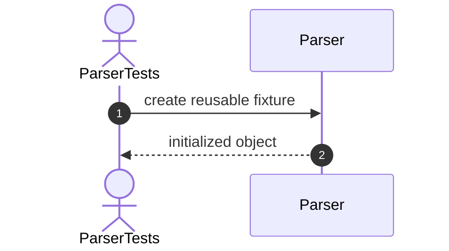

# Constructor Tests

## 1. Constructor_ShouldCreateParser

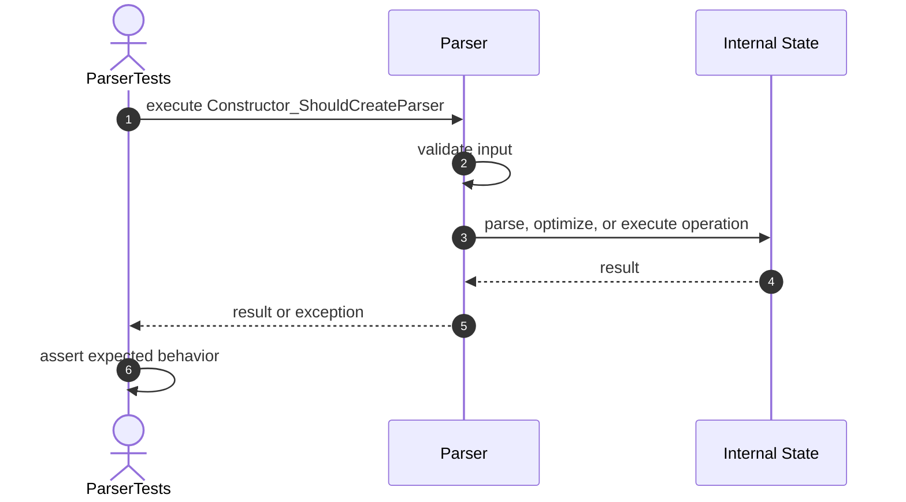

# Select Tests

## 2. Parse_ShouldParseSelectStatement

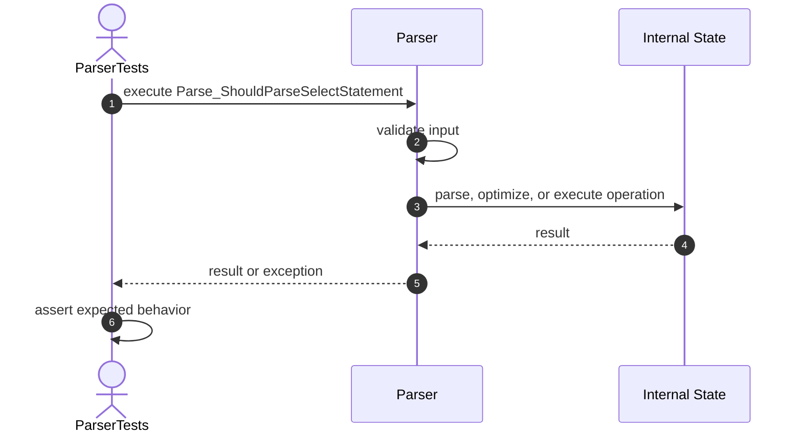

## 3. ParseSelect_ShouldExtractTableName


## 4. ParseSelect_ShouldExtractColumns


## 5. ParseSelect_ShouldSupportWildcard

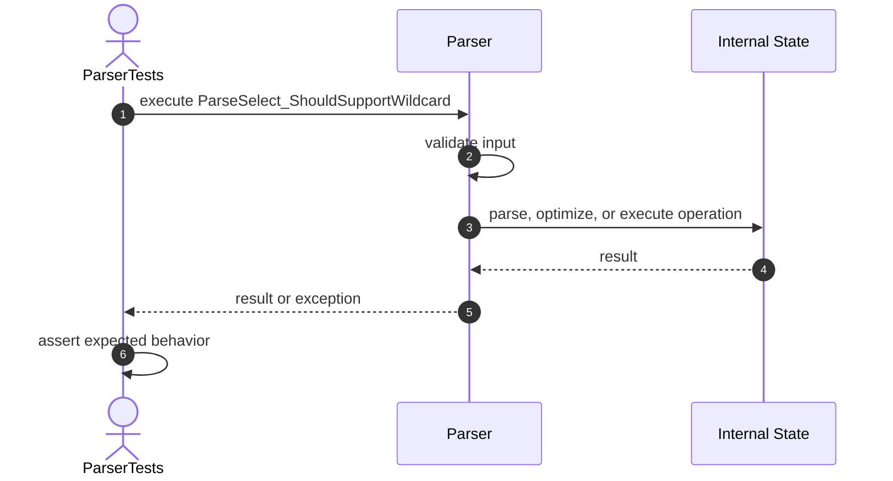

## 6. ParseSelect_ShouldNormalizeWhitespace

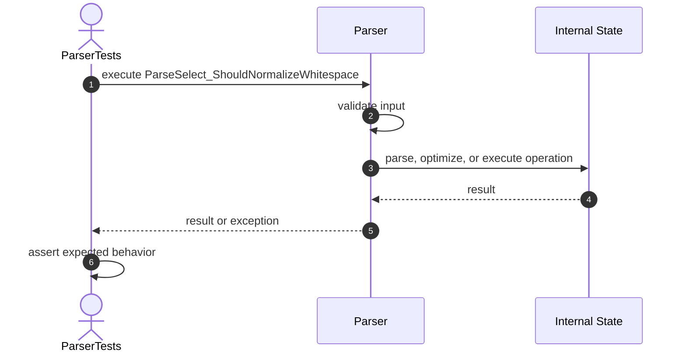

## 7. ParseSelect_ShouldRejectMissingFrom

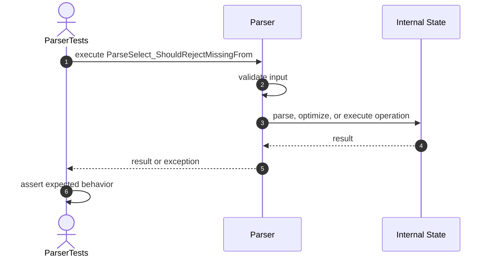

## 8. ParseSelect_ShouldRejectMissingColumns

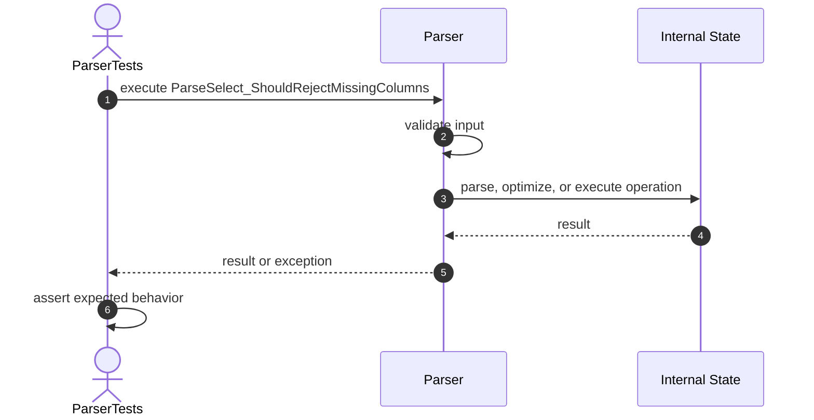

## 9. ParseSelect_ShouldRejectMissingTable


# Insert Tests

## 10. Parse_ShouldParseInsertStatement

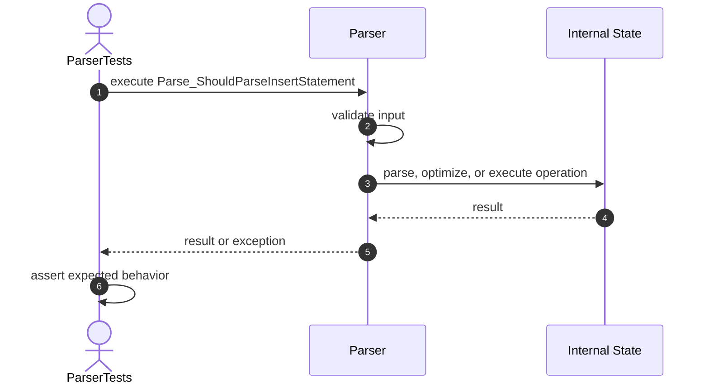

## 11. ParseInsert_ShouldExtractTableName

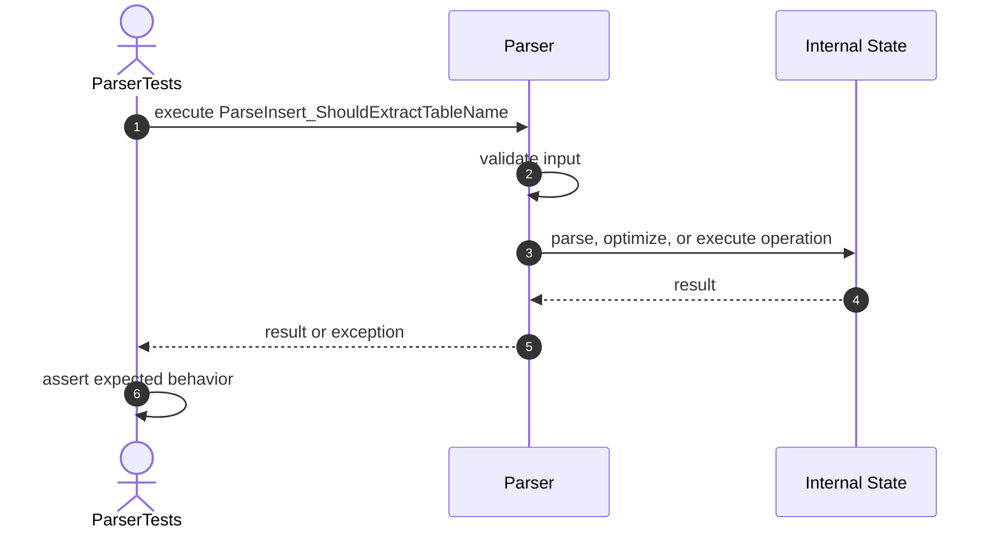

## 12. ParseInsert_ShouldExtractColumns


# Update Tests

## 13. Parse_ShouldParseUpdateStatement


## 14. ParseUpdate_ShouldExtractTableName

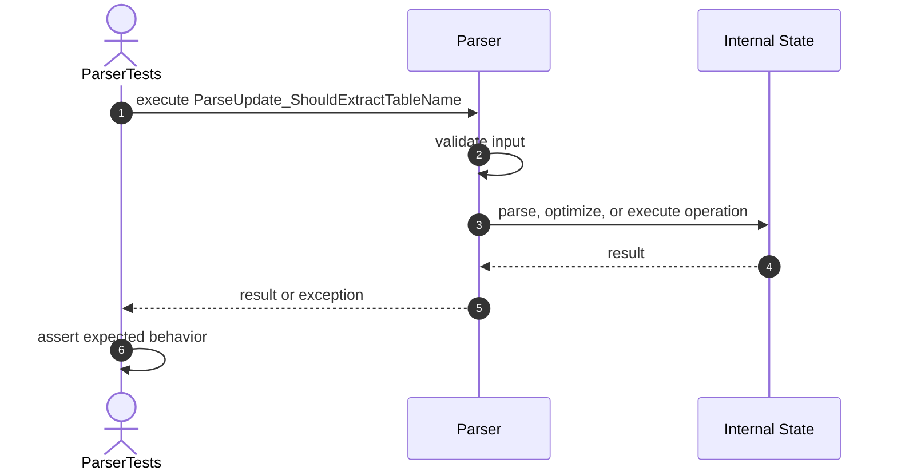

# Delete Tests

## 15. Parse_ShouldParseDeleteStatement


## 16. ParseDelete_ShouldExtractTableName


# Validation Tests

## 17. Parse_ShouldRejectNullSql

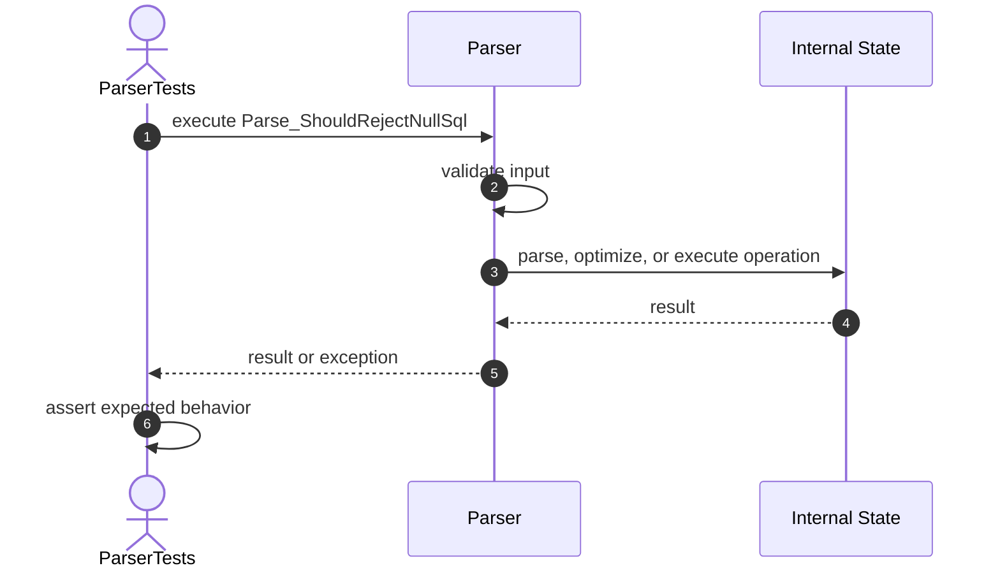

## 18. Parse_ShouldRejectBlankSql

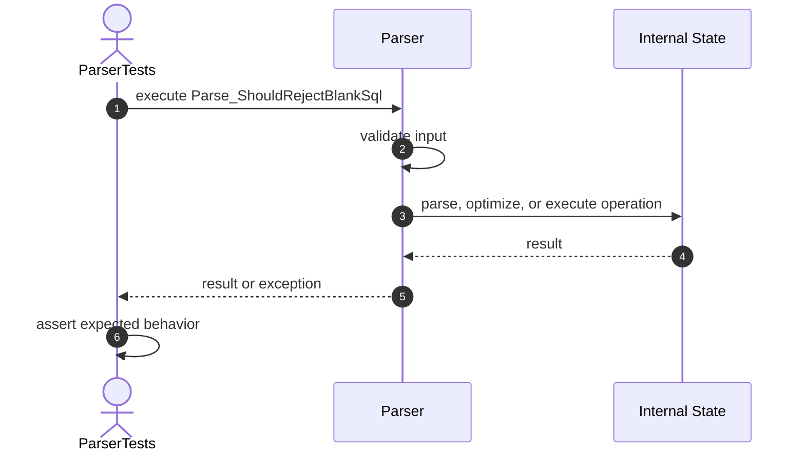

## 19. Parse_ShouldRejectUnsupportedStatement

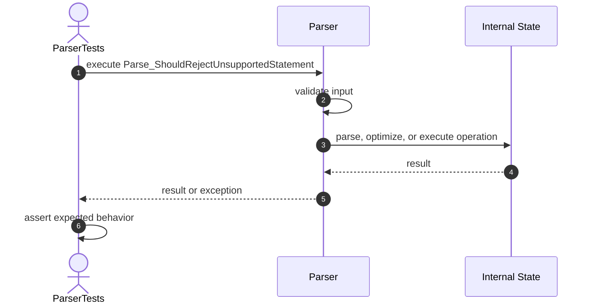

## 20. GetColumns_ShouldReturnUnmodifiableList

```mermaid
sequenceDiagram
    autonumber
    actor Test as ParserTests
    participant Target as Parser
    participant Internal as Internal State

    Test->>Target: execute GetColumns_ShouldReturnUnmodifiableList
    Target->>Target: validate input
    Target->>Internal: parse, optimize, or execute operation
    Internal-->>Target: result
    Target-->>Test: result or exception
    Test->>Test: assert expected behavior
```

## 21. ParsedQuery_ShouldPreserveRawSql

```mermaid
sequenceDiagram
    autonumber
    actor Test as ParserTests
    participant Target as Parser
    participant Internal as Internal State

    Test->>Target: execute ParsedQuery_ShouldPreserveRawSql
    Target->>Target: validate input
    Target->>Internal: parse, optimize, or execute operation
    Internal-->>Target: result
    Target-->>Test: result or exception
    Test->>Test: assert expected behavior
```