# StatisticsManager Testing - Main Functional Sequences

---

## 1. Collect Statistics

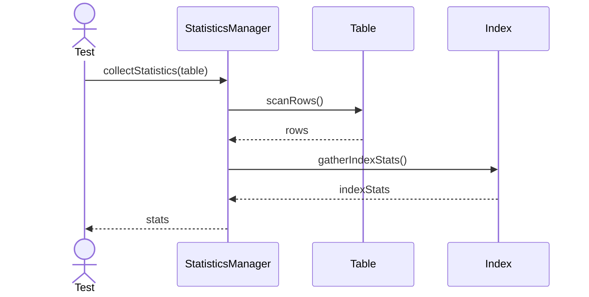

---

## 2. Update Histogram

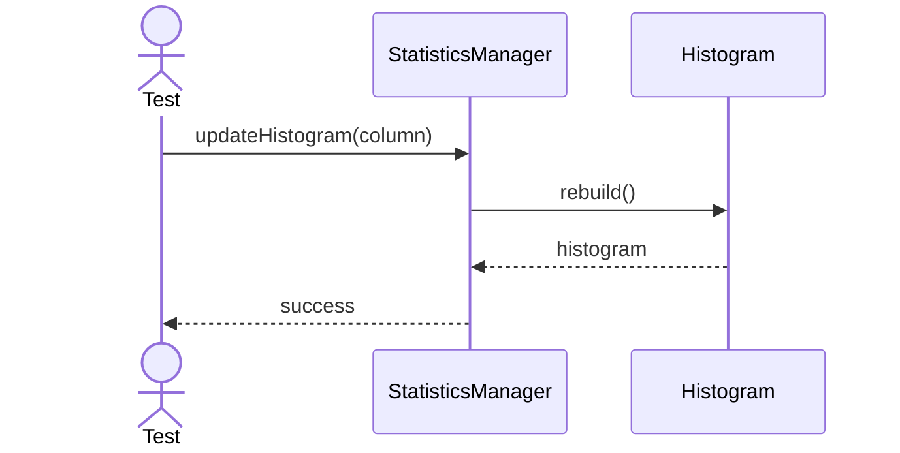

---

## 3. Estimate Cardinality

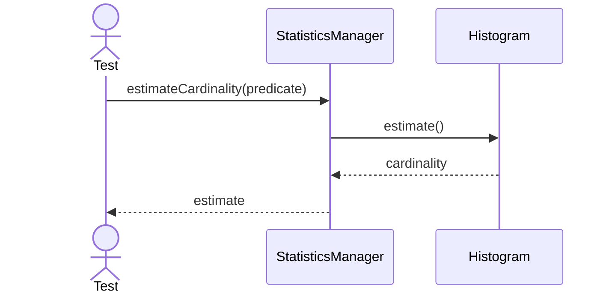

---

## 4. Refresh Statistics

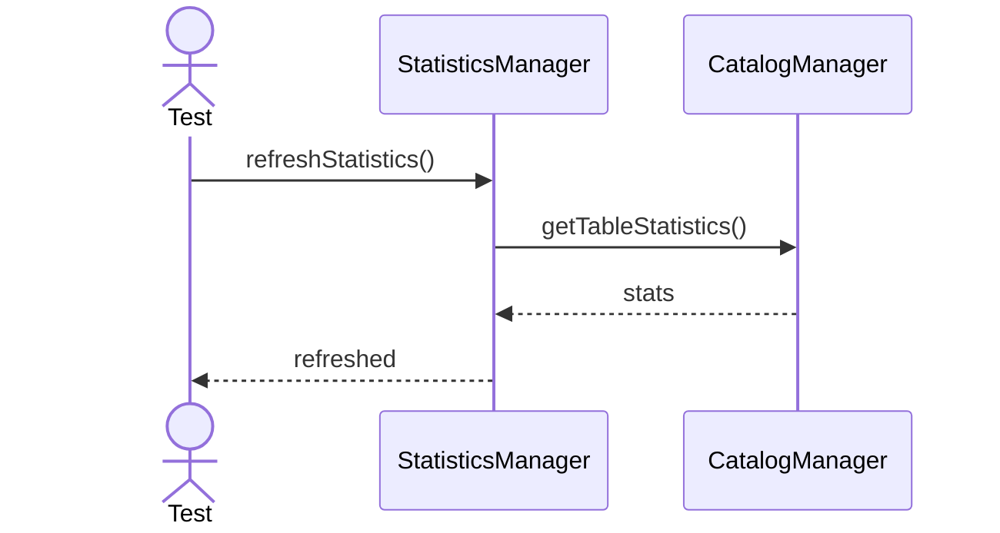

---

## 5. Delete Statistics

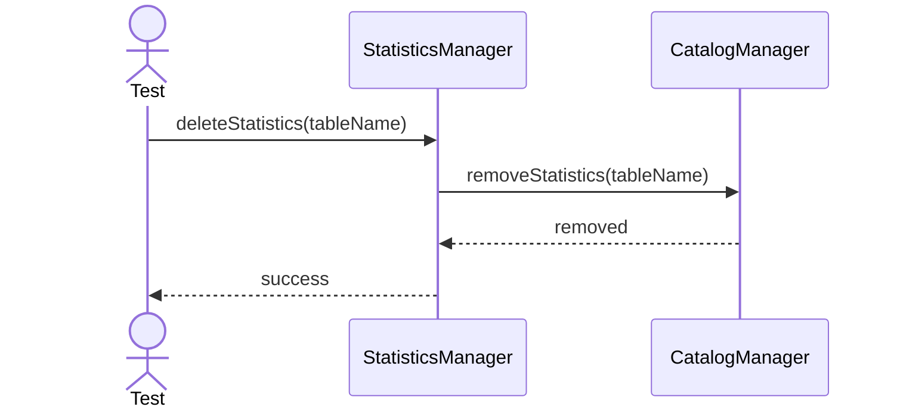

---

## 6. Update Row Count

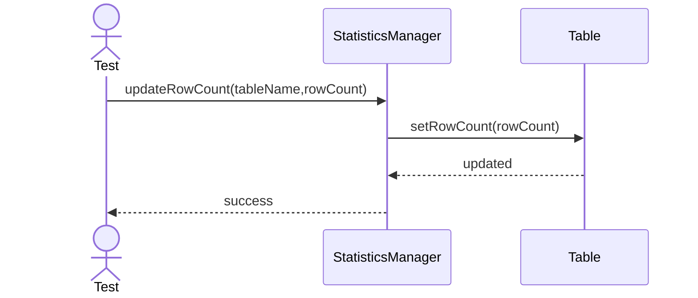

---

## 7. Estimate Distinct Values

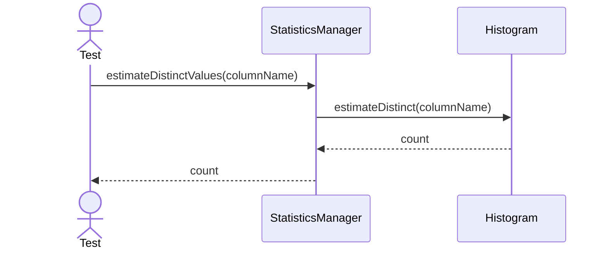

---

## 8. Estimate Null Fraction

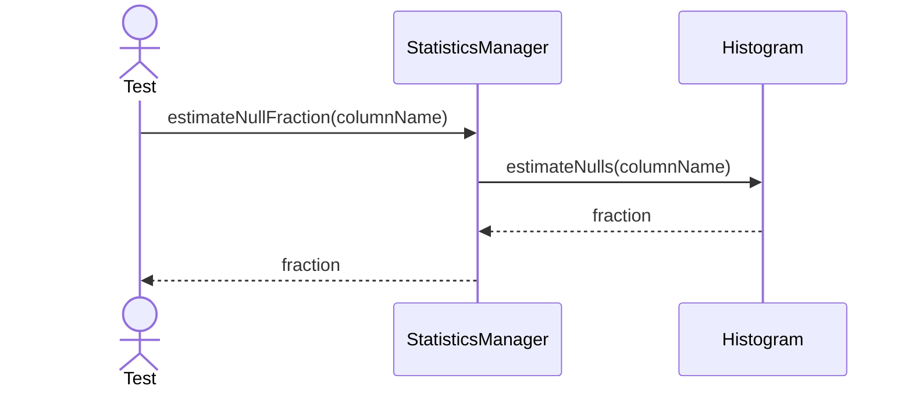

---

## 9. Estimate Selectivity

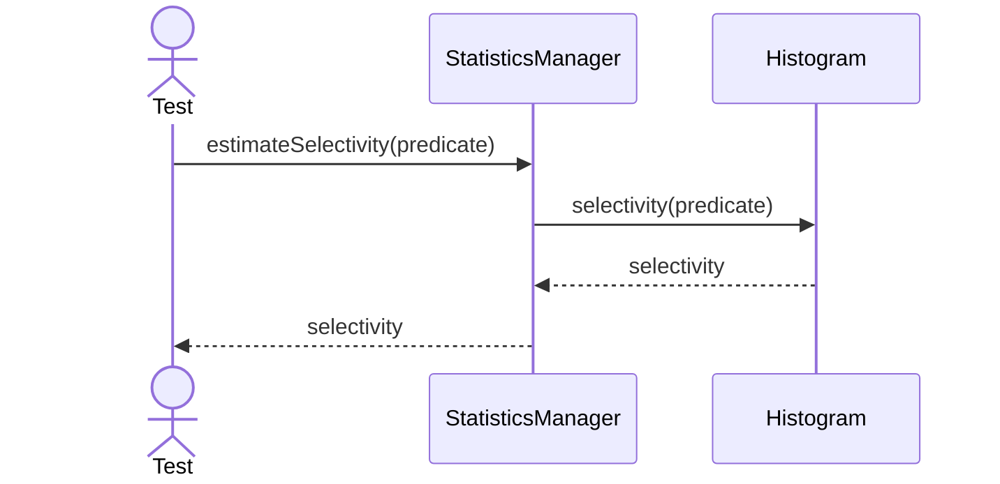

---

## 10. Analyze Table

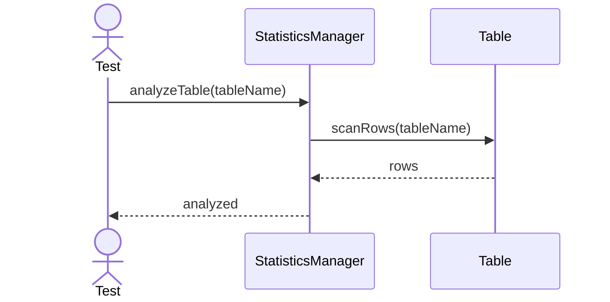

---

## 11. Estimate Row Count

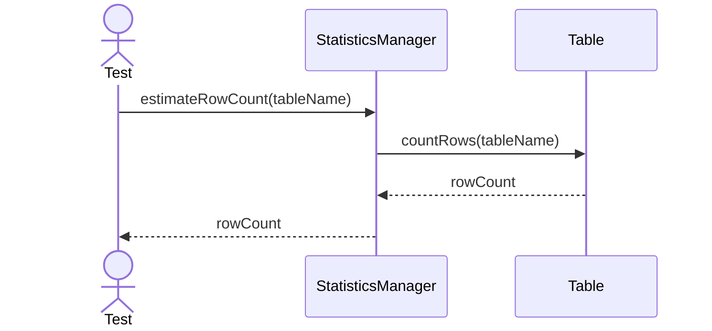

---

## 12. Estimate Data Distribution

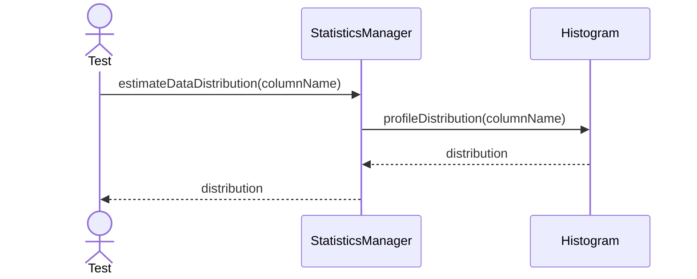

---

## 13. Analyze Column

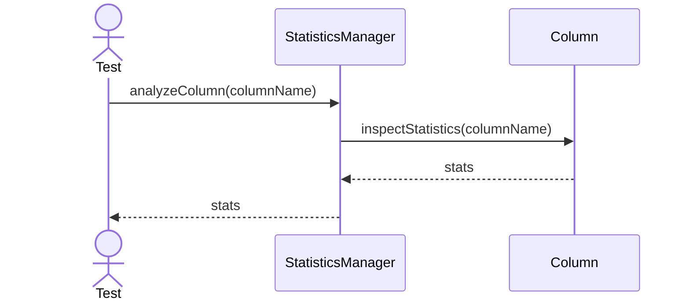
