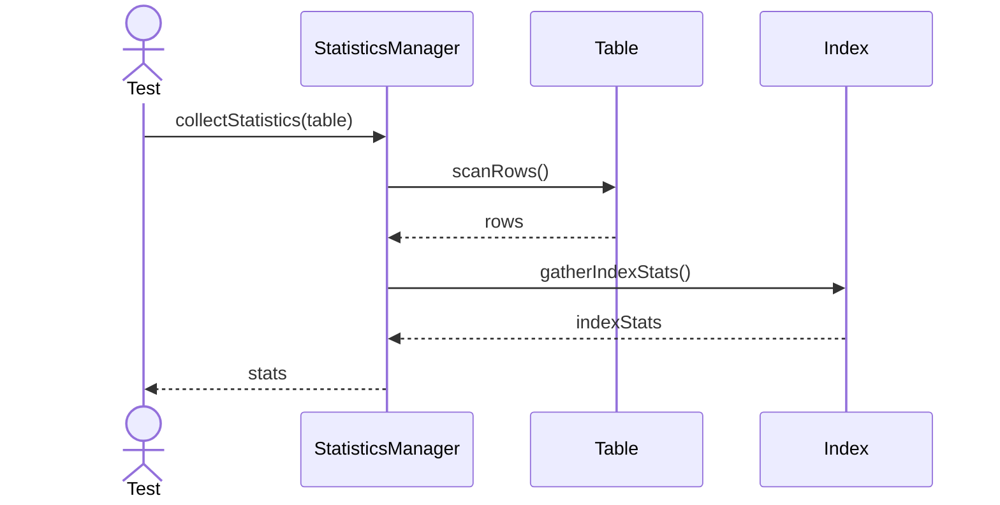
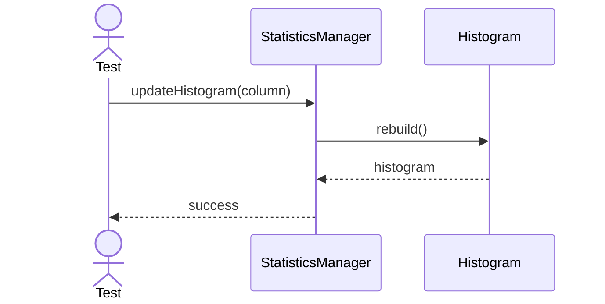
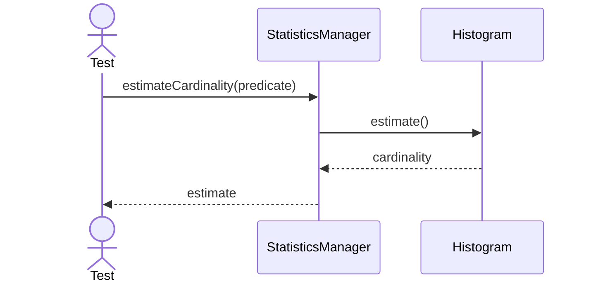
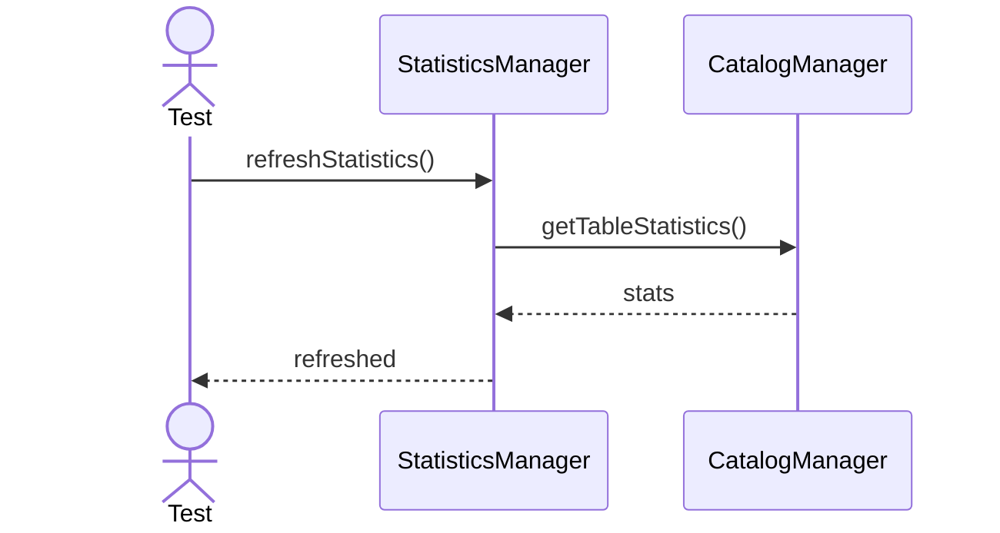

# StatisticsManager Testing - Main Functional Sequences

---

## 1. Collect Statistics

```mermaid
sequenceDiagram
actor Test
participant StatisticsManager
participant Table
participant Index

Test->>StatisticsManager: collectStatistics(table)
StatisticsManager->>Table: scanRows()
Table-->>StatisticsManager: rows
StatisticsManager->>Index: gatherIndexStats()
Index-->>StatisticsManager: indexStats
StatisticsManager-->>Test: stats
```

---

## 2. Update Histogram

```mermaid
sequenceDiagram
actor Test
participant StatisticsManager
participant Histogram

Test->>StatisticsManager: updateHistogram(column)
StatisticsManager->>Histogram: rebuild()
Histogram-->>StatisticsManager: histogram
StatisticsManager-->>Test: success
```

---

## 3. Estimate Cardinality

```mermaid
sequenceDiagram
actor Test
participant StatisticsManager
participant Histogram

Test->>StatisticsManager: estimateCardinality(predicate)
StatisticsManager->>Histogram: estimate()
Histogram-->>StatisticsManager: cardinality
StatisticsManager-->>Test: estimate
```

---

## 4. Refresh Statistics

```mermaid
sequenceDiagram
actor Test
participant StatisticsManager
participant CatalogManager

Test->>StatisticsManager: refreshStatistics()
StatisticsManager->>CatalogManager: getTableStatistics()
CatalogManager-->>StatisticsManager: stats
StatisticsManager-->>Test: refreshed
```
