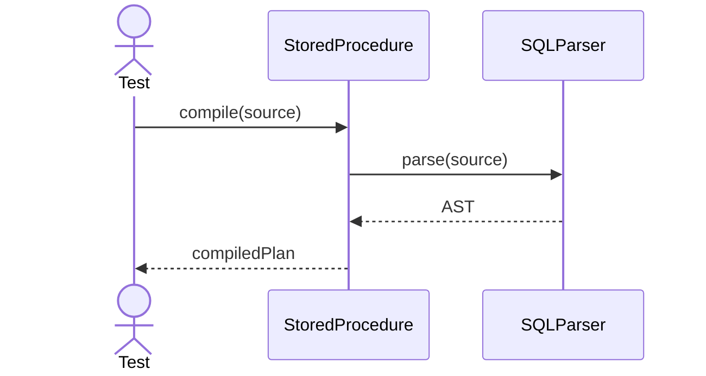
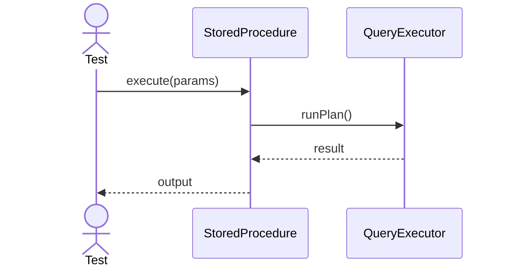
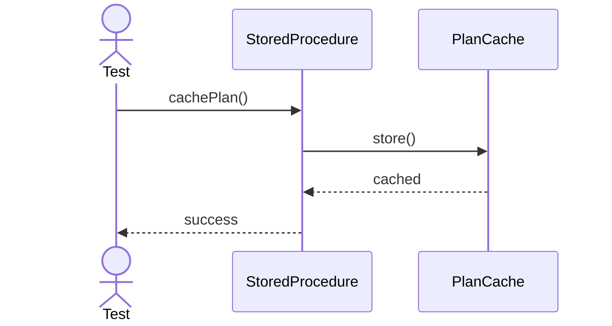

# StoredProcedure Testing - Main Functional Sequences

---

## 1. Compile

```mermaid
sequenceDiagram
actor Test
participant StoredProcedure
participant SQLParser

Test->>StoredProcedure: compile(source)
StoredProcedure->>SQLParser: parse(source)
SQLParser-->>StoredProcedure: AST
StoredProcedure-->>Test: compiledPlan
```

---

## 2. Execute

```mermaid
sequenceDiagram
actor Test
participant StoredProcedure
participant QueryExecutor

Test->>StoredProcedure: execute(params)
StoredProcedure->>QueryExecutor: runPlan()
QueryExecutor-->>StoredProcedure: result
StoredProcedure-->>Test: output
```

---

## 3. Cache Plan

```mermaid
sequenceDiagram
actor Test
participant StoredProcedure
participant PlanCache

Test->>StoredProcedure: cachePlan()
StoredProcedure->>PlanCache: store()
PlanCache-->>StoredProcedure: cached
StoredProcedure-->>Test: success
```
