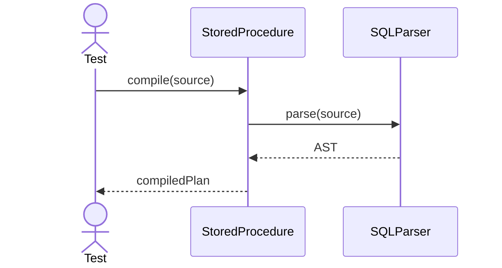
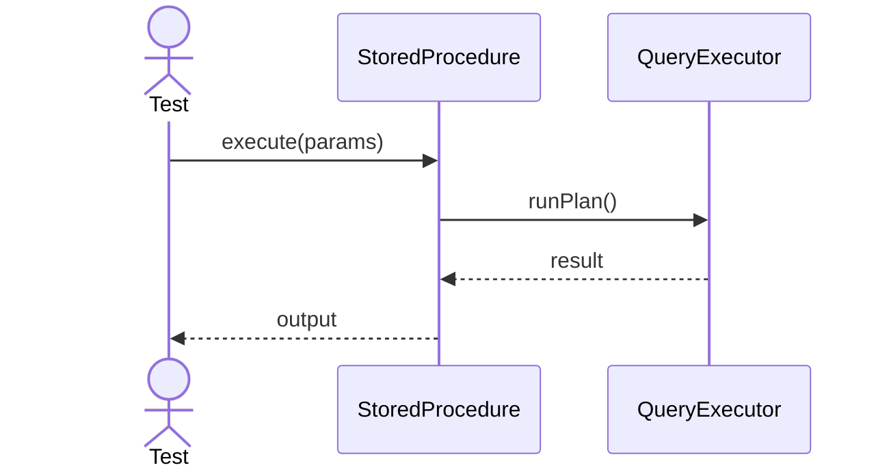
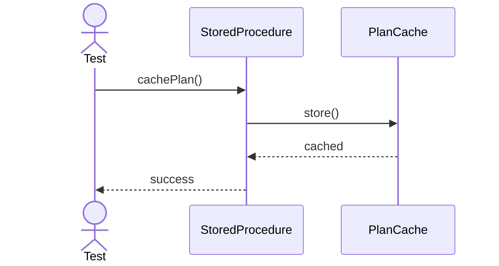
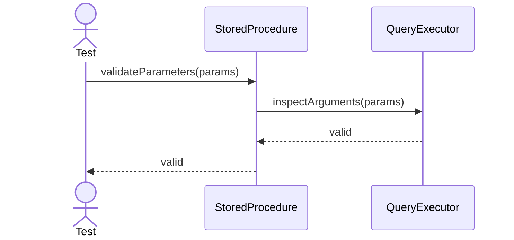
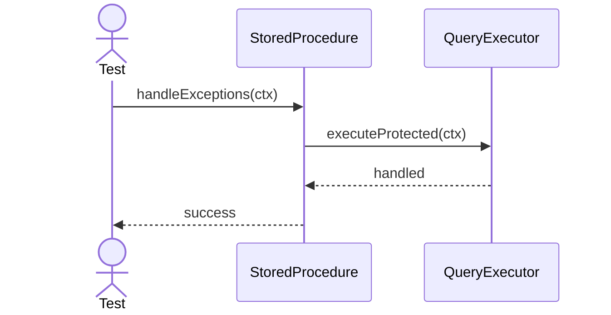
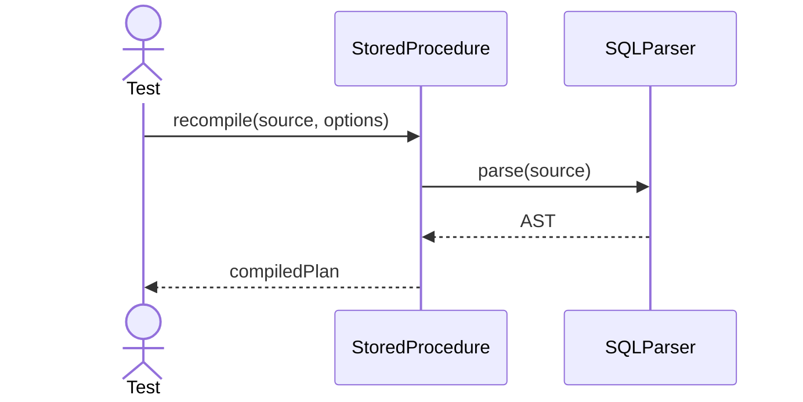
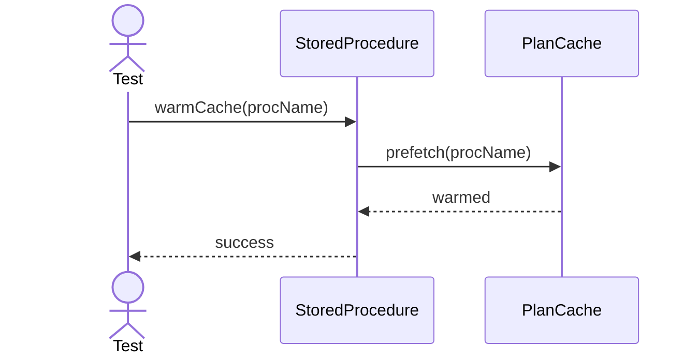
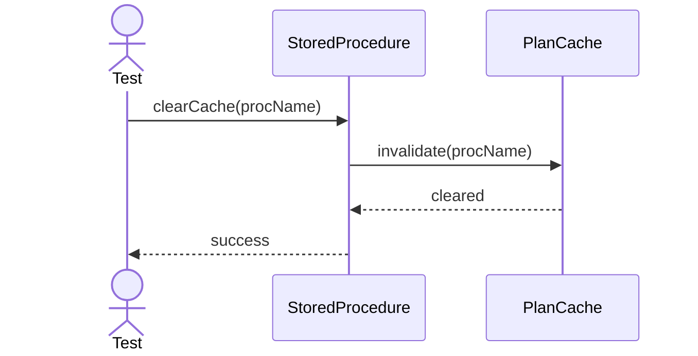
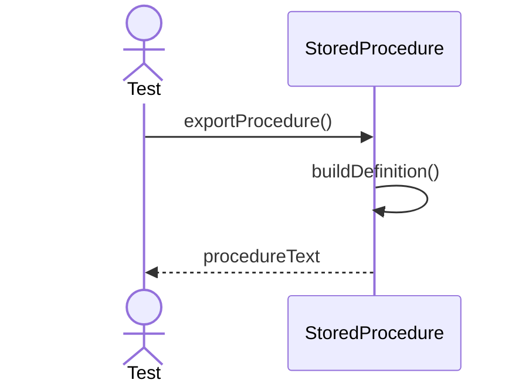
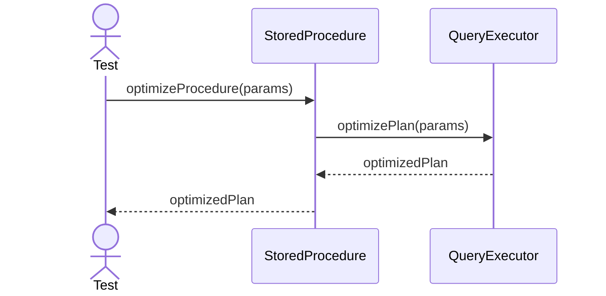

# StoredProcedure Testing - Main Functional Sequences

---

## 1. Compile

---

## 2. Execute

---

## 3. Cache Plan

---

## 4. Validate Parameters

---

## 5. Handle Exceptions

---

## 6. Recompile

---

## 7. Warm Cache

---

## 8. Clear Cache

---

## 9. Export Procedure

---

## 10. Optimize Procedure

