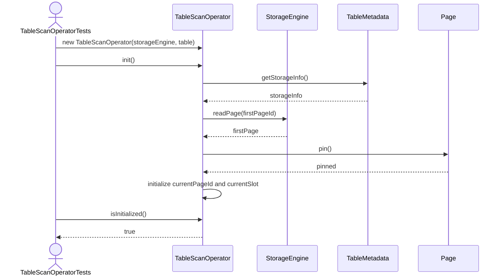
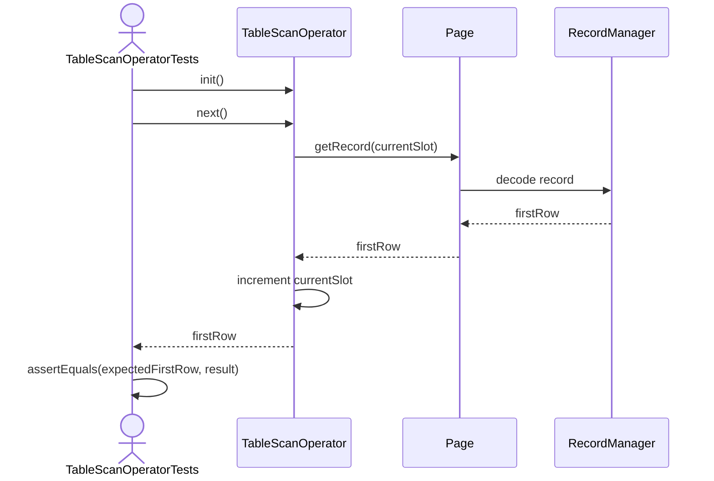
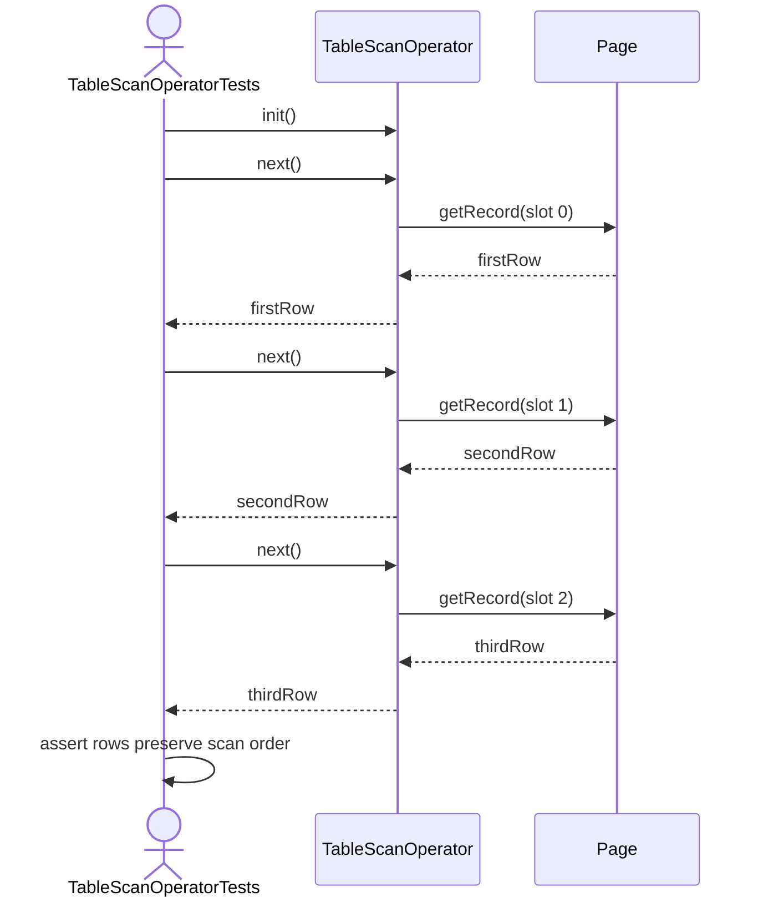
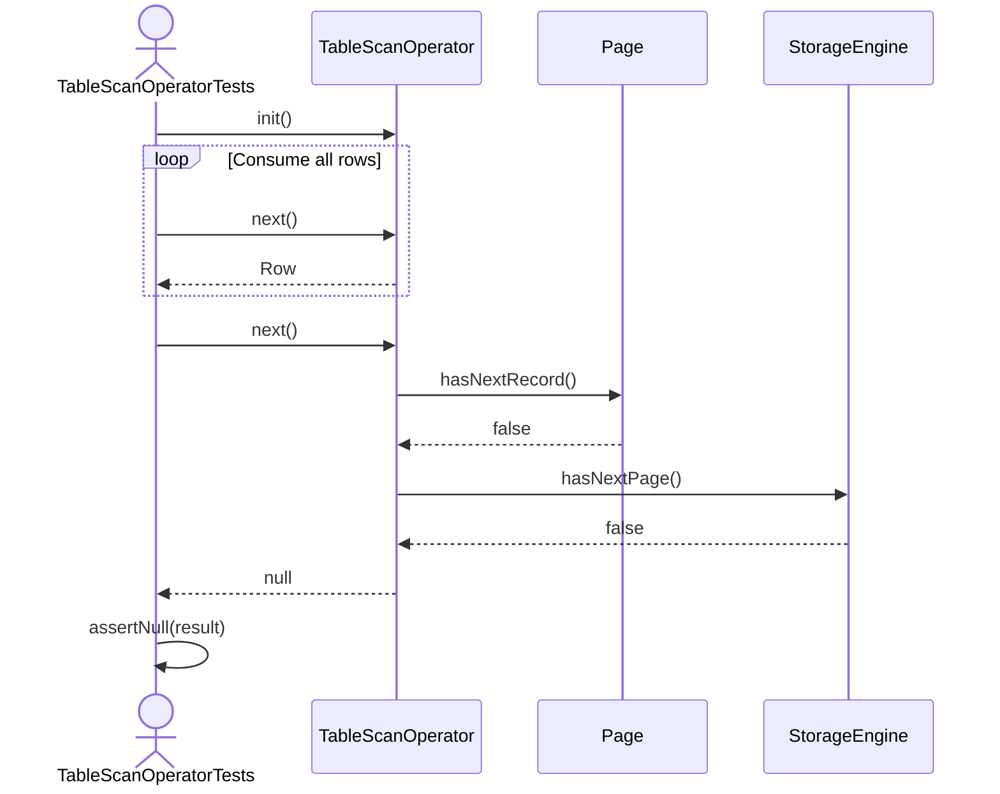
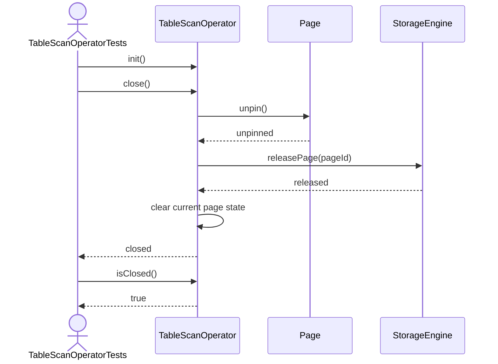
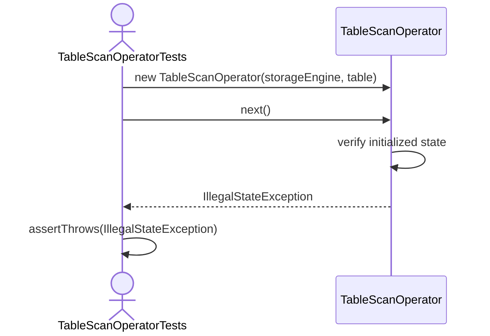

TableScanOperator Test Sequence Diagrams

1. Init_ShouldPrepareTableScan

2. Next_ShouldReturnFirstRow

3. Next_ShouldReturnRowsSequentially

4. Next_ShouldReturnNullWhenNoRowsRemain

5. Close_ShouldReleaseCurrentPage


6. NextBeforeInit_ShouldRejectOperation

7. NextAfterClose_ShouldRejectOperation
```mermaid
sequenceDiagram
    actor Test as TableScanOperatorTests
    participant Scan as TableScanOperator

    Test->>Scan: init()
    Test->>Scan: close()
    Test->>Scan: next()
    Scan->>Scan: verify closed state
    Scan-->>Test: IllegalStateException
    Test->>Test: assertThrows(IllegalStateException)
    ```