# Trigger Testing - Main Functional Sequences

---

## 1. Before Insert

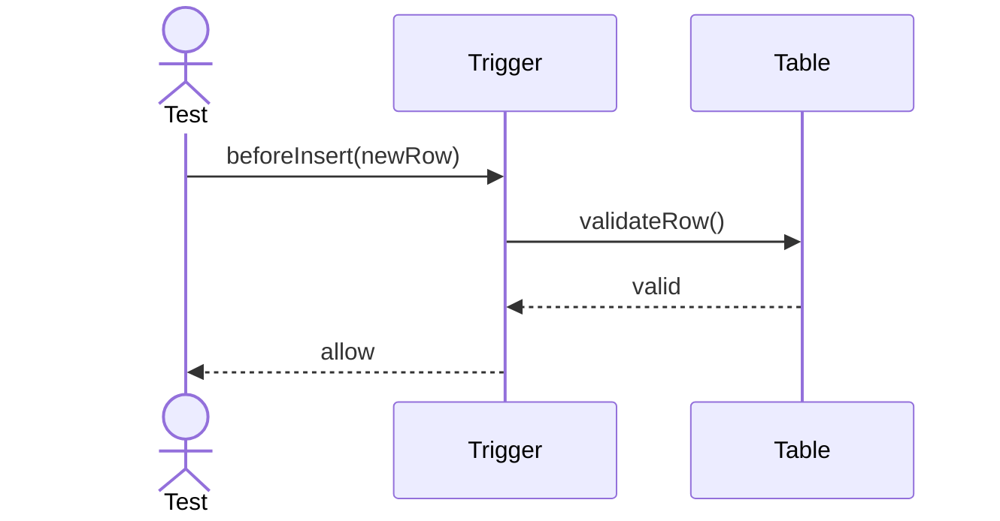

---

## 2. After Insert

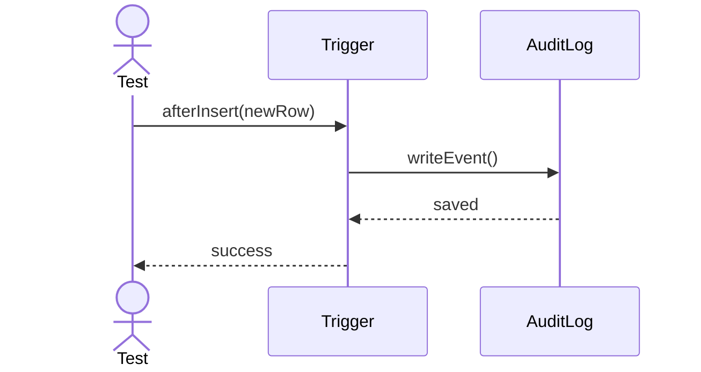

---

## 3. Before Update

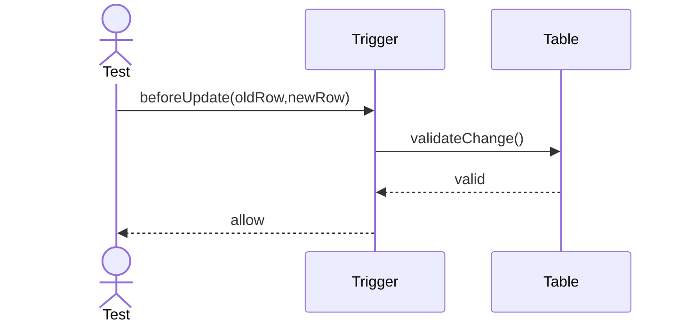

---

## 4. Disable Trigger

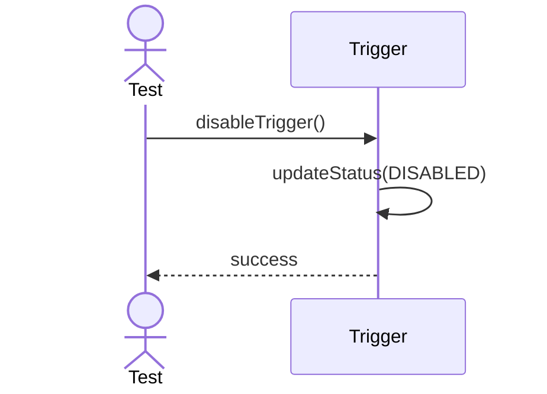

---

## 5. After Update

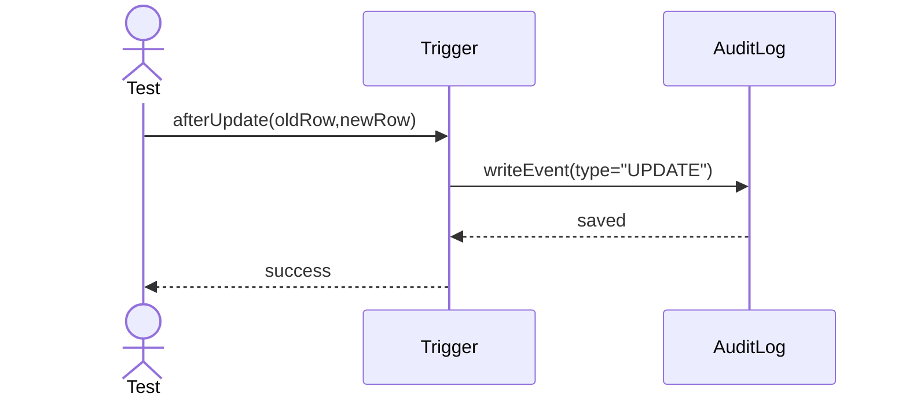

---

## 6. Before Delete

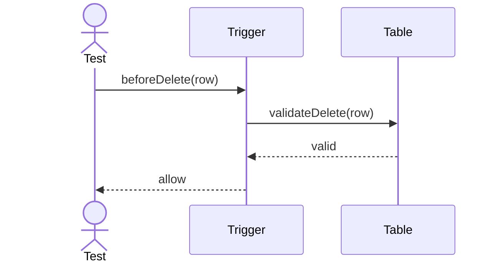

---

## 7. After Delete

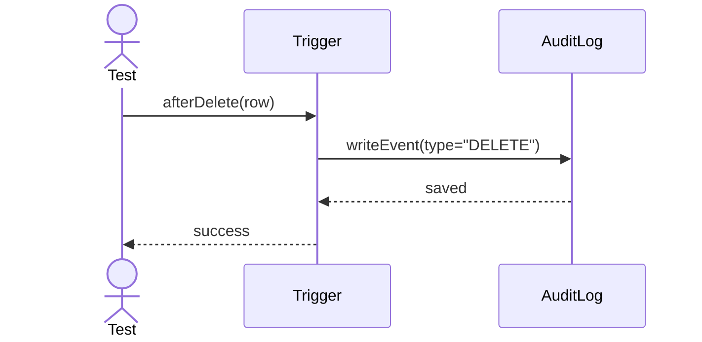

---

## 8. Enable Trigger

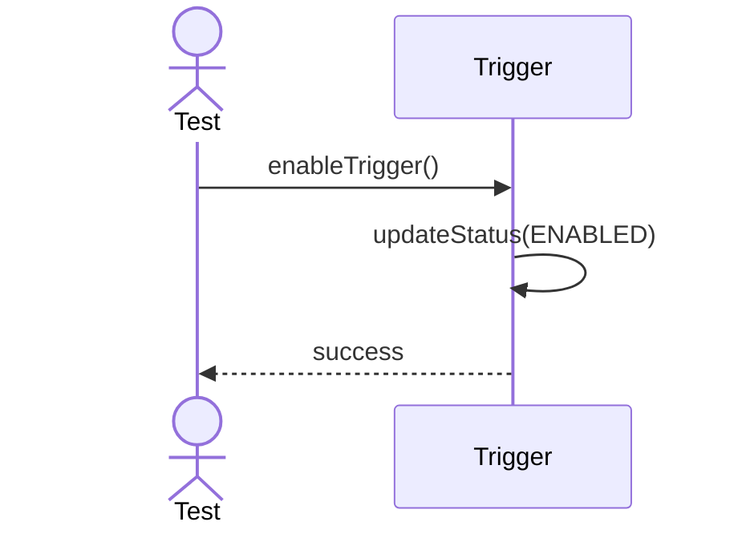

---

## 9. Set Condition

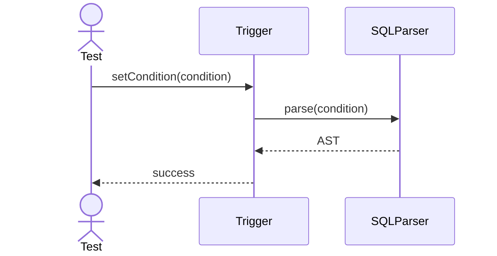

---

## 10. Set Action

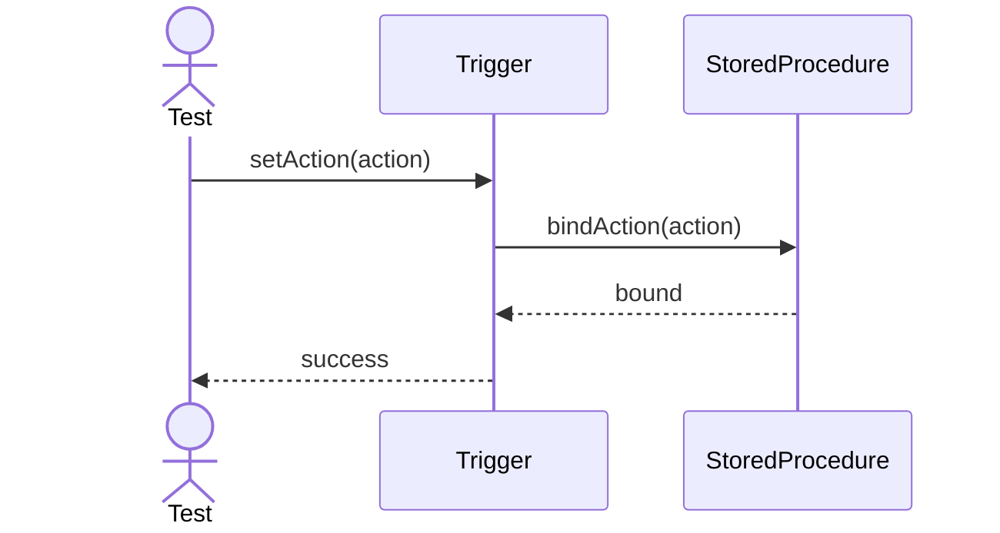

---

## 11. Update Trigger Order

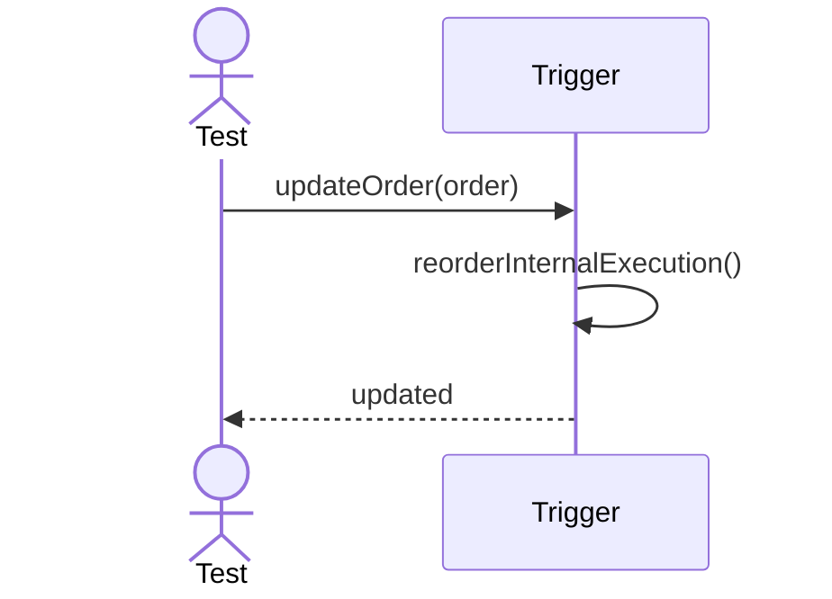

---

## 12. Evaluate Condition

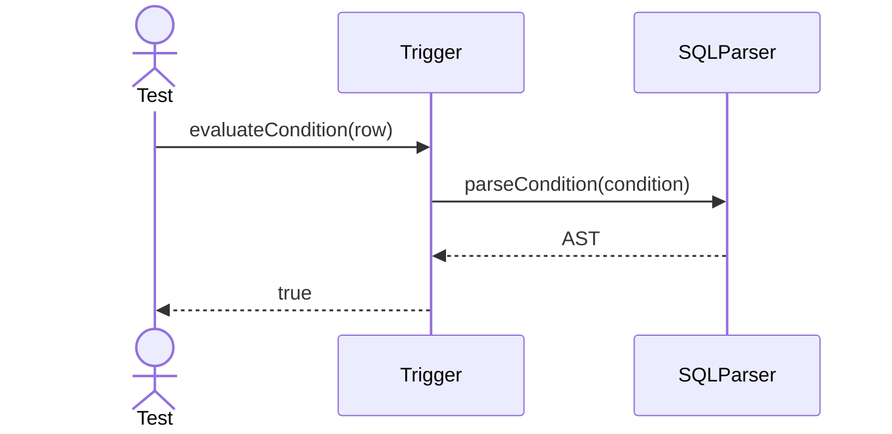

---

## 13. Bind Table

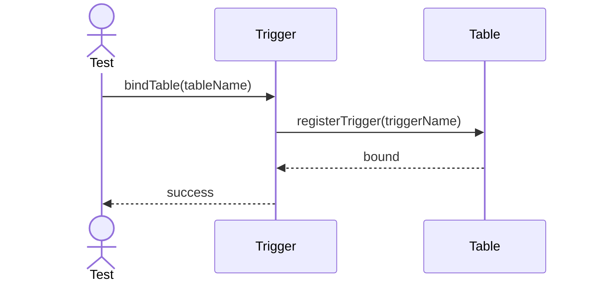
