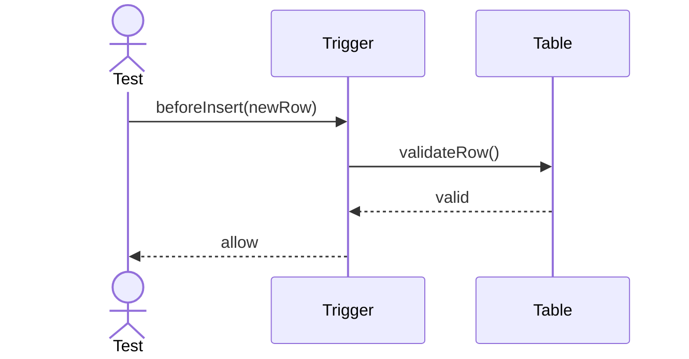
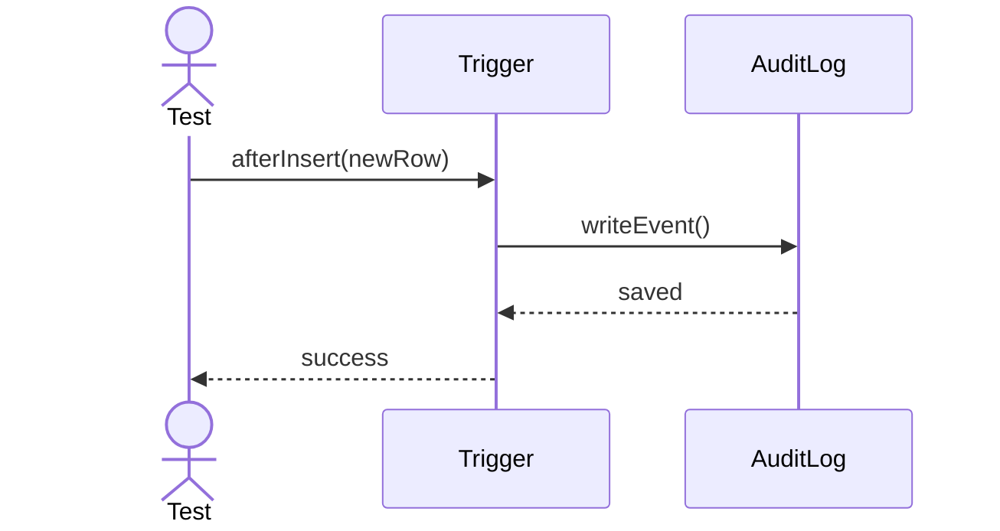
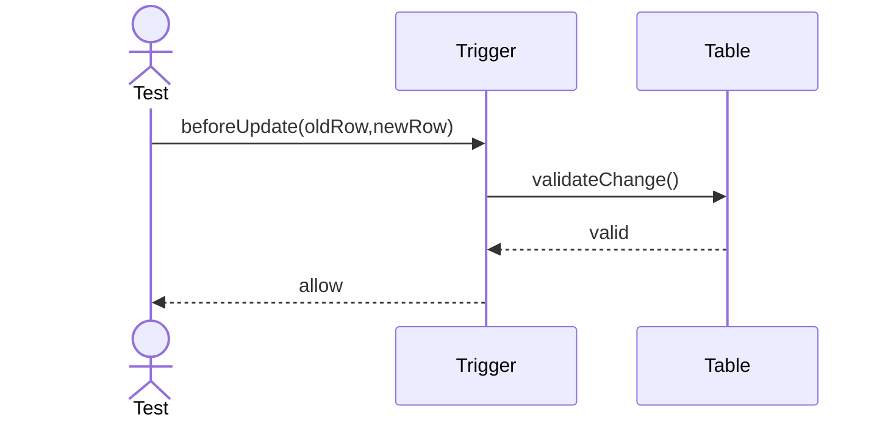
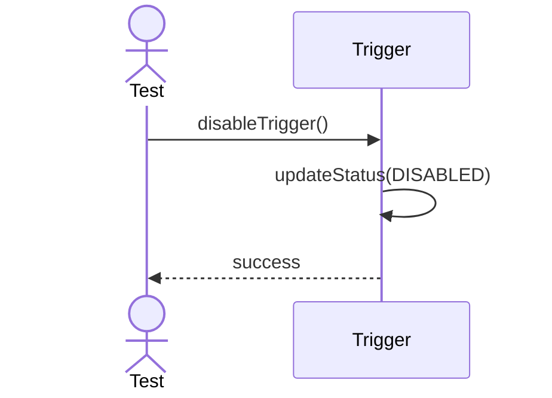

# Trigger Testing - Main Functional Sequences

---

## 1. Before Insert

```mermaid
sequenceDiagram
actor Test
participant Trigger
participant Table

Test->>Trigger: beforeInsert(newRow)
Trigger->>Table: validateRow()
Table-->>Trigger: valid
Trigger-->>Test: allow
```

---

## 2. After Insert

```mermaid
sequenceDiagram
actor Test
participant Trigger
participant AuditLog

Test->>Trigger: afterInsert(newRow)
Trigger->>AuditLog: writeEvent()
AuditLog-->>Trigger: saved
Trigger-->>Test: success
```

---

## 3. Before Update

```mermaid
sequenceDiagram
actor Test
participant Trigger
participant Table

Test->>Trigger: beforeUpdate(oldRow,newRow)
Trigger->>Table: validateChange()
Table-->>Trigger: valid
Trigger-->>Test: allow
```

---

## 4. Disable Trigger

```mermaid
sequenceDiagram
actor Test
participant Trigger

Test->>Trigger: disableTrigger()
Trigger->>Trigger: updateStatus(DISABLED)
Trigger-->>Test: success
```
