# ConnectionPool Testing - Main Functional Sequences

---

## 1. Acquire Connection

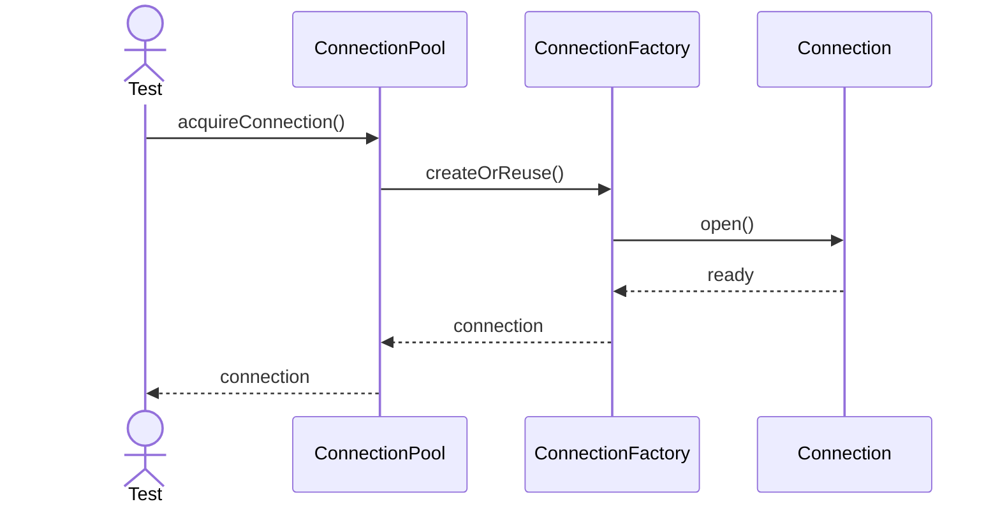

---

## 2. Acquire Warm Connection

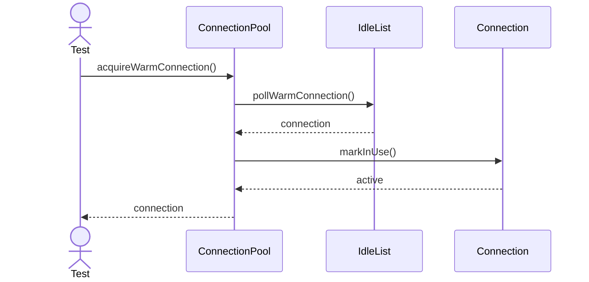

---

## 3. Create New Connection

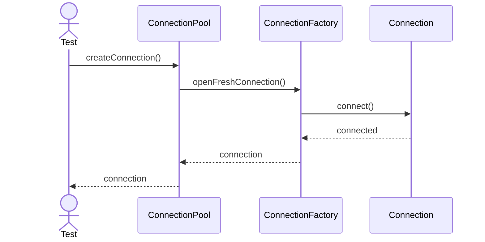

---

## 4. Validate Borrowed Connection

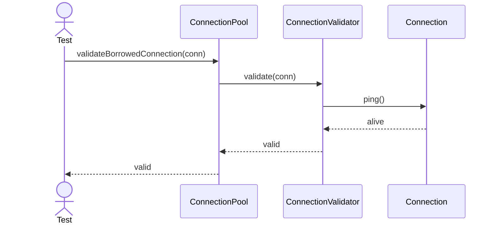

---

## 5. Release Connection

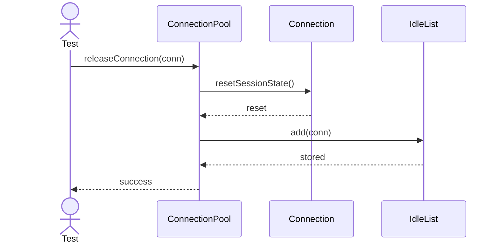

---

## 6. Recycle Connection

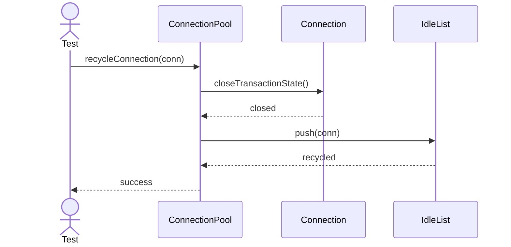

---

## 7. Evict Idle Connection

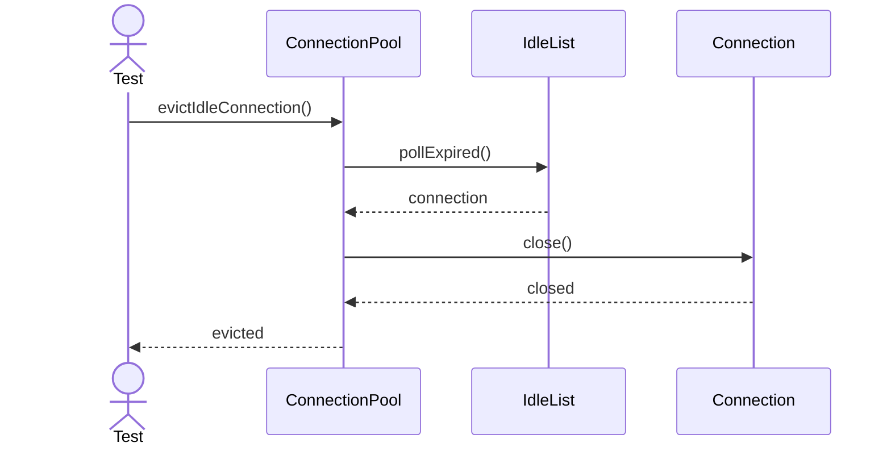

---

## 8. Cleanup Expired Connections

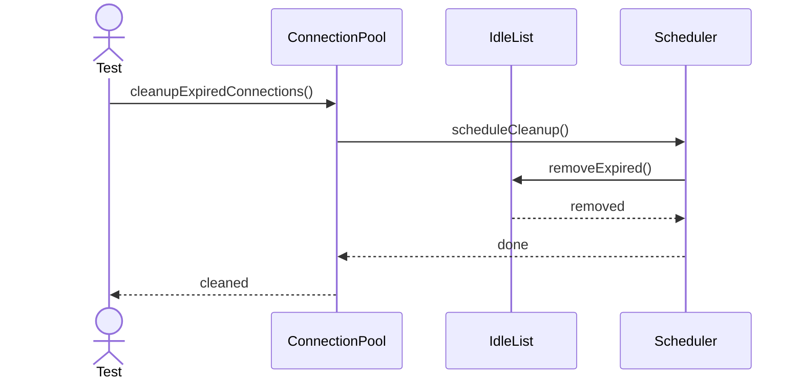

---

## 9. Ping Connection

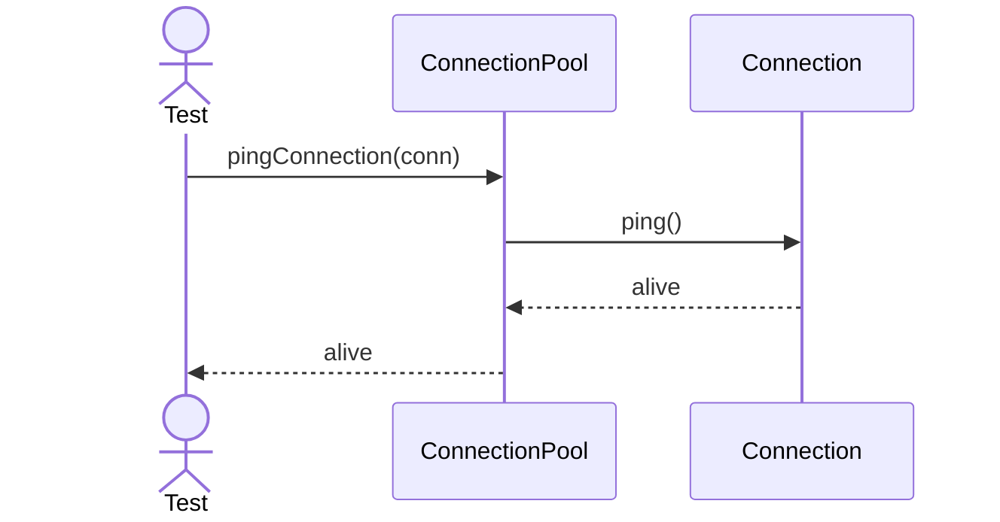

---

## 10. Reset Session State

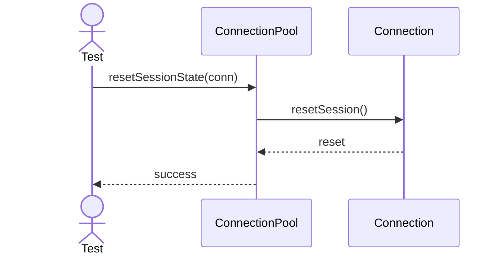

---

## 11. Mark Connection Busy

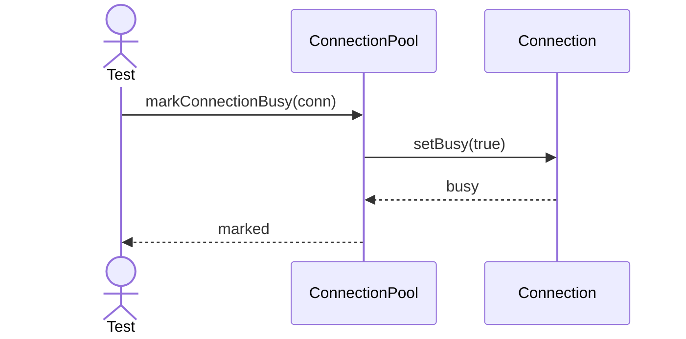

---

## 12. Mark Connection Idle

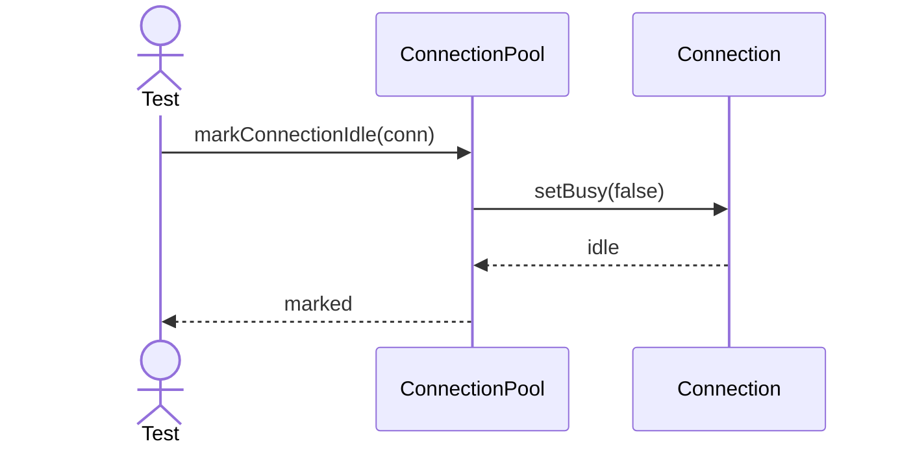

---

## 13. Resize Pool Up

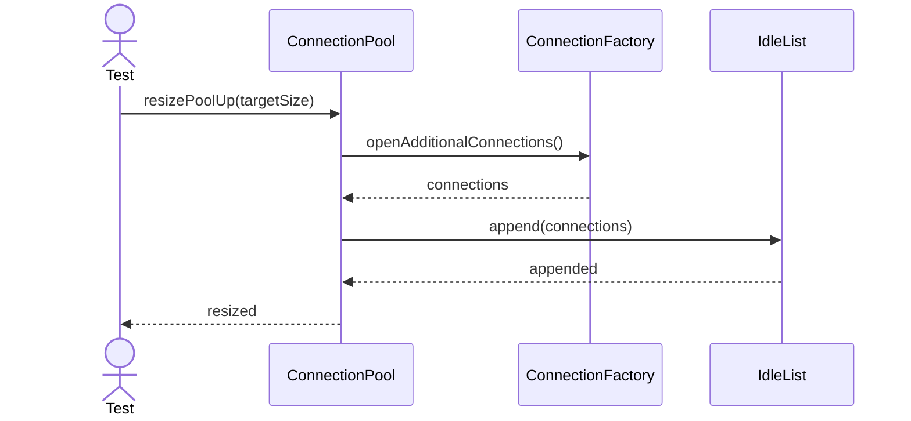

---

## 14. Shrink Pool Down

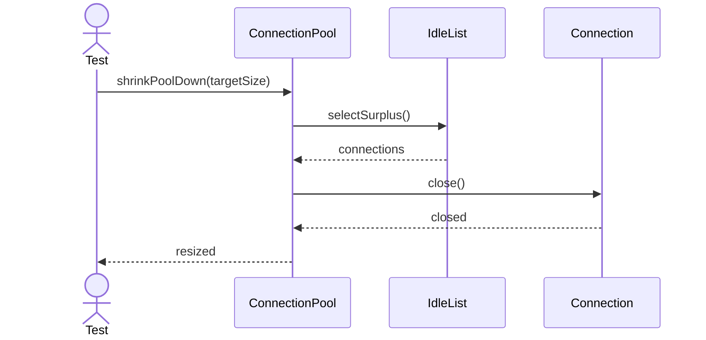

---

## 15. Borrow With Timeout

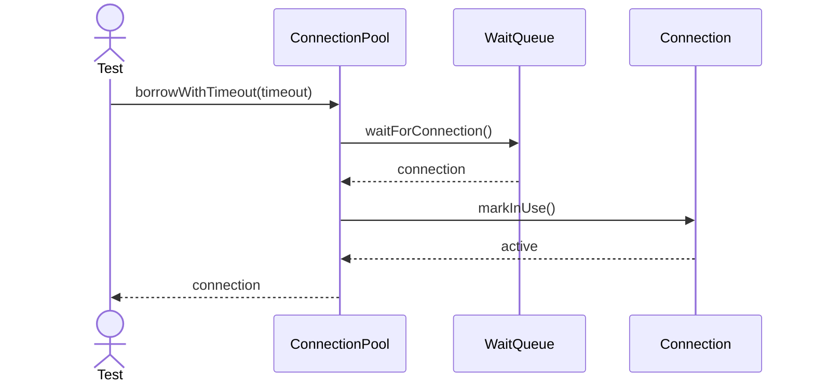

---

## 16. Recover Broken Connection

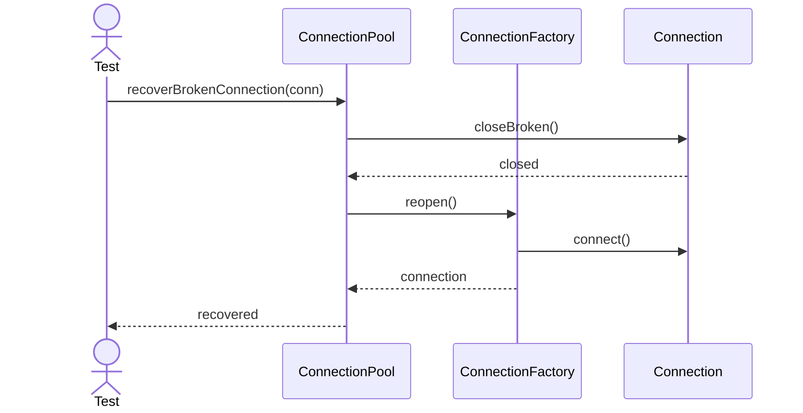

---

## 17. Replenish Pool

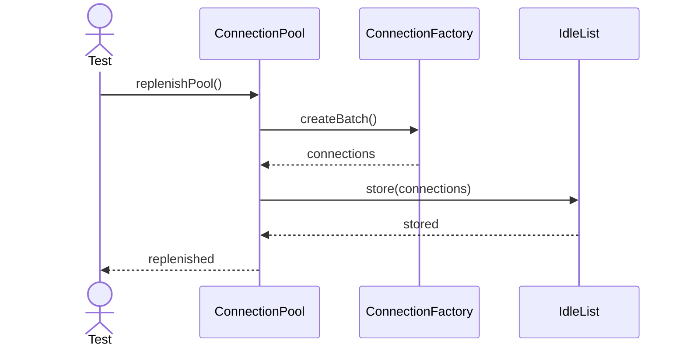

---

## 18. Refresh Authentication

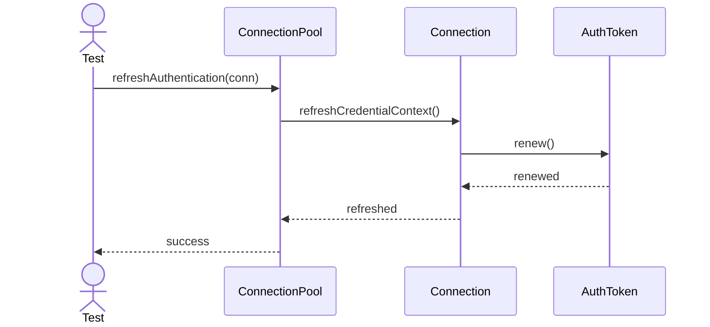

---

## 19. Report Metrics

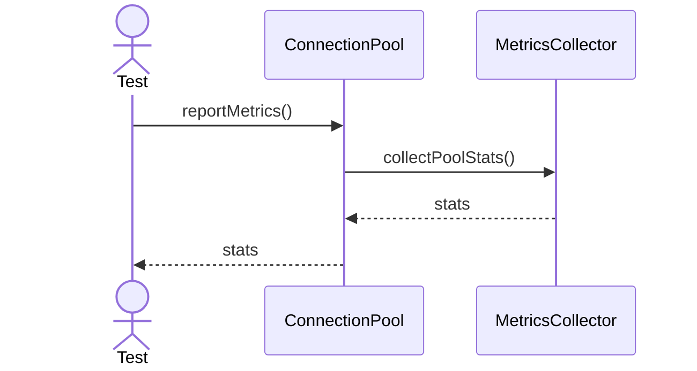

---

## 20. Shutdown Pool

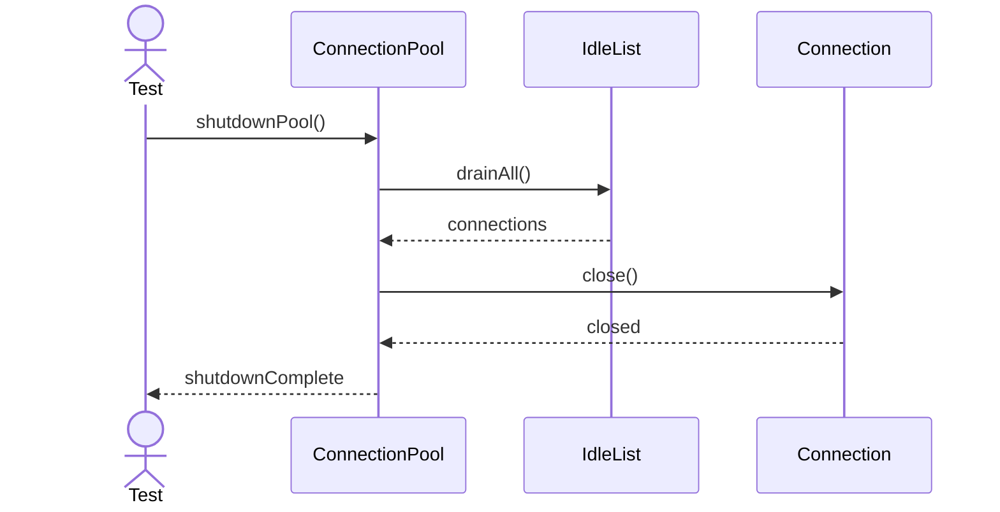
