# Role Testing - Main Functional Sequences

---

## 1. Create Role

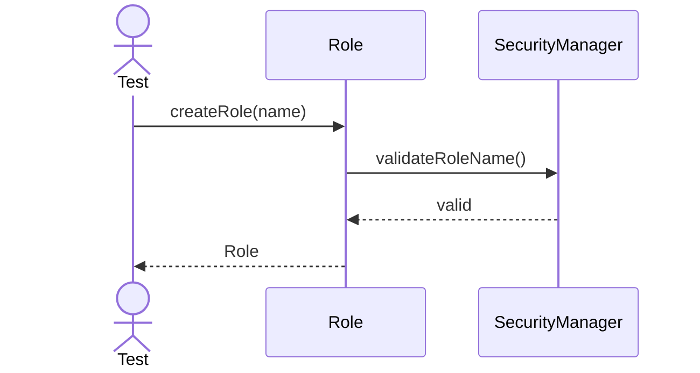

---

## 2. Grant Permission

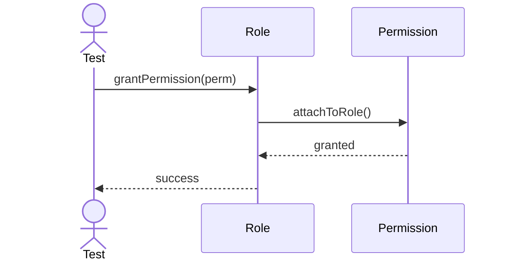

---

## 3. Add Member

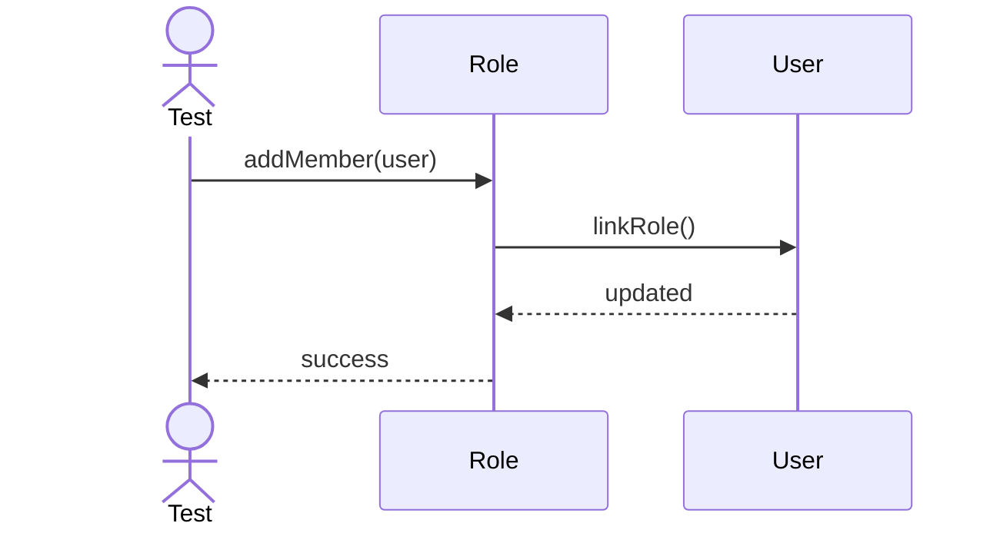

---

## 4. Remove Member

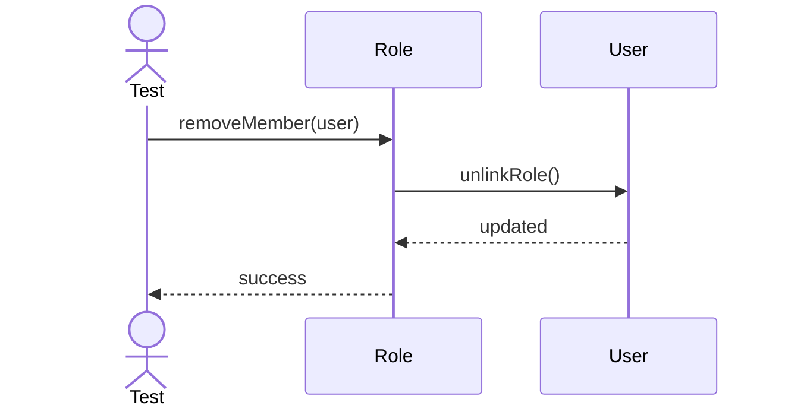

---

## 5. Revoke Permission

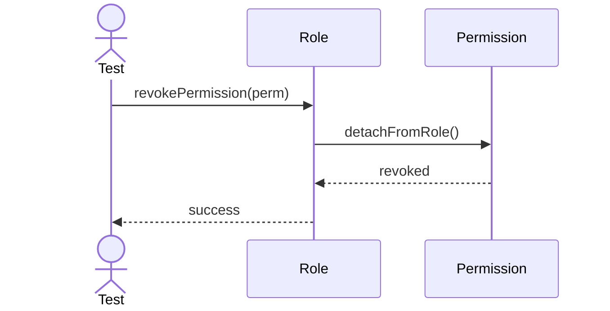

---

## 6. Rename Role

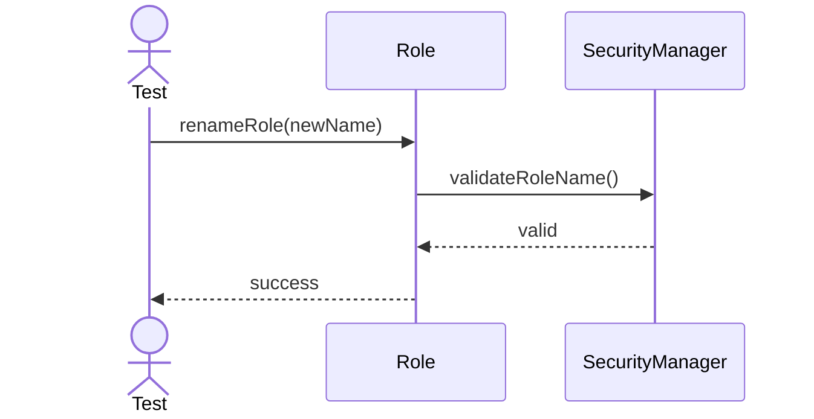

---

## 7. Disable Role

---

## 8. Enable Role

---

## 9. Export Role Summary

---

## 10. Sync Permissions

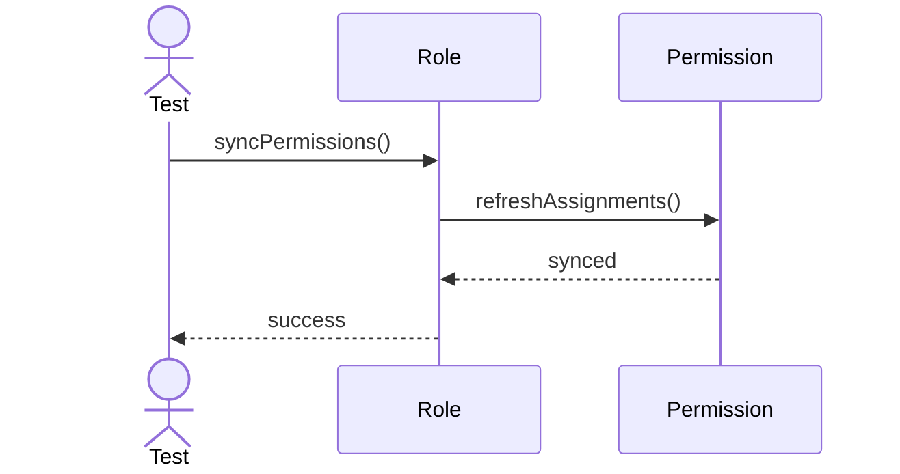

---

## 11. Load Role

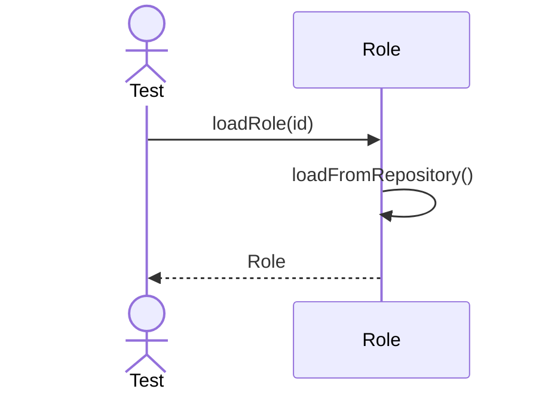

---

## 12. Validate Membership

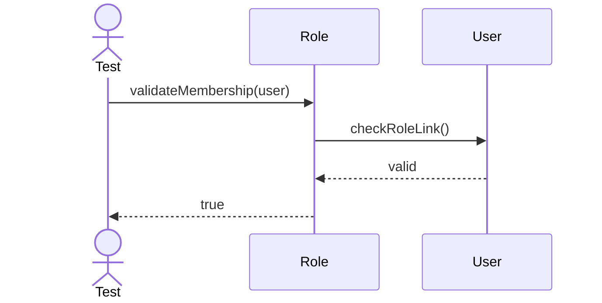

---

## 13. Attach User Count

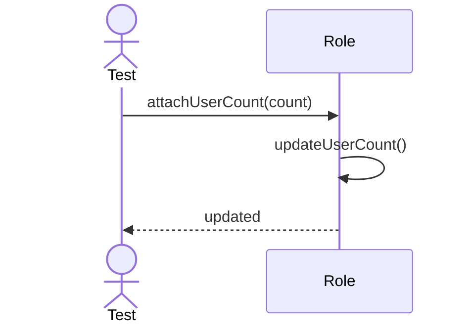

---

## 14. Detach User Count

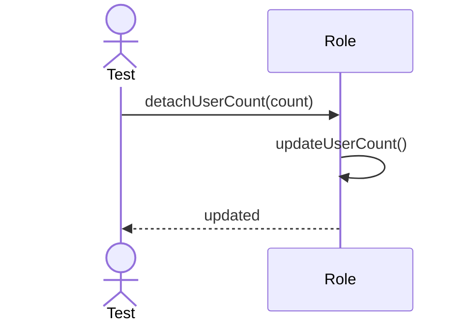

---

## 15. Archive Role

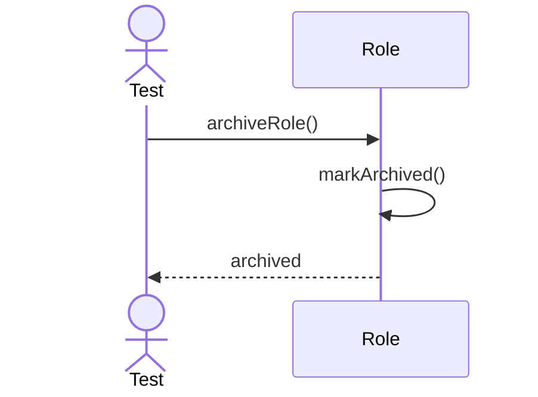

---

## 16. Restore Role

---

## 17. Resolve Effective Permissions

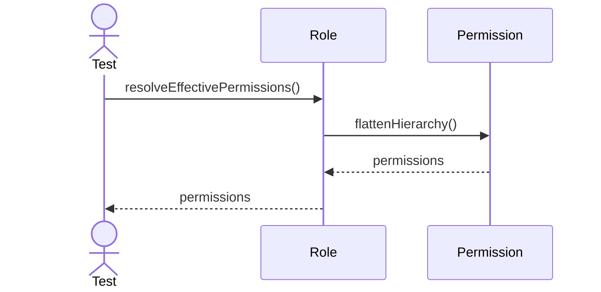

---

## 18. Export Role Graph

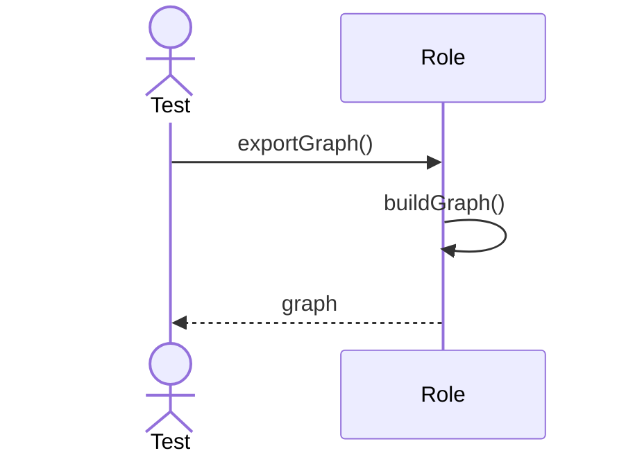

---

## 19. Reset Role Cache

---

## 20. Export Access Summary

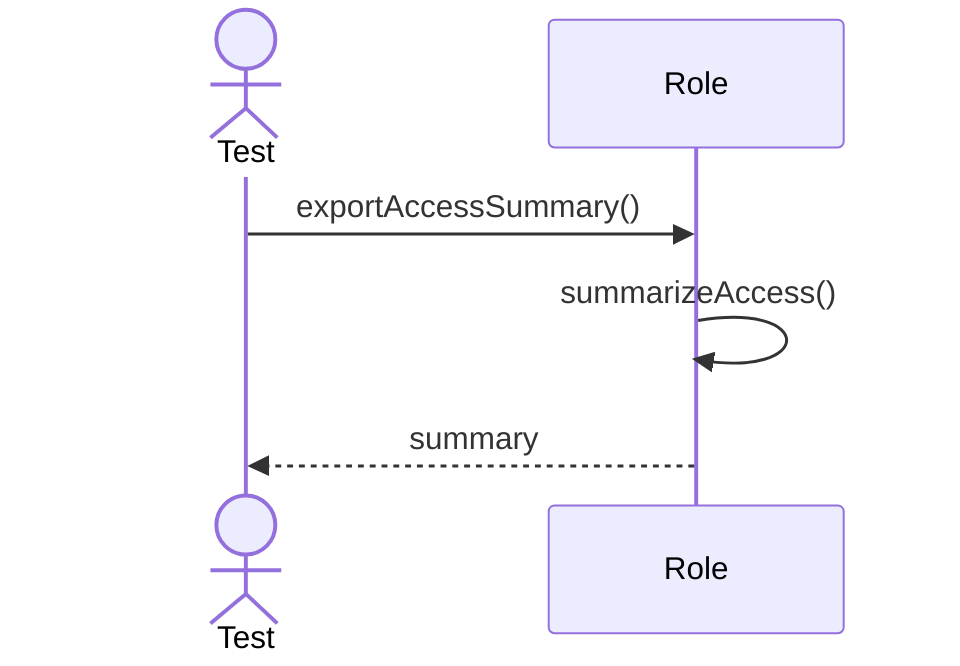
