# SecurityManager Testing - Main Functional Sequences

---

## 1. Authenticate

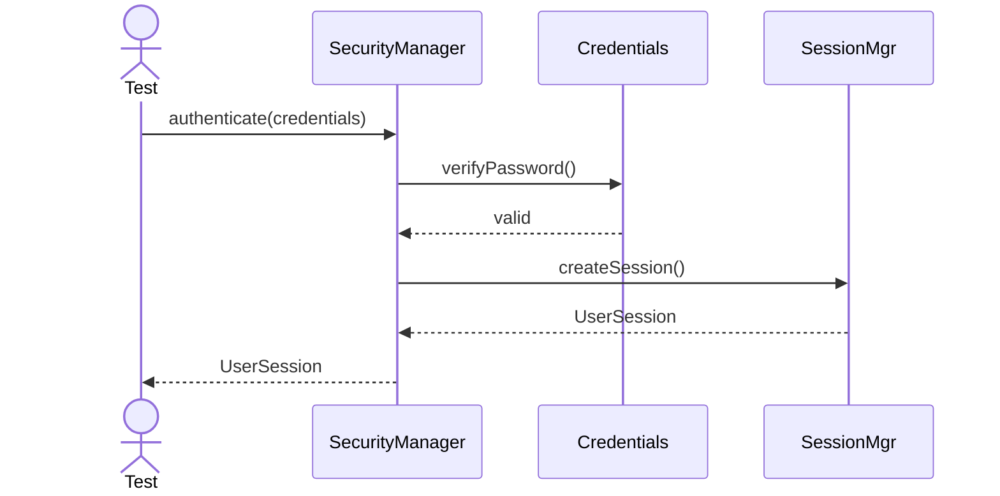

---

## 2. Authorize

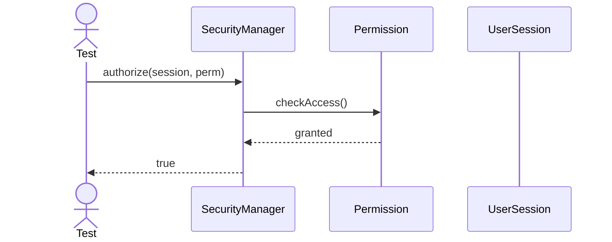

---

## 3. Grant Permission

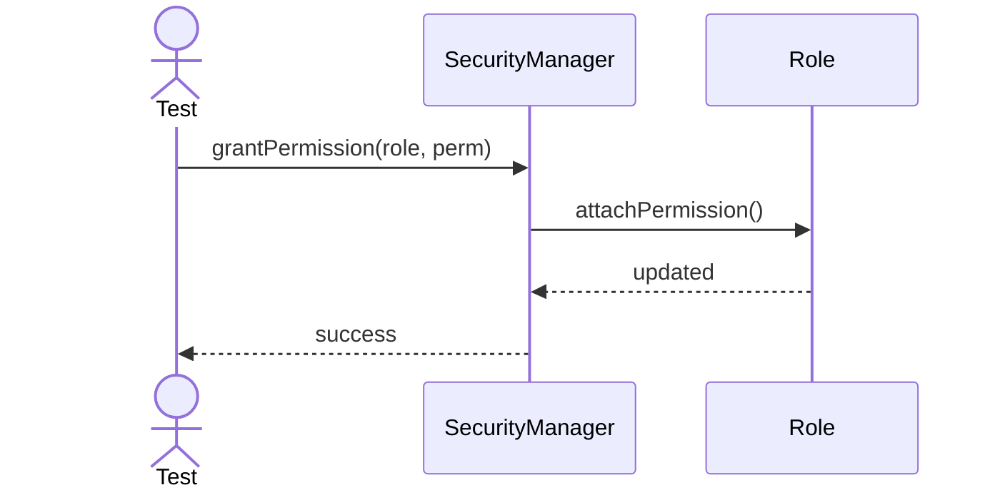

---

## 4. Audit Login

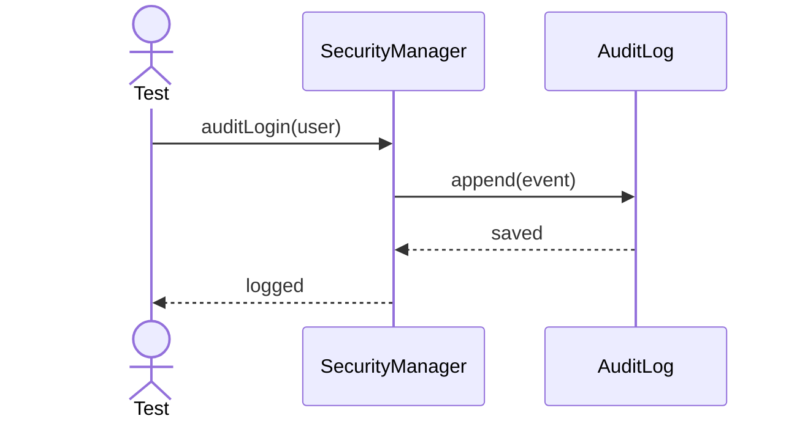

---

## 5. Change Password

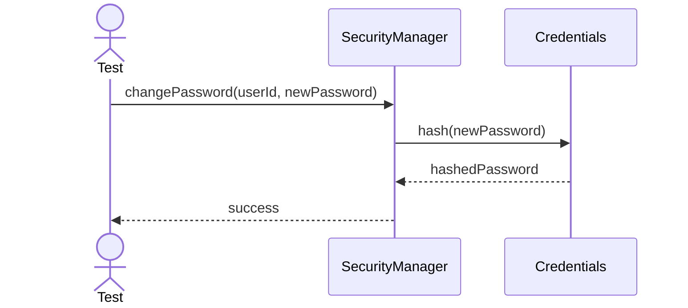

---

## 6. Lock User

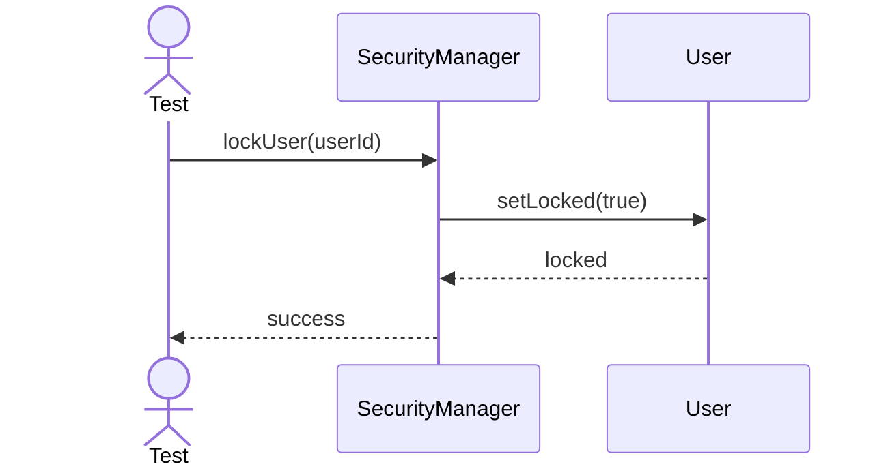

---

## 7. Unlock User

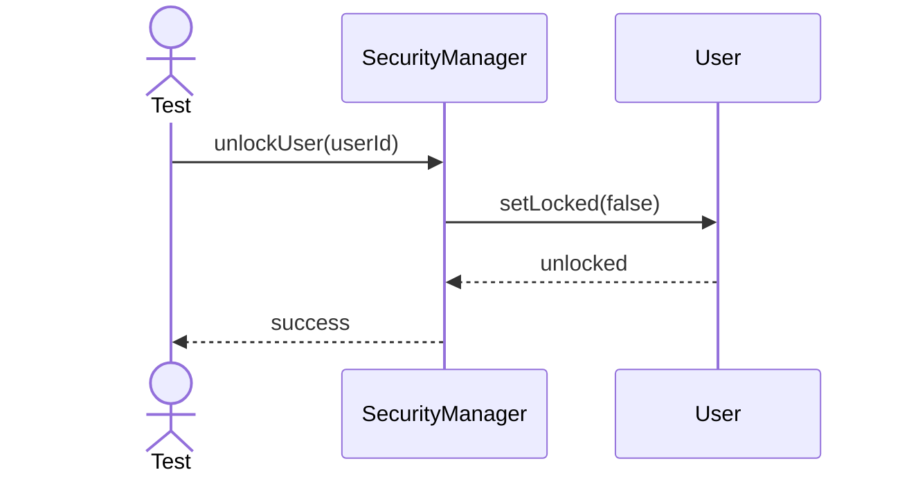

---

## 8. Revoke Permission

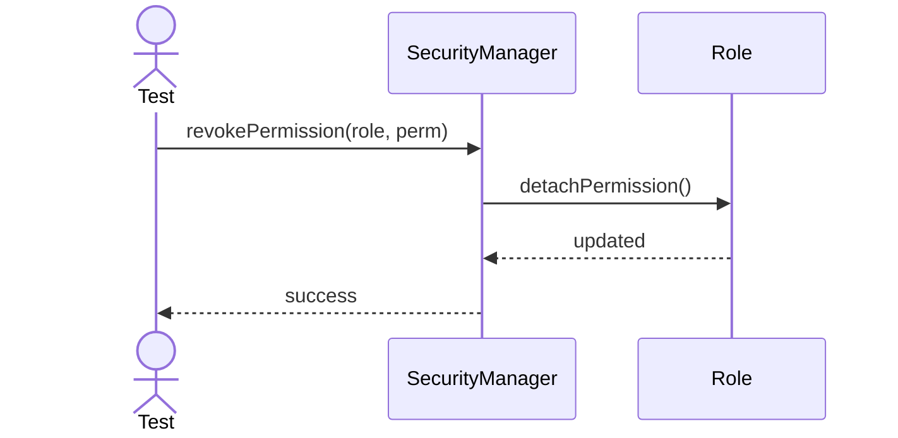

---

## 9. Audit Failed Login

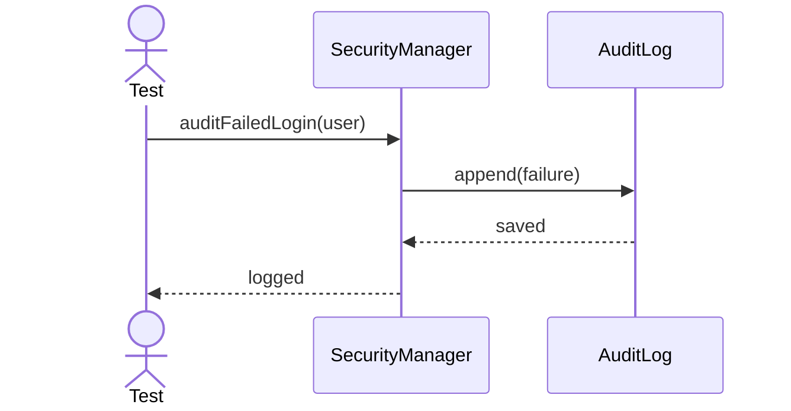

---

## 10. Refresh Session

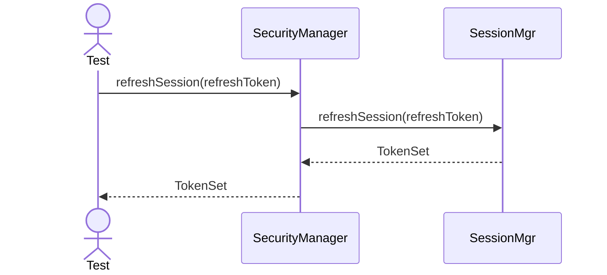

---

## 11. Validate Credentials

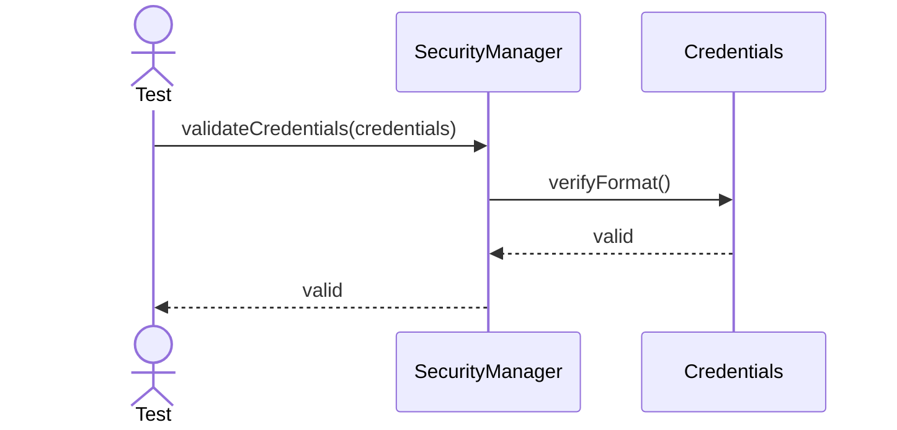

---

## 12. Resolve Role Hierarchy

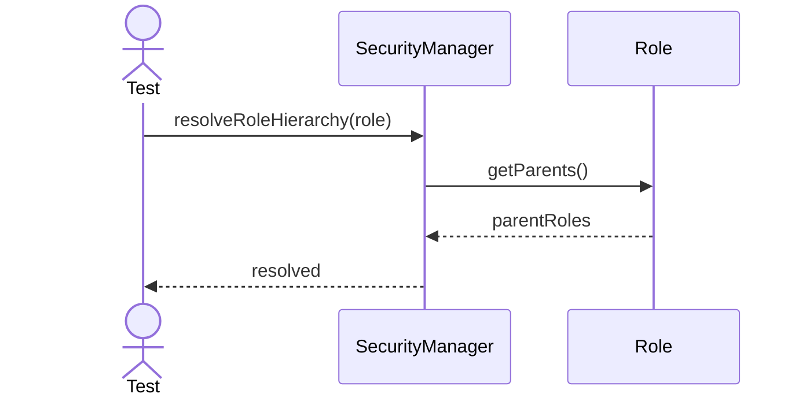

---

## 13. Check Resource Access

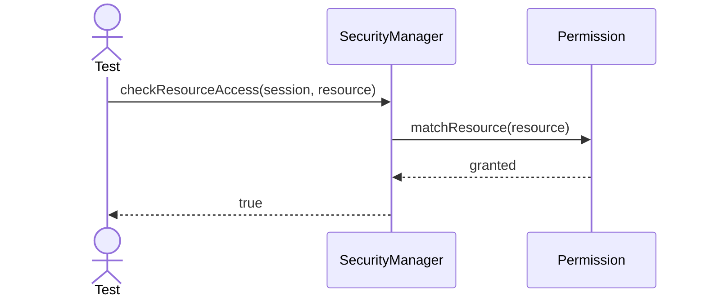

---

## 14. List Permissions

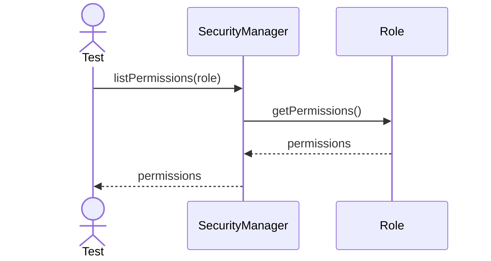

---

## 15. Assign Role

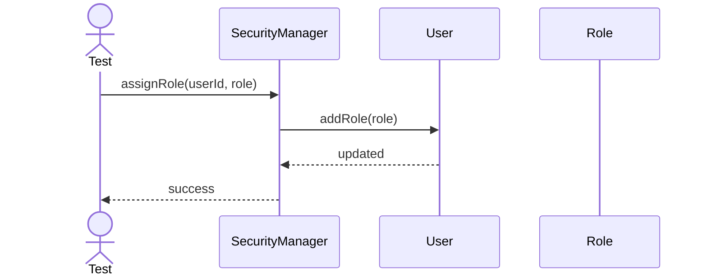

---

## 16. Remove Role

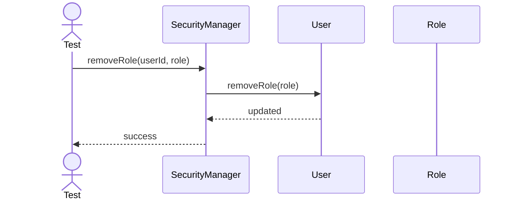

---

## 17. Sync Security Cache

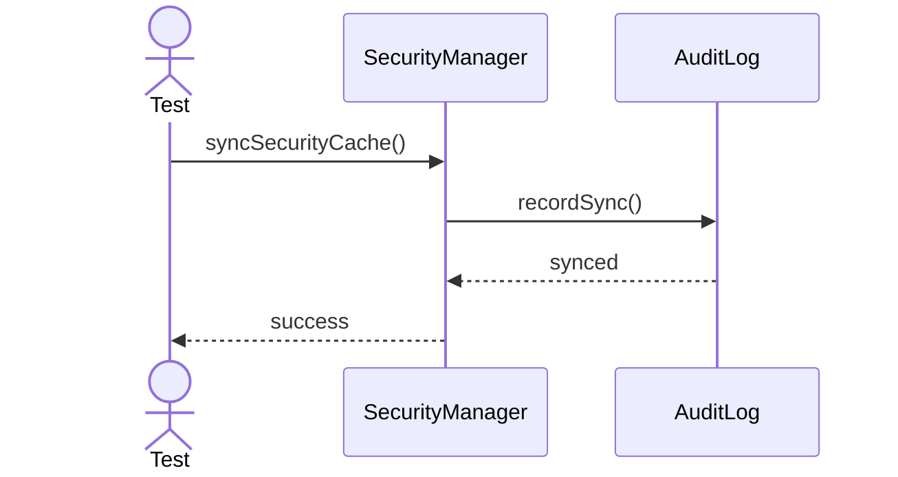

---

## 18. Issue Token Pair

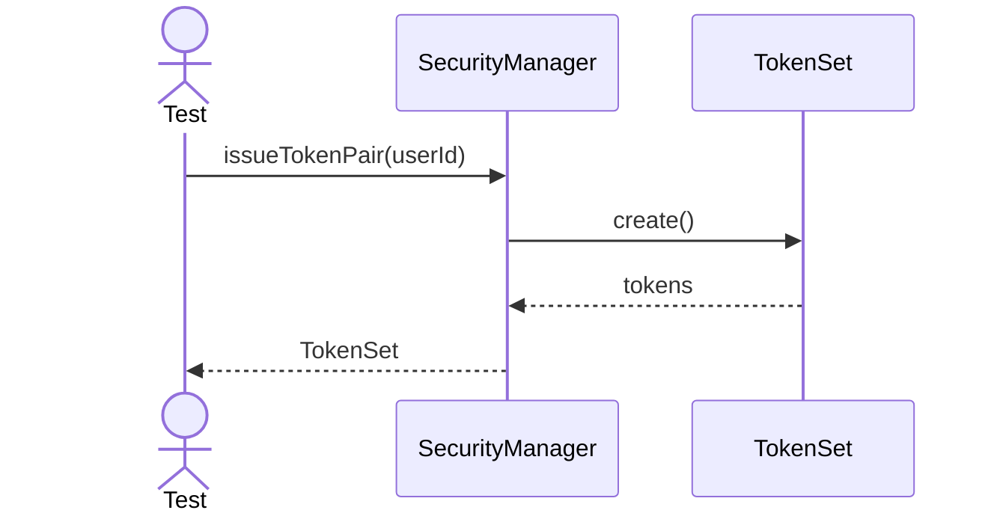

---

## 19. Invalidate Token Set

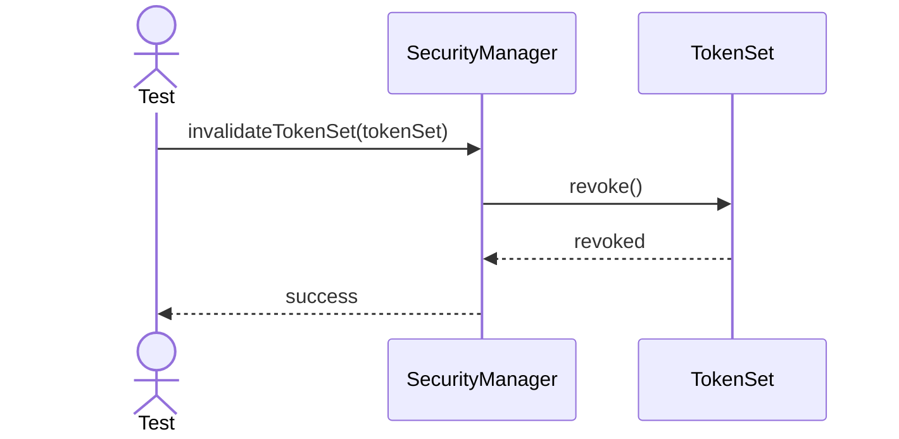

---

## 20. Check Password Policy

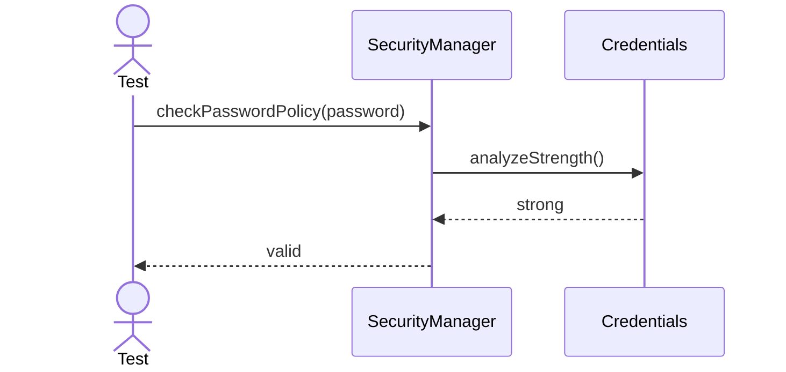
