# SessionManager Testing - Main Functional Sequences

---

## 1. Open Session

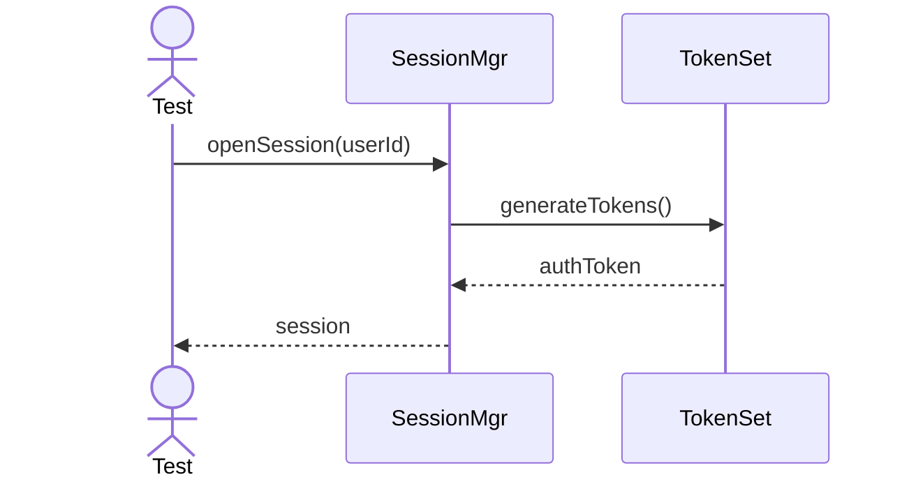
```mermaid
sequenceDiagram
actor Test
participant SessionMgr
participant TokenSet

Test->>SessionMgr: openSession(userId)
SessionMgr->>TokenSet: generateTokens()
TokenSet-->>SessionMgr: authToken
SessionMgr-->>Test: session
```

---

## 2. Close Session

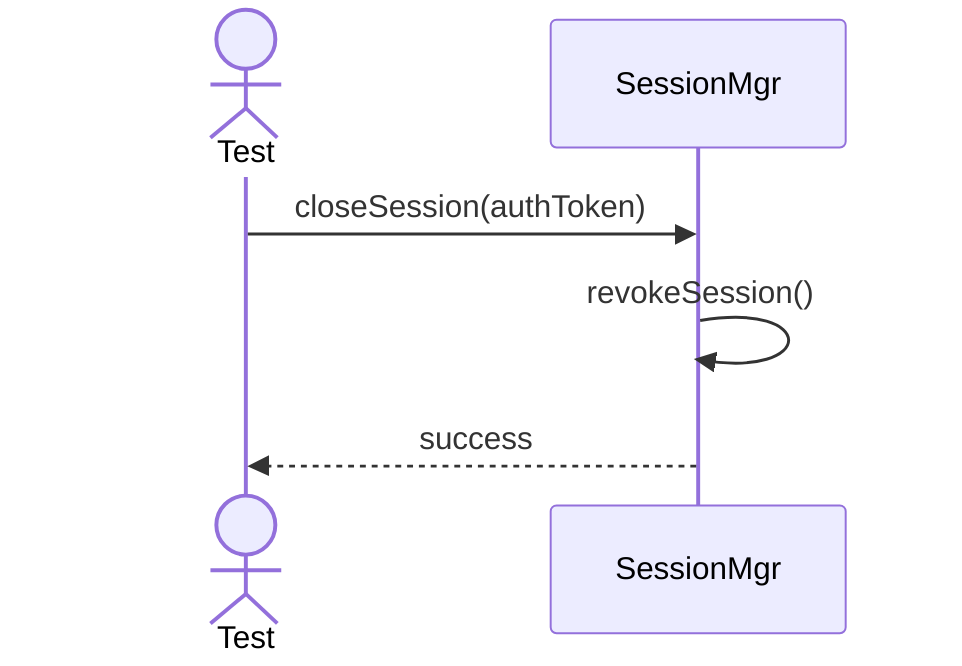
```mermaid
sequenceDiagram
actor Test
participant SessionMgr

Test->>SessionMgr: closeSession(authToken)
SessionMgr->>SessionMgr: revokeSession()
SessionMgr-->>Test: success
```

---

## 3. Timeout Session

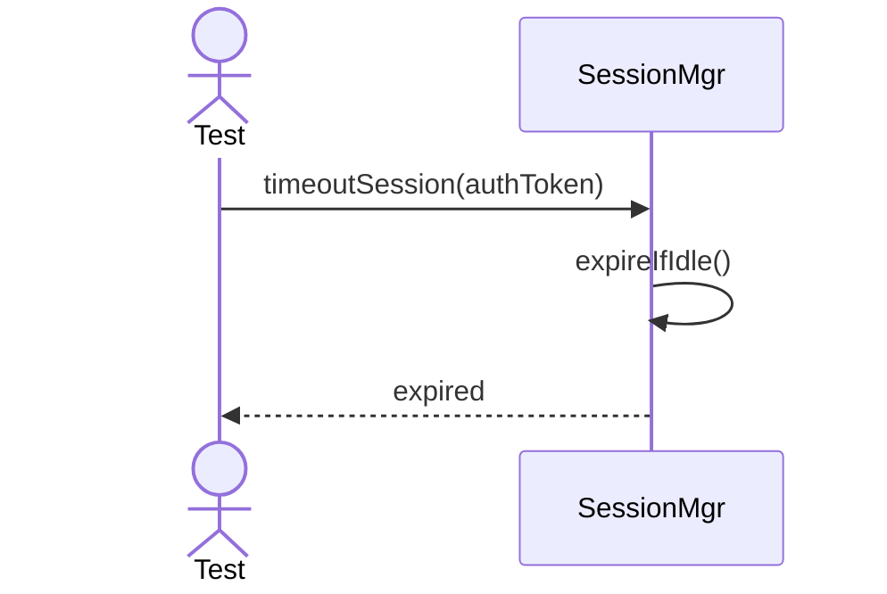
```mermaid
sequenceDiagram
actor Test
participant SessionMgr

Test->>SessionMgr: timeoutSession(authToken)
SessionMgr->>SessionMgr: expireIfIdle()
SessionMgr-->>Test: expired
```

---

## 4. Associate Transaction

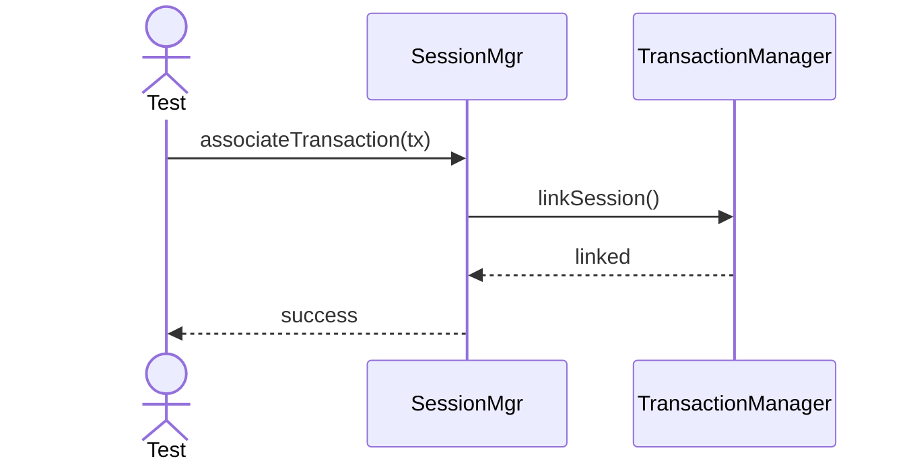
```mermaid
sequenceDiagram
actor Test
participant SessionMgr
participant TransactionManager

Test->>SessionMgr: associateTransaction(tx)
SessionMgr->>TransactionManager: linkSession()
TransactionManager-->>SessionMgr: linked
SessionMgr-->>Test: success
```

---

## 5. Refresh Session

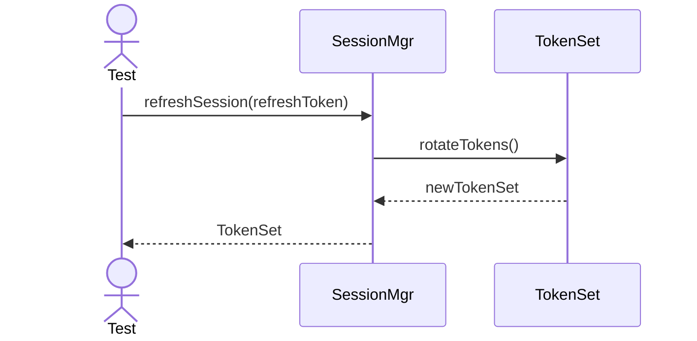
```mermaid
sequenceDiagram
actor Test
participant SessionMgr
participant TokenSet

Test->>SessionMgr: refreshSession(refreshToken)
SessionMgr->>TokenSet: rotateTokens()
TokenSet-->>SessionMgr: newTokenSet
SessionMgr-->>Test: TokenSet
```

---

## 6. Revoke Session

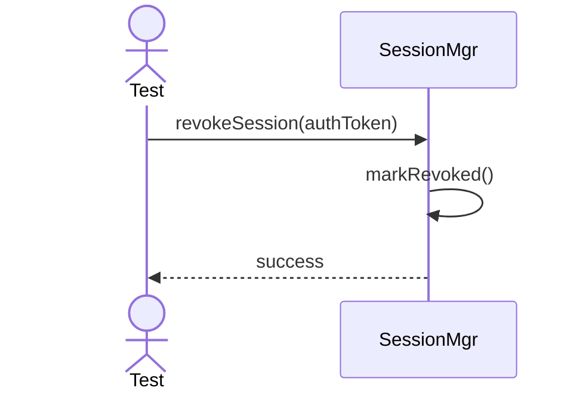
```mermaid
sequenceDiagram
actor Test
participant SessionMgr

Test->>SessionMgr: revokeSession(authToken)
SessionMgr->>SessionMgr: markRevoked()
SessionMgr-->>Test: success
```

---

## 7. Validate Session

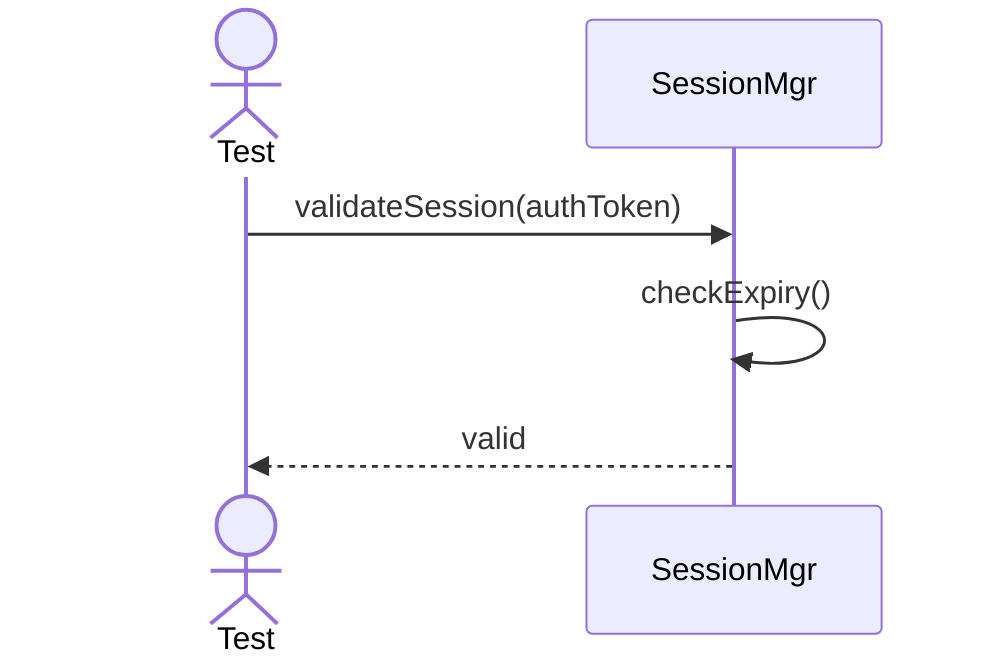
```mermaid
sequenceDiagram
actor Test
participant SessionMgr

Test->>SessionMgr: validateSession(authToken)
SessionMgr->>SessionMgr: checkExpiry()
SessionMgr-->>Test: valid
```

---

## 8. Validate Refresh Token

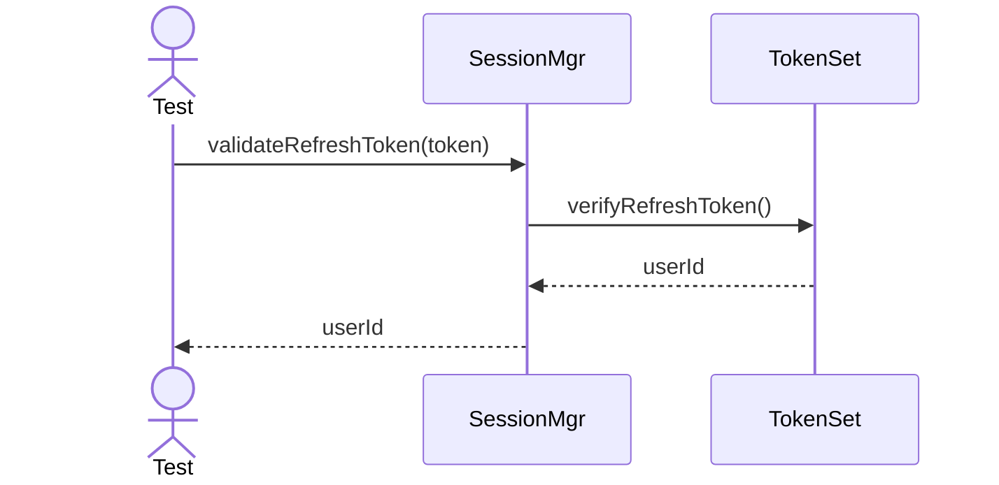
```mermaid
sequenceDiagram
actor Test
participant SessionMgr
participant TokenSet

Test->>SessionMgr: validateRefreshToken(token)
SessionMgr->>TokenSet: verifyRefreshToken()
TokenSet-->>SessionMgr: userId
SessionMgr-->>Test: userId
```

---

## 9. Track Activity

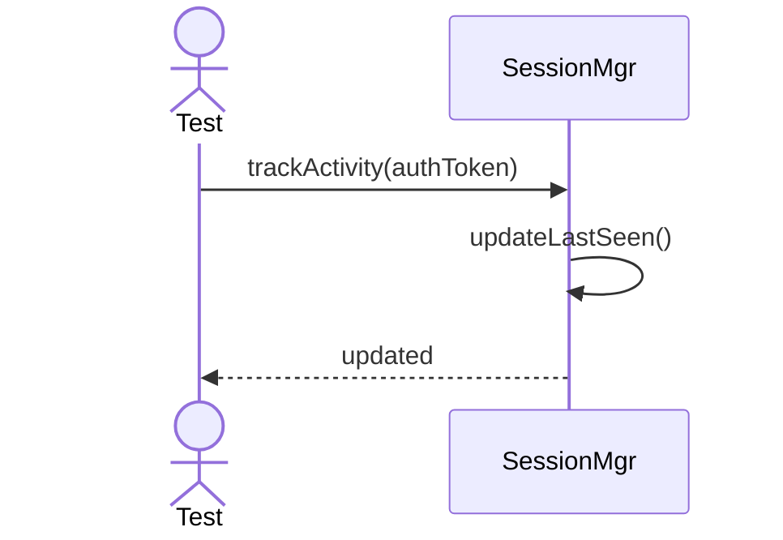
```mermaid
sequenceDiagram
actor Test
participant SessionMgr

Test->>SessionMgr: trackActivity(authToken)
SessionMgr->>SessionMgr: updateLastSeen()
SessionMgr-->>Test: updated
```

---

## 10. Extend Session

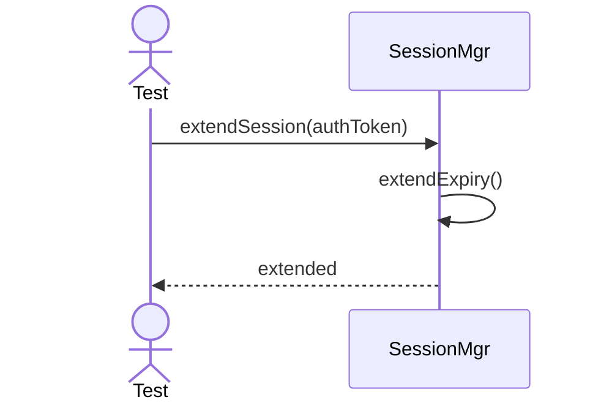
```mermaid
sequenceDiagram
actor Test
participant SessionMgr

Test->>SessionMgr: extendSession(authToken)
SessionMgr->>SessionMgr: extendExpiry()
SessionMgr-->>Test: extended
```

---

## 11. Purge Expired Sessions

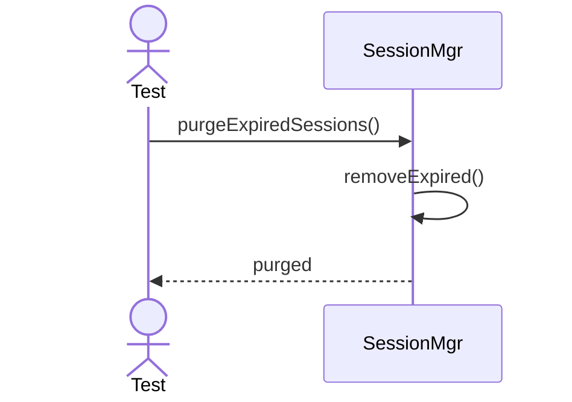
```mermaid
sequenceDiagram
actor Test
participant SessionMgr

Test->>SessionMgr: purgeExpiredSessions()
SessionMgr->>SessionMgr: removeExpired()
SessionMgr-->>Test: purged
```

---

## 12. Revoke Sessions By User

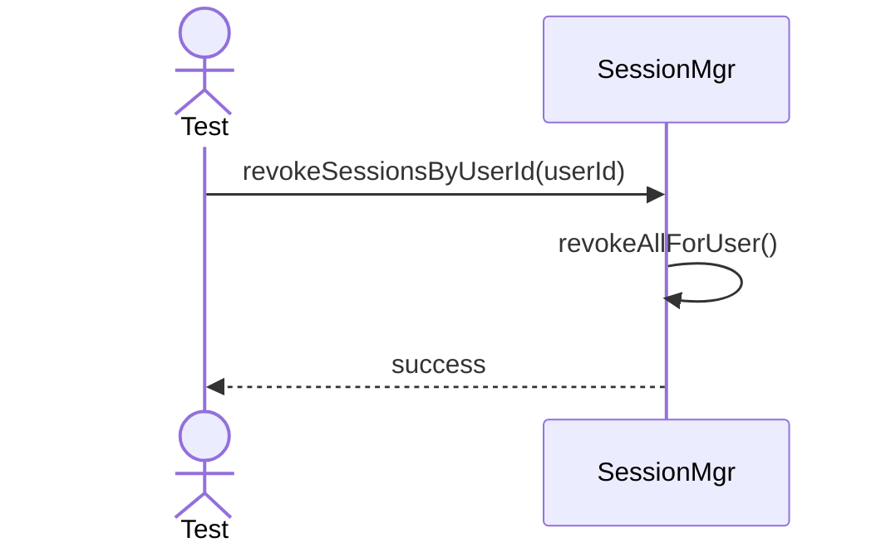
```mermaid
sequenceDiagram
actor Test
participant SessionMgr

Test->>SessionMgr: revokeSessionsByUserId(userId)
SessionMgr->>SessionMgr: revokeAllForUser()
SessionMgr-->>Test: success
```

---

## 13. Bind Device

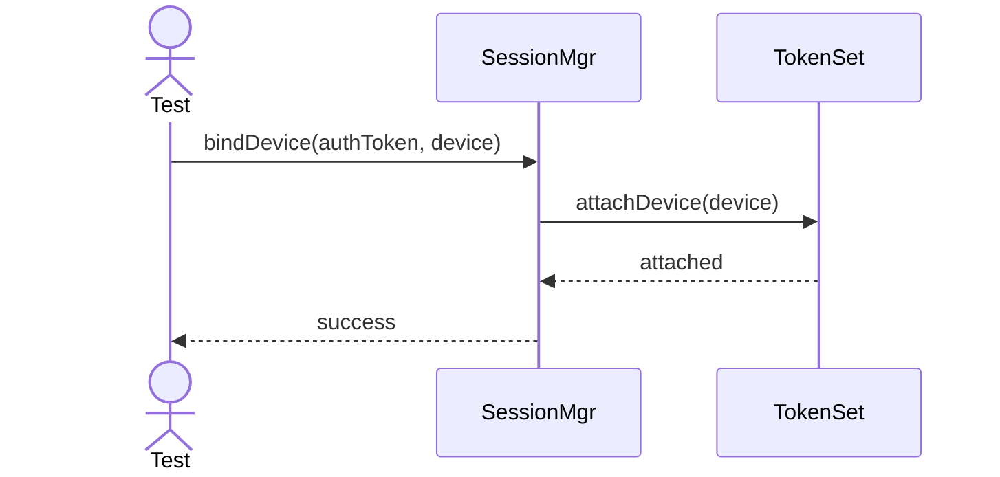
```mermaid
sequenceDiagram
actor Test
participant SessionMgr
participant TokenSet

Test->>SessionMgr: bindDevice(authToken, device)
SessionMgr->>TokenSet: attachDevice(device)
TokenSet-->>SessionMgr: attached
SessionMgr-->>Test: success
```

---

## 14. Unbind Device

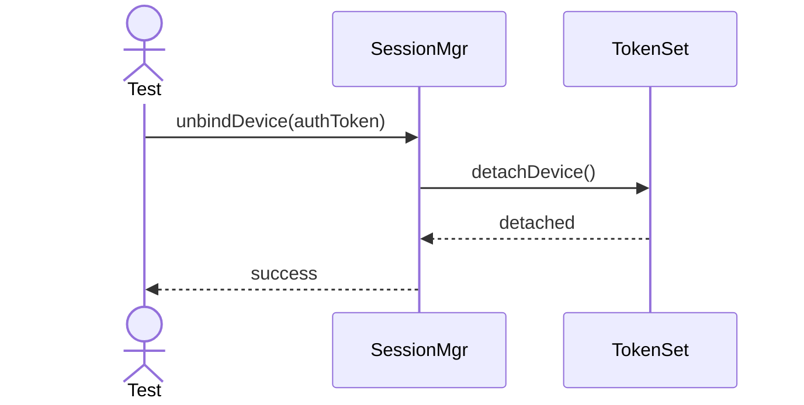
```mermaid
sequenceDiagram
actor Test
participant SessionMgr
participant TokenSet

Test->>SessionMgr: unbindDevice(authToken)
SessionMgr->>TokenSet: detachDevice()
TokenSet-->>SessionMgr: detached
SessionMgr-->>Test: success
```

---

## 15. Issue New Session

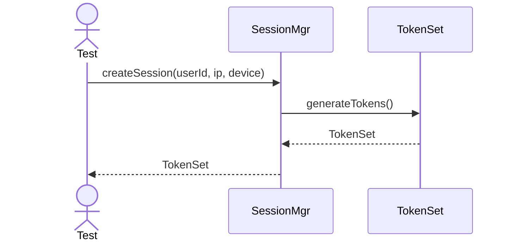
```mermaid
sequenceDiagram
actor Test
participant SessionMgr
participant TokenSet

Test->>SessionMgr: createSession(userId, ip, device)
SessionMgr->>TokenSet: generateTokens()
TokenSet-->>SessionMgr: TokenSet
SessionMgr-->>Test: TokenSet
```

---

## 16. Rotate Refresh Token

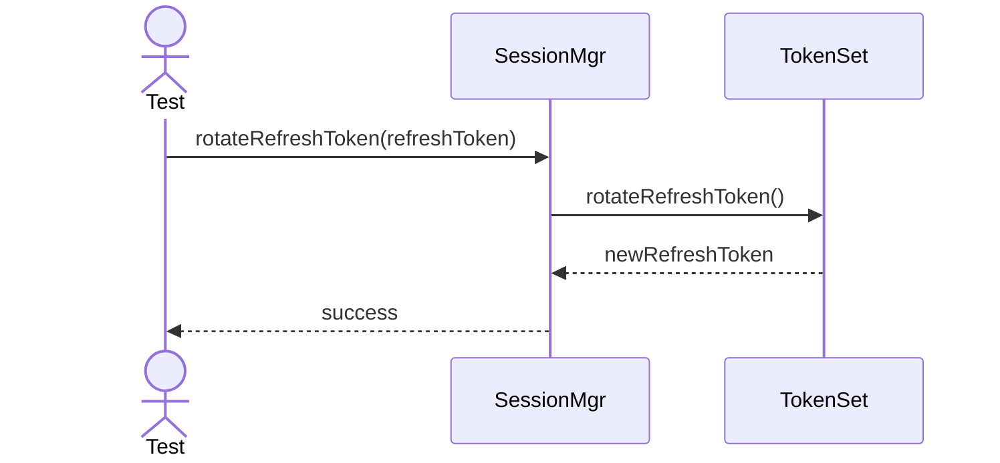
```mermaid
sequenceDiagram
actor Test
participant SessionMgr
participant TokenSet

Test->>SessionMgr: rotateRefreshToken(refreshToken)
SessionMgr->>TokenSet: rotateRefreshToken()
TokenSet-->>SessionMgr: newRefreshToken
SessionMgr-->>Test: success
```

---

## 17. Record Latest Auth Token

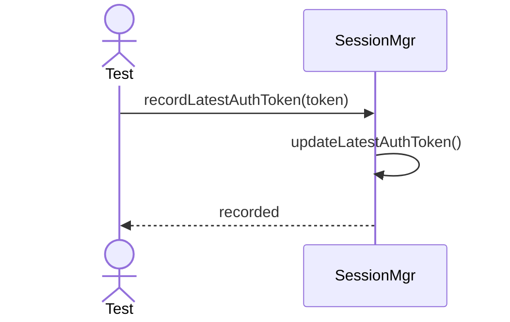
```mermaid
sequenceDiagram
actor Test
participant SessionMgr

Test->>SessionMgr: recordLatestAuthToken(token)
SessionMgr->>SessionMgr: updateLatestAuthToken()
SessionMgr-->>Test: recorded
```

---

## 18. Clear Latest Auth Token

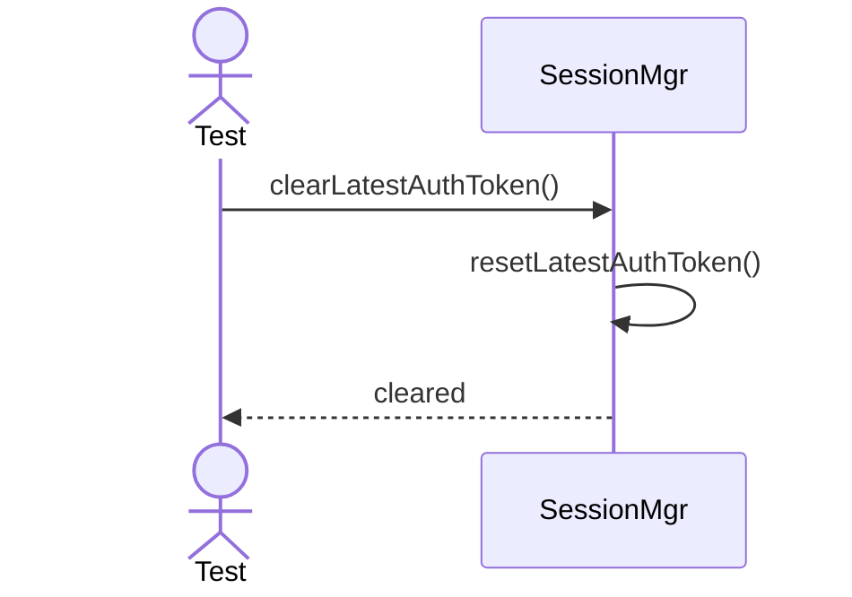
```mermaid
sequenceDiagram
actor Test
participant SessionMgr

Test->>SessionMgr: clearLatestAuthToken()
SessionMgr->>SessionMgr: resetLatestAuthToken()
SessionMgr-->>Test: cleared
```

---

## 19. Create Session From Login

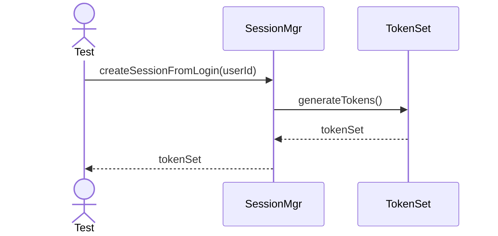
```mermaid
sequenceDiagram
actor Test
participant SessionMgr
participant TokenSet

Test->>SessionMgr: createSessionFromLogin(userId)
SessionMgr->>TokenSet: generateTokens()
TokenSet-->>SessionMgr: tokenSet
SessionMgr-->>Test: tokenSet
```

---

## 20. Verify Session Ownership

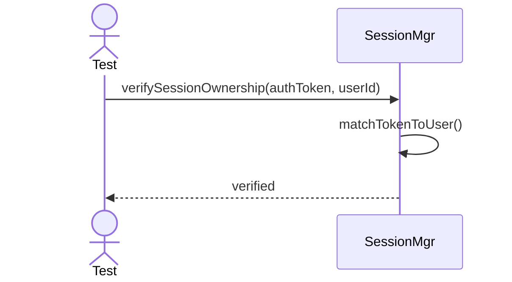
```mermaid
sequenceDiagram
actor Test
participant SessionMgr

Test->>SessionMgr: verifySessionOwnership(authToken, userId)
SessionMgr->>SessionMgr: matchTokenToUser()
SessionMgr-->>Test: verified
```
