# User Testing - Main Functional Sequences

---

## 1. Create User

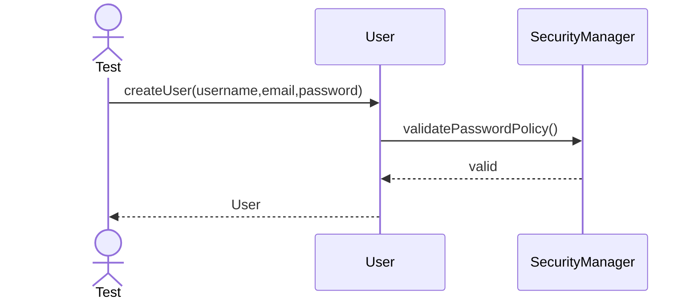

---

## 2. Disable User

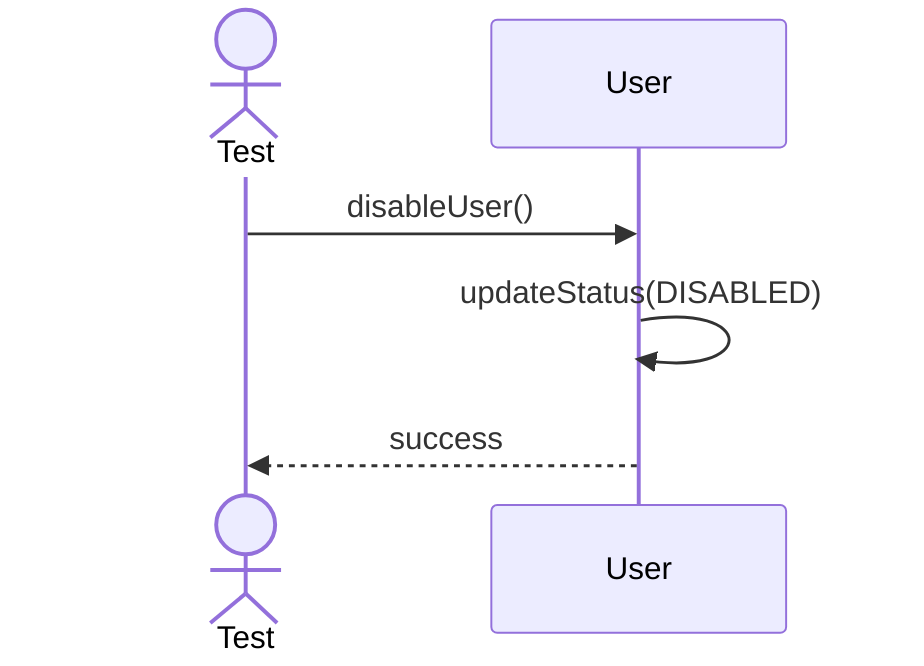

---

## 3. Reset Password

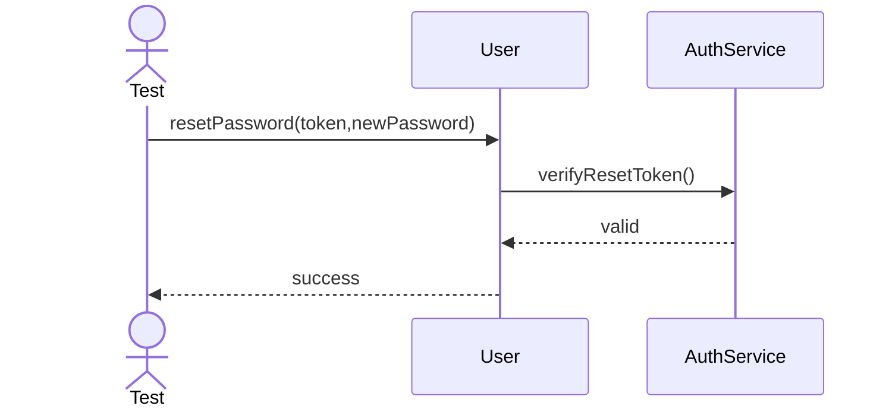

---

## 4. Assign Role

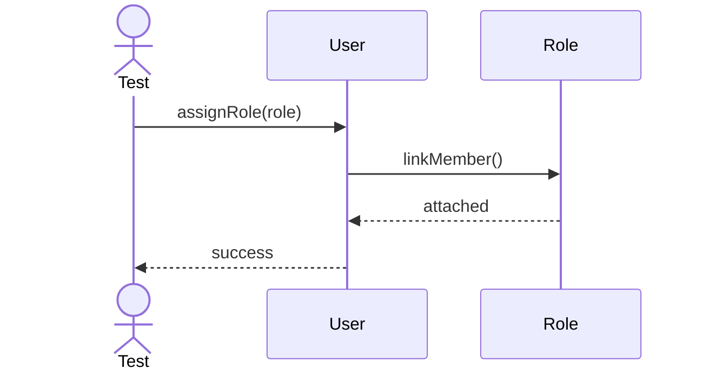

---

## 5. Enable User

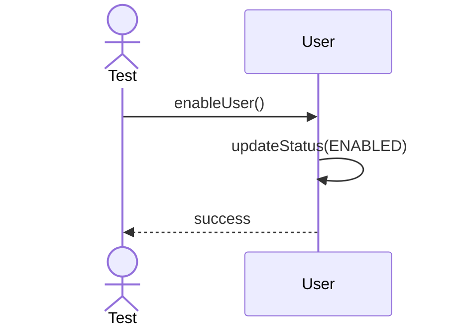

---

## 6. Change Email

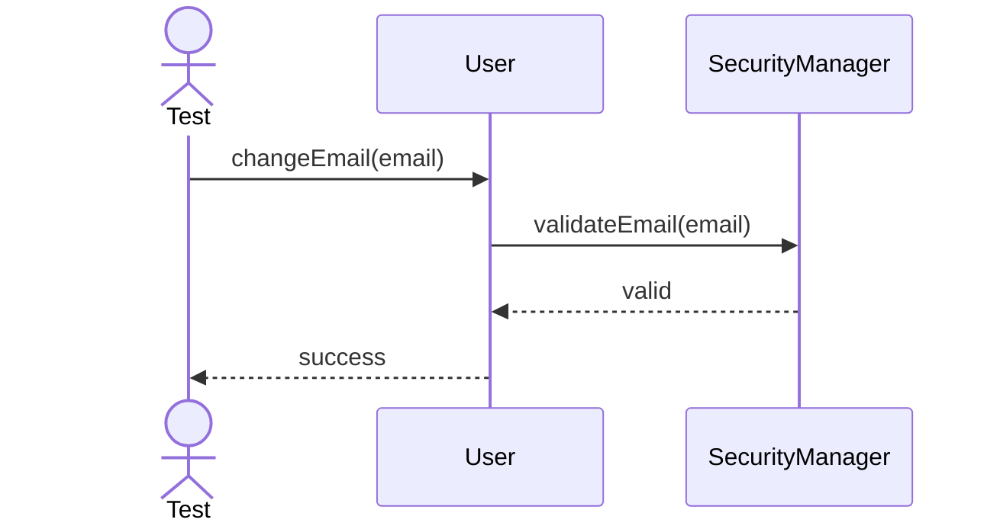

---

## 7. Change Username

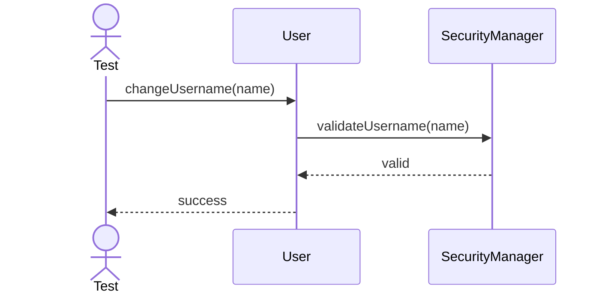

---

## 8. Update Profile

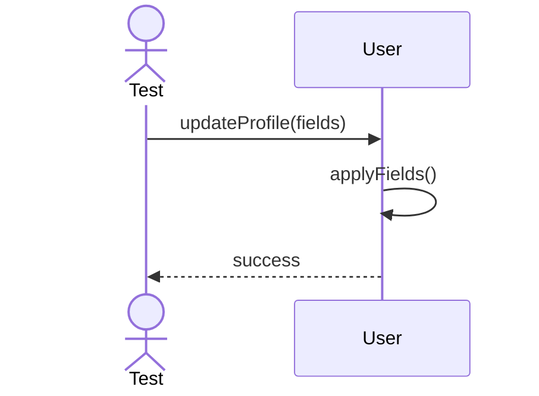

---

## 9. Verify Password

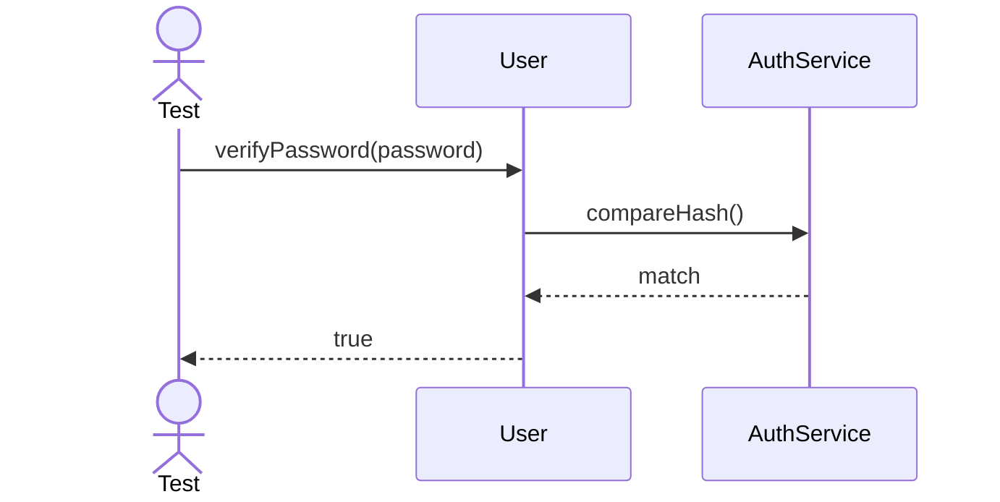

---

## 10. Lock Account

---

## 11. Unlock Account

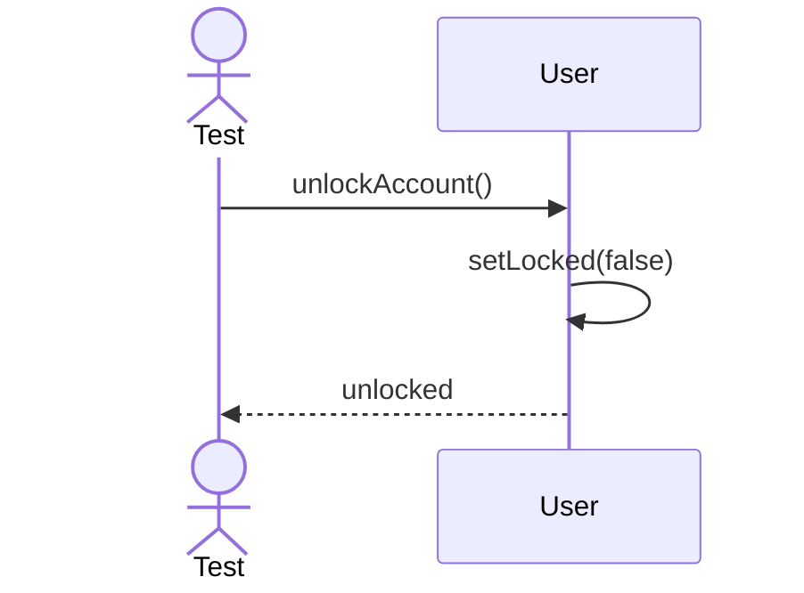

---

## 12. Export User Summary

---

## 13. Load User From Storage

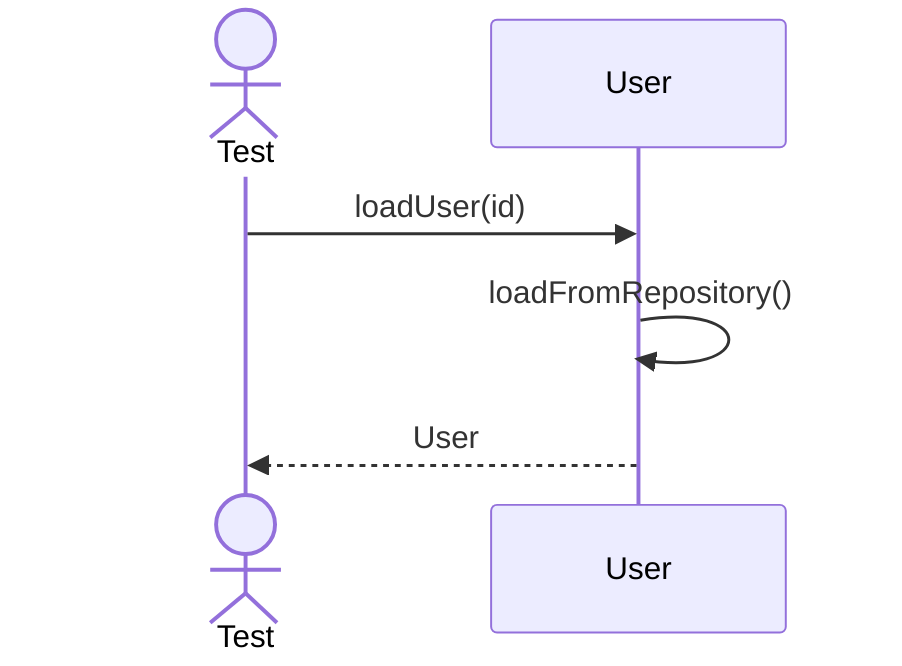

---

## 14. Sync User Roles

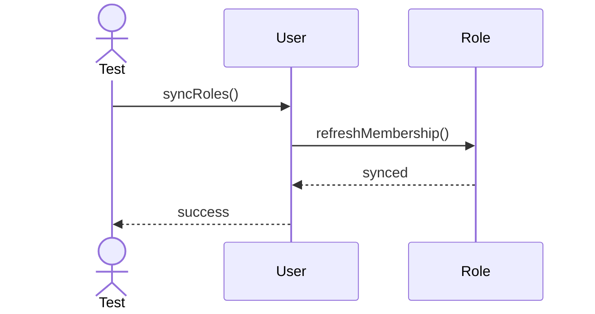

---

## 15. Archive User

---

## 16. Restore User

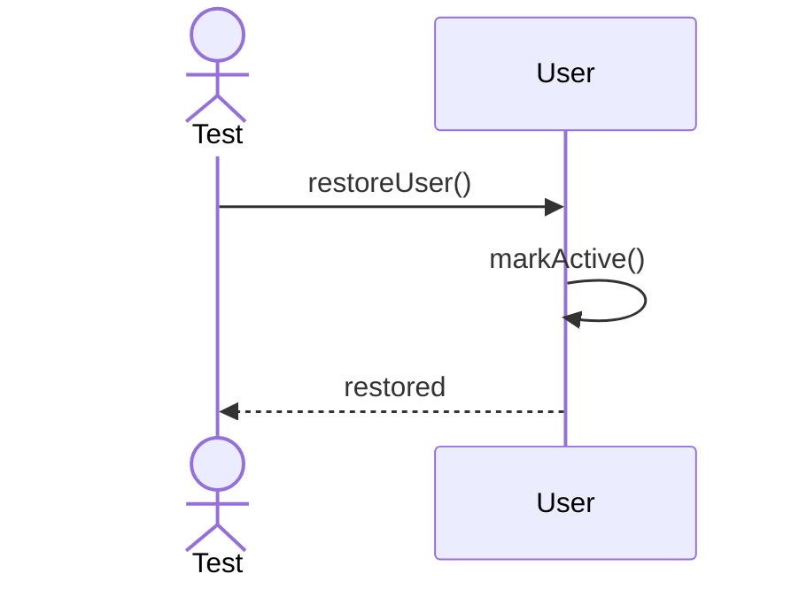

---

## 17. Validate Identity

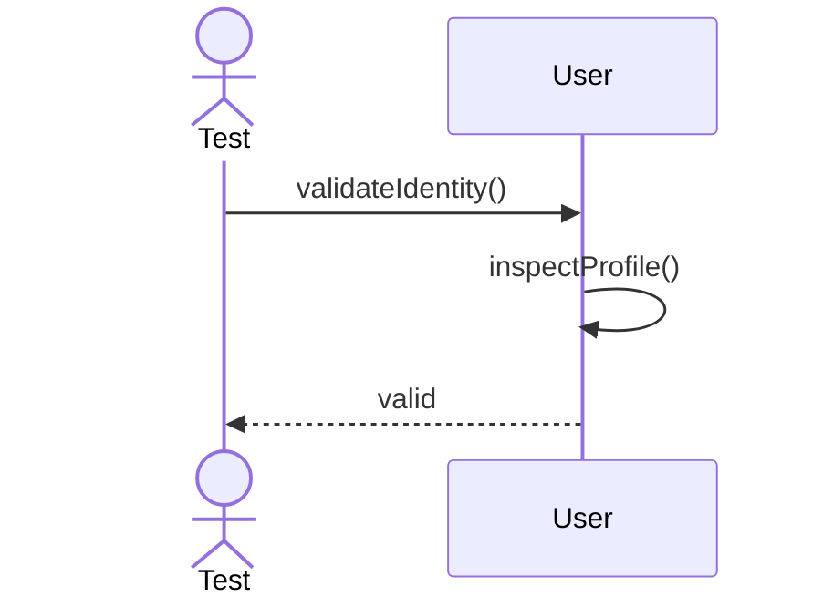

---

## 18. Set Avatar

---

## 19. Clear Avatar

---

## 20. Export Access Profile

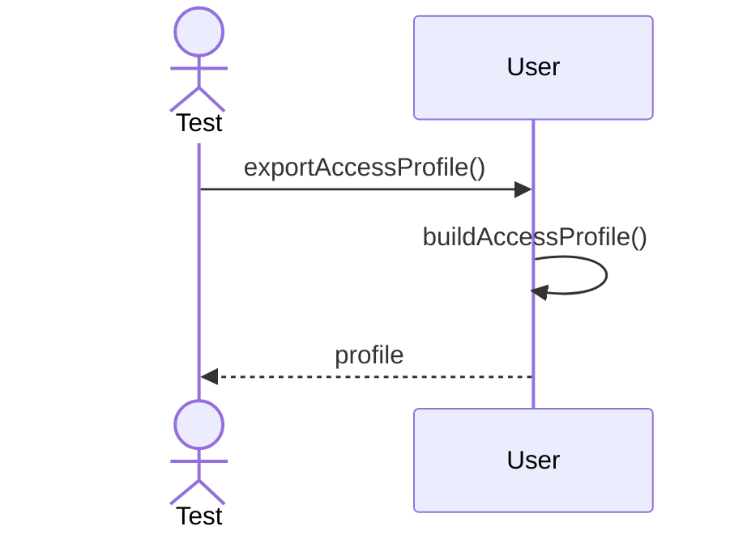
