# BufferPool Testing - Main Functional Sequences

---

## 1. Pin Page

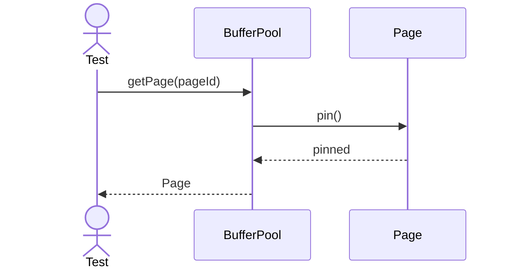

---

## 2. Unpin Page

---

## 3. Evict Page

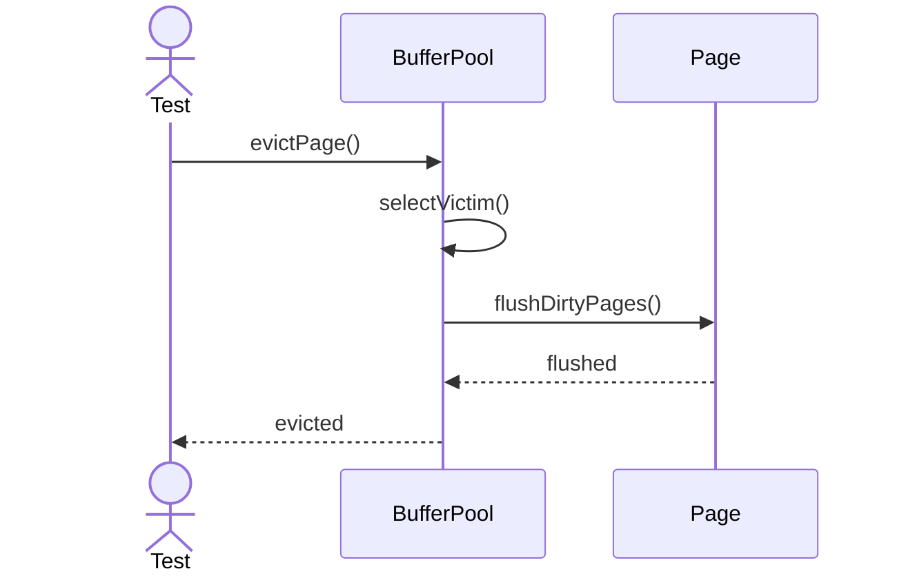

---

## 4. Flush Page

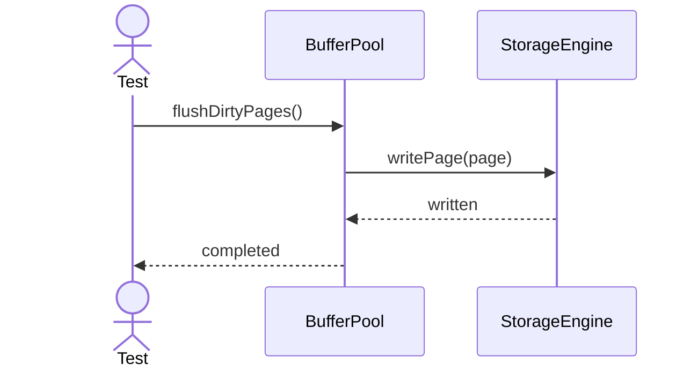

---

## 5. Allocate Frame

---

## 6. Concurrent Pin

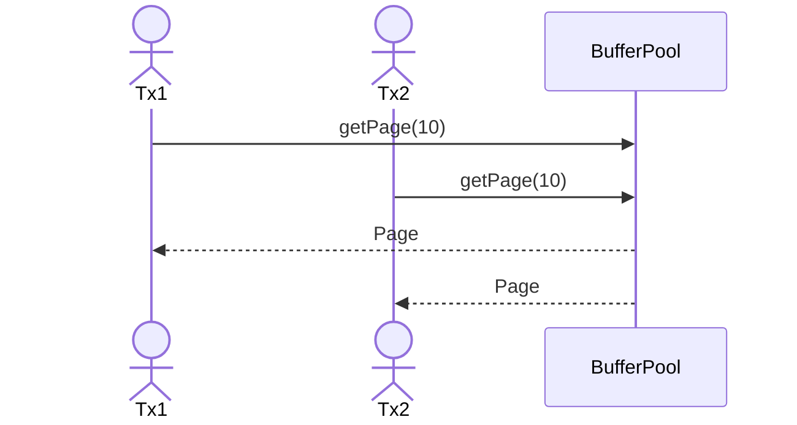

---

## 7. Pin Dirty Page

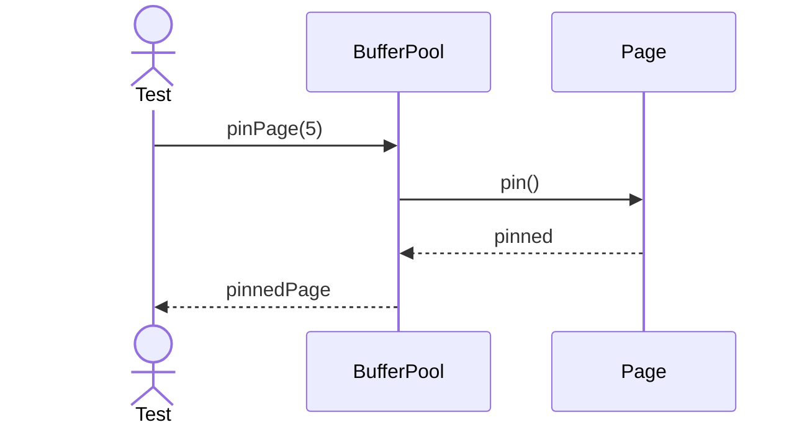

---

## 8. Unpin Dirty Page

---

## 9. Reuse Free Frame

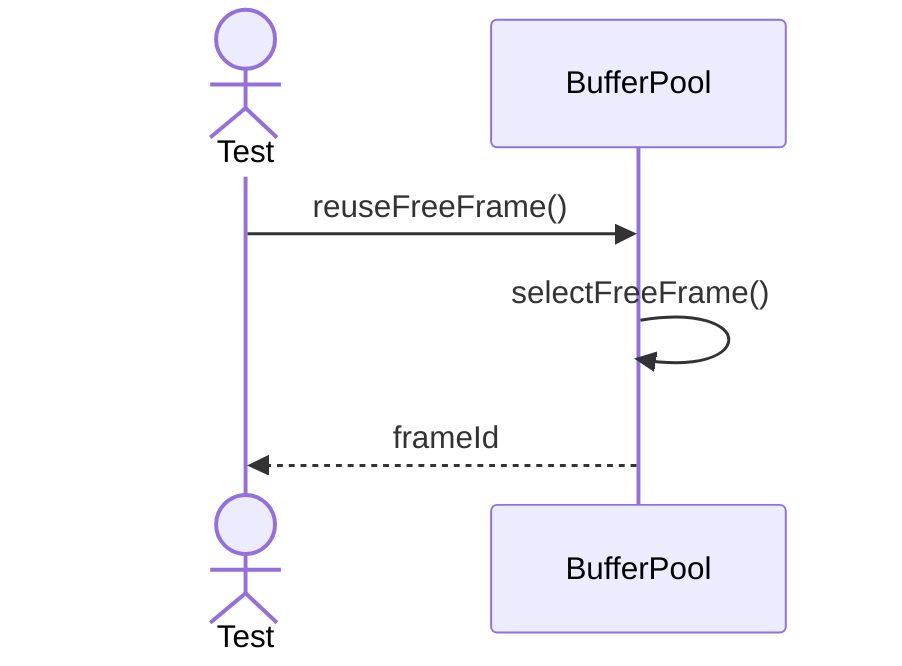

---

## 10. Select LRU Victim

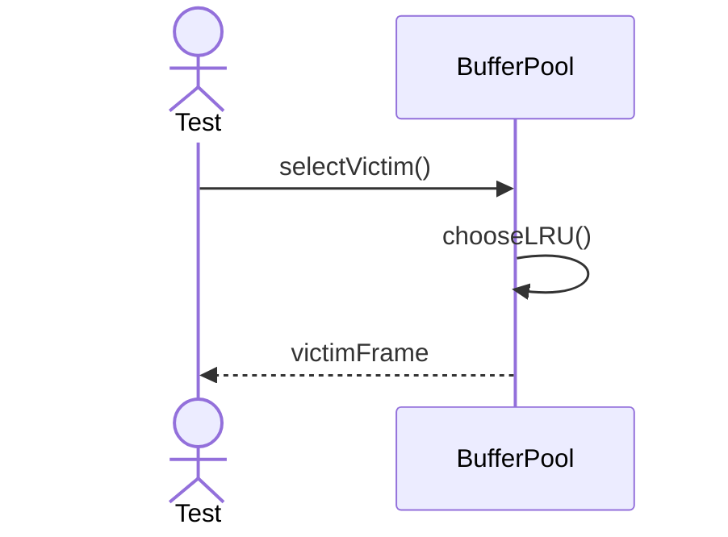

---

## 11. Select Clock Victim

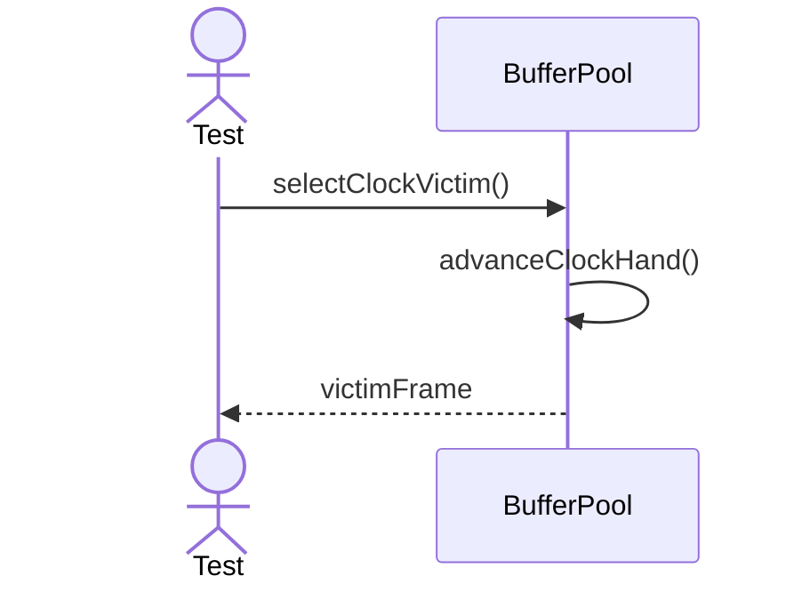

---

## 12. Allocate New Frame

---

## 13. Release Frame

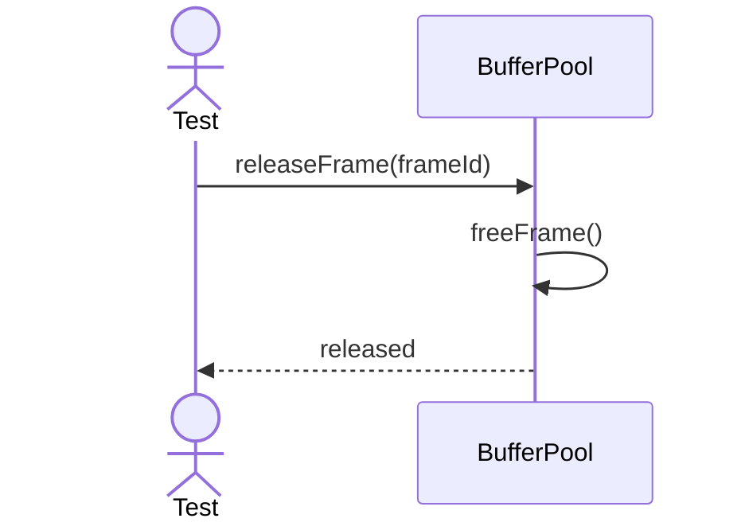

---

## 14. Flush Single Page

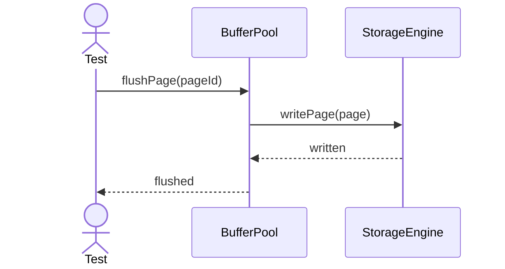

---

## 15. Flush All Pages

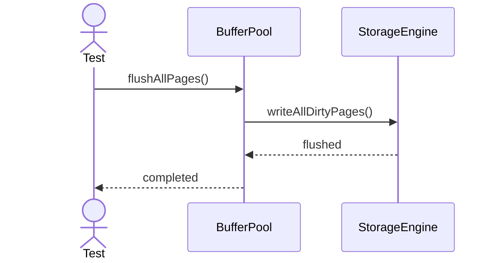

---

## 16. Warm Up Cache

---

## 17. Evict Clean Page

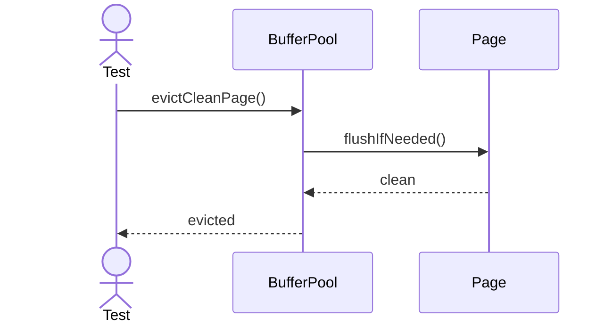

---

## 18. Track Hit Ratio

---

## 19. Reset Pool State

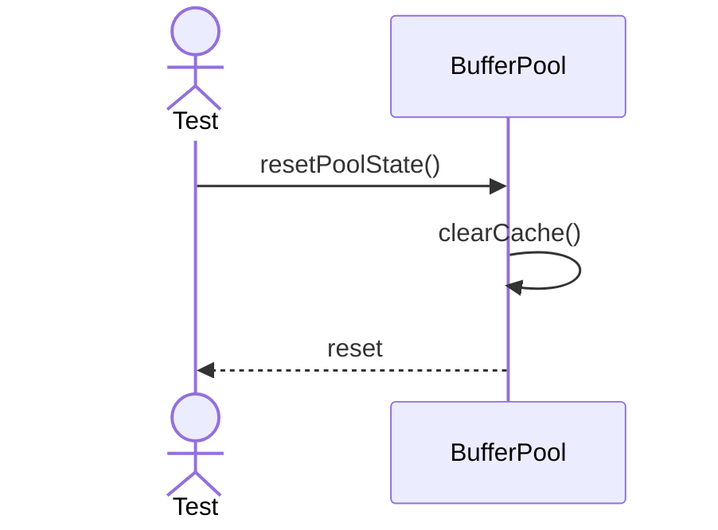

---

## 20. Export Pool Snapshot

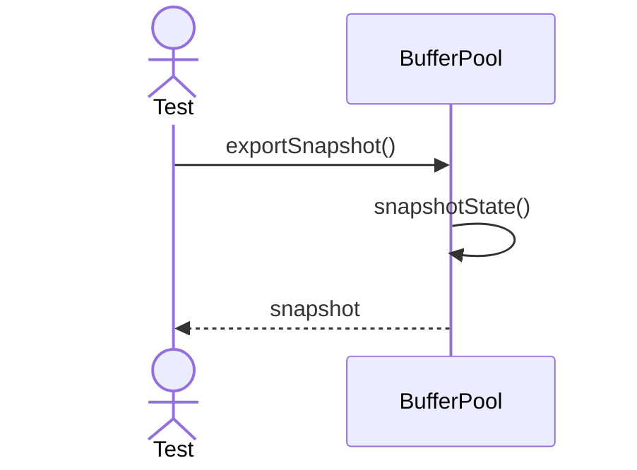
