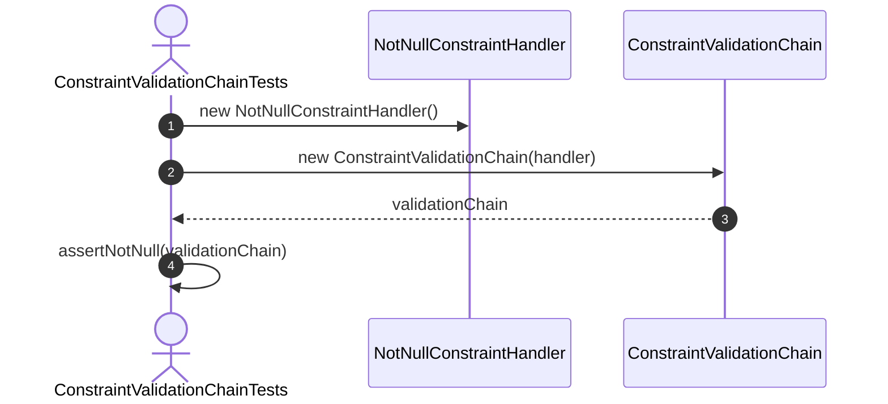
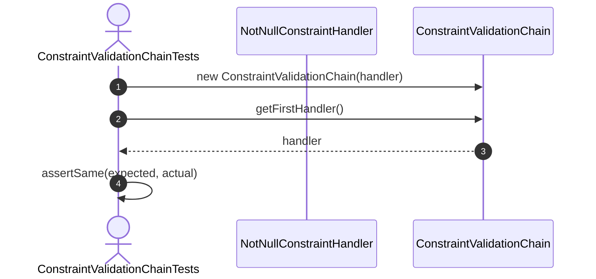
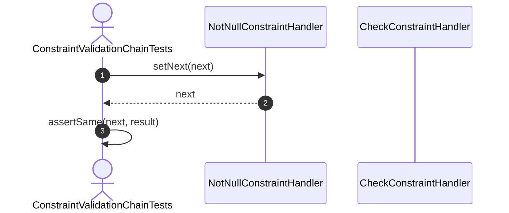
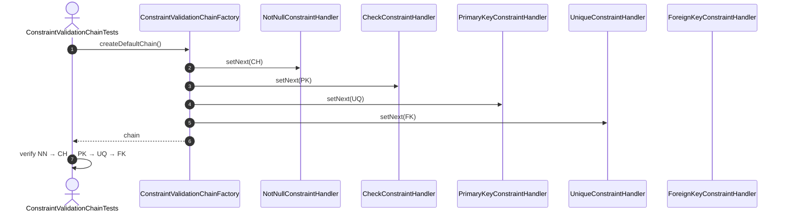
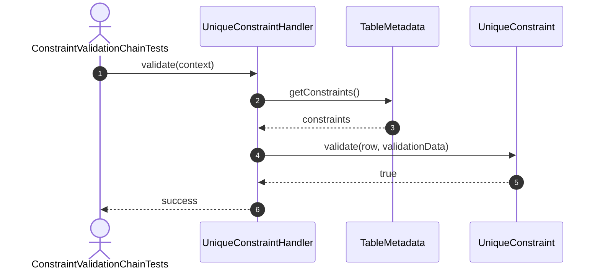
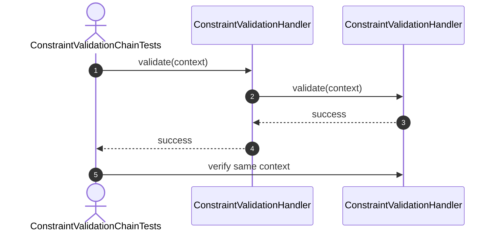
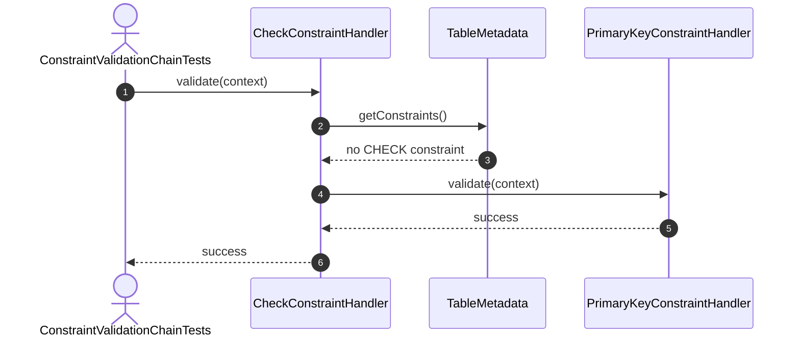
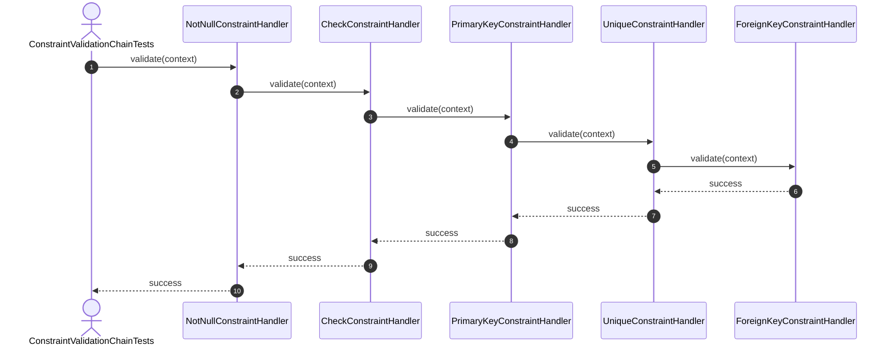

ConstraintValidationChain Test Sequence Diagrams

1. Constructor_ShouldCreateValidationChain

2. Constructor_ShouldStoreFirstHandler


3. SetNext_ShouldReturnAssignedHandler

4–8. Default chain configuration

9. Validate_ShouldDelegateToMatchingConstraint

10. Validate_ShouldPassSameContextToNextHandler

11. Validate_ShouldSkipMissingConstraintType

12. Validate_ShouldReturnSuccessWhenAllConstraintsPass

13–17. Short-circuit at first violation
```mermaid

sequenceDiagram
    autonumber
    actor Test as ConstraintValidationChainTests
    participant Current as CurrentConstraintHandler
    participant Constraint as ConcreteConstraint
    participant Next as NextConstraintHandler
    Test->>Current: validate(context)
    Current->>Constraint: validate(row, validationData)
    Constraint-->>Current: false
    Current-->>Test: failure(violationCode)
    Test->>Next: verify no interactions

Apply below sequence for:

Validate_ShouldStopAtNotNullViolation
Validate_ShouldStopAtCheckViolation
Validate_ShouldStopAtPrimaryKeyViolation
Validate_ShouldStopAtUniqueViolation
Validate_ShouldStopAtForeignKeyViolation
    ```
18. RecordManagerInsert_ShouldValidateBeforeStorageWrite
```mermaid

sequenceDiagram
    autonumber
    actor Test as ConstraintValidationChainTests
    participant Manager as RecordManager
    participant Chain as ConstraintValidationChain
    participant Storage as StorageEngine
    Test->>Manager: insert(record, tableFile)
    Manager->>Chain: validate(context)
    Chain-->>Manager: success
    Manager->>Storage: write record
    Storage-->>Manager: RecordId
    Manager-->>Test: RecordId
    Test->>Test: verify validation before storage write
    ```