# DiskManager Test Sequence Diagrams

Sequence diagrams are aligned 1–1 with `DiskManagerTests` and its roadmap.
# Constructor Tests

## 1. Constructor_ShouldCreateDiskManager

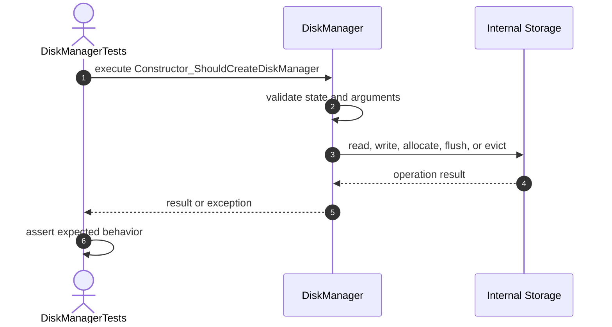

## 2. Constructor_ShouldInitializeClosedState

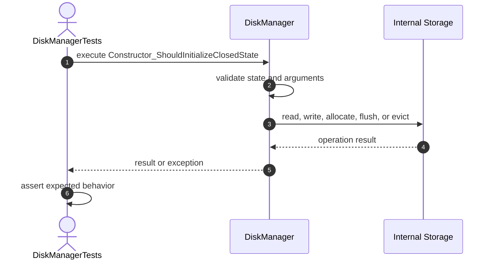

## 3. Constructor_ShouldInitializeEmptyStorage

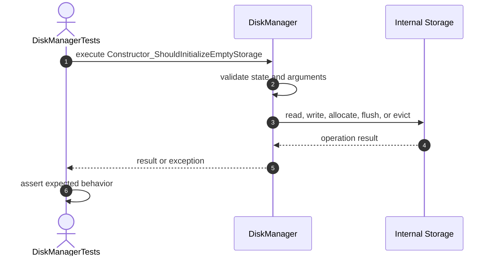

# Lifecycle Tests

## 4. Open_ShouldOpenDiskManager

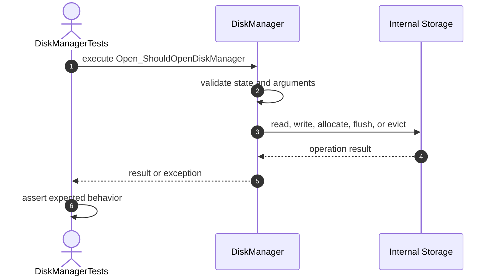

## 5. Open_ShouldBeIdempotent

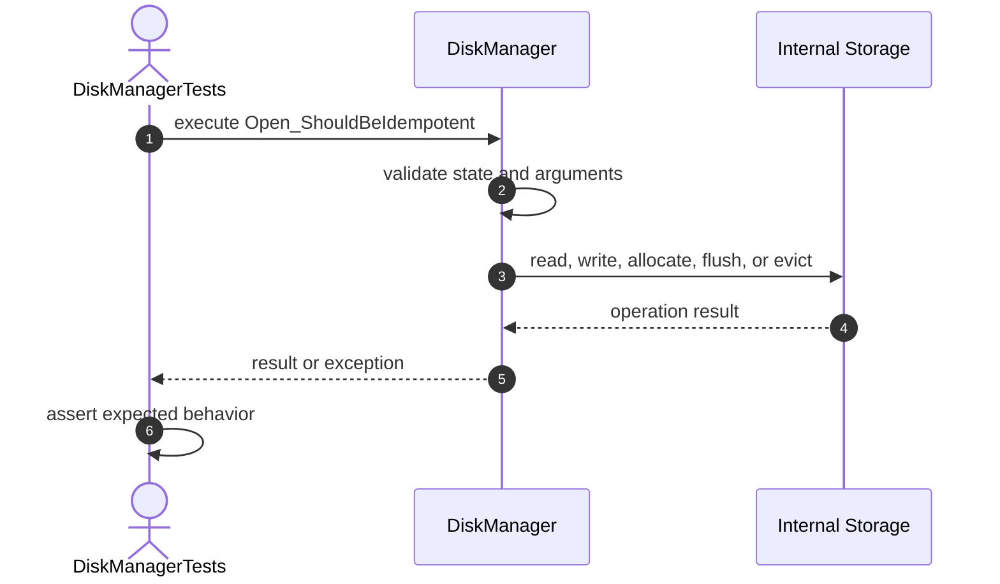

## 6. Close_ShouldCloseDiskManager

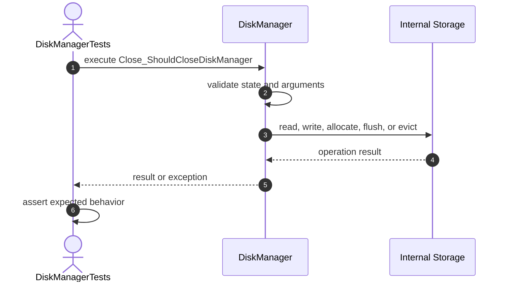

## 7. Close_ShouldBeIdempotent

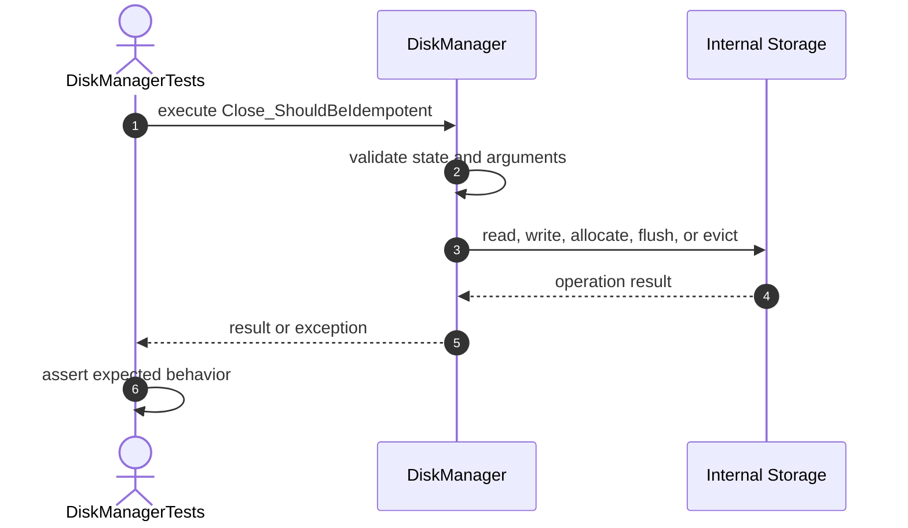

# Allocation Tests

## 8. AllocatePage_ShouldCreatePage


## 9. AllocatePage_ShouldGenerateSequentialIds

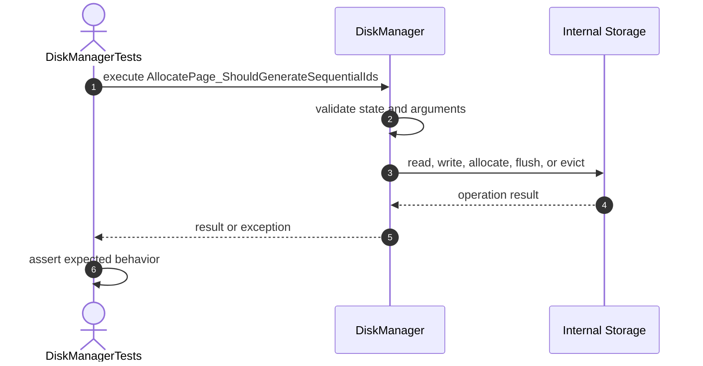

## 10. AllocatePage_ShouldIncreasePageCount

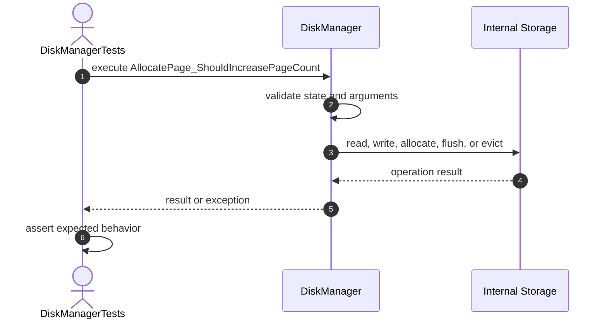

## 11. AllocatePage_ShouldRejectWhenClosed

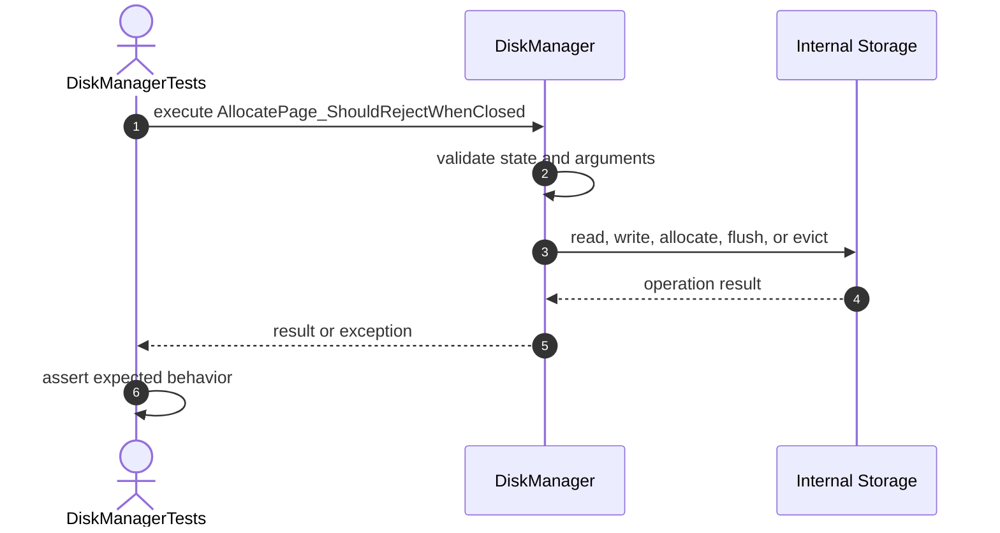

# Write Tests

## 12. WritePage_ShouldStoreData

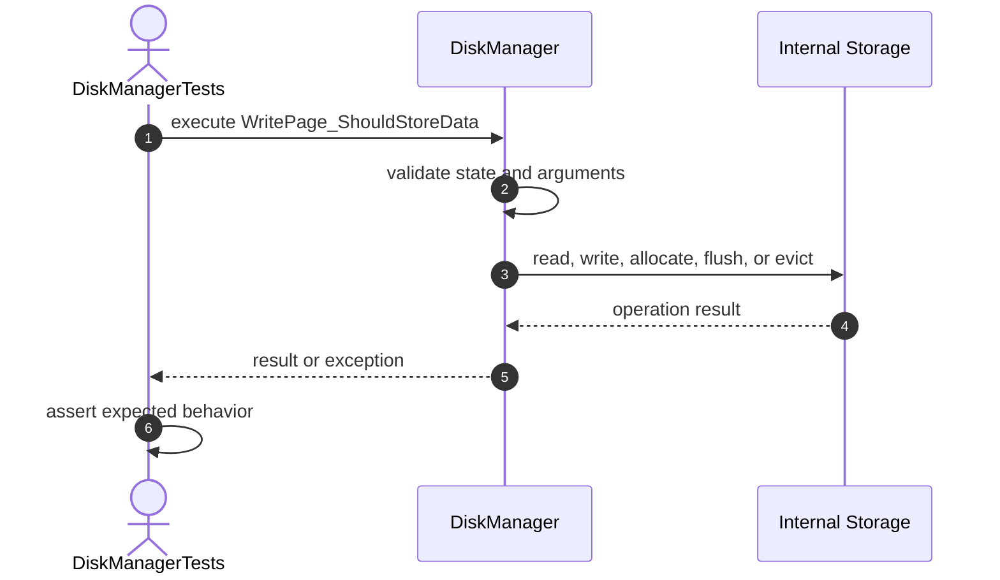

## 13. WritePage_ShouldReplaceData

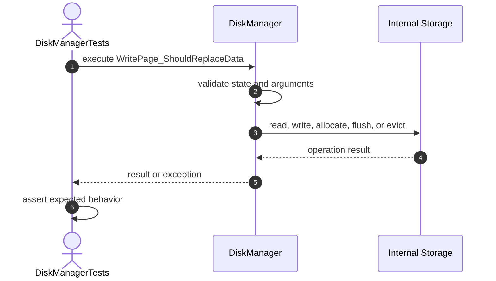

## 14. WritePage_ShouldRejectNullData


## 15. WritePage_ShouldRejectMissingPage


## 16. WritePage_ShouldRejectWhenClosed

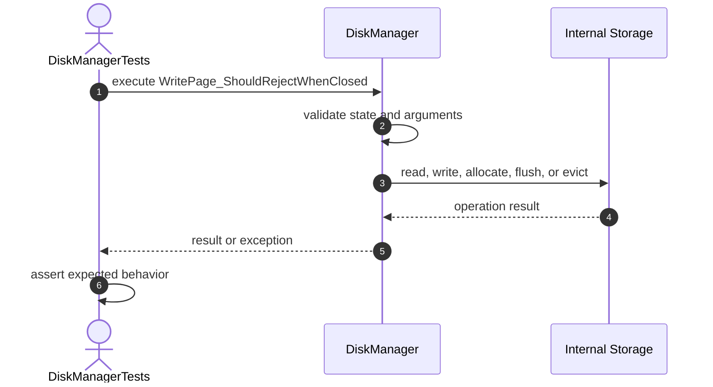

# Read Tests

## 17. ReadPage_ShouldReturnStoredData

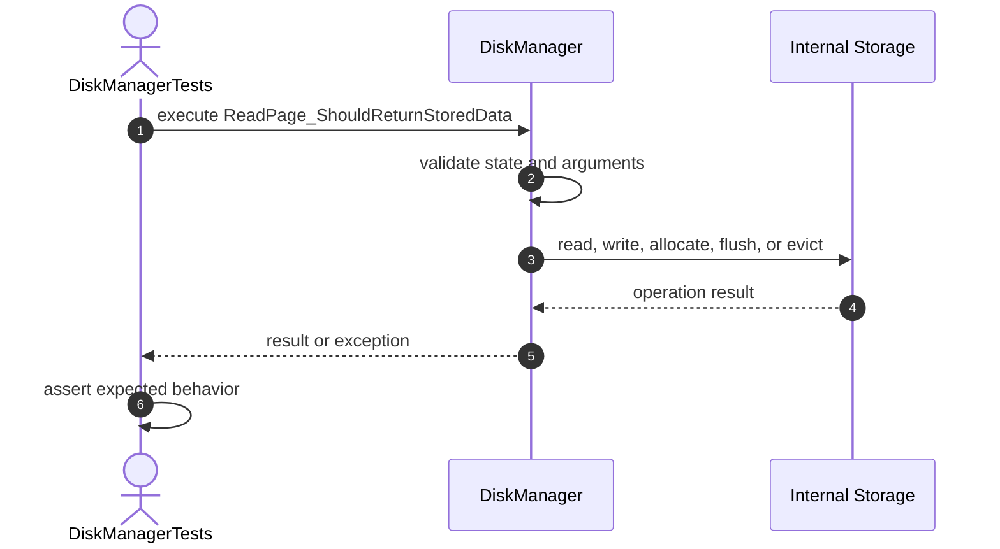

## 18. ReadPage_ShouldReturnDefensiveCopy


## 19. ReadPage_ShouldRejectMissingPage

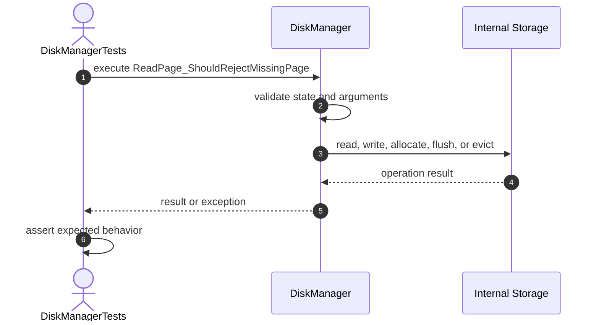

## 20. ReadPage_ShouldRejectWhenClosed


# Deallocation Tests

## 21. DeallocatePage_ShouldRemoveExistingPage

```mermaid
sequenceDiagram
    autonumber
    actor Test as DiskManagerTests
    participant Target as DiskManager
    participant Storage as Internal Storage

    Test->>Target: execute DeallocatePage_ShouldRemoveExistingPage
    Target->>Target: validate state and arguments
    Target->>Storage: read, write, allocate, flush, or evict
    Storage-->>Target: operation result
    Target-->>Test: result or exception
    Test->>Test: assert expected behavior
```

## 22. DeallocatePage_ShouldReturnFalseForMissingPage

```mermaid
sequenceDiagram
    autonumber
    actor Test as DiskManagerTests
    participant Target as DiskManager
    participant Storage as Internal Storage

    Test->>Target: execute DeallocatePage_ShouldReturnFalseForMissingPage
    Target->>Target: validate state and arguments
    Target->>Storage: read, write, allocate, flush, or evict
    Storage-->>Target: operation result
    Target-->>Test: result or exception
    Test->>Test: assert expected behavior
```

## 23. DeallocatePage_ShouldDecreasePageCount

```mermaid
sequenceDiagram
    autonumber
    actor Test as DiskManagerTests
    participant Target as DiskManager
    participant Storage as Internal Storage

    Test->>Target: execute DeallocatePage_ShouldDecreasePageCount
    Target->>Target: validate state and arguments
    Target->>Storage: read, write, allocate, flush, or evict
    Storage-->>Target: operation result
    Target-->>Test: result or exception
    Test->>Test: assert expected behavior
```

## 24. DeallocatePage_ShouldRejectWhenClosed

```mermaid
sequenceDiagram
    autonumber
    actor Test as DiskManagerTests
    participant Target as DiskManager
    participant Storage as Internal Storage

    Test->>Target: execute DeallocatePage_ShouldRejectWhenClosed
    Target->>Target: validate state and arguments
    Target->>Storage: read, write, allocate, flush, or evict
    Storage-->>Target: operation result
    Target-->>Test: result or exception
    Test->>Test: assert expected behavior
```

# CollectionSafety Tests

## 25. GetPages_ShouldReturnUnmodifiableMap

```mermaid
sequenceDiagram
    autonumber
    actor Test as DiskManagerTests
    participant Target as DiskManager
    participant Storage as Internal Storage

    Test->>Target: execute GetPages_ShouldReturnUnmodifiableMap
    Target->>Target: validate state and arguments
    Target->>Storage: read, write, allocate, flush, or evict
    Storage-->>Target: operation result
    Target-->>Test: result or exception
    Test->>Test: assert expected behavior
```

## 26. GetPages_ShouldProtectNestedArrays

```mermaid
sequenceDiagram
    autonumber
    actor Test as DiskManagerTests
    participant Target as DiskManager
    participant Storage as Internal Storage

    Test->>Target: execute GetPages_ShouldProtectNestedArrays
    Target->>Target: validate state and arguments
    Target->>Storage: read, write, allocate, flush, or evict
    Storage-->>Target: operation result
    Target-->>Test: result or exception
    Test->>Test: assert expected behavior
```