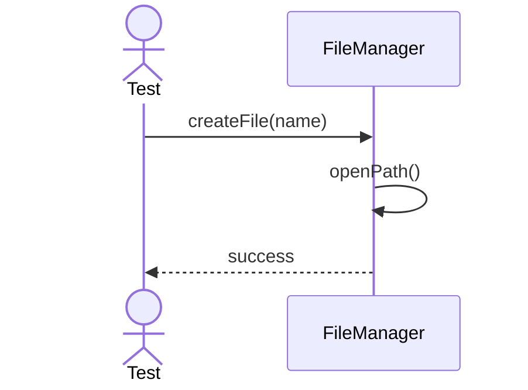
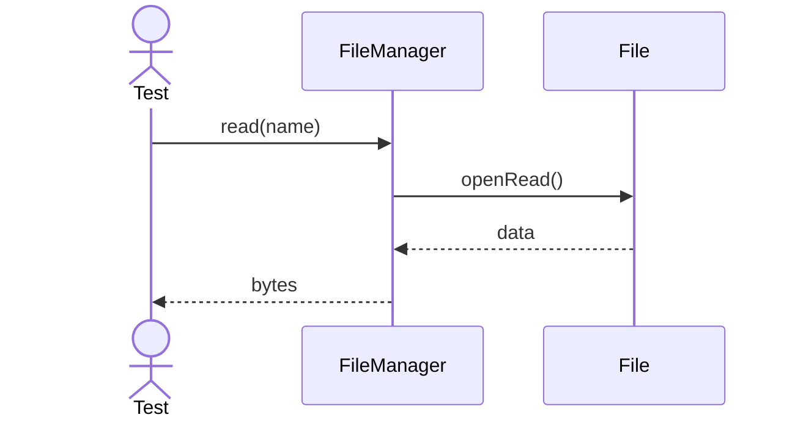
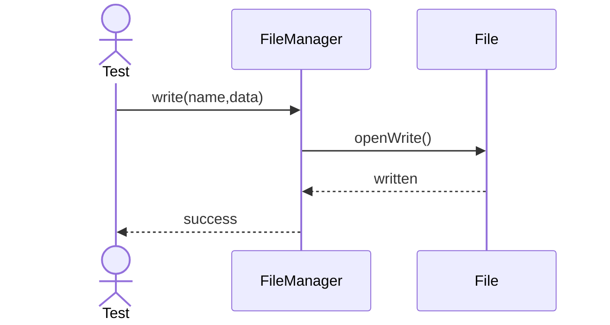
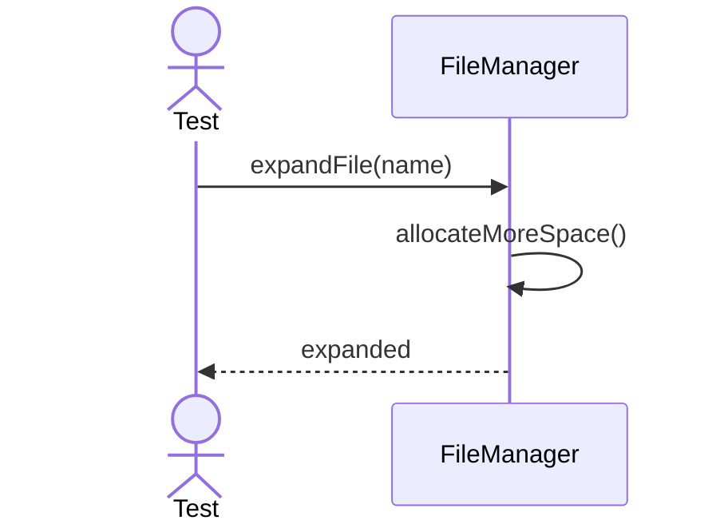

# FileManager Testing - Main Functional Sequences

---

## 1. Create File

```mermaid
sequenceDiagram
actor Test
participant FileManager

Test->>FileManager: createFile(name)
FileManager->>FileManager: openPath()
FileManager-->>Test: success
```

---

## 2. Read File

```mermaid
sequenceDiagram
actor Test
participant FileManager
participant File

Test->>FileManager: read(name)
FileManager->>File: openRead()
File-->>FileManager: data
FileManager-->>Test: bytes
```

---

## 3. Write File

```mermaid
sequenceDiagram
actor Test
participant FileManager
participant File

Test->>FileManager: write(name,data)
FileManager->>File: openWrite()
File-->>FileManager: written
FileManager-->>Test: success
```

---

## 4. Expand File

```mermaid
sequenceDiagram
actor Test
participant FileManager

Test->>FileManager: expandFile(name)
FileManager->>FileManager: allocateMoreSpace()
FileManager-->>Test: expanded
```
