# LockManager Test Sequence Diagrams

Each sequence matches one test in `LockManagerTests` and the roadmap.

## Fixture: setUp

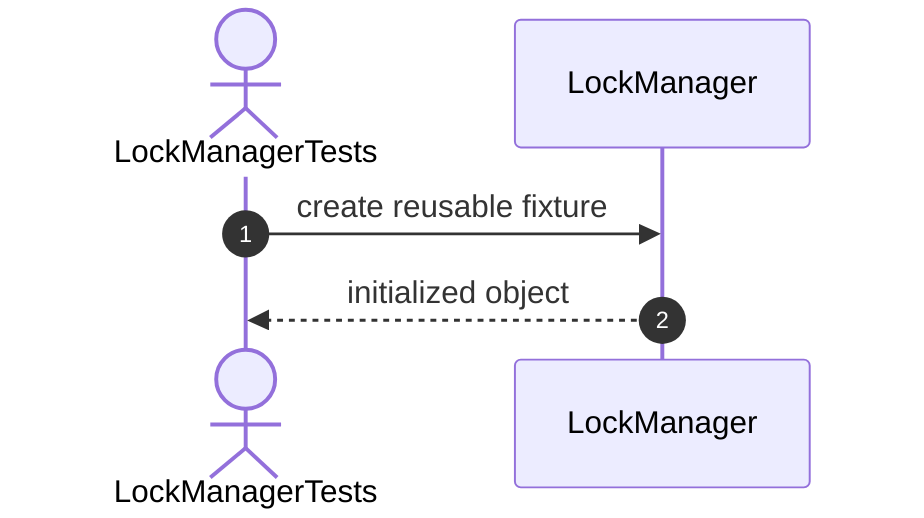

# Constructor Tests

## 1. Constructor_ShouldCreateManager

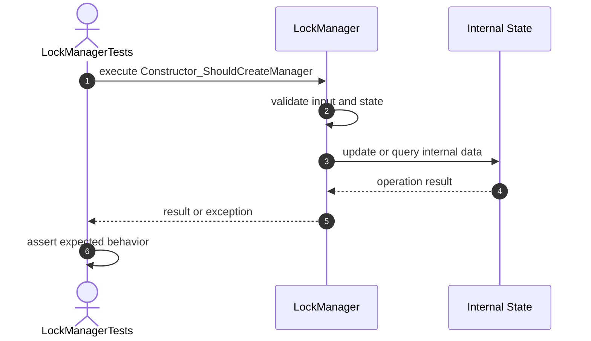

## 2. Constructor_ShouldInitializeEmptyLocks

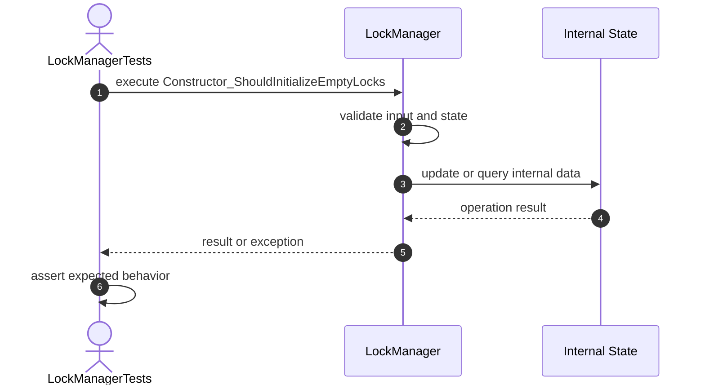

# Acquire Tests

## 3. Acquire_ShouldAcquireSharedLock

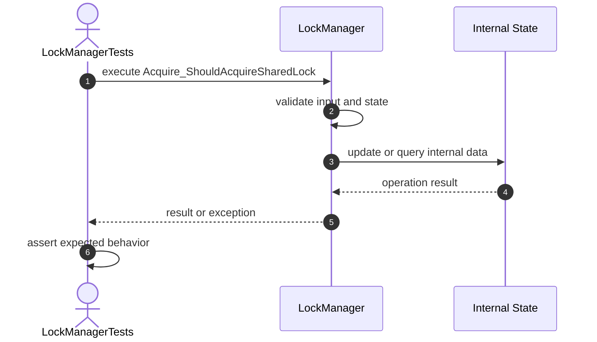

## 4. Acquire_ShouldAcquireExclusiveLock

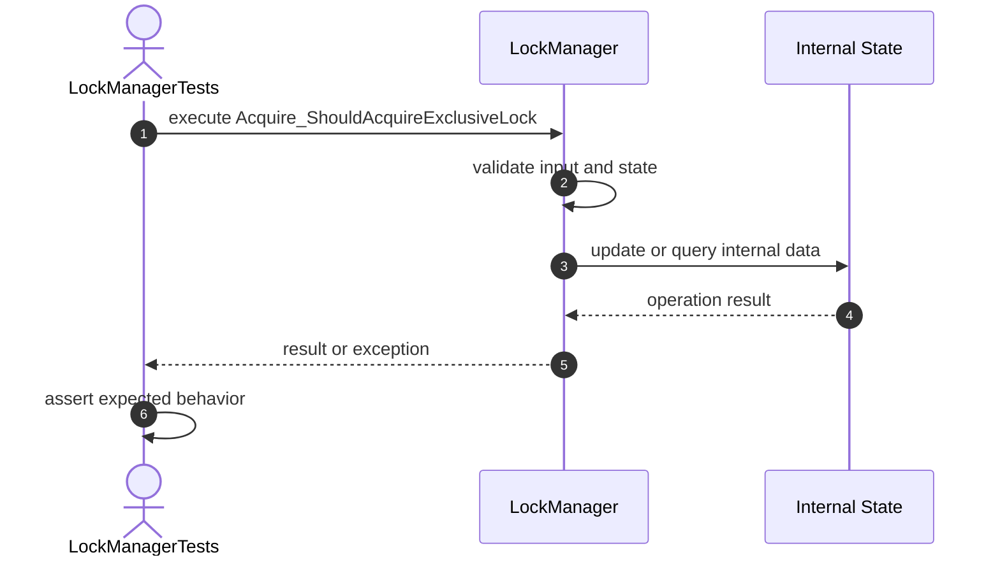

## 5. Acquire_ShouldStoreOwner

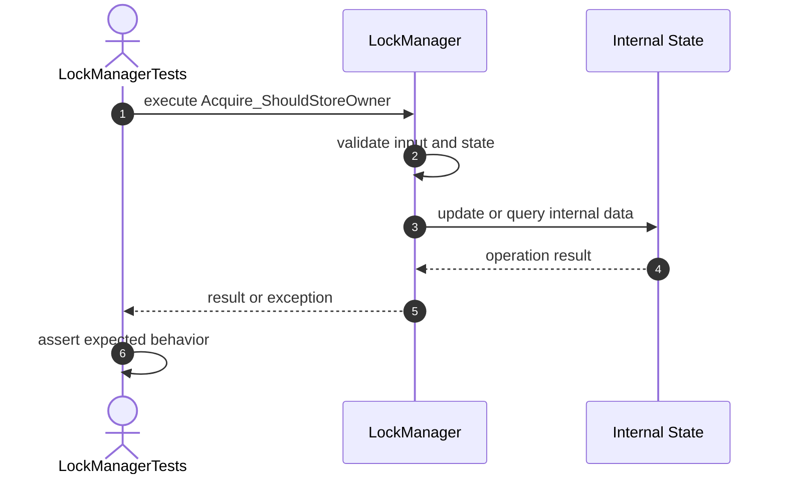

## 6. Acquire_ShouldStoreMode

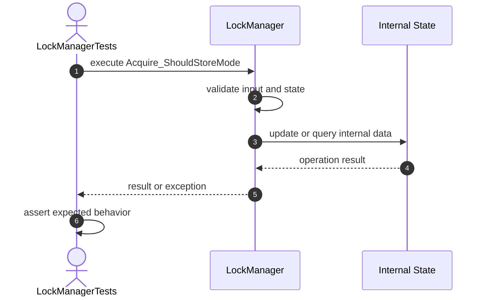

## 7. Acquire_ShouldRejectConflictingOwner

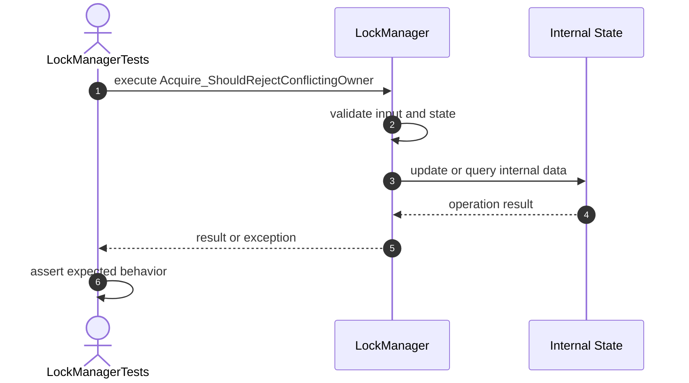

## 8. Acquire_ShouldAllowSameOwner

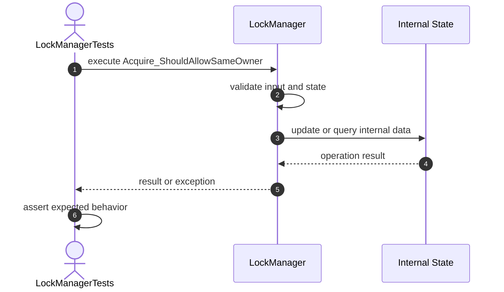

## 9. Acquire_ShouldUpgradeSameOwnerToExclusive

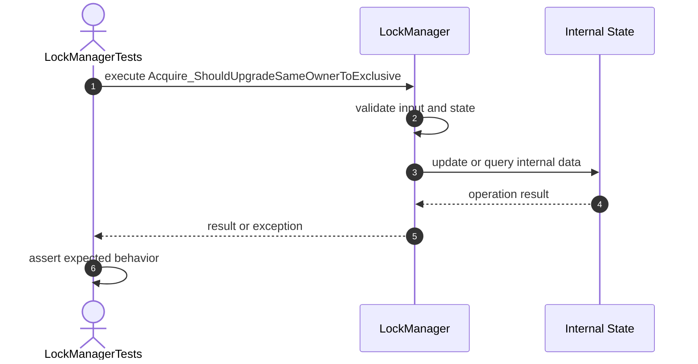

## 10. Acquire_ShouldRejectBlankResource

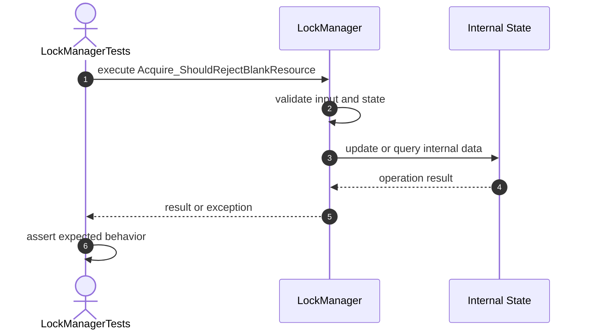

## 11. Acquire_ShouldRejectNullOwner

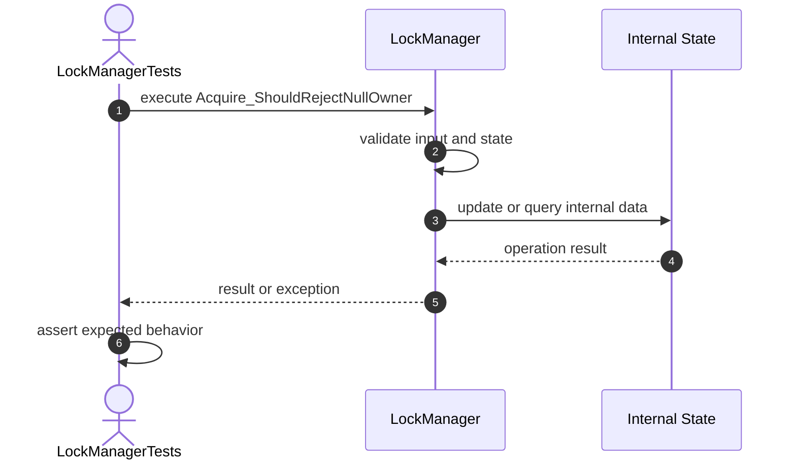

## 12. Acquire_ShouldRejectNullMode

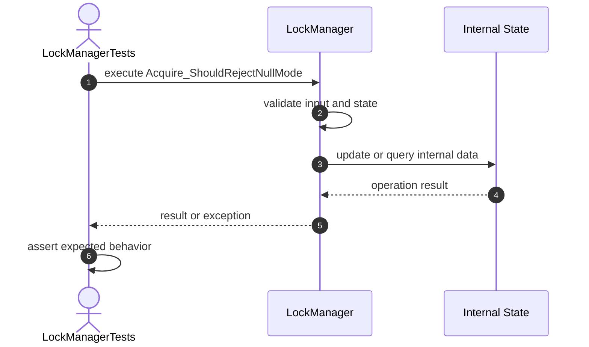

# Release Tests

## 13. Release_ShouldRemoveOwnedLock

## 14. Release_ShouldReturnFalseForWrongOwner

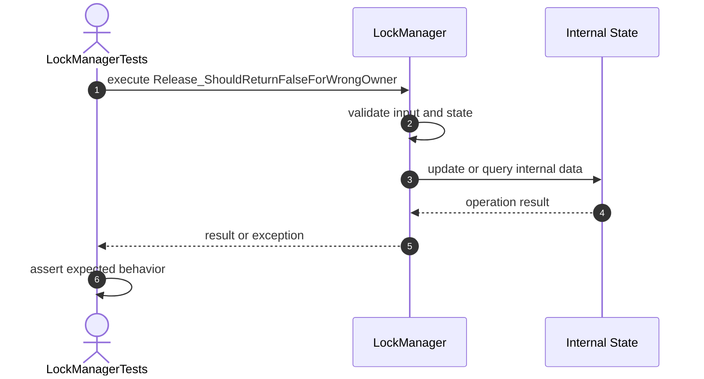

## 15. Release_ShouldReturnFalseForMissingLock

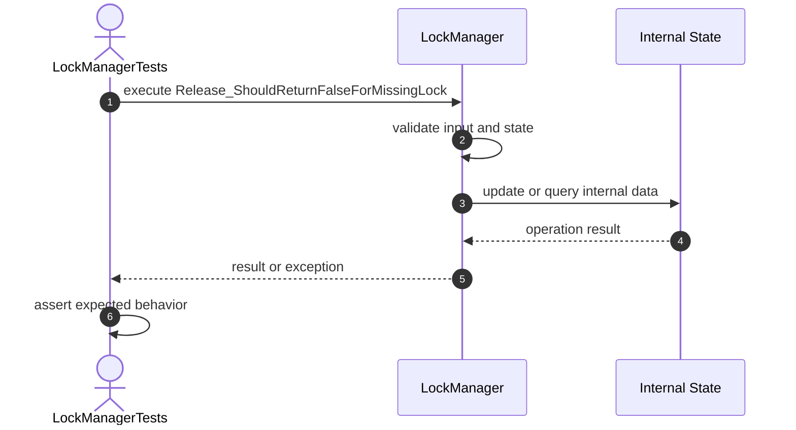

## 16. ReleaseAll_ShouldRemoveAllOwnedLocks

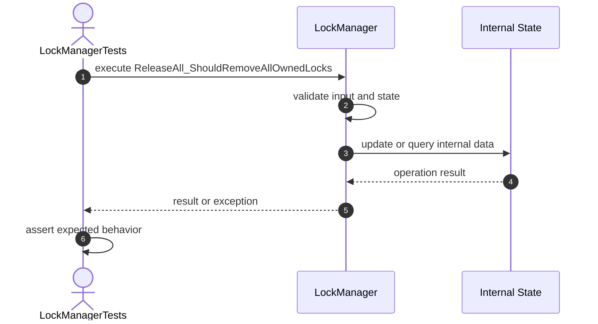

# Metadata Tests

## 17. IsLocked_ShouldReturnTrueForExistingLock

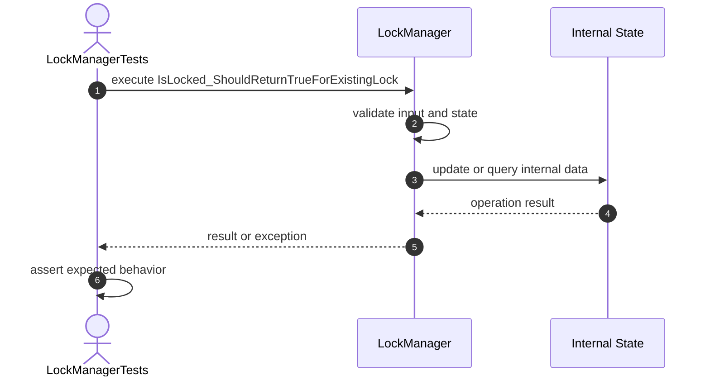

## 18. GetLockMode_ShouldReturnNullForMissingLock

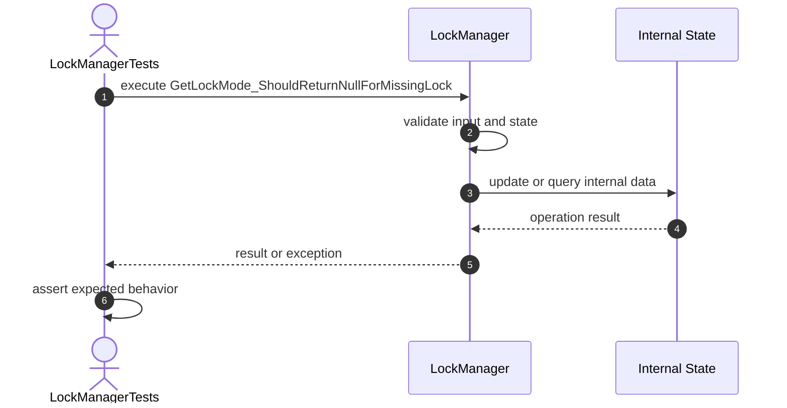

## 19. GetLocks_ShouldReturnUnmodifiableMap

