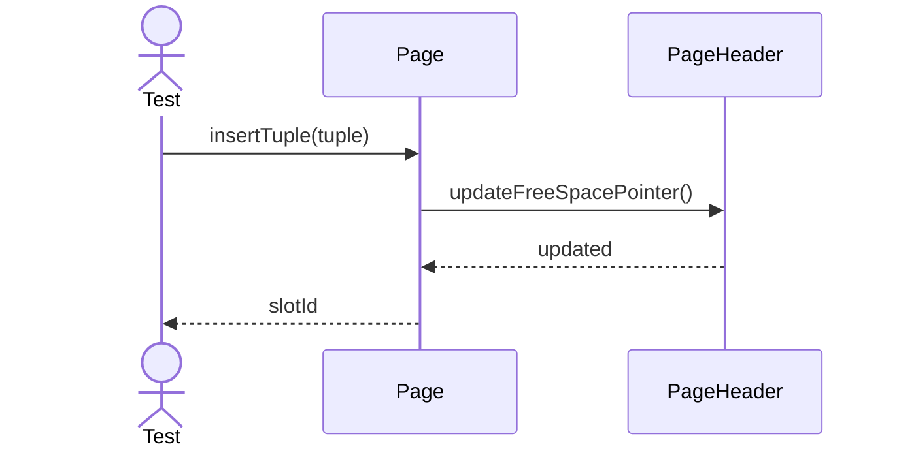
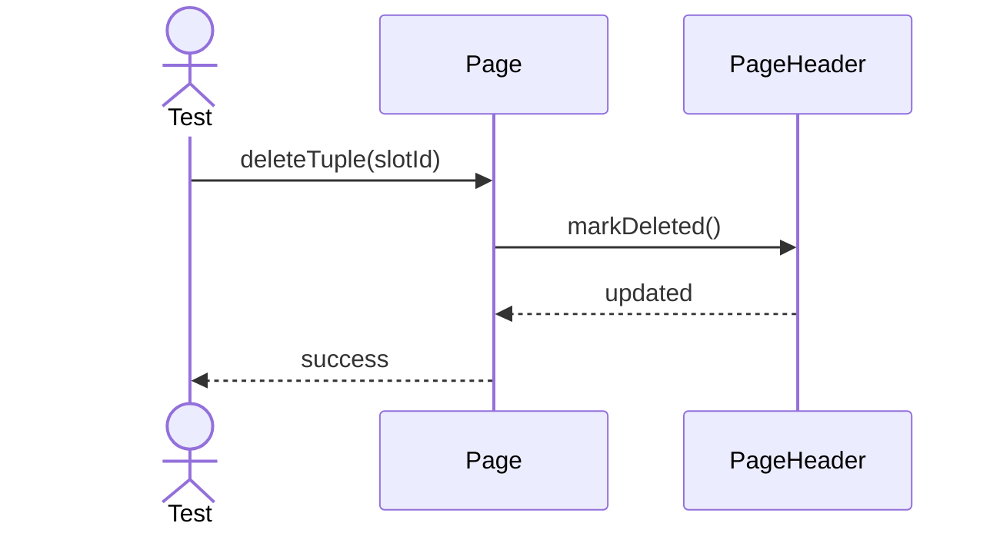
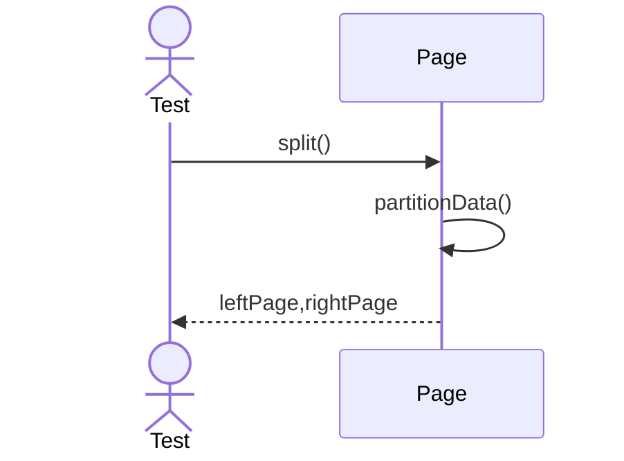
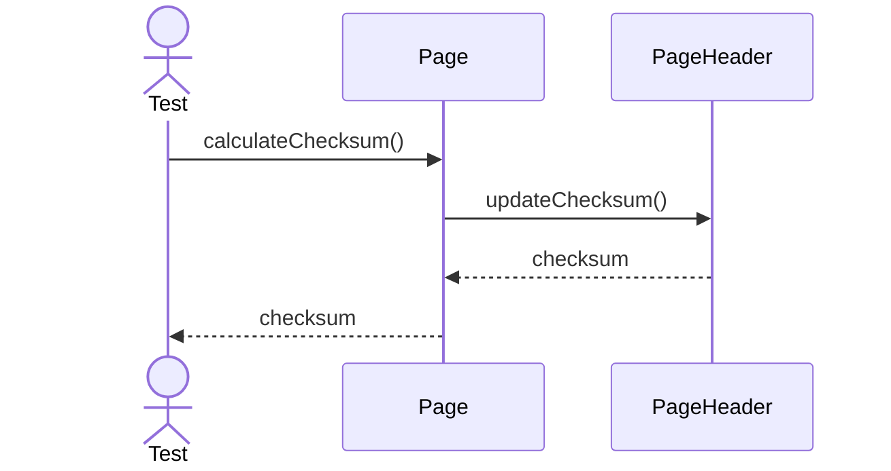

# Page Testing - Main Functional Sequences

---

## 1. Insert Tuple

```mermaid
sequenceDiagram
actor Test
participant Page
participant PageHeader

Test->>Page: insertTuple(tuple)
Page->>PageHeader: updateFreeSpacePointer()
PageHeader-->>Page: updated
Page-->>Test: slotId
```

---

## 2. Delete Tuple

```mermaid
sequenceDiagram
actor Test
participant Page
participant PageHeader

Test->>Page: deleteTuple(slotId)
Page->>PageHeader: markDeleted()
PageHeader-->>Page: updated
Page-->>Test: success
```

---

## 3. Split Page

```mermaid
sequenceDiagram
actor Test
participant Page

Test->>Page: split()
Page->>Page: partitionData()
Page-->>Test: leftPage,rightPage
```

---

## 4. Calculate Checksum

```mermaid
sequenceDiagram
actor Test
participant Page
participant PageHeader

Test->>Page: calculateChecksum()
Page->>PageHeader: updateChecksum()
PageHeader-->>Page: checksum
Page-->>Test: checksum
```
