# RecoveryManager Testing - Main Functional Sequences

---

## 1. Crash Recovery

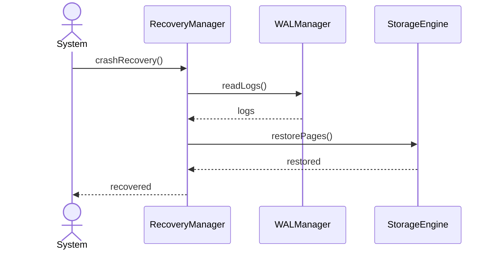
```mermaid
sequenceDiagram
actor System
participant RecoveryManager
participant WALManager
participant StorageEngine

System->>RecoveryManager: crashRecovery()
RecoveryManager->>WALManager: readLogs()
WALManager-->>RecoveryManager: logs
RecoveryManager->>StorageEngine: restorePages()
StorageEngine-->>RecoveryManager: restored
RecoveryManager-->>System: recovered
```

---

## 2. Redo

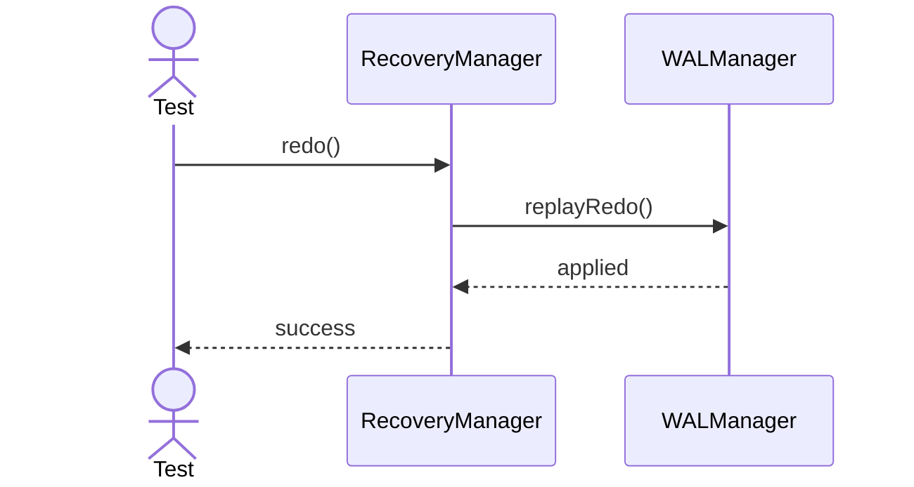
```mermaid
sequenceDiagram
actor Test
participant RecoveryManager
participant WALManager

Test->>RecoveryManager: redo()
RecoveryManager->>WALManager: replayRedo()
WALManager-->>RecoveryManager: applied
RecoveryManager-->>Test: success
```

---

## 3. Undo

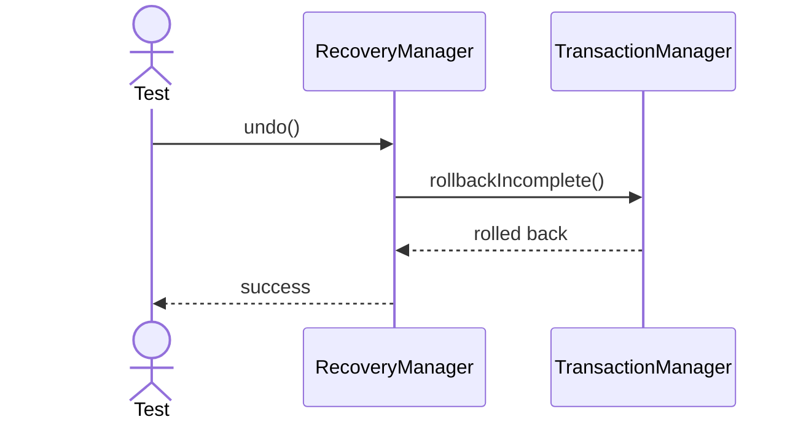
```mermaid
sequenceDiagram
actor Test
participant RecoveryManager
participant TransactionManager

Test->>RecoveryManager: undo()
RecoveryManager->>TransactionManager: rollbackIncomplete()
TransactionManager-->>RecoveryManager: rolled back
RecoveryManager-->>Test: success
```

---

## 4. Recover Checkpoint

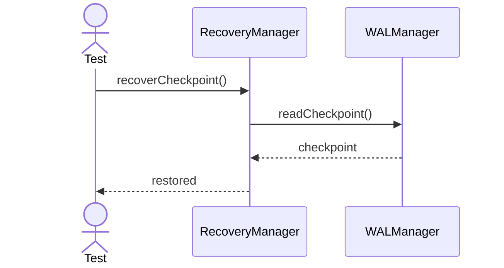
```mermaid
sequenceDiagram
actor Test
participant RecoveryManager
participant WALManager

Test->>RecoveryManager: recoverCheckpoint()
RecoveryManager->>WALManager: readCheckpoint()
WALManager-->>RecoveryManager: checkpoint
RecoveryManager-->>Test: restored
```

---

## 5. Recover Corrupted Log

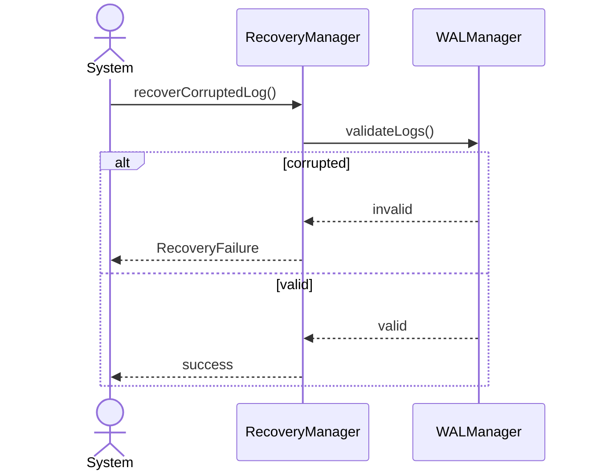
```mermaid
sequenceDiagram
actor System
participant RecoveryManager
participant WALManager

System->>RecoveryManager: recoverCorruptedLog()
RecoveryManager->>WALManager: validateLogs()
alt corrupted
    WALManager-->>RecoveryManager: invalid
    RecoveryManager-->>System: RecoveryFailure
else valid
    WALManager-->>RecoveryManager: valid
    RecoveryManager-->>System: success
end
```

---

## 6. Recover Committed Transaction

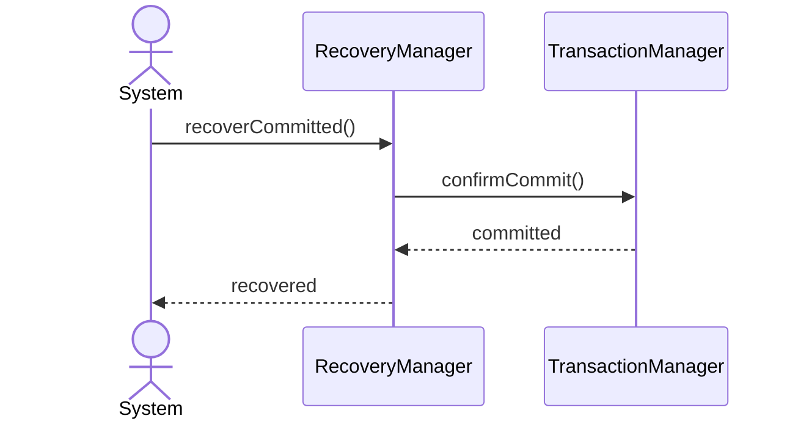
```mermaid
sequenceDiagram
actor System
participant RecoveryManager
participant TransactionManager

System->>RecoveryManager: recoverCommitted()
RecoveryManager->>TransactionManager: confirmCommit()
TransactionManager-->>RecoveryManager: committed
RecoveryManager-->>System: recovered
```

---

## 7. Recover Rolled Back Transaction

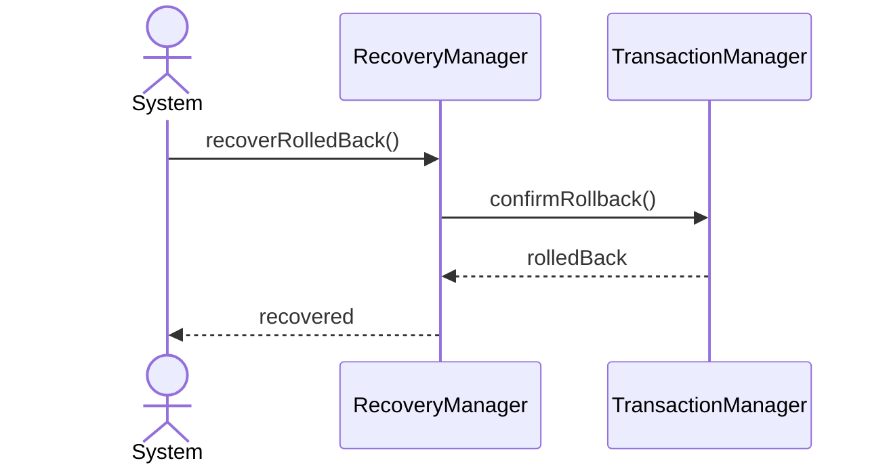
```mermaid
sequenceDiagram
actor System
participant RecoveryManager
participant TransactionManager

System->>RecoveryManager: recoverRolledBack()
RecoveryManager->>TransactionManager: confirmRollback()
TransactionManager-->>RecoveryManager: rolledBack
RecoveryManager-->>System: recovered
```

---

## 8. Rebuild Page Map

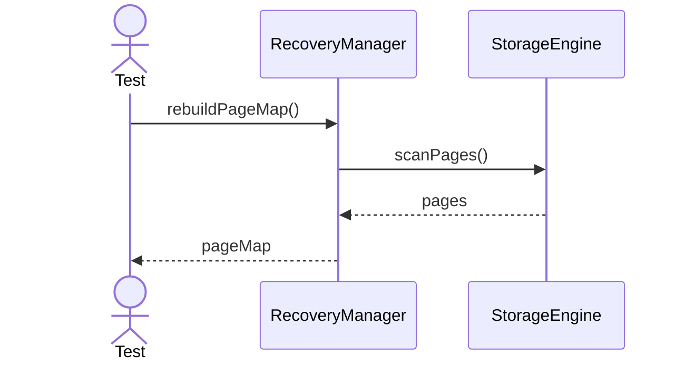
```mermaid
sequenceDiagram
actor Test
participant RecoveryManager
participant StorageEngine

Test->>RecoveryManager: rebuildPageMap()
RecoveryManager->>StorageEngine: scanPages()
StorageEngine-->>RecoveryManager: pages
RecoveryManager-->>Test: pageMap
```

---

## 9. Restore Buffer Pool

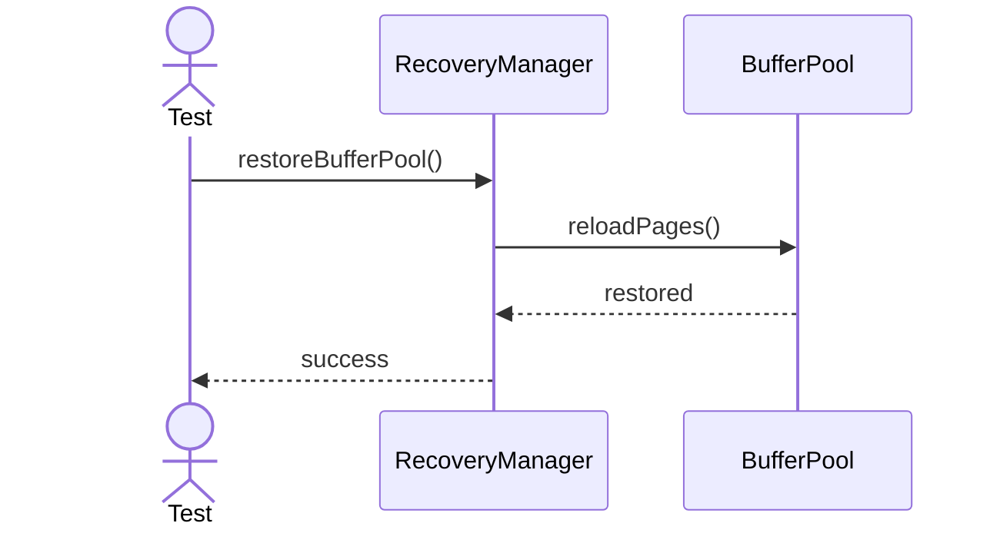
```mermaid
sequenceDiagram
actor Test
participant RecoveryManager
participant BufferPool

Test->>RecoveryManager: restoreBufferPool()
RecoveryManager->>BufferPool: reloadPages()
BufferPool-->>RecoveryManager: restored
RecoveryManager-->>Test: success
```

---

## 10. Reapply Redo Log

```mermaid
sequenceDiagram
actor Test
participant RecoveryManager
participant WALManager

Test->>RecoveryManager: reapplyRedoLog()
RecoveryManager->>WALManager: replayRedo()
WALManager-->>RecoveryManager: applied
RecoveryManager-->>Test: success
```

---

## 11. Reapply Undo Log

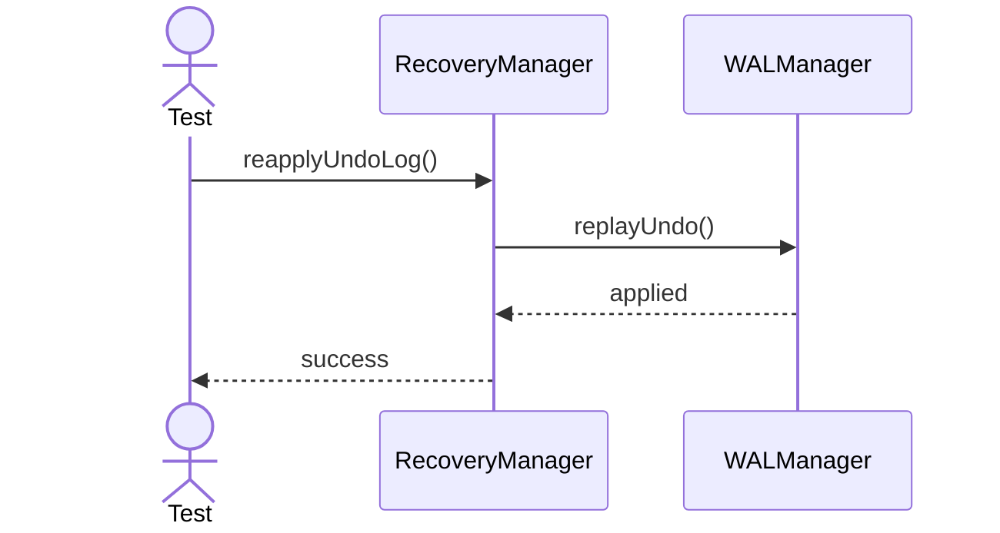
```mermaid
sequenceDiagram
actor Test
participant RecoveryManager
participant WALManager

Test->>RecoveryManager: reapplyUndoLog()
RecoveryManager->>WALManager: replayUndo()
WALManager-->>RecoveryManager: applied
RecoveryManager-->>Test: success
```

---

## 12. Scan Transaction Table

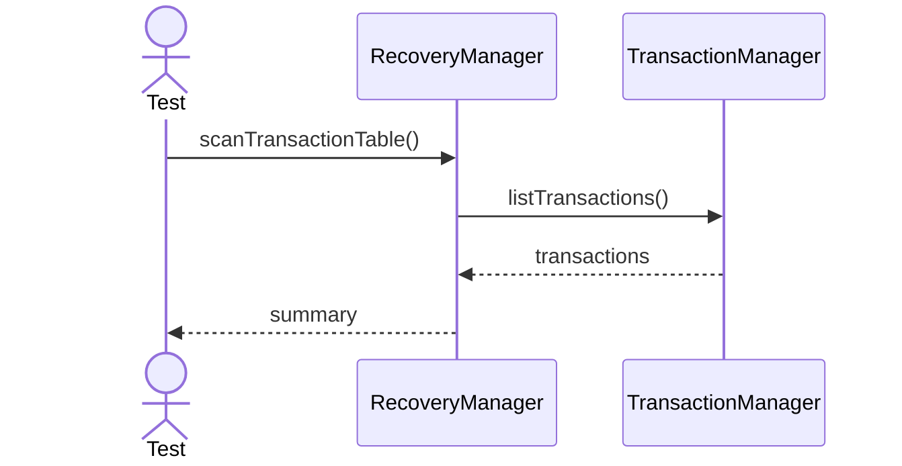
```mermaid
sequenceDiagram
actor Test
participant RecoveryManager
participant TransactionManager

Test->>RecoveryManager: scanTransactionTable()
RecoveryManager->>TransactionManager: listTransactions()
TransactionManager-->>RecoveryManager: transactions
RecoveryManager-->>Test: summary
```

---

## 13. Resolve Checkpoint State

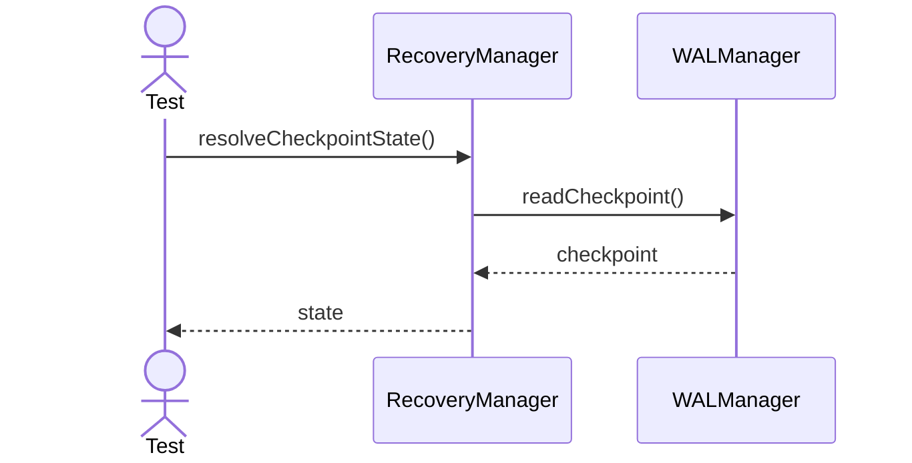
```mermaid
sequenceDiagram
actor Test
participant RecoveryManager
participant WALManager

Test->>RecoveryManager: resolveCheckpointState()
RecoveryManager->>WALManager: readCheckpoint()
WALManager-->>RecoveryManager: checkpoint
RecoveryManager-->>Test: state
```

---

## 14. Repair Corrupted Page

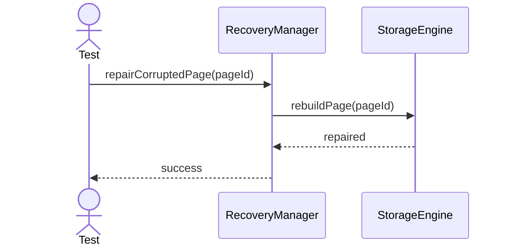
```mermaid
sequenceDiagram
actor Test
participant RecoveryManager
participant StorageEngine

Test->>RecoveryManager: repairCorruptedPage(pageId)
RecoveryManager->>StorageEngine: rebuildPage(pageId)
StorageEngine-->>RecoveryManager: repaired
RecoveryManager-->>Test: success
```

---

## 15. Rebuild Indexes

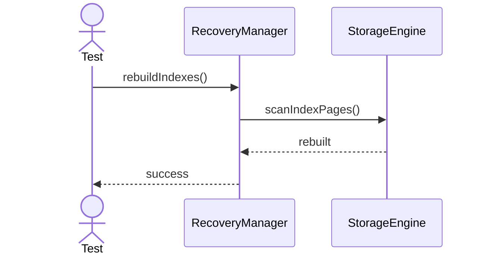
```mermaid
sequenceDiagram
actor Test
participant RecoveryManager
participant StorageEngine

Test->>RecoveryManager: rebuildIndexes()
RecoveryManager->>StorageEngine: scanIndexPages()
StorageEngine-->>RecoveryManager: rebuilt
RecoveryManager-->>Test: success
```

---

## 16. Reconcile WAL And Data

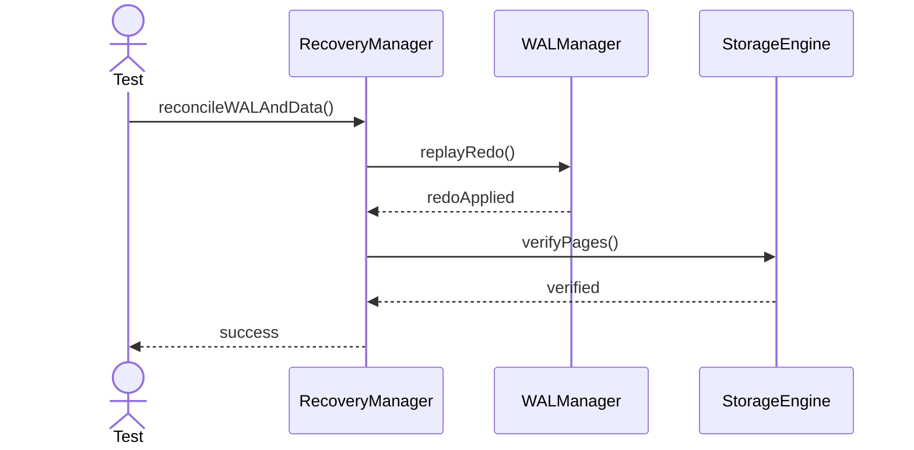
```mermaid
sequenceDiagram
actor Test
participant RecoveryManager
participant WALManager
participant StorageEngine

Test->>RecoveryManager: reconcileWALAndData()
RecoveryManager->>WALManager: replayRedo()
WALManager-->>RecoveryManager: redoApplied
RecoveryManager->>StorageEngine: verifyPages()
StorageEngine-->>RecoveryManager: verified
RecoveryManager-->>Test: success
```

---

## 17. Validate Recovery Consistency

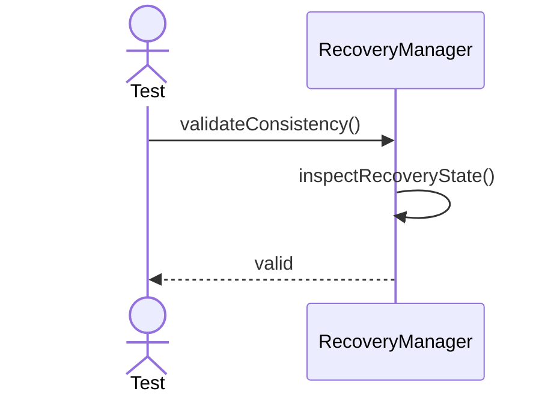
```mermaid
sequenceDiagram
actor Test
participant RecoveryManager

Test->>RecoveryManager: validateConsistency()
RecoveryManager->>RecoveryManager: inspectRecoveryState()
RecoveryManager-->>Test: valid
```

---

## 18. Export Recovery Summary

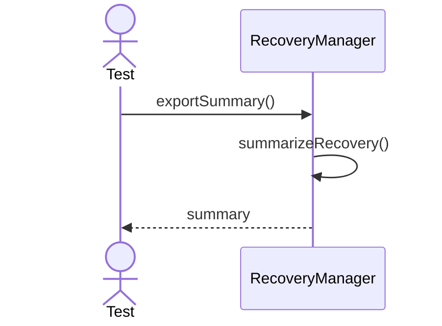
```mermaid
sequenceDiagram
actor Test
participant RecoveryManager

Test->>RecoveryManager: exportSummary()
RecoveryManager->>RecoveryManager: summarizeRecovery()
RecoveryManager-->>Test: summary
```

---

## 19. Reset Recovery Metadata

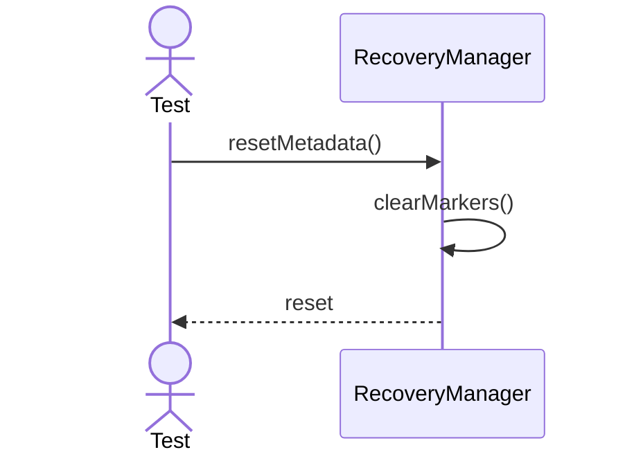
```mermaid
sequenceDiagram
actor Test
participant RecoveryManager

Test->>RecoveryManager: resetMetadata()
RecoveryManager->>RecoveryManager: clearMarkers()
RecoveryManager-->>Test: reset
```

---

## 20. Archive Recovery Trace

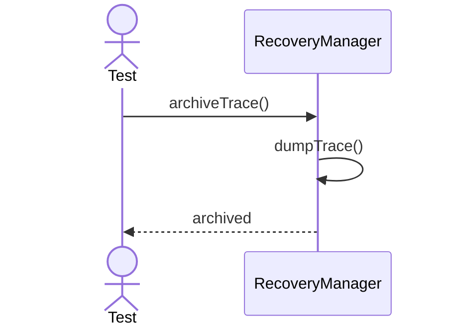
```mermaid
sequenceDiagram
actor Test
participant RecoveryManager

Test->>RecoveryManager: archiveTrace()
RecoveryManager->>RecoveryManager: dumpTrace()
RecoveryManager-->>Test: archived
```
