# Storage Engine Test Sequence Diagrams

# Constructor Tests
## 1. constructor_ShouldCreateStorageEngine

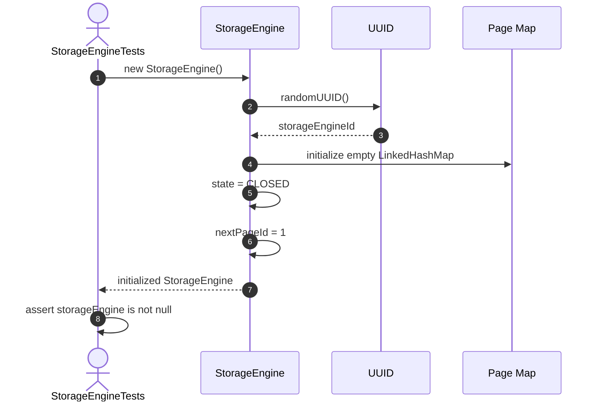
```mermaid
sequenceDiagram
    autonumber
    actor Test as StorageEngineTests
    participant Engine as StorageEngine
    participant UUID as UUID
    participant Pages as Page Map

    Test->>Engine: new StorageEngine()
    Engine->>UUID: randomUUID()
    UUID-->>Engine: storageEngineId
    Engine->>Pages: initialize empty LinkedHashMap
    Engine->>Engine: state = CLOSED
    Engine->>Engine: nextPageId = 1
    Engine-->>Test: initialized StorageEngine
    Test->>Test: assert storageEngine is not null
```

## 2. constructor_ShouldGenerateStorageEngineId

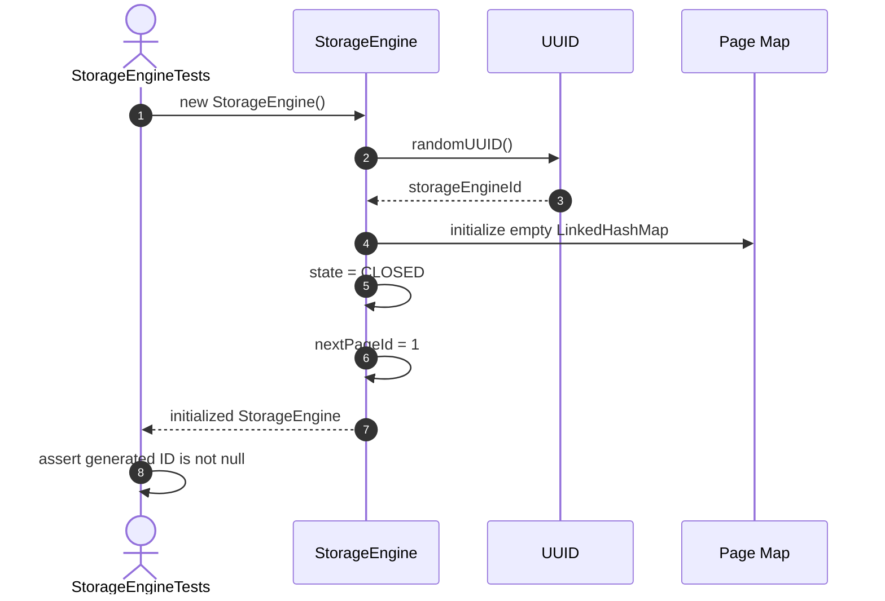
```mermaid
sequenceDiagram
    autonumber
    actor Test as StorageEngineTests
    participant Engine as StorageEngine
    participant UUID as UUID
    participant Pages as Page Map

    Test->>Engine: new StorageEngine()
    Engine->>UUID: randomUUID()
    UUID-->>Engine: storageEngineId
    Engine->>Pages: initialize empty LinkedHashMap
    Engine->>Engine: state = CLOSED
    Engine->>Engine: nextPageId = 1
    Engine-->>Test: initialized StorageEngine
    Test->>Test: assert generated ID is not null
```

## 3. constructor_ShouldGenerateUniqueStorageEngineIds

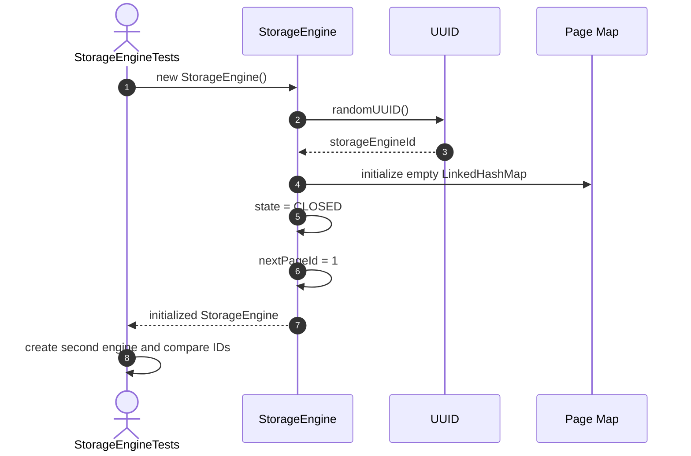
```mermaid
sequenceDiagram
    autonumber
    actor Test as StorageEngineTests
    participant Engine as StorageEngine
    participant UUID as UUID
    participant Pages as Page Map

    Test->>Engine: new StorageEngine()
    Engine->>UUID: randomUUID()
    UUID-->>Engine: storageEngineId
    Engine->>Pages: initialize empty LinkedHashMap
    Engine->>Engine: state = CLOSED
    Engine->>Engine: nextPageId = 1
    Engine-->>Test: initialized StorageEngine
    Test->>Test: create second engine and compare IDs
```

## 4. constructor_ShouldInitializeClosedState

```mermaid
sequenceDiagram
    autonumber
    actor Test as StorageEngineTests
    participant Engine as StorageEngine
    participant UUID as UUID
    participant Pages as Page Map

    Test->>Engine: new StorageEngine()
    Engine->>UUID: randomUUID()
    UUID-->>Engine: storageEngineId
    Engine->>Pages: initialize empty LinkedHashMap
    Engine->>Engine: state = CLOSED
    Engine->>Engine: nextPageId = 1
    Engine-->>Test: initialized StorageEngine
    Test->>Test: assert state is CLOSED and isOpen is false
```

## 5. constructor_ShouldInitializeEmptyPageCollection

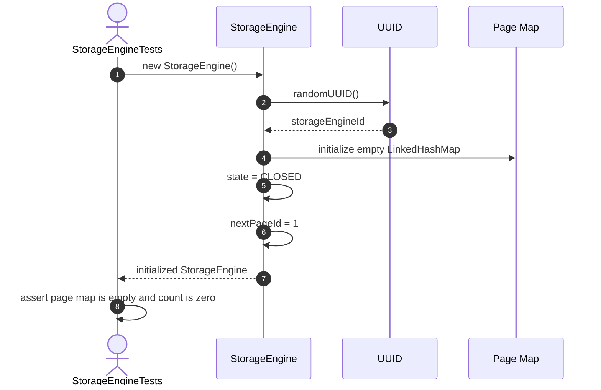
```mermaid
sequenceDiagram
    autonumber
    actor Test as StorageEngineTests
    participant Engine as StorageEngine
    participant UUID as UUID
    participant Pages as Page Map

    Test->>Engine: new StorageEngine()
    Engine->>UUID: randomUUID()
    UUID-->>Engine: storageEngineId
    Engine->>Pages: initialize empty LinkedHashMap
    Engine->>Engine: state = CLOSED
    Engine->>Engine: nextPageId = 1
    Engine-->>Test: initialized StorageEngine
    Test->>Test: assert page map is empty and count is zero
```

# Lifecycle Tests

## 6. open_ShouldChangeStateToOpen

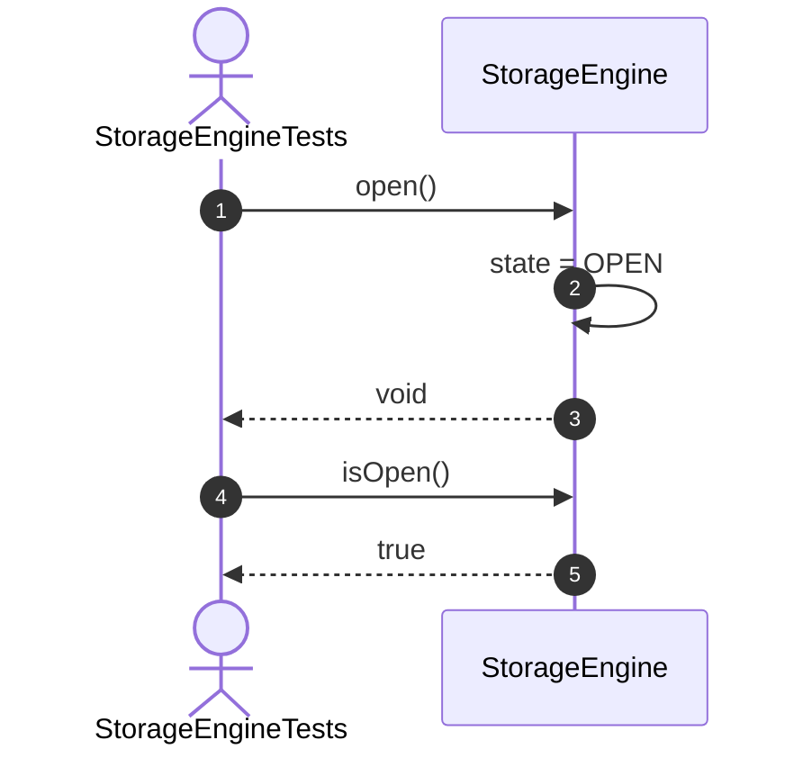
```mermaid
sequenceDiagram
    autonumber
    actor Test as StorageEngineTests
    participant Engine as StorageEngine

    Test->>Engine: open()
    Engine->>Engine: state = OPEN
    Engine-->>Test: void
    Test->>Engine: isOpen()
    Engine-->>Test: true
```

## 7. open_ShouldBeIdempotent

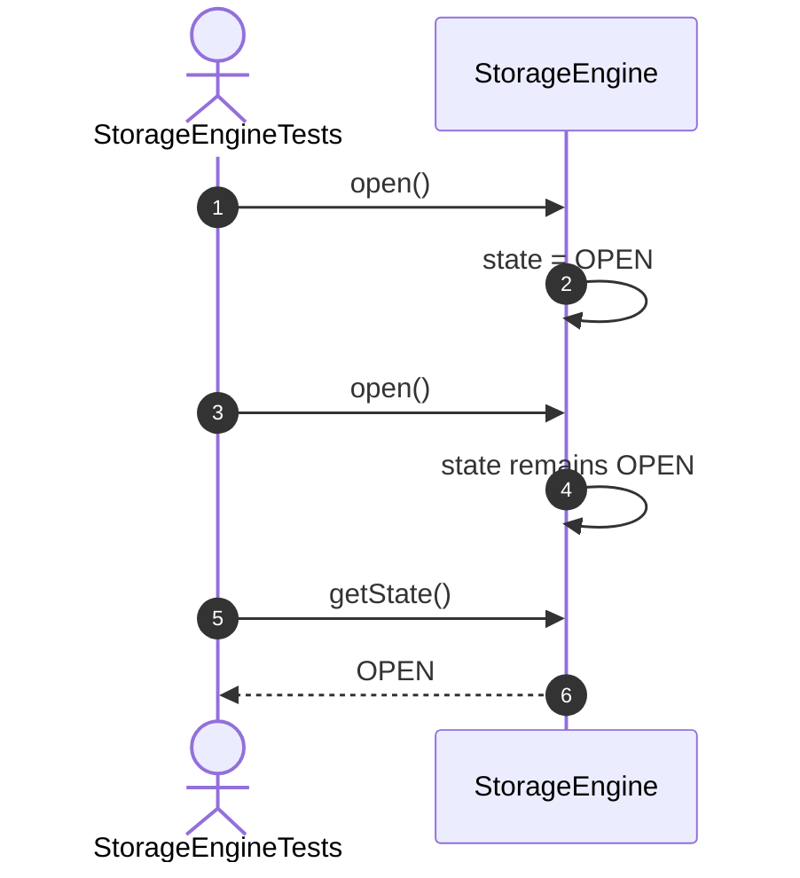
```mermaid
sequenceDiagram
    autonumber
    actor Test as StorageEngineTests
    participant Engine as StorageEngine

    Test->>Engine: open()
    Engine->>Engine: state = OPEN
    Test->>Engine: open()
    Engine->>Engine: state remains OPEN
    Test->>Engine: getState()
    Engine-->>Test: OPEN
```

## 8. close_ShouldChangeStateToClosed

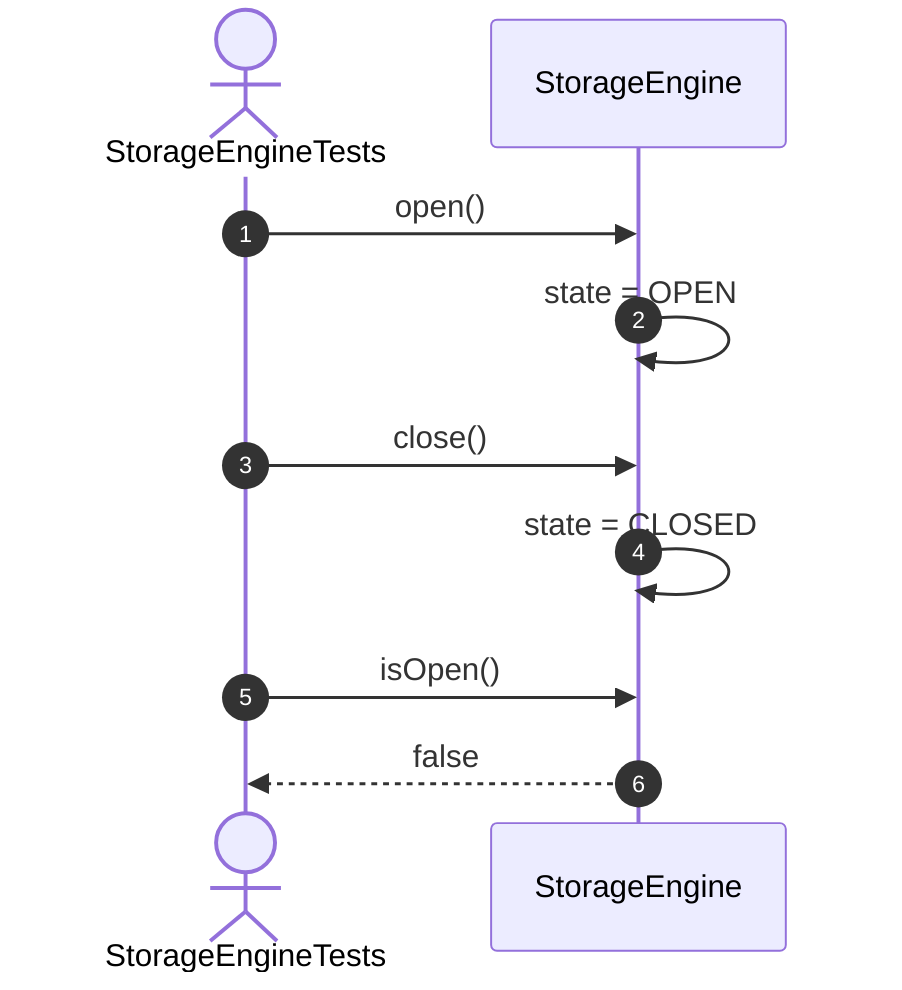
```mermaid
sequenceDiagram
    autonumber
    actor Test as StorageEngineTests
    participant Engine as StorageEngine

    Test->>Engine: open()
    Engine->>Engine: state = OPEN
    Test->>Engine: close()
    Engine->>Engine: state = CLOSED
    Test->>Engine: isOpen()
    Engine-->>Test: false
```

## 9. close_ShouldBeIdempotent

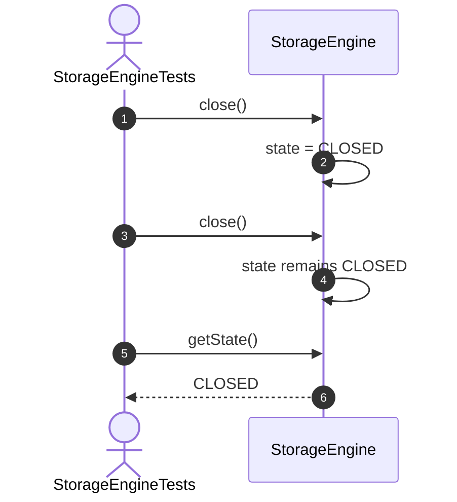
```mermaid
sequenceDiagram
    autonumber
    actor Test as StorageEngineTests
    participant Engine as StorageEngine

    Test->>Engine: close()
    Engine->>Engine: state = CLOSED
    Test->>Engine: close()
    Engine->>Engine: state remains CLOSED
    Test->>Engine: getState()
    Engine-->>Test: CLOSED
```

## 10. open_ShouldReopenClosedStorageEngine

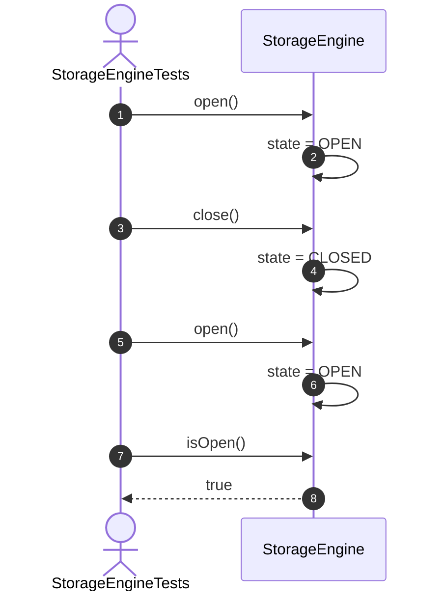
```mermaid
sequenceDiagram
    autonumber
    actor Test as StorageEngineTests
    participant Engine as StorageEngine

    Test->>Engine: open()
    Engine->>Engine: state = OPEN
    Test->>Engine: close()
    Engine->>Engine: state = CLOSED
    Test->>Engine: open()
    Engine->>Engine: state = OPEN
    Test->>Engine: isOpen()
    Engine-->>Test: true
```

# Page Operation Tests

## 11. allocatePage_ShouldCreatePage

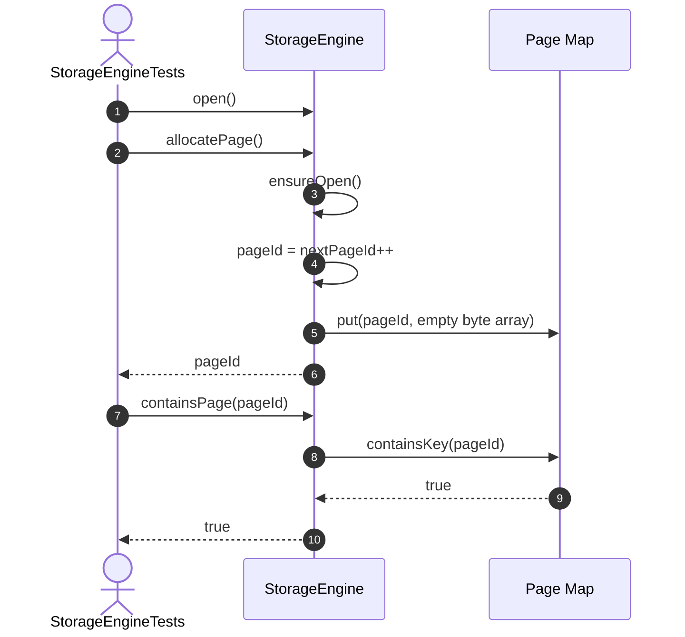
```mermaid
sequenceDiagram
    autonumber
    actor Test as StorageEngineTests
    participant Engine as StorageEngine
    participant Pages as Page Map

    Test->>Engine: open()
    Test->>Engine: allocatePage()
    Engine->>Engine: ensureOpen()
    Engine->>Engine: pageId = nextPageId++
    Engine->>Pages: put(pageId, empty byte array)
    Engine-->>Test: pageId
    Test->>Engine: containsPage(pageId)
    Engine->>Pages: containsKey(pageId)
    Pages-->>Engine: true
    Engine-->>Test: true
```

## 12. allocatePage_ShouldGenerateSequentialPageIds

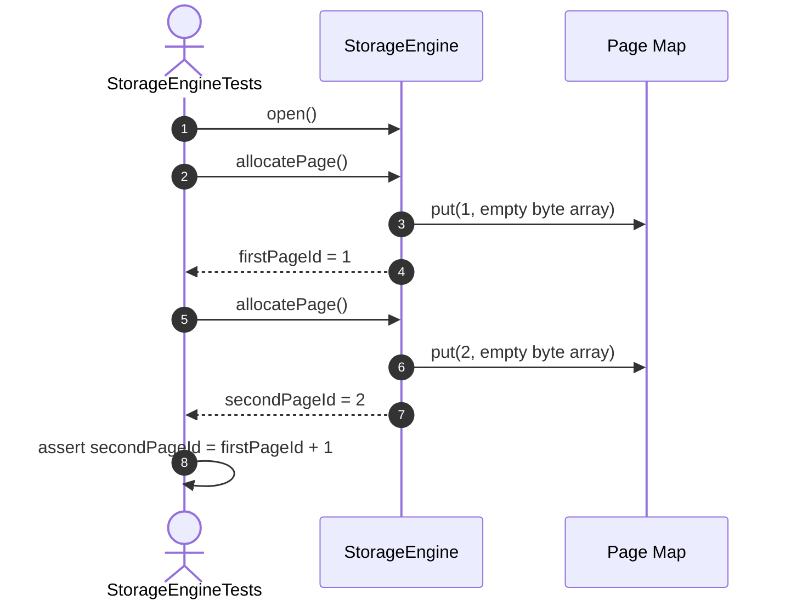
```mermaid
sequenceDiagram
    autonumber
    actor Test as StorageEngineTests
    participant Engine as StorageEngine
    participant Pages as Page Map

    Test->>Engine: open()
    Test->>Engine: allocatePage()
    Engine->>Pages: put(1, empty byte array)
    Engine-->>Test: firstPageId = 1
    Test->>Engine: allocatePage()
    Engine->>Pages: put(2, empty byte array)
    Engine-->>Test: secondPageId = 2
    Test->>Test: assert secondPageId = firstPageId + 1
```

## 13. allocatePage_ShouldRejectWhenClosed

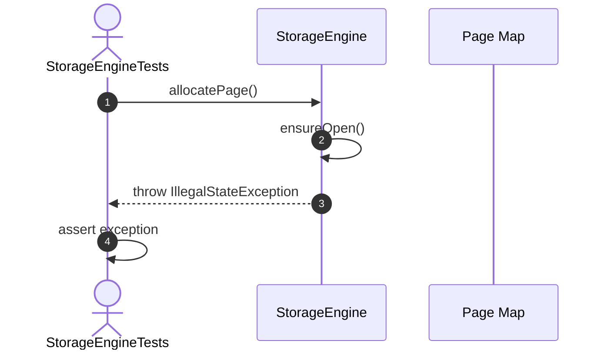
```mermaid
sequenceDiagram
    autonumber
    actor Test as StorageEngineTests
    participant Engine as StorageEngine
    participant Pages as Page Map

    Test->>Engine: allocatePage()
    Engine->>Engine: ensureOpen()
    Engine-->>Test: throw IllegalStateException
    Test->>Test: assert exception
```

## 14. writePage_ShouldStorePageData

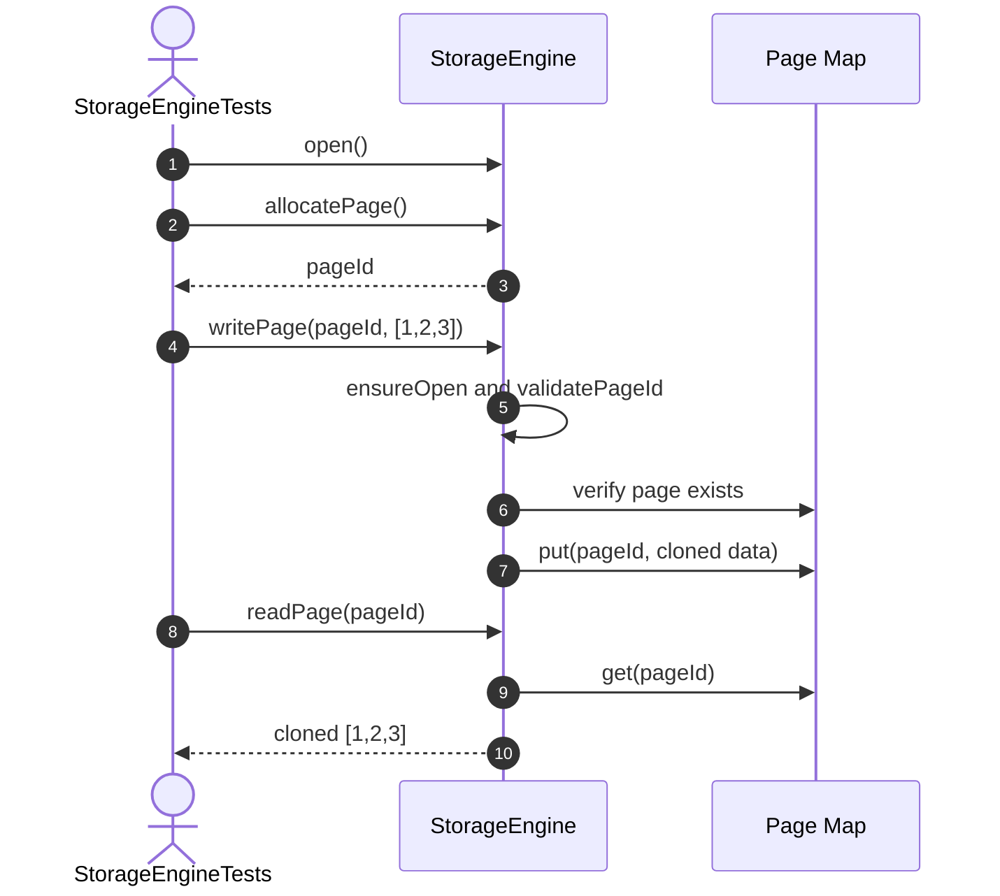
```mermaid
sequenceDiagram
    autonumber
    actor Test as StorageEngineTests
    participant Engine as StorageEngine
    participant Pages as Page Map

    Test->>Engine: open()
    Test->>Engine: allocatePage()
    Engine-->>Test: pageId
    Test->>Engine: writePage(pageId, [1,2,3])
    Engine->>Engine: ensureOpen and validatePageId
    Engine->>Pages: verify page exists
    Engine->>Pages: put(pageId, cloned data)
    Test->>Engine: readPage(pageId)
    Engine->>Pages: get(pageId)
    Engine-->>Test: cloned [1,2,3]
```

## 15. writePage_ShouldReplaceExistingData

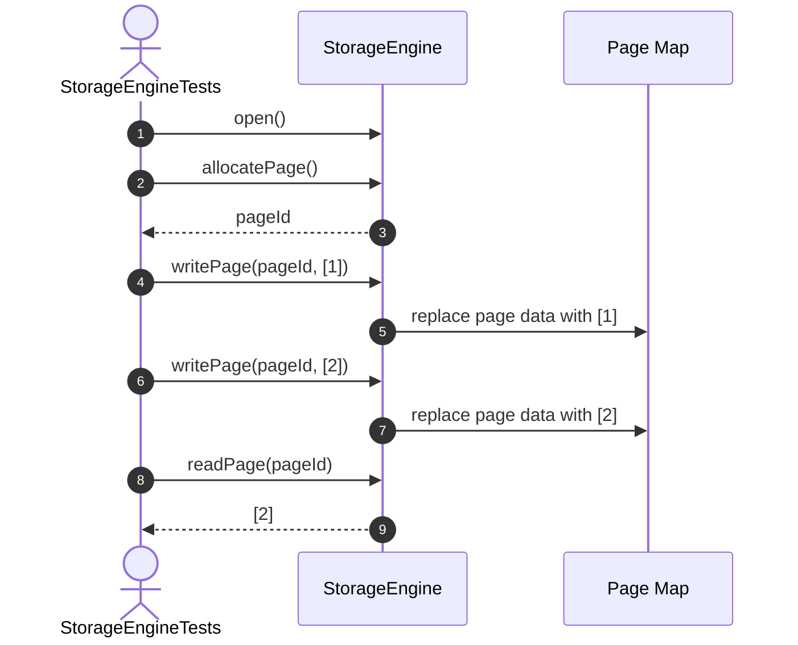
```mermaid
sequenceDiagram
    autonumber
    actor Test as StorageEngineTests
    participant Engine as StorageEngine
    participant Pages as Page Map

    Test->>Engine: open()
    Test->>Engine: allocatePage()
    Engine-->>Test: pageId
    Test->>Engine: writePage(pageId, [1])
    Engine->>Pages: replace page data with [1]
    Test->>Engine: writePage(pageId, [2])
    Engine->>Pages: replace page data with [2]
    Test->>Engine: readPage(pageId)
    Engine-->>Test: [2]
```

## 16. writePage_ShouldRejectNullData

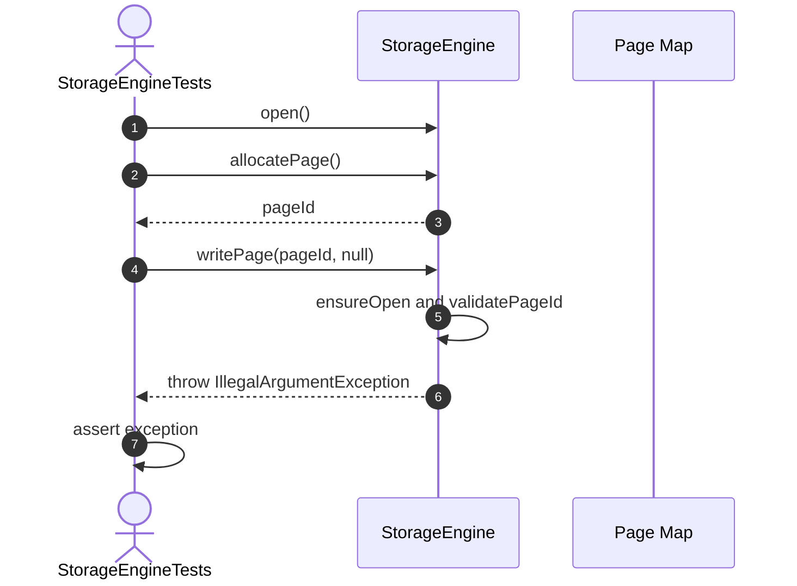
```mermaid
sequenceDiagram
    autonumber
    actor Test as StorageEngineTests
    participant Engine as StorageEngine
    participant Pages as Page Map

    Test->>Engine: open()
    Test->>Engine: allocatePage()
    Engine-->>Test: pageId
    Test->>Engine: writePage(pageId, null)
    Engine->>Engine: ensureOpen and validatePageId
    Engine-->>Test: throw IllegalArgumentException
    Test->>Test: assert exception
```

## 17. writePage_ShouldRejectMissingPage

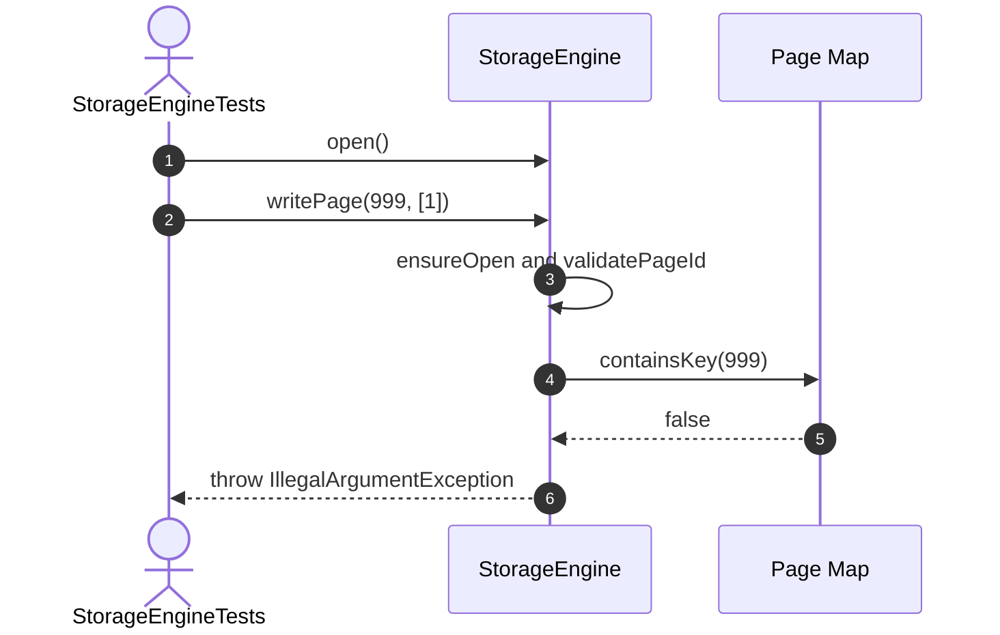
```mermaid
sequenceDiagram
    autonumber
    actor Test as StorageEngineTests
    participant Engine as StorageEngine
    participant Pages as Page Map

    Test->>Engine: open()
    Test->>Engine: writePage(999, [1])
    Engine->>Engine: ensureOpen and validatePageId
    Engine->>Pages: containsKey(999)
    Pages-->>Engine: false
    Engine-->>Test: throw IllegalArgumentException
```

## 18. readPage_ShouldReturnCopy

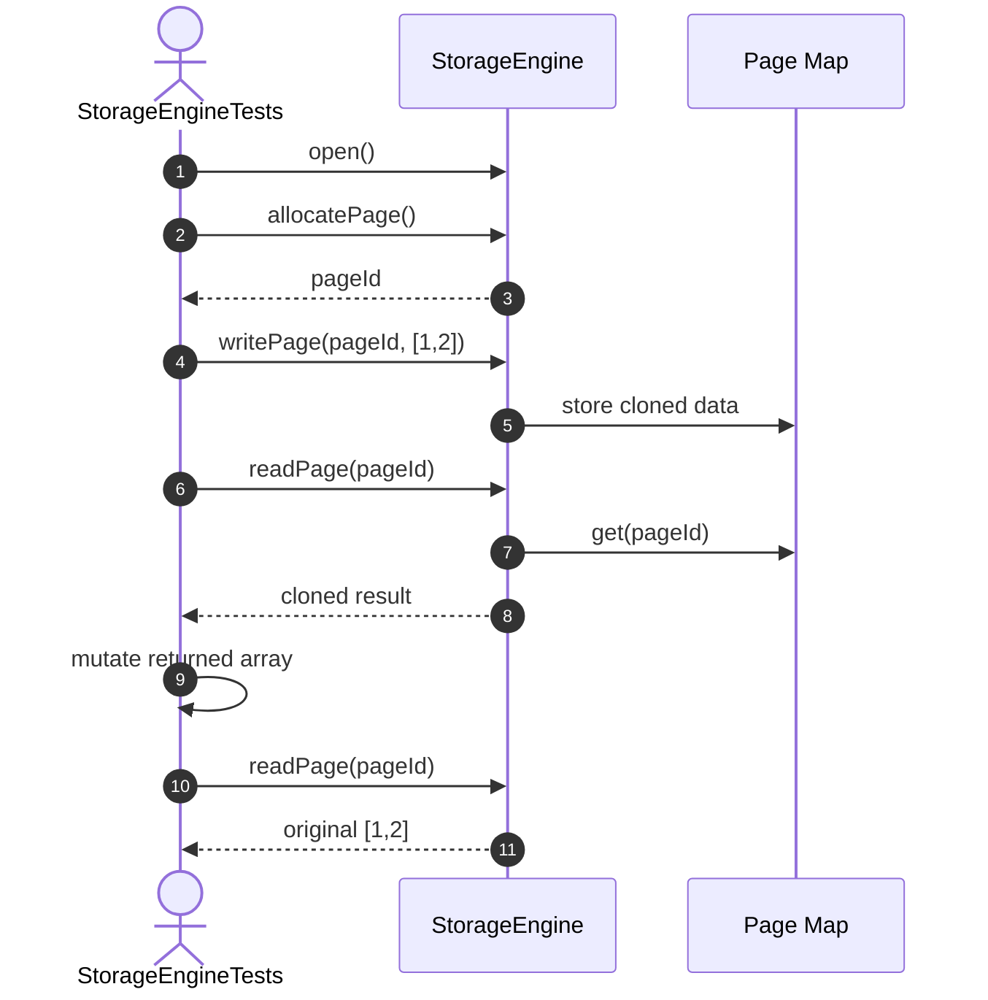
```mermaid
sequenceDiagram
    autonumber
    actor Test as StorageEngineTests
    participant Engine as StorageEngine
    participant Pages as Page Map

    Test->>Engine: open()
    Test->>Engine: allocatePage()
    Engine-->>Test: pageId
    Test->>Engine: writePage(pageId, [1,2])
    Engine->>Pages: store cloned data
    Test->>Engine: readPage(pageId)
    Engine->>Pages: get(pageId)
    Engine-->>Test: cloned result
    Test->>Test: mutate returned array
    Test->>Engine: readPage(pageId)
    Engine-->>Test: original [1,2]
```

## 19. readPage_ShouldRejectMissingPage

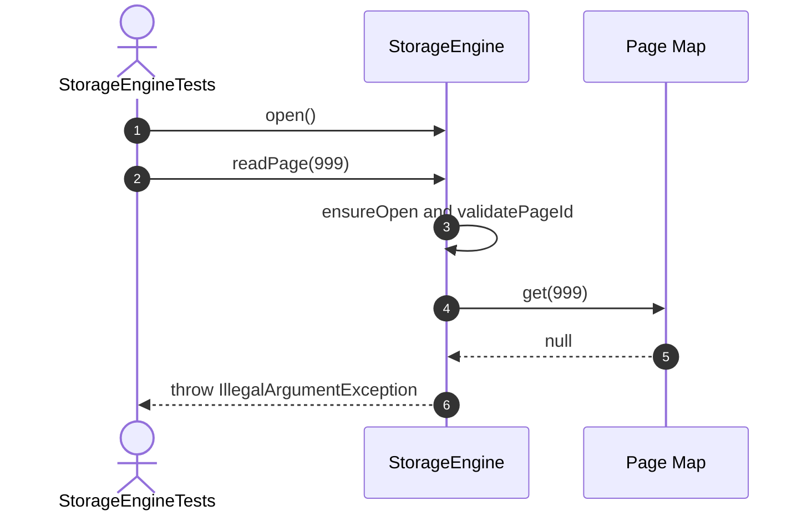
```mermaid
sequenceDiagram
    autonumber
    actor Test as StorageEngineTests
    participant Engine as StorageEngine
    participant Pages as Page Map

    Test->>Engine: open()
    Test->>Engine: readPage(999)
    Engine->>Engine: ensureOpen and validatePageId
    Engine->>Pages: get(999)
    Pages-->>Engine: null
    Engine-->>Test: throw IllegalArgumentException
```

## 20. deletePage_ShouldRemoveExistingPage

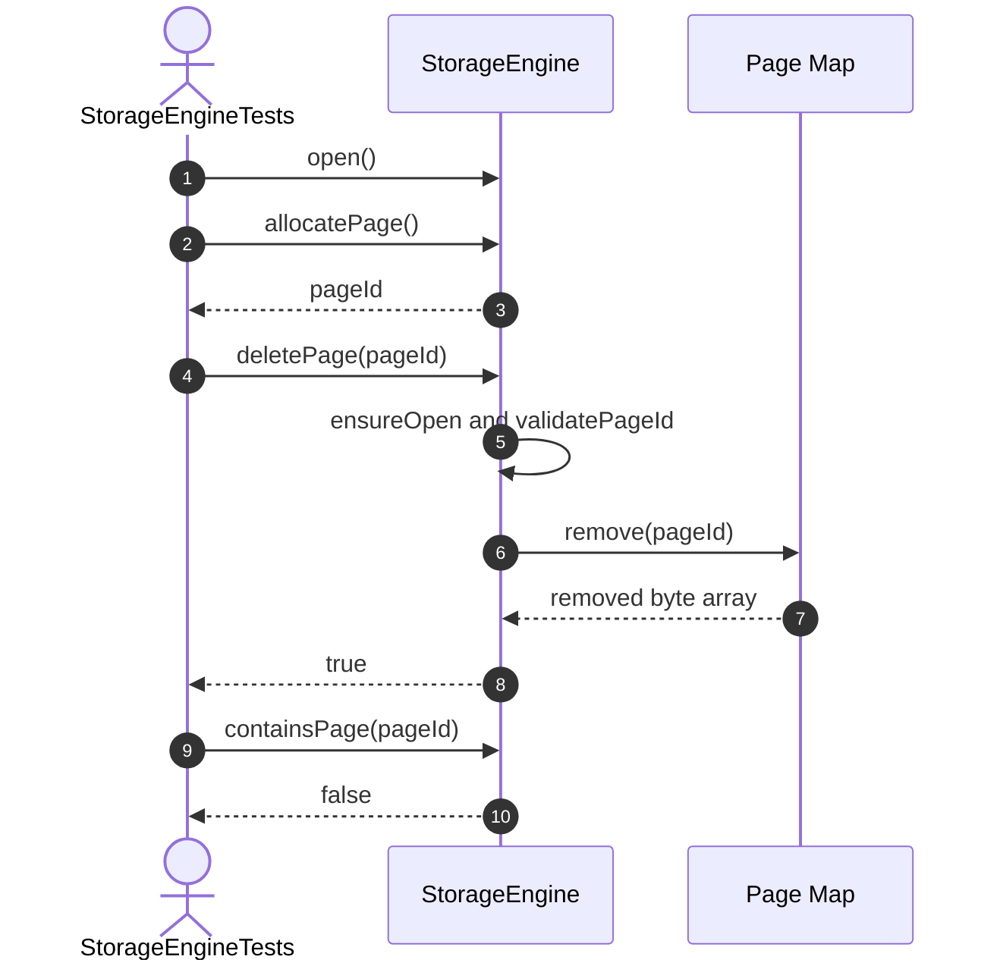
```mermaid
sequenceDiagram
    autonumber
    actor Test as StorageEngineTests
    participant Engine as StorageEngine
    participant Pages as Page Map

    Test->>Engine: open()
    Test->>Engine: allocatePage()
    Engine-->>Test: pageId
    Test->>Engine: deletePage(pageId)
    Engine->>Engine: ensureOpen and validatePageId
    Engine->>Pages: remove(pageId)
    Pages-->>Engine: removed byte array
    Engine-->>Test: true
    Test->>Engine: containsPage(pageId)
    Engine-->>Test: false
```

## 21. deletePage_ShouldReturnFalseForMissingPage

```mermaid
sequenceDiagram
    autonumber
    actor Test as StorageEngineTests
    participant Engine as StorageEngine
    participant Pages as Page Map

    Test->>Engine: open()
    Test->>Engine: deletePage(999)
    Engine->>Engine: ensureOpen and validatePageId
    Engine->>Pages: remove(999)
    Pages-->>Engine: null
    Engine-->>Test: false
```

# Collection Safety Tests

## 22. getPages_ShouldReturnUnmodifiableMap

```mermaid
sequenceDiagram
    autonumber
    actor Test as StorageEngineTests
    participant Engine as StorageEngine
    participant Pages as Page Map

    Test->>Engine: open()
    Test->>Engine: allocatePage()
    Test->>Engine: getPages()
    Engine->>Pages: copy entries and clone arrays
    Engine-->>Test: unmodifiable map
    Test->>Test: pages.clear()
    Test->>Test: assert UnsupportedOperationException
```

## 23. getPages_ShouldProtectNestedByteArrays

```mermaid
sequenceDiagram
    autonumber
    actor Test as StorageEngineTests
    participant Engine as StorageEngine
    participant Pages as Page Map

    Test->>Engine: open()
    Test->>Engine: allocatePage()
    Engine-->>Test: pageId
    Test->>Engine: writePage(pageId, [1,2])
    Test->>Engine: getPages()
    Engine->>Pages: clone nested byte arrays
    Engine-->>Test: copied map
    Test->>Test: mutate copied byte array
    Test->>Engine: readPage(pageId)
    Engine-->>Test: original [1,2]
```

## 24. clear_ShouldRemoveAllPages

```mermaid
sequenceDiagram
    autonumber
    actor Test as StorageEngineTests
    participant Engine as StorageEngine
    participant Pages as Page Map

    Test->>Engine: open()
    Test->>Engine: allocatePage() twice
    Engine->>Pages: store two pages
    Test->>Engine: clear()
    Engine->>Engine: ensureOpen()
    Engine->>Pages: clear()
    Test->>Engine: isEmpty()
    Engine-->>Test: true
```

## 25. clear_ShouldRejectWhenClosed

```mermaid
sequenceDiagram
    autonumber
    actor Test as StorageEngineTests
    participant Engine as StorageEngine
    participant Pages as Page Map

    Test->>Engine: clear()
    Engine->>Engine: ensureOpen()
    Engine-->>Test: throw IllegalStateException
    Test->>Test: assert exception
```