# WALManager Testing - Main Functional Sequences

---

## 1. Append Log

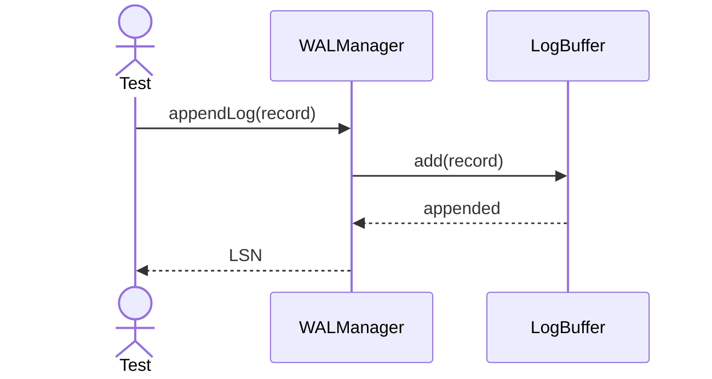
```mermaid
sequenceDiagram
actor Test
participant WALManager
participant LogBuffer

Test->>WALManager: appendLog(record)
WALManager->>LogBuffer: add(record)
LogBuffer-->>WALManager: appended
WALManager-->>Test: LSN
```

---

## 2. Flush Log

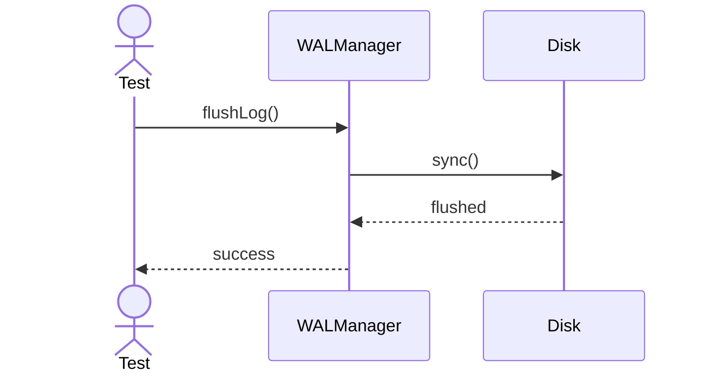
```mermaid
sequenceDiagram
actor Test
participant WALManager
participant Disk

Test->>WALManager: flushLog()
WALManager->>Disk: sync()
Disk-->>WALManager: flushed
WALManager-->>Test: success
```

---

## 3. Checkpoint

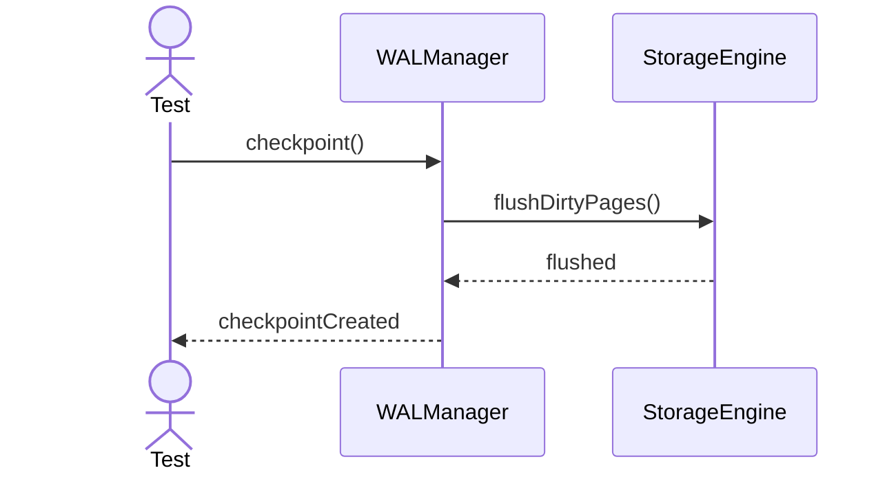
```mermaid
sequenceDiagram
actor Test
participant WALManager
participant StorageEngine

Test->>WALManager: checkpoint()
WALManager->>StorageEngine: flushDirtyPages()
StorageEngine-->>WALManager: flushed
WALManager-->>Test: checkpointCreated
```

---

## 4. Recover From Log

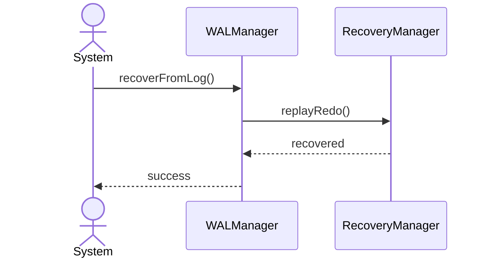
```mermaid
sequenceDiagram
actor System
participant WALManager
participant RecoveryManager

System->>WALManager: recoverFromLog()
WALManager->>RecoveryManager: replayRedo()
RecoveryManager-->>WALManager: recovered
WALManager-->>System: success
```

---

## 5. Validate LSN

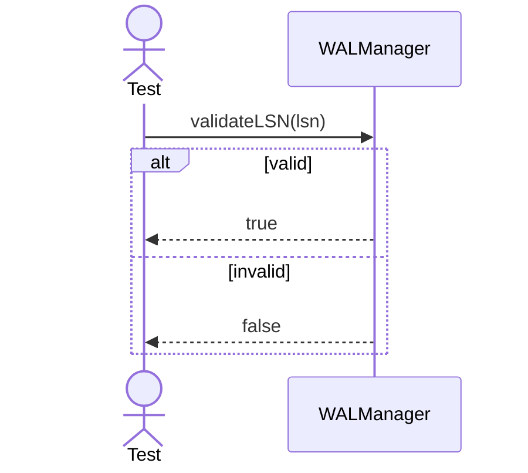
```mermaid
sequenceDiagram
actor Test
participant WALManager

Test->>WALManager: validateLSN(lsn)
alt valid
    WALManager-->>Test: true
else invalid
    WALManager-->>Test: false
end
```

---

## 6. Rotate Log

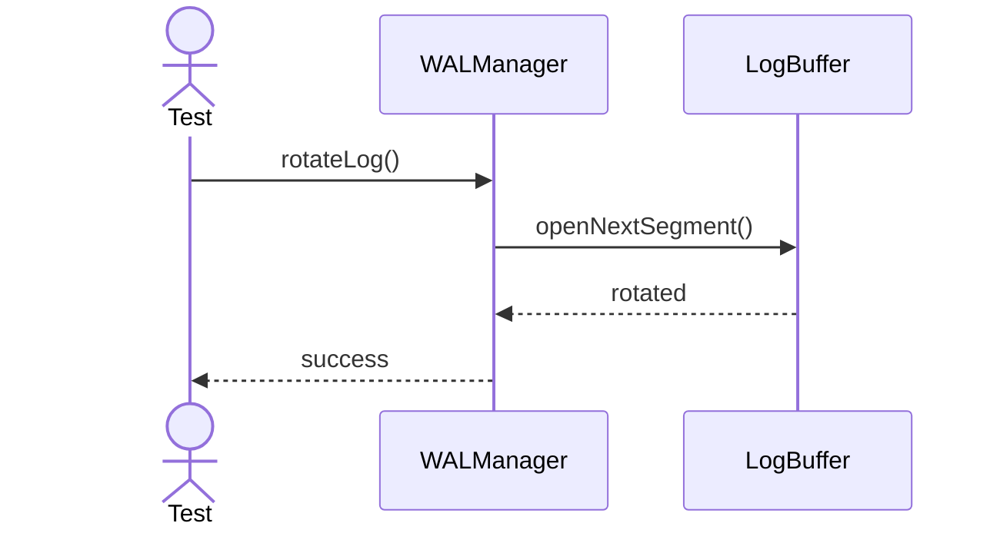
```mermaid
sequenceDiagram
actor Test
participant WALManager
participant LogBuffer

Test->>WALManager: rotateLog()
WALManager->>LogBuffer: openNextSegment()
LogBuffer-->>WALManager: rotated
WALManager-->>Test: success
```

---

## 7. Archive Log

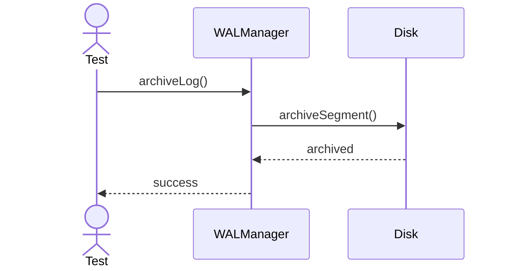
```mermaid
sequenceDiagram
actor Test
participant WALManager
participant Disk

Test->>WALManager: archiveLog()
WALManager->>Disk: archiveSegment()
Disk-->>WALManager: archived
WALManager-->>Test: success
```

---

## 8. Replay Redo

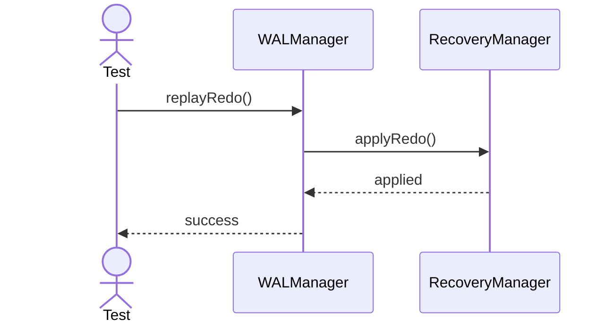
```mermaid
sequenceDiagram
actor Test
participant WALManager
participant RecoveryManager

Test->>WALManager: replayRedo()
WALManager->>RecoveryManager: applyRedo()
RecoveryManager-->>WALManager: applied
WALManager-->>Test: success
```

---

## 9. Replay Undo

```mermaid
sequenceDiagram
actor Test
participant WALManager
participant RecoveryManager

Test->>WALManager: replayUndo()
WALManager->>RecoveryManager: applyUndo()
RecoveryManager-->>WALManager: applied
WALManager-->>Test: success
```

---

## 10. Checkpoint Redo LSN

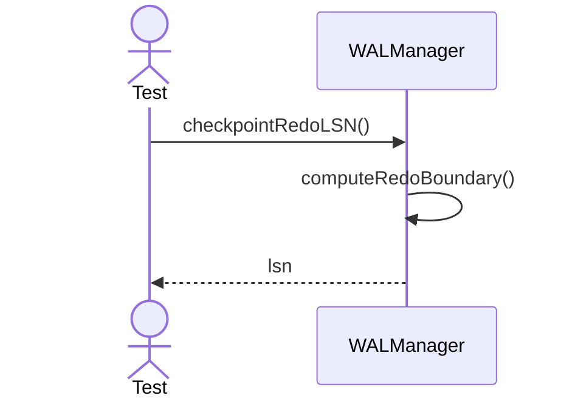
```mermaid
sequenceDiagram
actor Test
participant WALManager

Test->>WALManager: checkpointRedoLSN()
WALManager->>WALManager: computeRedoBoundary()
WALManager-->>Test: lsn
```

---

## 11. Append Transaction Log

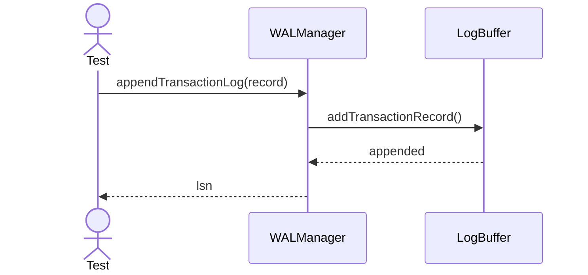
```mermaid
sequenceDiagram
actor Test
participant WALManager
participant LogBuffer

Test->>WALManager: appendTransactionLog(record)
WALManager->>LogBuffer: addTransactionRecord()
LogBuffer-->>WALManager: appended
WALManager-->>Test: lsn
```

---

## 12. Append Page Log

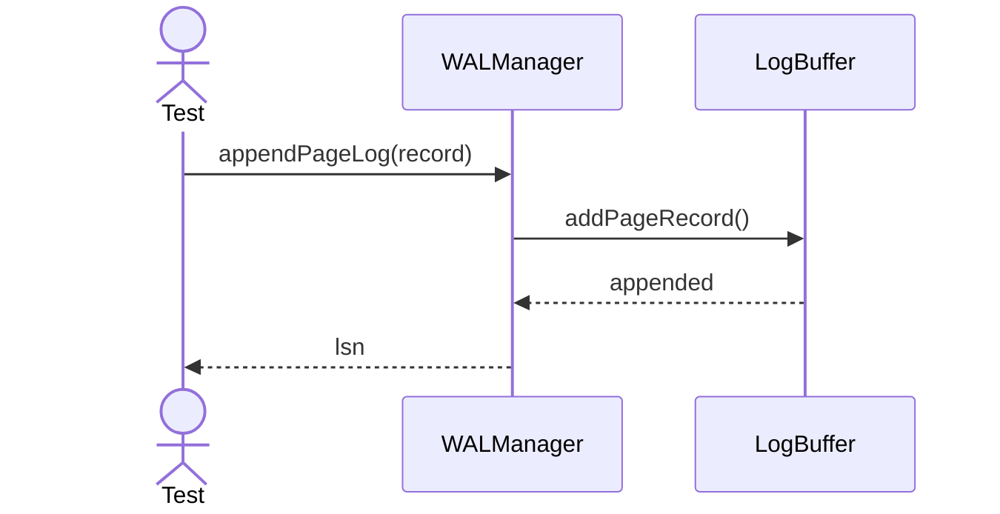
```mermaid
sequenceDiagram
actor Test
participant WALManager
participant LogBuffer

Test->>WALManager: appendPageLog(record)
WALManager->>LogBuffer: addPageRecord()
LogBuffer-->>WALManager: appended
WALManager-->>Test: lsn
```

---

## 13. Sync Log Buffer

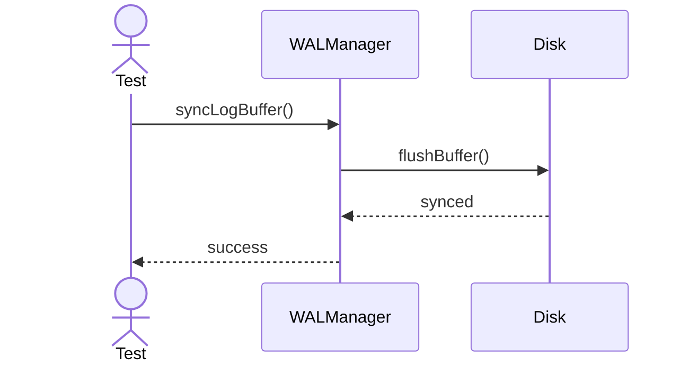
```mermaid
sequenceDiagram
actor Test
participant WALManager
participant Disk

Test->>WALManager: syncLogBuffer()
WALManager->>Disk: flushBuffer()
Disk-->>WALManager: synced
WALManager-->>Test: success
```

---

## 14. Seal Log Segment

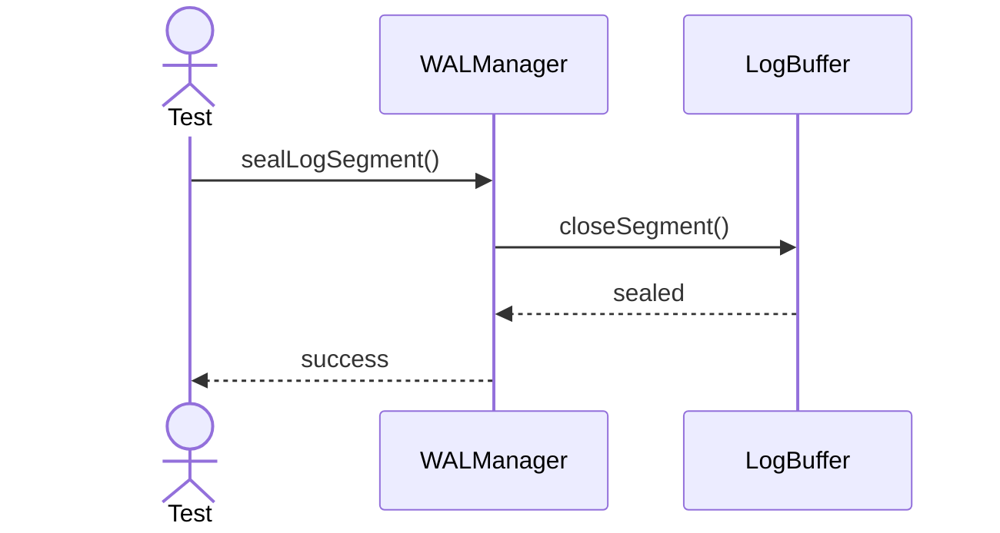
```mermaid
sequenceDiagram
actor Test
participant WALManager
participant LogBuffer

Test->>WALManager: sealLogSegment()
WALManager->>LogBuffer: closeSegment()
LogBuffer-->>WALManager: sealed
WALManager-->>Test: success
```

---

## 15. Open Next Segment

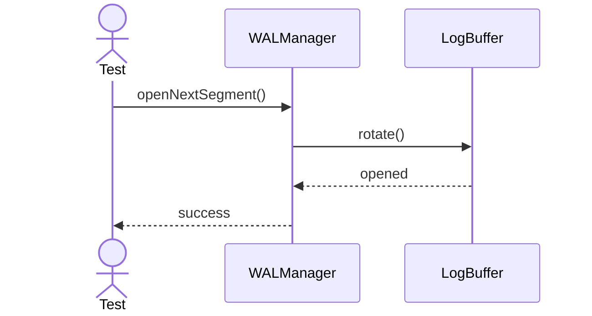
```mermaid
sequenceDiagram
actor Test
participant WALManager
participant LogBuffer

Test->>WALManager: openNextSegment()
WALManager->>LogBuffer: rotate()
LogBuffer-->>WALManager: opened
WALManager-->>Test: success
```

---

## 16. Compact Logs

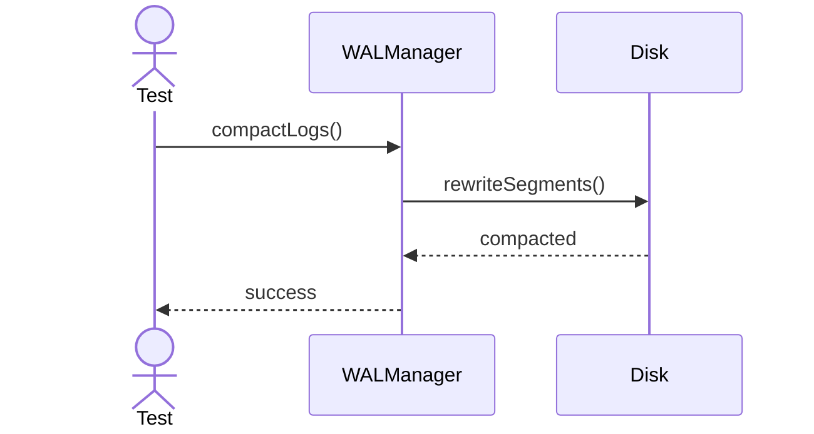
```mermaid
sequenceDiagram
actor Test
participant WALManager
participant Disk

Test->>WALManager: compactLogs()
WALManager->>Disk: rewriteSegments()
Disk-->>WALManager: compacted
WALManager-->>Test: success
```

---

## 17. Estimate Log Size

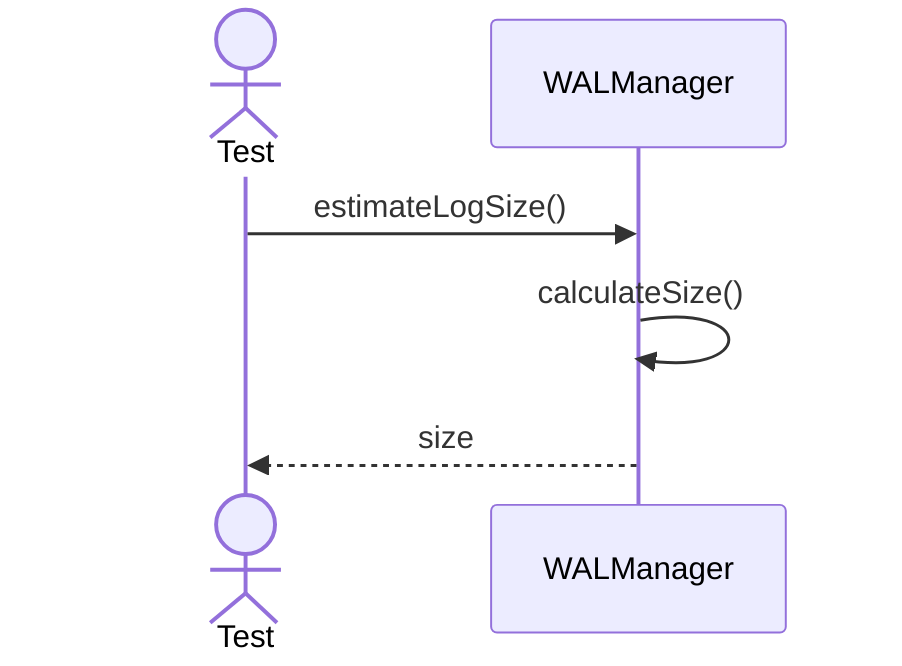
```mermaid
sequenceDiagram
actor Test
participant WALManager

Test->>WALManager: estimateLogSize()
WALManager->>WALManager: calculateSize()
WALManager-->>Test: size
```

---

## 18. Trim Old Logs

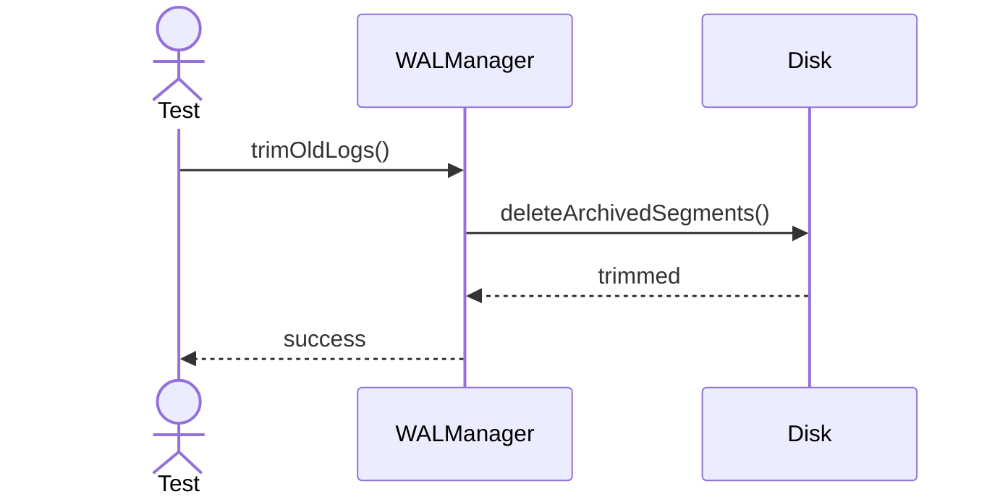
```mermaid
sequenceDiagram
actor Test
participant WALManager
participant Disk

Test->>WALManager: trimOldLogs()
WALManager->>Disk: deleteArchivedSegments()
Disk-->>WALManager: trimmed
WALManager-->>Test: success
```

---

## 19. Validate Checkpoint

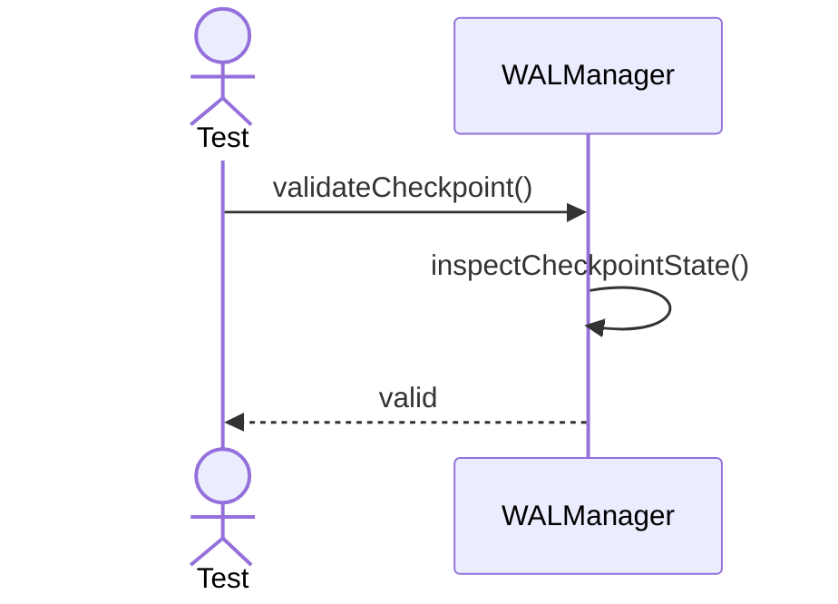
```mermaid
sequenceDiagram
actor Test
participant WALManager

Test->>WALManager: validateCheckpoint()
WALManager->>WALManager: inspectCheckpointState()
WALManager-->>Test: valid
```

---

## 20. Export WAL Snapshot

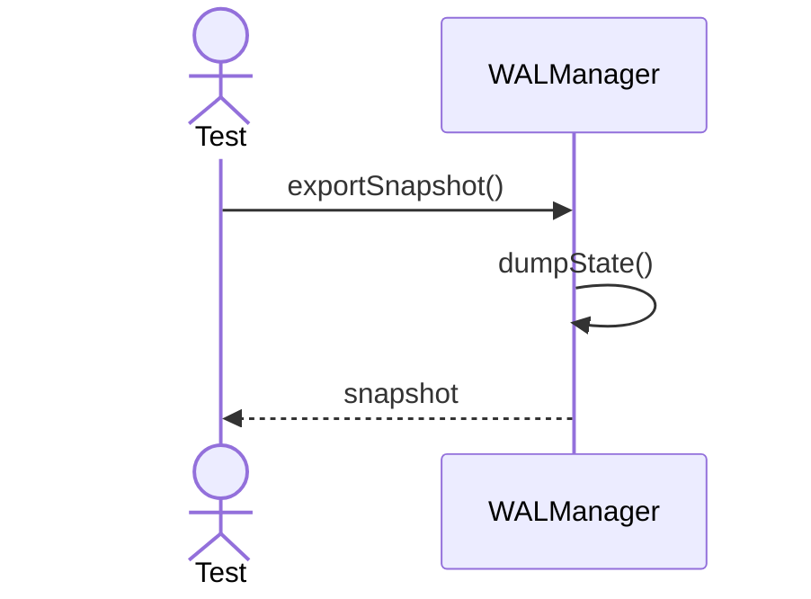
```mermaid
sequenceDiagram
actor Test
participant WALManager

Test->>WALManager: exportSnapshot()
WALManager->>WALManager: dumpState()
WALManager-->>Test: snapshot
```
