# StorageEngine Testing - Main Functional Sequences

---

## 1. Allocate Page

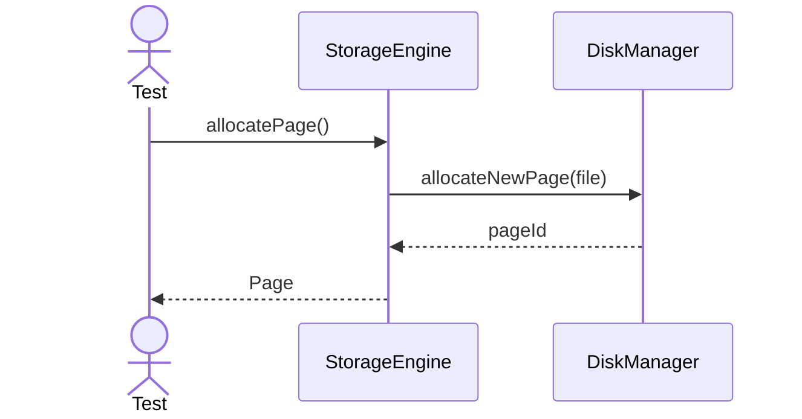

---

## 2. Read Page

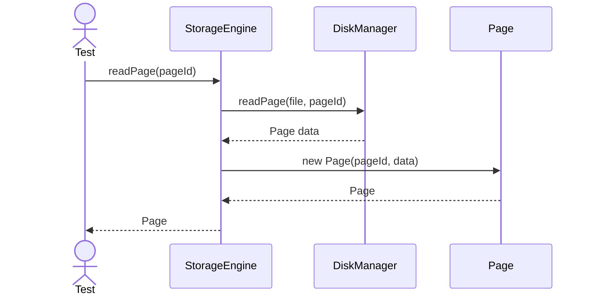

---

## 3. Write Page

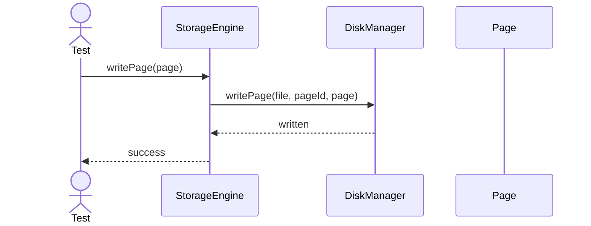

---

## 4. Split Page

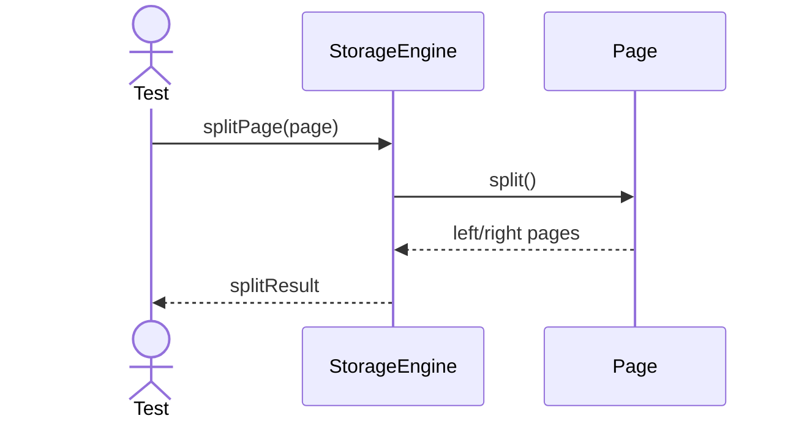

---

## 5. Compress Page

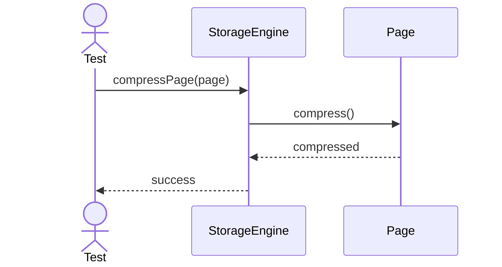

---

## 6. Encrypt Page

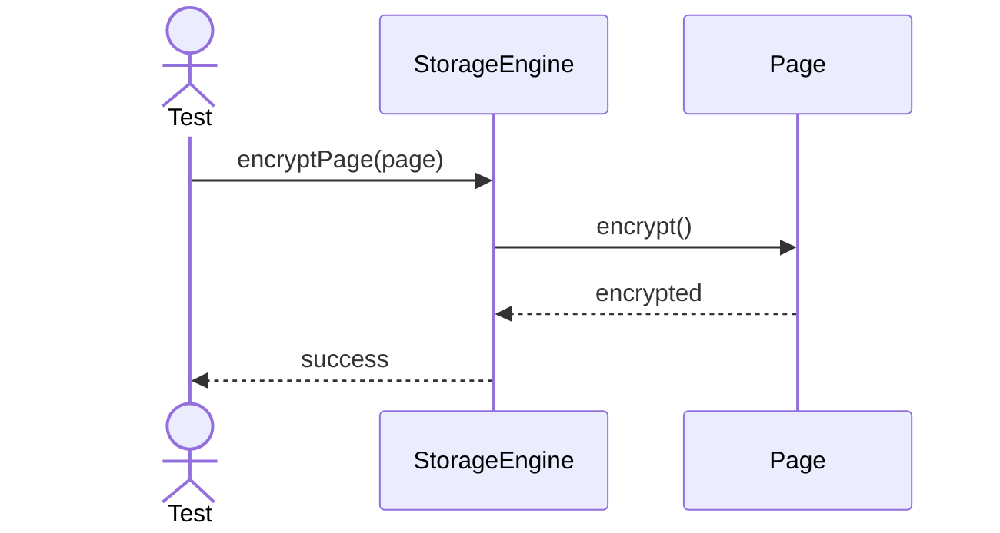

---

## 7. Free Page

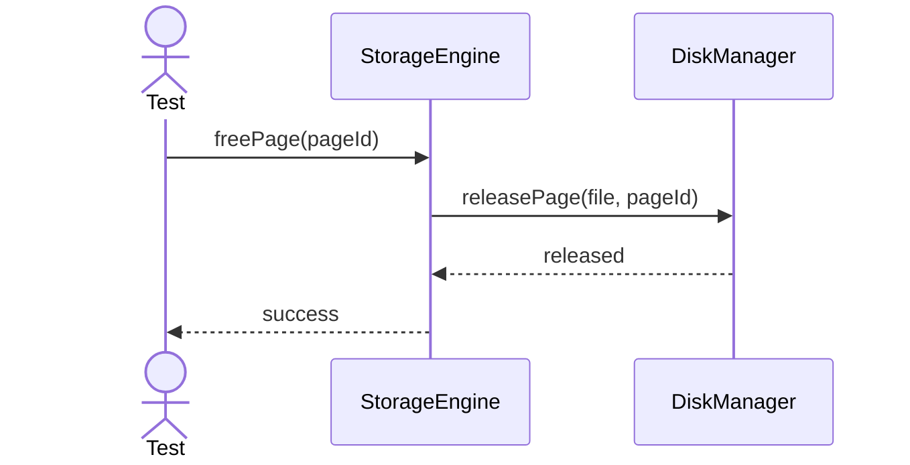

---

## 8. Merge Page

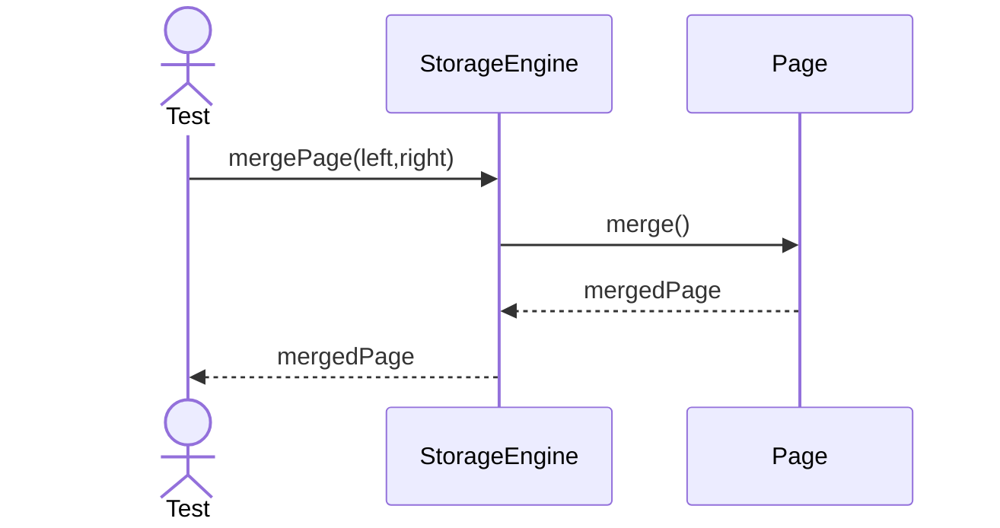

---

## 9. Flush Dirty Pages

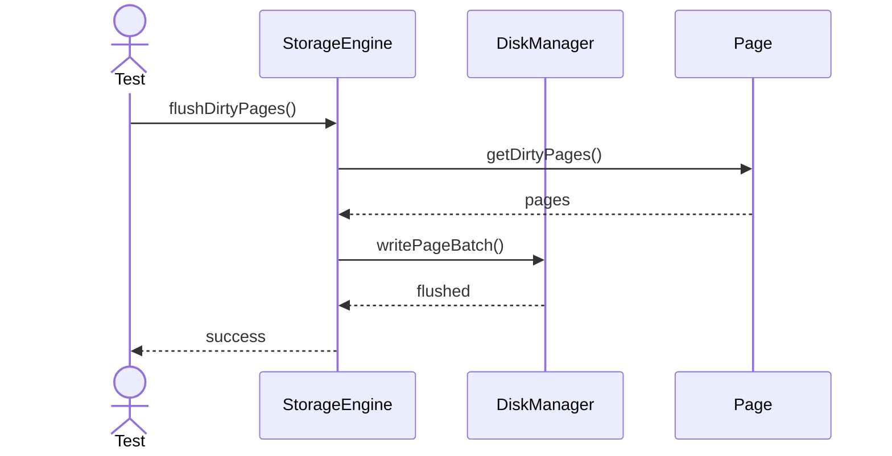

---

## 10. Checkpoint Storage

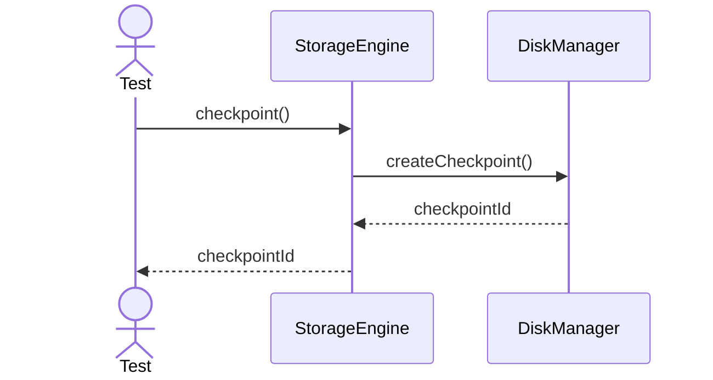

---

## 11. Allocate Extent

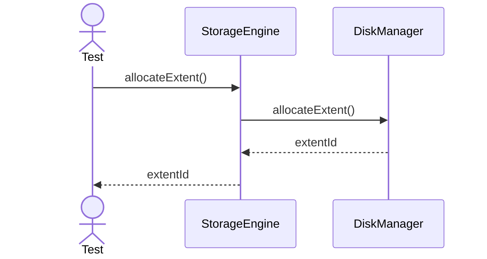

---

## 12. Release Extent

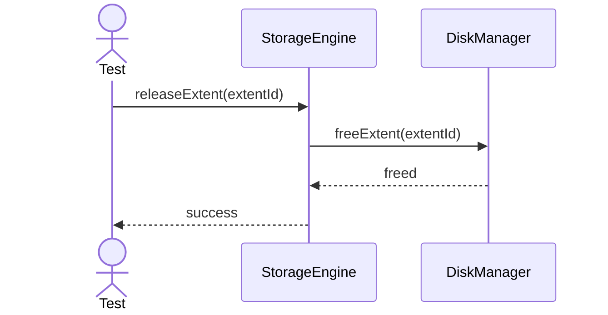

---

## 13. Recover Page

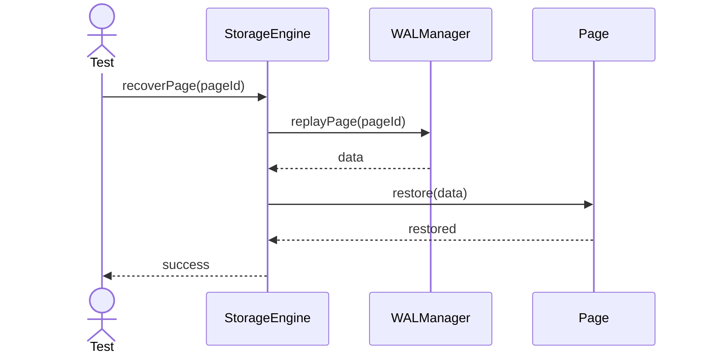

---

## 14. Validate Checksum

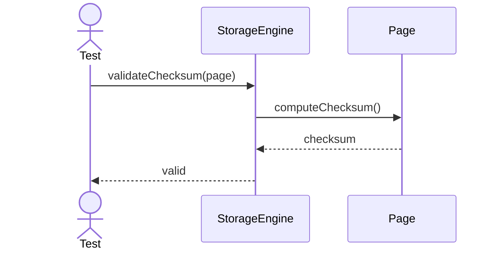

---

## 15. Pin Page

---

## 16. Unpin Page

---

## 17. Map Logical To Physical

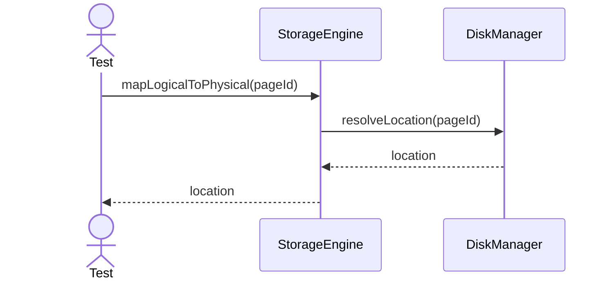

---

## 18. Copy On Write Page

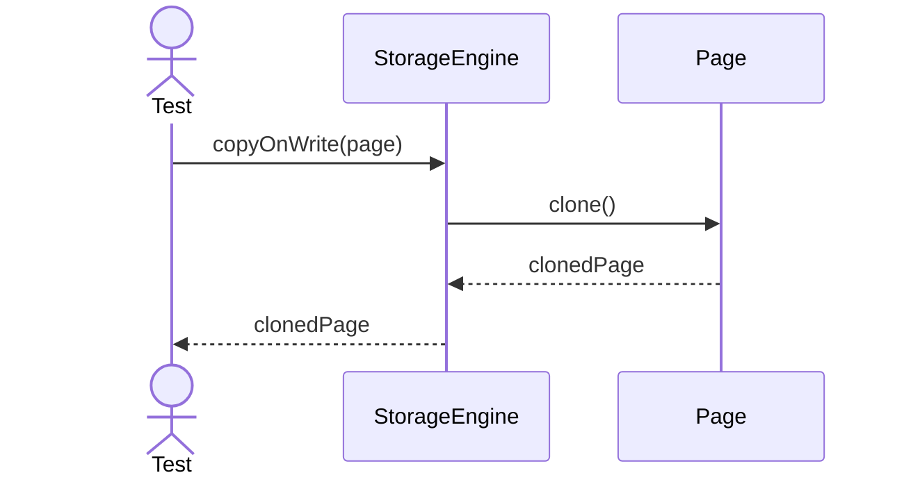

---

## 19. Archive Page

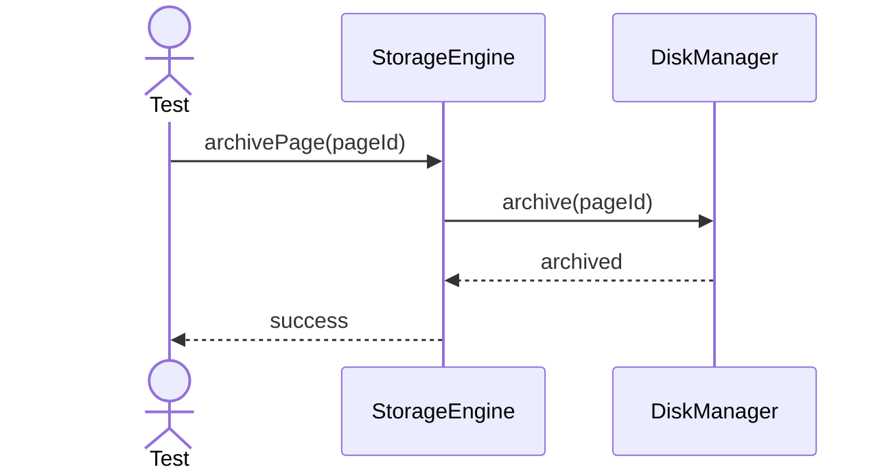

---

## 20. Restore Page

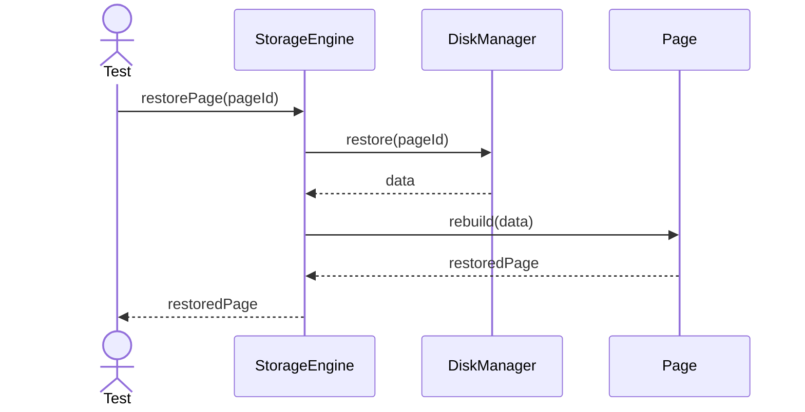
