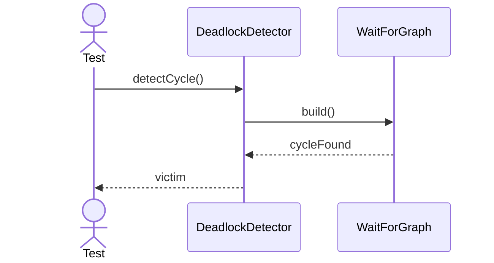
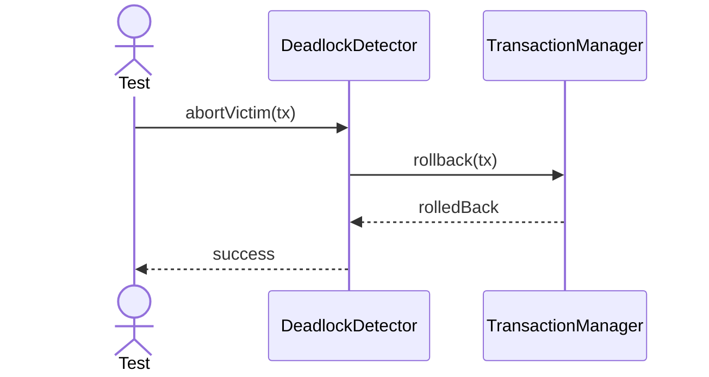
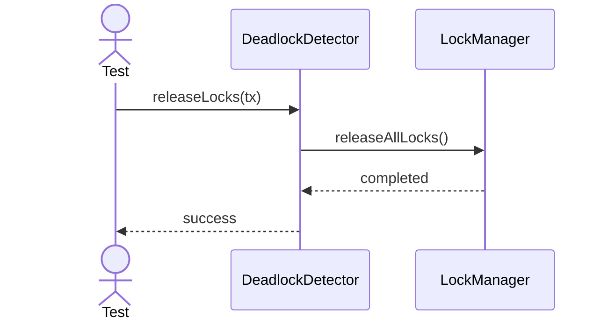

# DeadlockDetector Testing - Main Functional Sequences

---

## 1. Detect Cycle

```mermaid
sequenceDiagram
actor Test
participant DeadlockDetector
participant WaitForGraph

Test->>DeadlockDetector: detectCycle()
DeadlockDetector->>WaitForGraph: build()
WaitForGraph-->>DeadlockDetector: cycleFound
DeadlockDetector-->>Test: victim
```

---

## 2. Abort Victim

```mermaid
sequenceDiagram
actor Test
participant DeadlockDetector
participant TransactionManager

Test->>DeadlockDetector: abortVictim(tx)
DeadlockDetector->>TransactionManager: rollback(tx)
TransactionManager-->>DeadlockDetector: rolledBack
DeadlockDetector-->>Test: success
```

---

## 3. Release Locks

```mermaid
sequenceDiagram
actor Test
participant DeadlockDetector
participant LockManager

Test->>DeadlockDetector: releaseLocks(tx)
DeadlockDetector->>LockManager: releaseAllLocks()
LockManager-->>DeadlockDetector: completed
DeadlockDetector-->>Test: success
```
