# LockManager Testing - Main Functional Sequences

---

## 1. Acquire Shared Lock

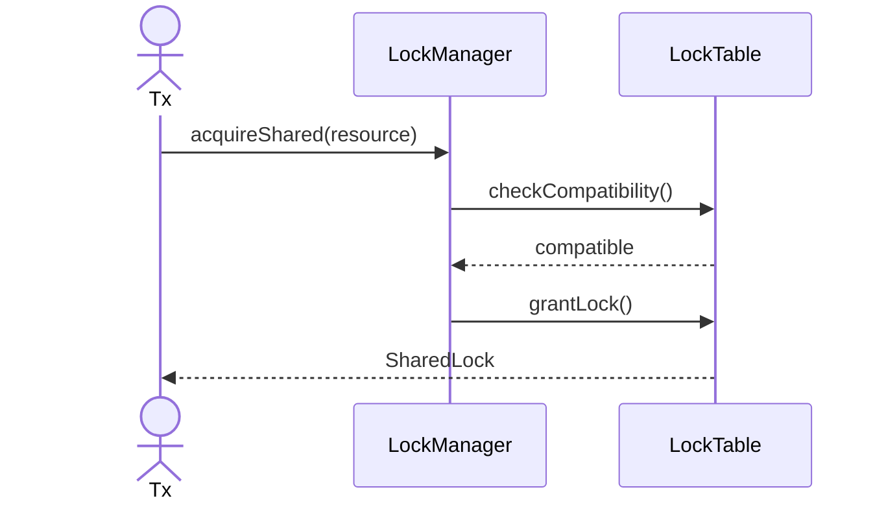

---

## 2. Acquire Exclusive Lock

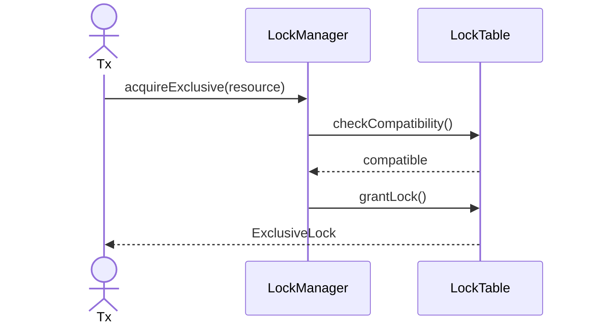

---

## 3. Upgrade Lock

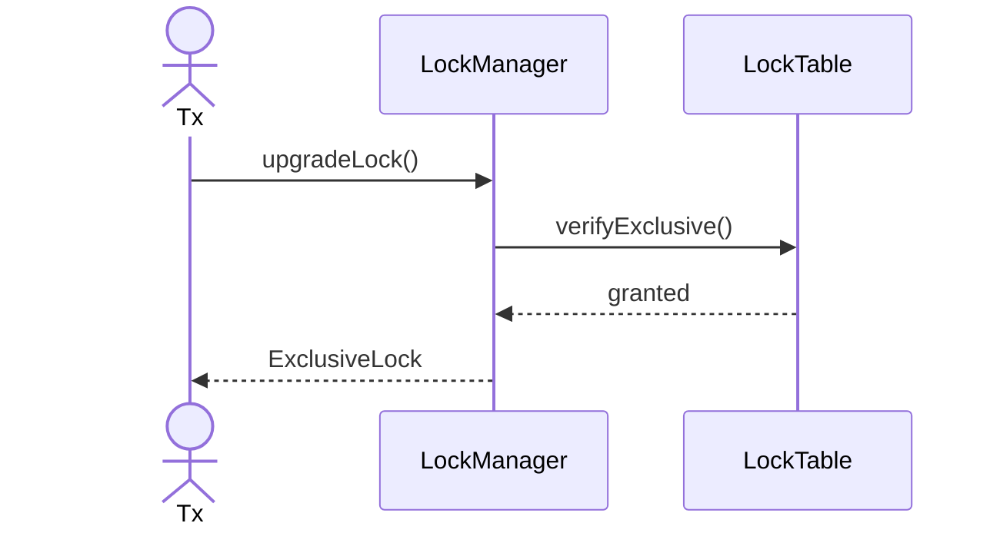

---

## 4. Downgrade Lock

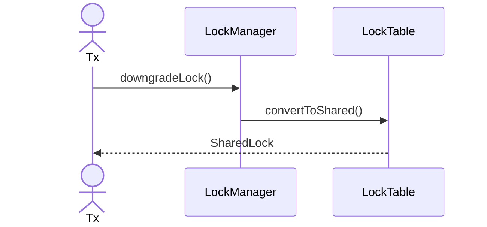

---

## 5. Release Lock

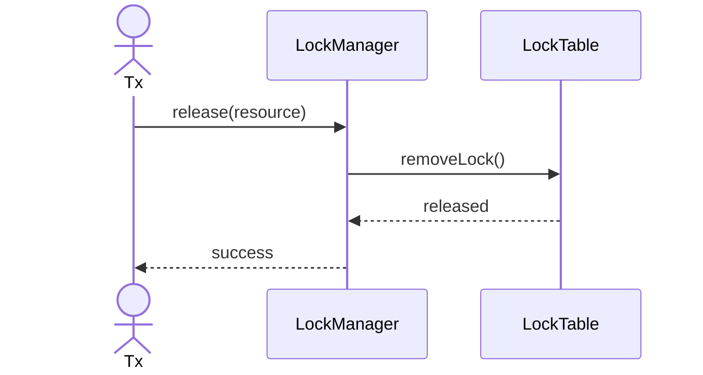

---

## 6. Release All Locks

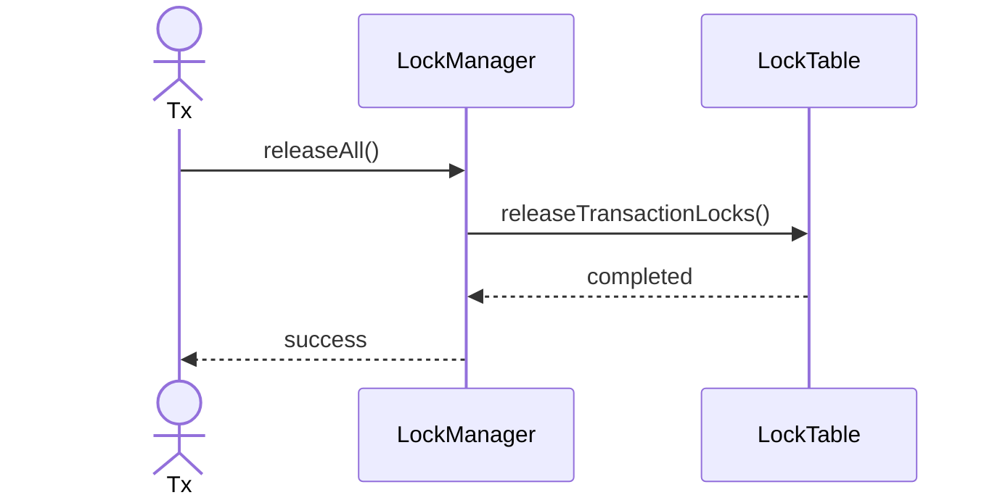

---

## 7. Detect Deadlock

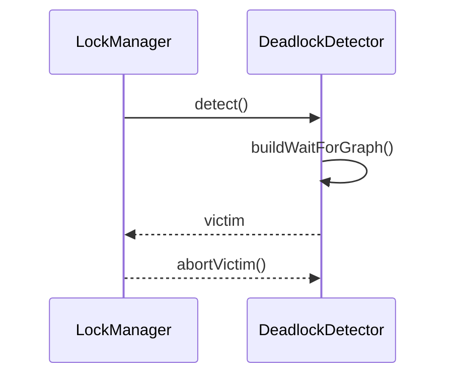

---

## 8. Lock Timeout

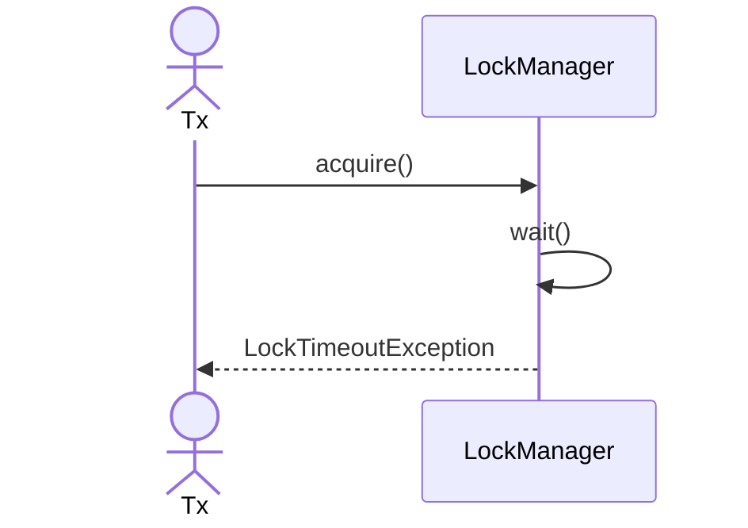

---

## 9. Concurrent Readers

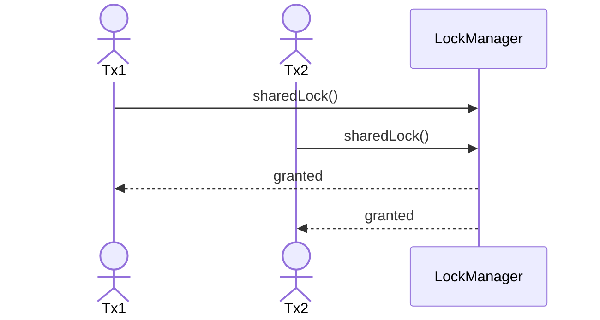

---

## 10. Concurrent Writers

---

## 11. Mixed Locks

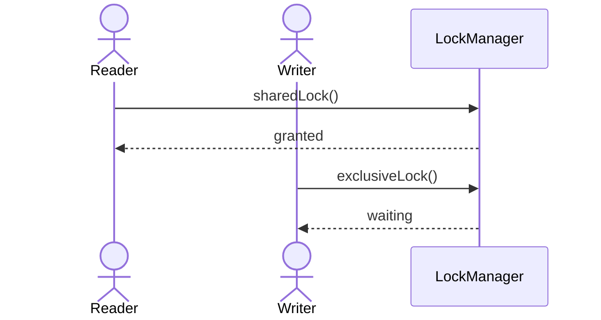

---

## 12. Queue Waiting Transaction

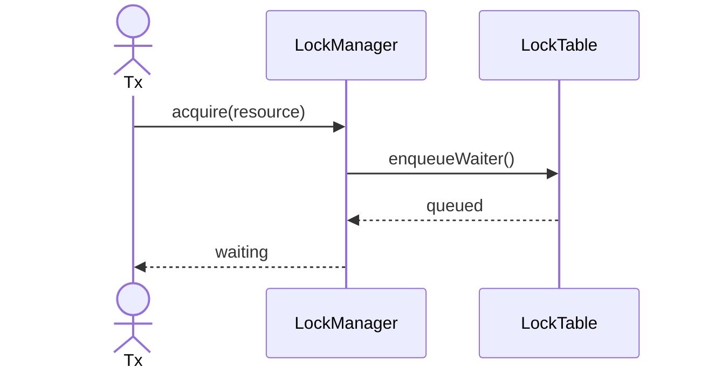

---

## 13. Wake Waiting Transaction

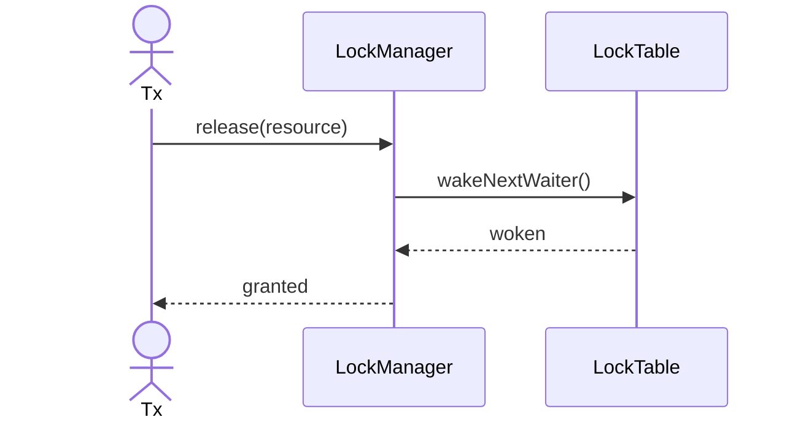

---

## 14. Validate Compatibility Matrix

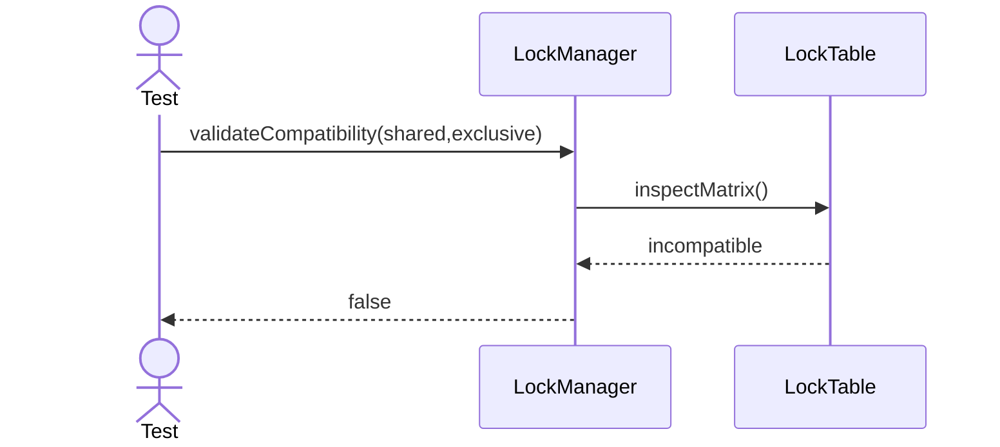

---

## 15. Select Deadlock Victim

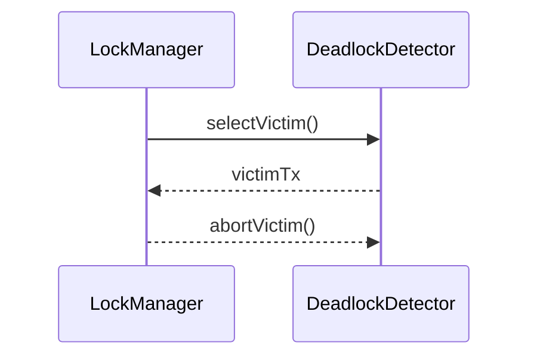

---

## 16. Release By Resource

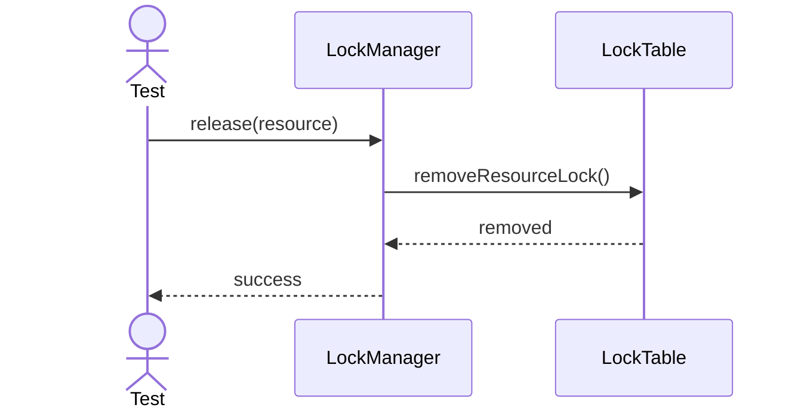

---

## 17. Release By Transaction

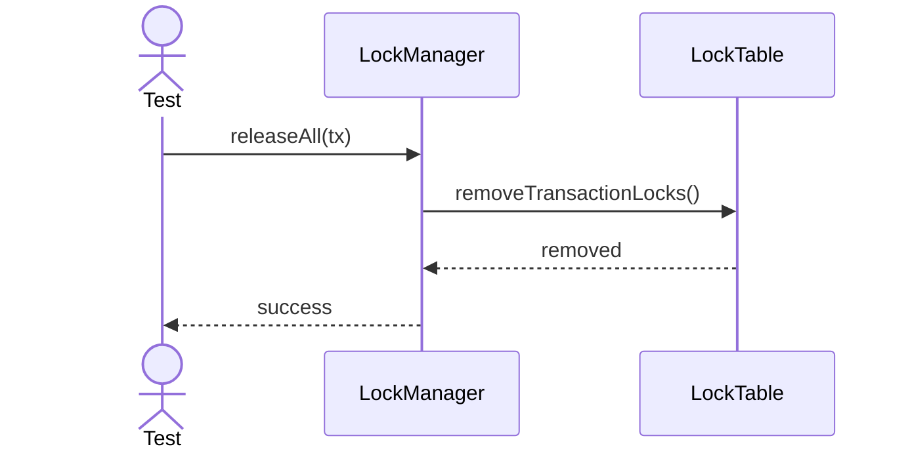

---

## 18. Lock Timeout Retry

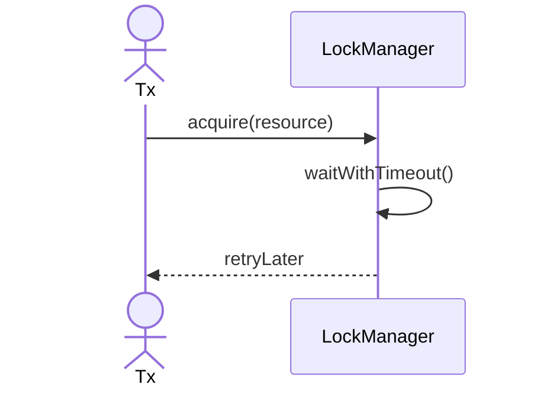

---

## 19. Clean Lock Table

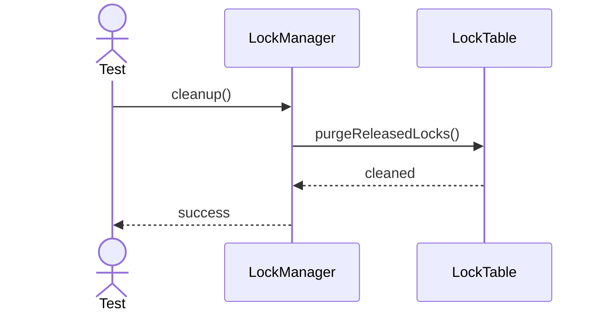

---

## 20. Resolve Lock Priority

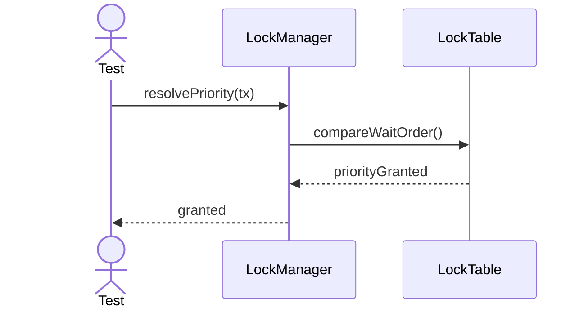
