# MVCCManager Testing - Main Functional Sequences

---

## 1. Create Snapshot

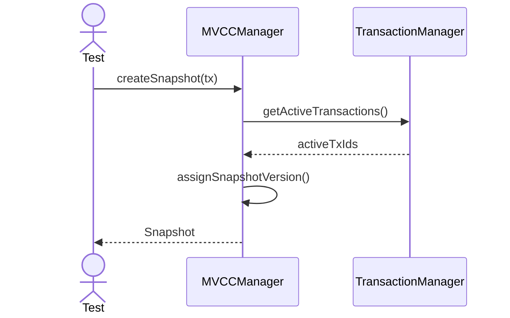

---

## 2. Read Visible Version

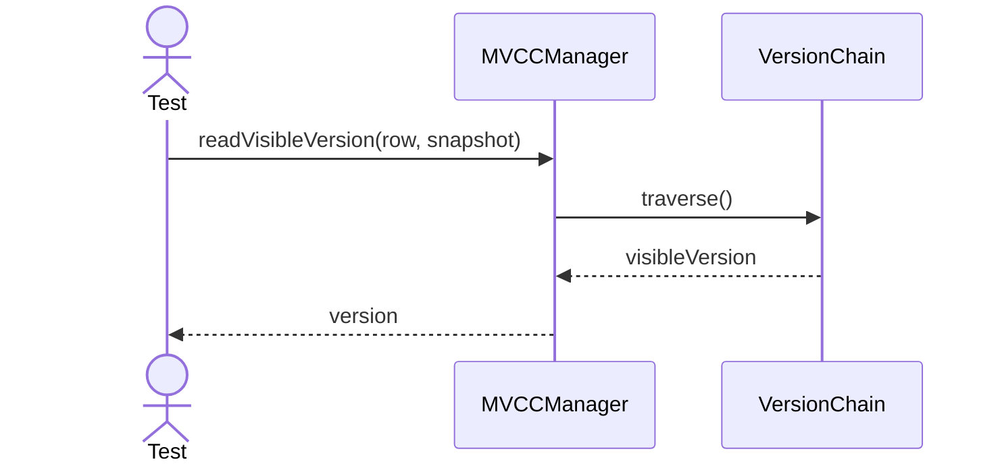

---

## 3. Skip Invisible Version

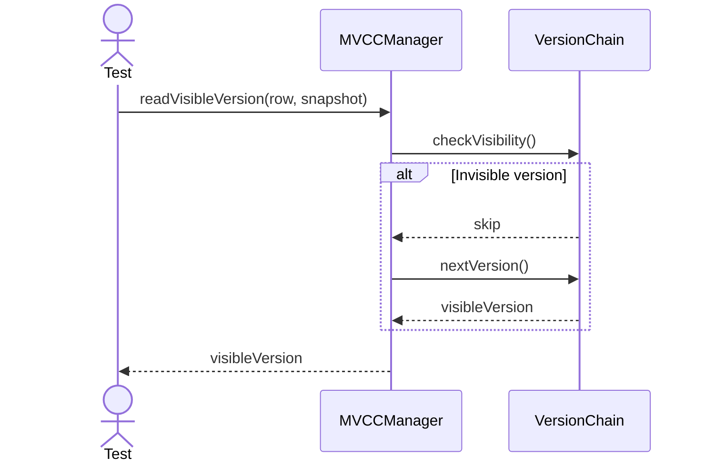

---

## 4. Create Version

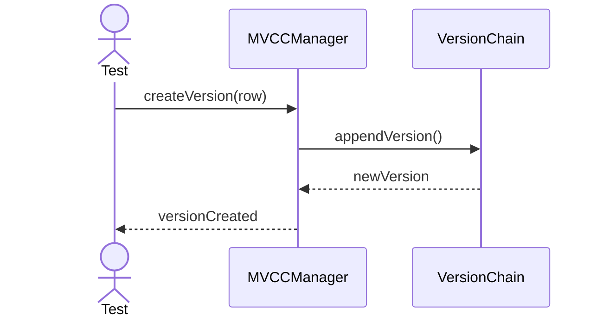

---

## 5. Garbage Collect

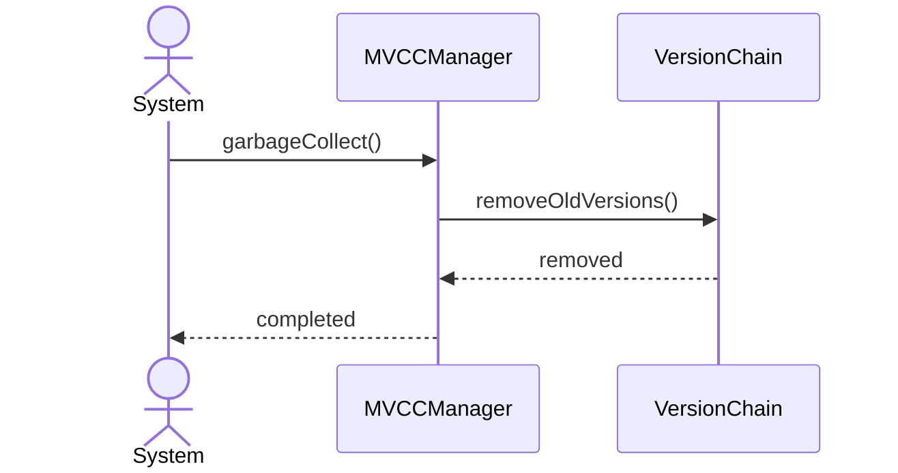

---

## 6. Concurrent Writers

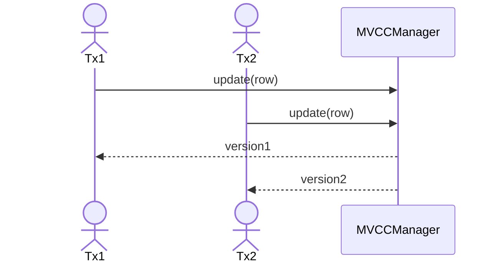

---

## 7. Read Snapshot

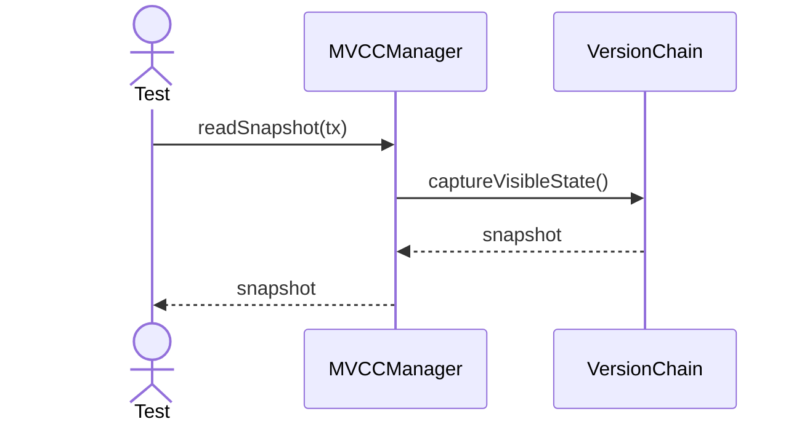

---

## 8. Write New Version

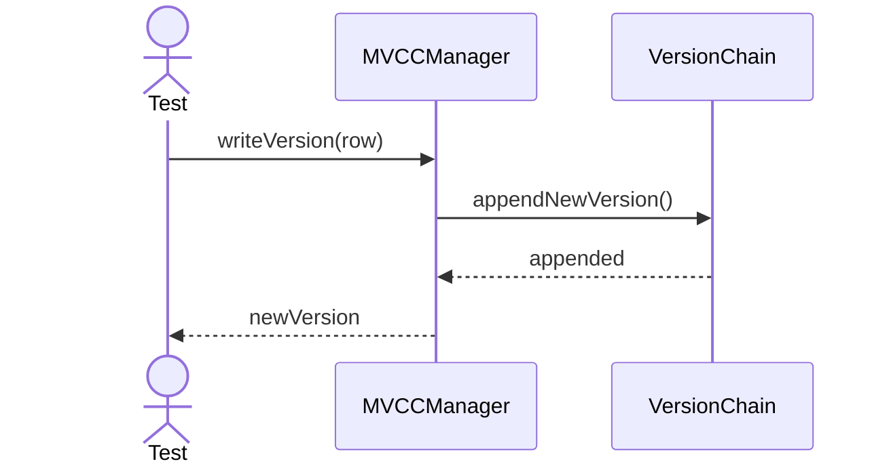

---

## 9. Prune Old Versions

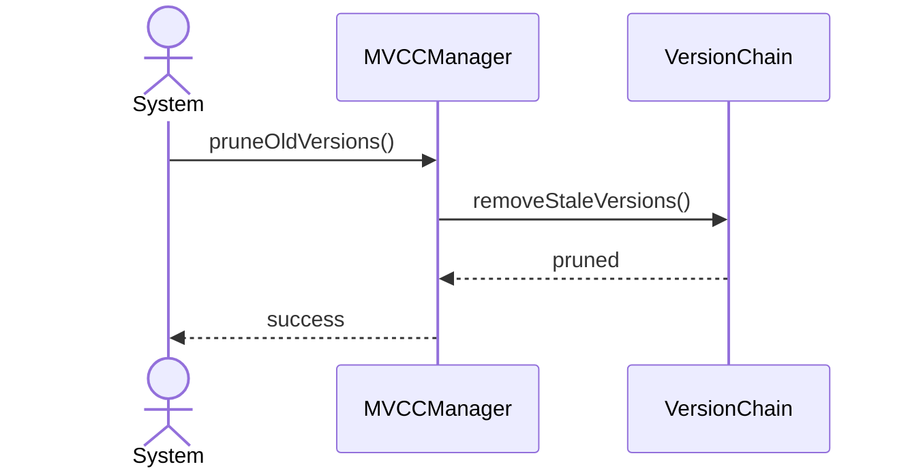

---

## 10. Check Read Visibility

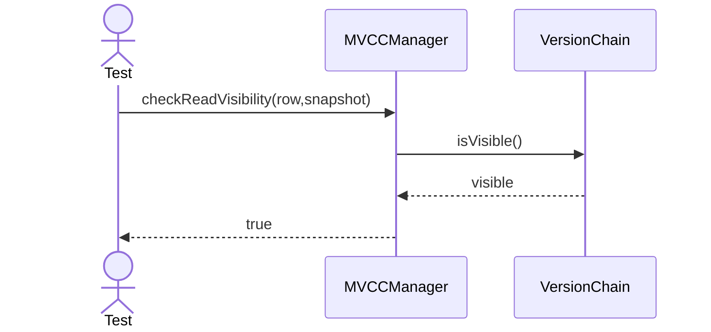

---

## 11. Check Write Visibility

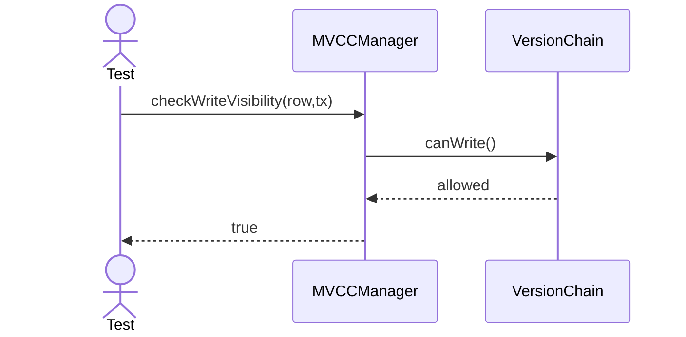

---

## 12. Vacuum Versions

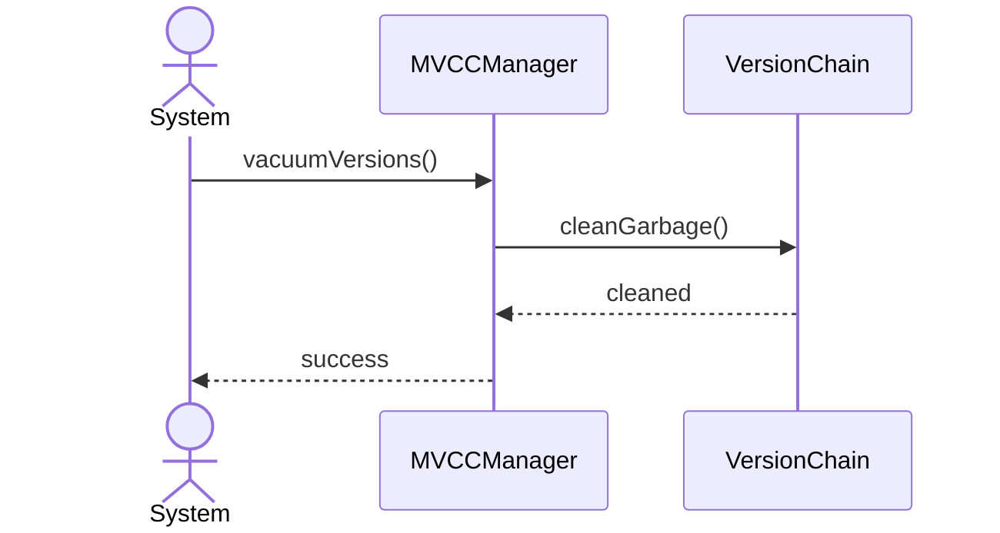

---

## 13. Merge Version Chain

---

## 14. Allocate Visibility Range

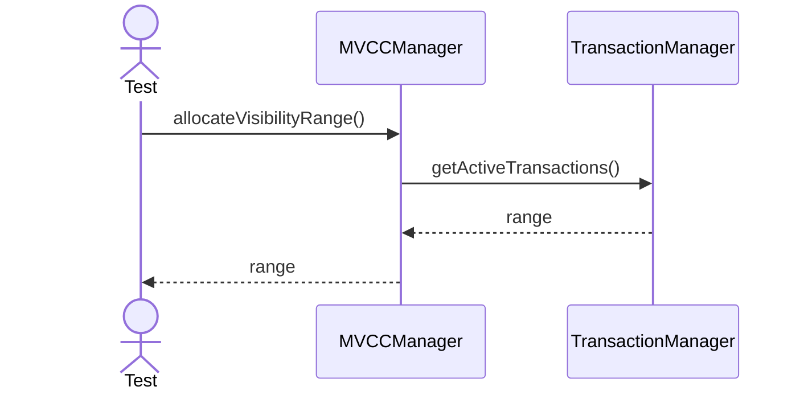

---

## 15. Resolve Conflict

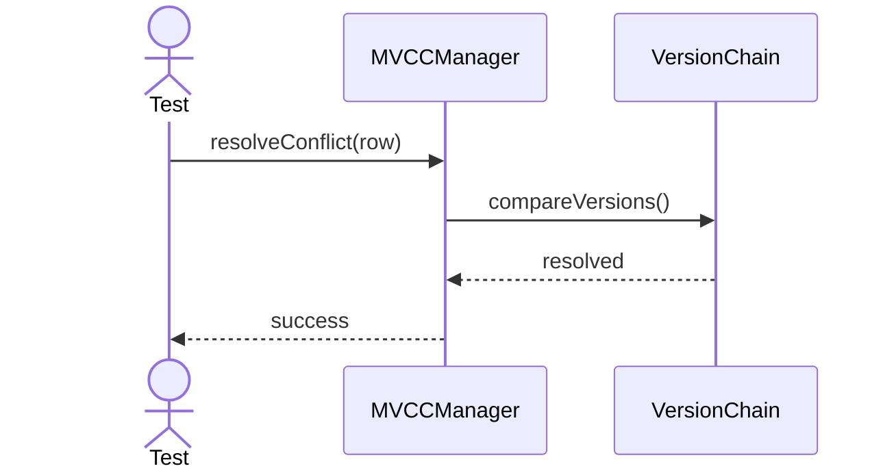

---

## 16. Commit Snapshot

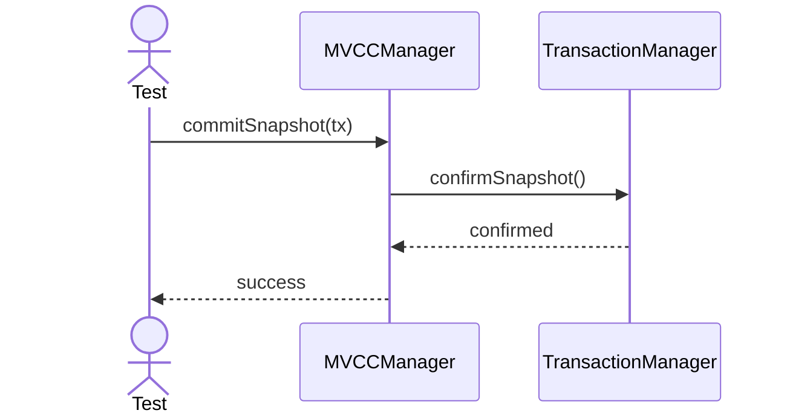

---

## 17. Rollback Version

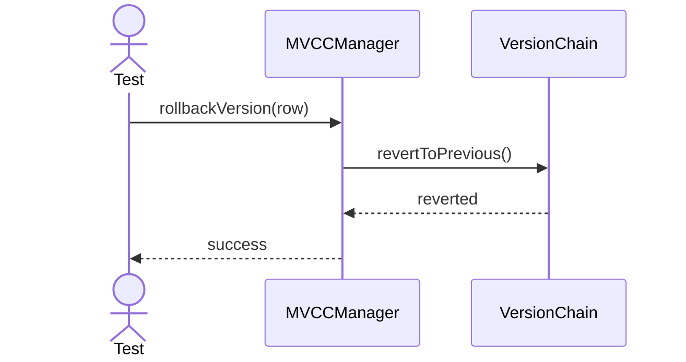

---

## 18. Pin Version

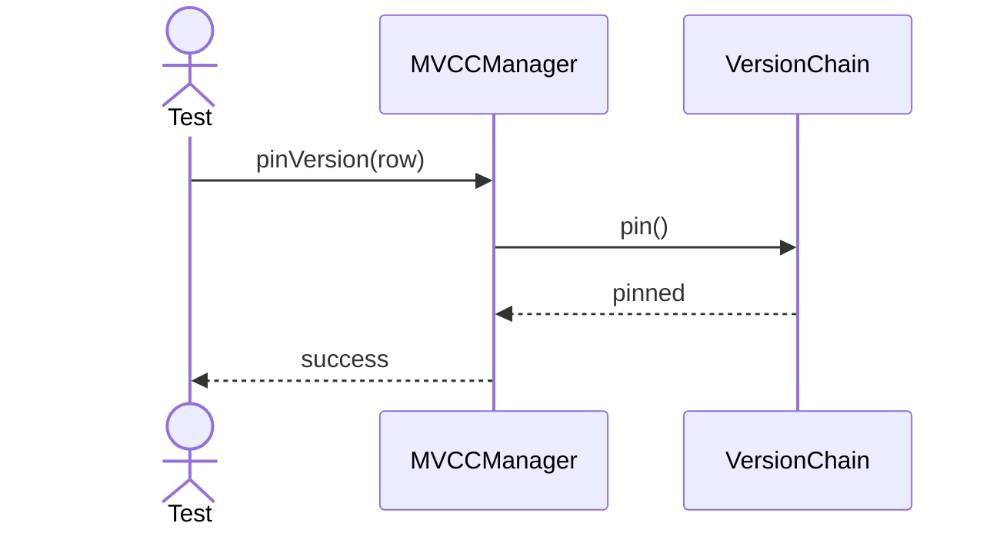

---

## 19. Unpin Version

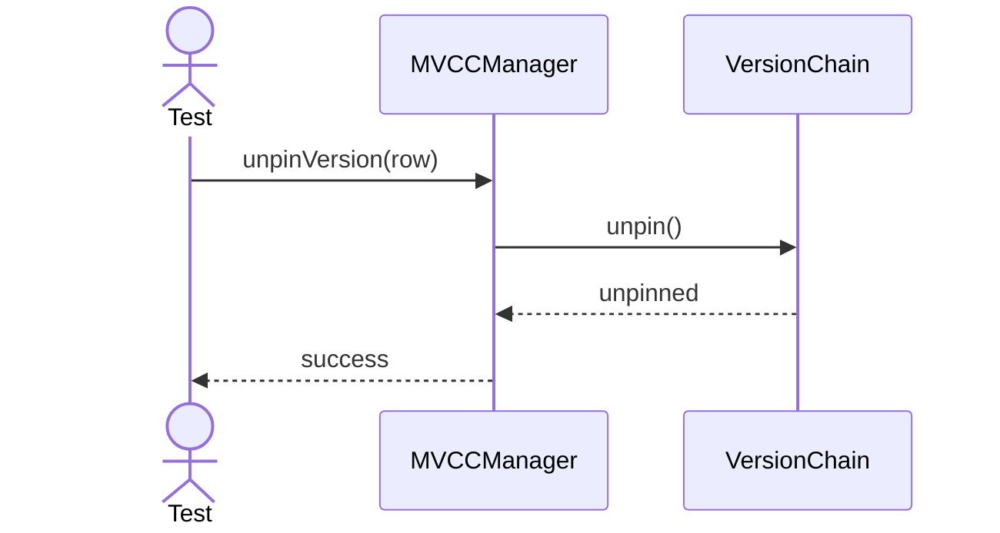

---

## 20. Export Version History

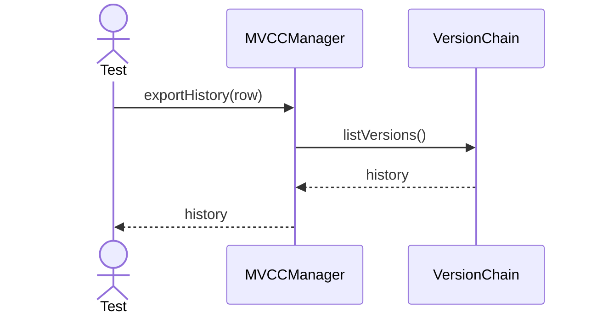
