# Transaction Testing - Main Functional Sequences

---

## 1. Create Transaction

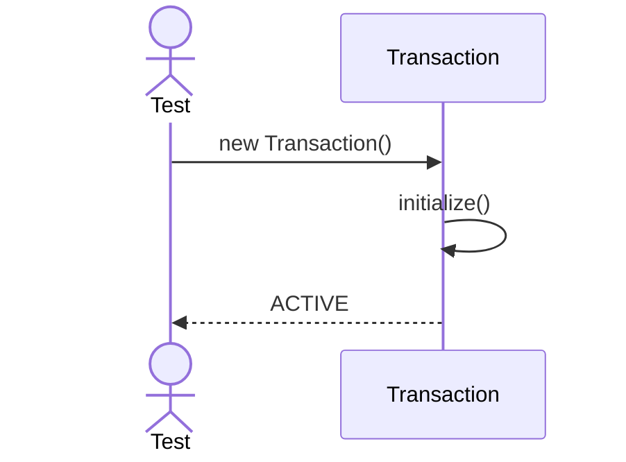
```mermaid
sequenceDiagram
actor Test
participant Transaction

Test->>Transaction: new Transaction()

Transaction->>Transaction: initialize()

Transaction-->>Test: ACTIVE
```

---

## 2. Commit Transaction

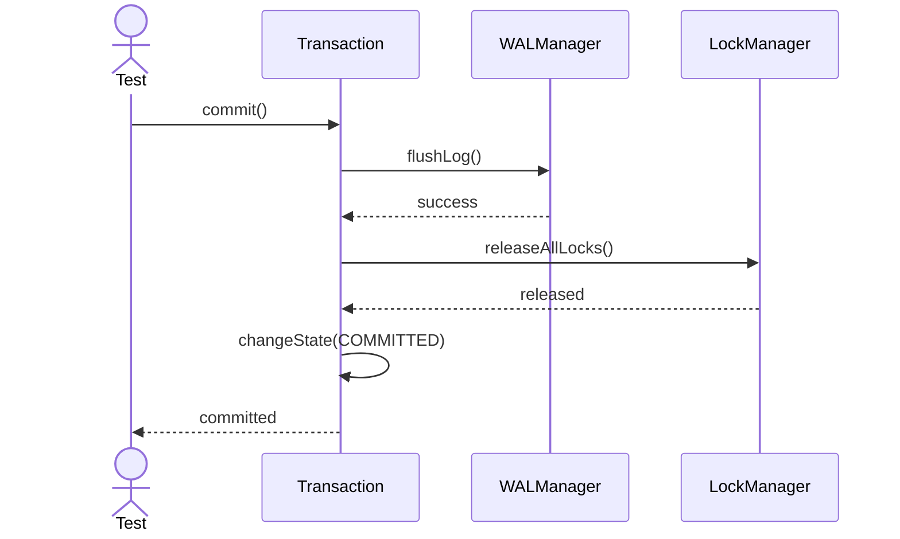
```mermaid
sequenceDiagram
actor Test
participant Transaction
participant WALManager
participant LockManager

Test->>Transaction: commit()

Transaction->>WALManager: flushLog()

WALManager-->>Transaction: success

Transaction->>LockManager: releaseAllLocks()

LockManager-->>Transaction: released

Transaction->>Transaction: changeState(COMMITTED)

Transaction-->>Test: committed
```

---

## 3. Rollback Transaction

```mermaid
sequenceDiagram
actor Test
participant Transaction
participant WALManager
participant LockManager

Test->>Transaction: rollback()

Transaction->>WALManager: undoChanges()

WALManager-->>Transaction: completed

Transaction->>LockManager: releaseAllLocks()

LockManager-->>Transaction: released

Transaction->>Transaction: changeState(ABORTED)

Transaction-->>Test: rolled back
```

---

## 4. Create Savepoint

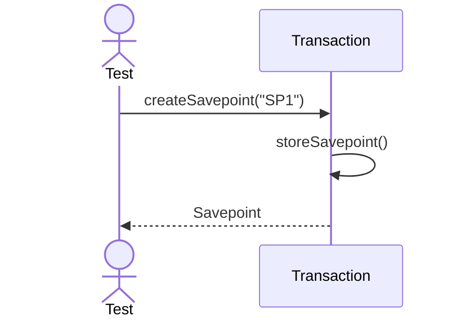
```mermaid
sequenceDiagram
actor Test
participant Transaction

Test->>Transaction: createSavepoint("SP1")

Transaction->>Transaction: storeSavepoint()

Transaction-->>Test: Savepoint
```

---

## 5. Release Savepoint

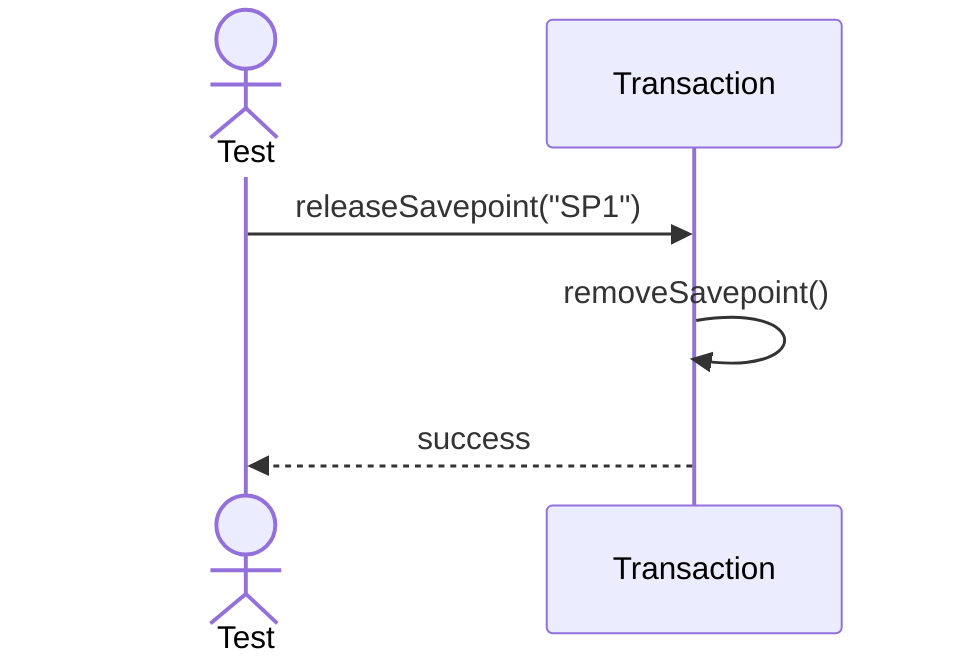
```mermaid
sequenceDiagram
actor Test
participant Transaction

Test->>Transaction: releaseSavepoint("SP1")

Transaction->>Transaction: removeSavepoint()

Transaction-->>Test: success
```

---

## 6. Set Isolation Level

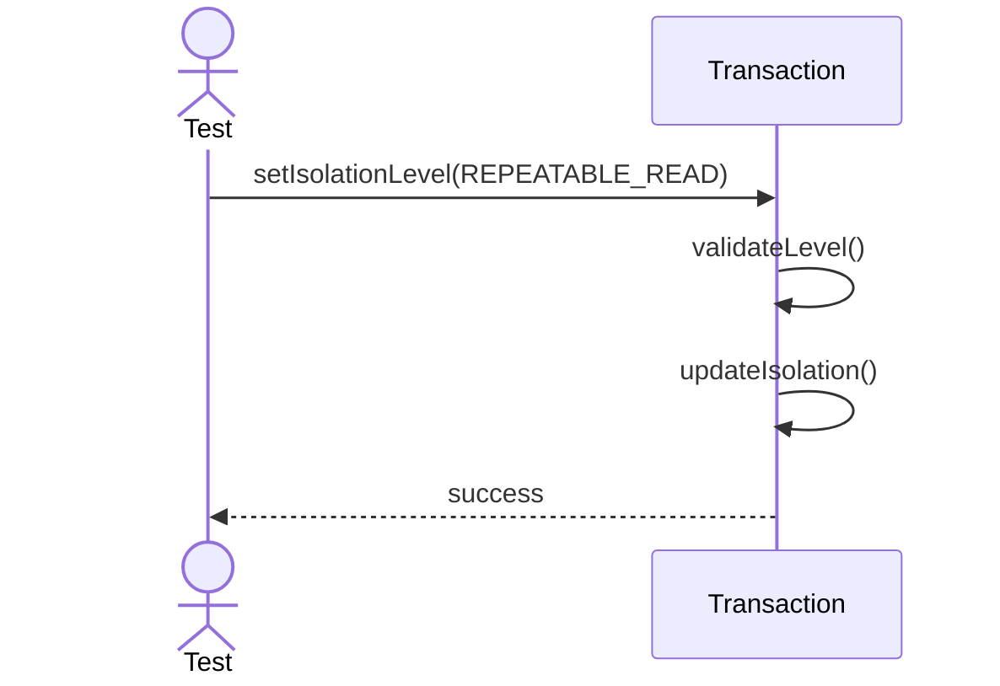
```mermaid
sequenceDiagram
actor Test
participant Transaction

Test->>Transaction: setIsolationLevel(REPEATABLE_READ)

Transaction->>Transaction: validateLevel()

Transaction->>Transaction: updateIsolation()

Transaction-->>Test: success
```

---

## 7. Change Transaction State

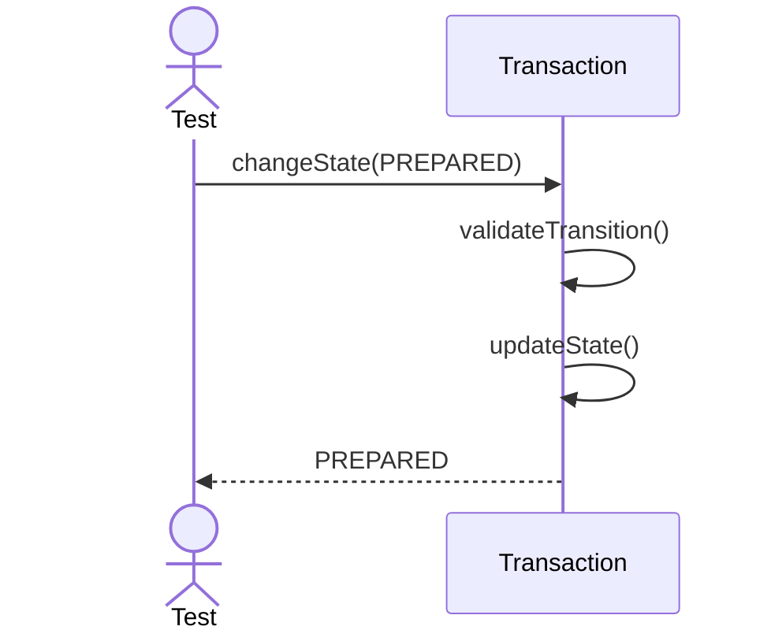
```mermaid
sequenceDiagram
actor Test
participant Transaction

Test->>Transaction: changeState(PREPARED)

Transaction->>Transaction: validateTransition()

Transaction->>Transaction: updateState()

Transaction-->>Test: PREPARED
```

---

## 8. Acquire Lock

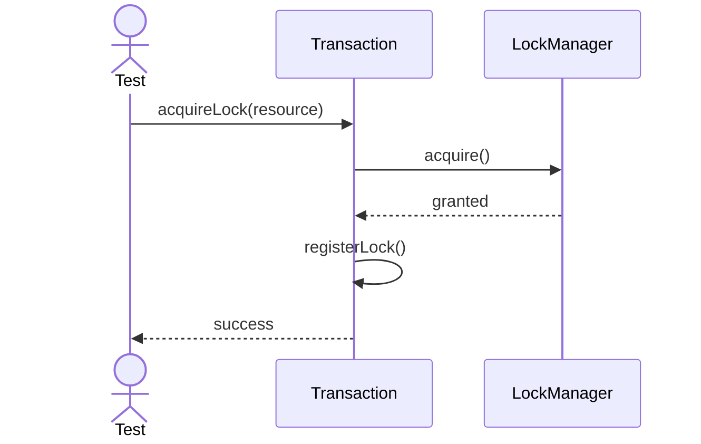
```mermaid
sequenceDiagram
actor Test
participant Transaction
participant LockManager

Test->>Transaction: acquireLock(resource)

Transaction->>LockManager: acquire()

LockManager-->>Transaction: granted

Transaction->>Transaction: registerLock()

Transaction-->>Test: success
```

---

## 9. Release Lock

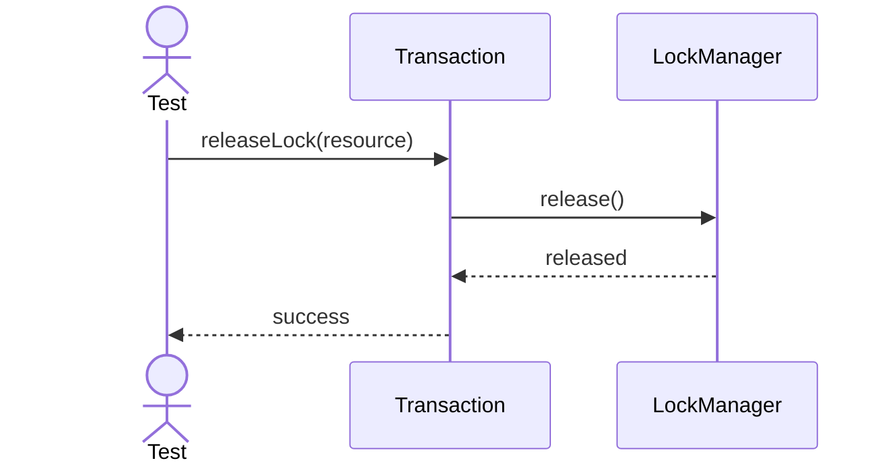
```mermaid
sequenceDiagram
actor Test
participant Transaction
participant LockManager

Test->>Transaction: releaseLock(resource)

Transaction->>LockManager: release()

LockManager-->>Transaction: released

Transaction-->>Test: success
```

---

## 10. Validate Transaction State

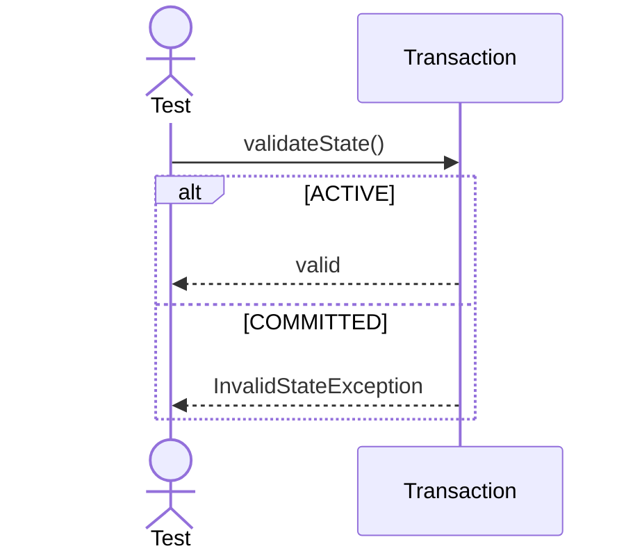
```mermaid
sequenceDiagram
actor Test
participant Transaction

Test->>Transaction: validateState()

alt ACTIVE
    Transaction-->>Test: valid
else COMMITTED
    Transaction-->>Test: InvalidStateException
end
```

---

## 11. Validate Isolation Level

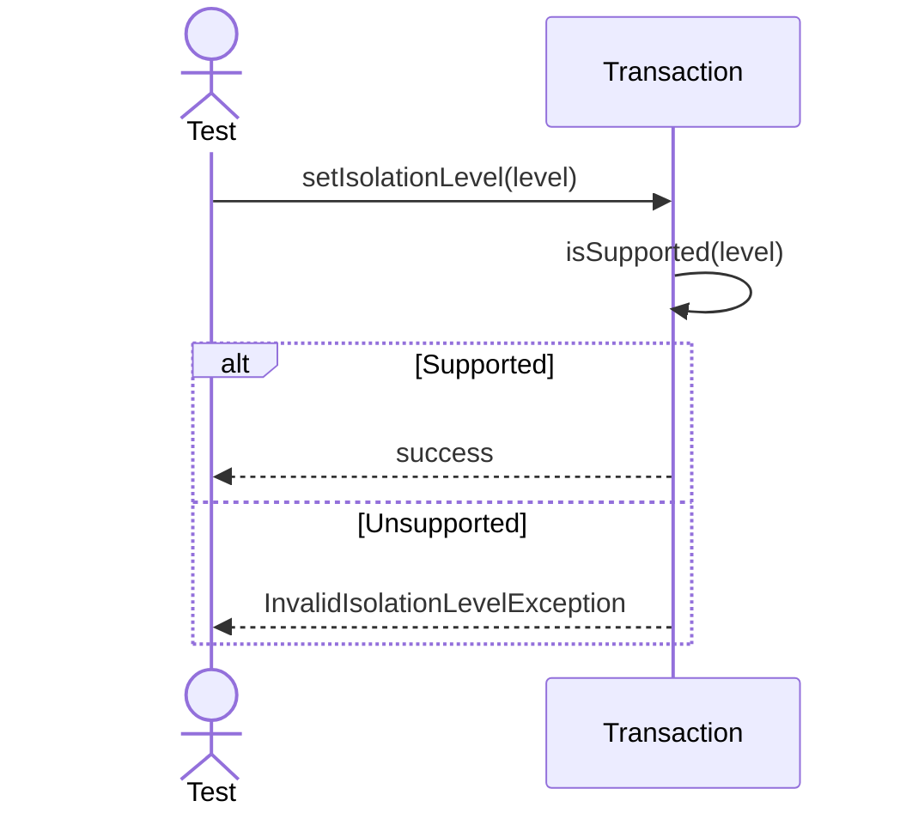
```mermaid
sequenceDiagram
actor Test
participant Transaction

Test->>Transaction: setIsolationLevel(level)

Transaction->>Transaction: isSupported(level)

alt Supported
    Transaction-->>Test: success
else Unsupported
    Transaction-->>Test: InvalidIsolationLevelException
end
```

---

## 12. Commit Failure

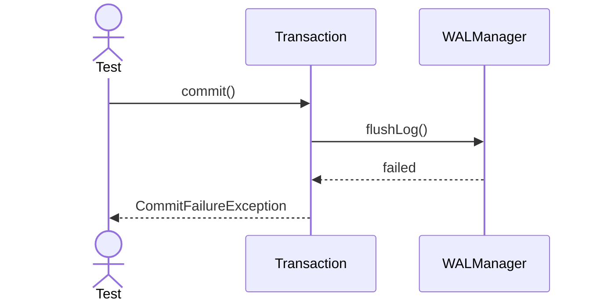
```mermaid
sequenceDiagram
actor Test
participant Transaction
participant WALManager

Test->>Transaction: commit()

Transaction->>WALManager: flushLog()

WALManager-->>Transaction: failed

Transaction-->>Test: CommitFailureException
```

---

## 13. Rollback Failure

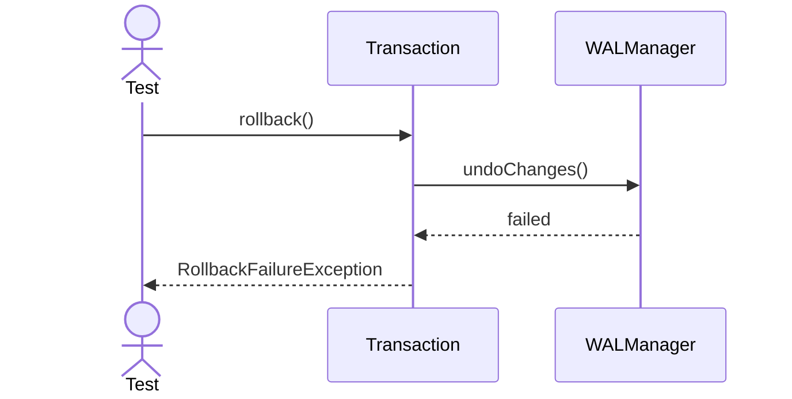
```mermaid
sequenceDiagram
actor Test
participant Transaction
participant WALManager

Test->>Transaction: rollback()

Transaction->>WALManager: undoChanges()

WALManager-->>Transaction: failed

Transaction-->>Test: RollbackFailureException
```

---

## 14. Concurrent Commit

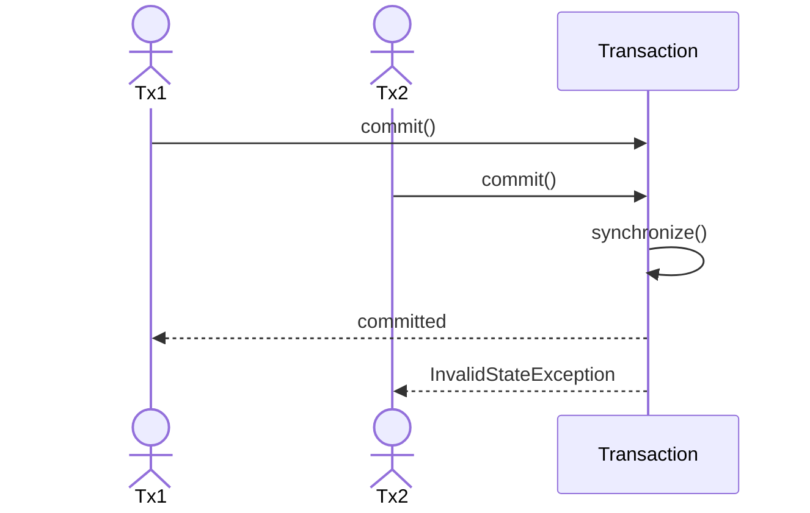
```mermaid
sequenceDiagram
actor Tx1
actor Tx2

participant Transaction

Tx1->>Transaction: commit()

Tx2->>Transaction: commit()

Transaction->>Transaction: synchronize()

Transaction-->>Tx1: committed

Transaction-->>Tx2: InvalidStateException
```

---

## 15. Lock Contention

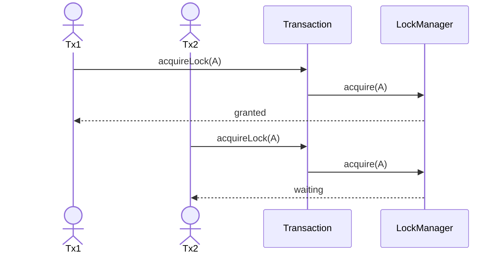
```mermaid
sequenceDiagram
actor Tx1
actor Tx2

participant Transaction
participant LockManager

Tx1->>Transaction: acquireLock(A)

Transaction->>LockManager: acquire(A)

LockManager-->>Tx1: granted

Tx2->>Transaction: acquireLock(A)

Transaction->>LockManager: acquire(A)

LockManager-->>Tx2: waiting
```

---

## 16. Create Checkpoint Transaction

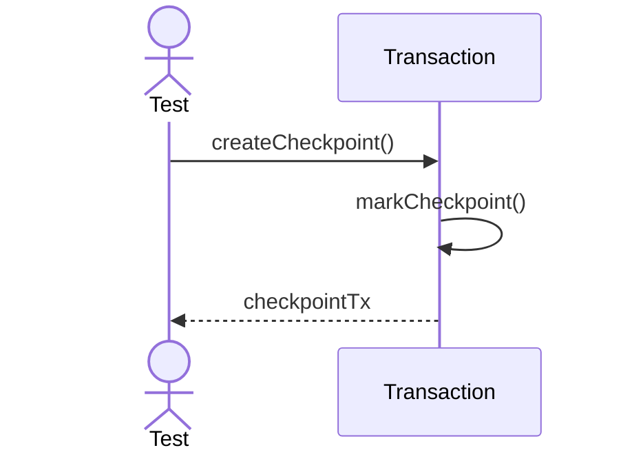
```mermaid
sequenceDiagram
actor Test
participant Transaction

Test->>Transaction: createCheckpoint()
Transaction->>Transaction: markCheckpoint()
Transaction-->>Test: checkpointTx
```

---

## 17. Register Session Binding

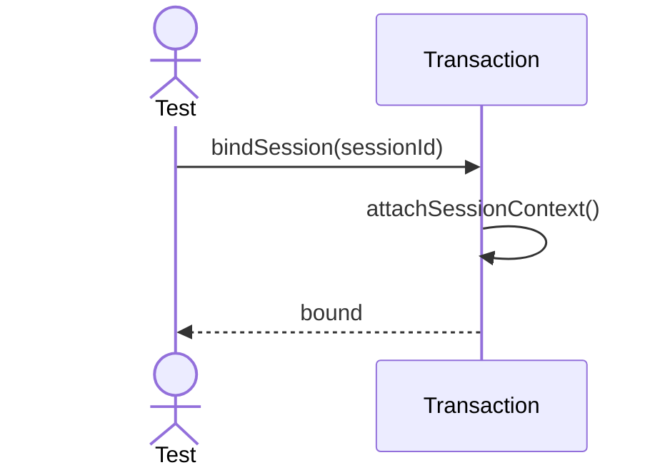
```mermaid
sequenceDiagram
actor Test
participant Transaction

Test->>Transaction: bindSession(sessionId)
Transaction->>Transaction: attachSessionContext()
Transaction-->>Test: bound
```

---

## 18. Detach Session Binding

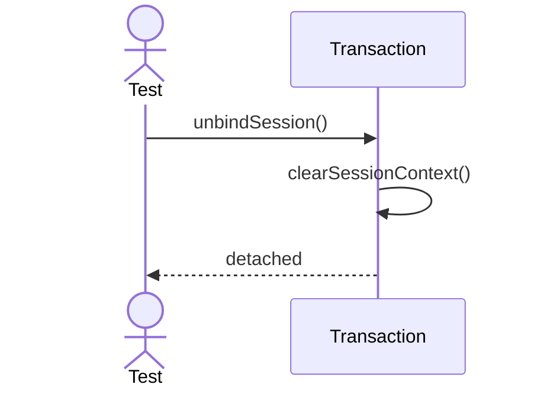
```mermaid
sequenceDiagram
actor Test
participant Transaction

Test->>Transaction: unbindSession()
Transaction->>Transaction: clearSessionContext()
Transaction-->>Test: detached
```

---

## 19. Promote To Prepared

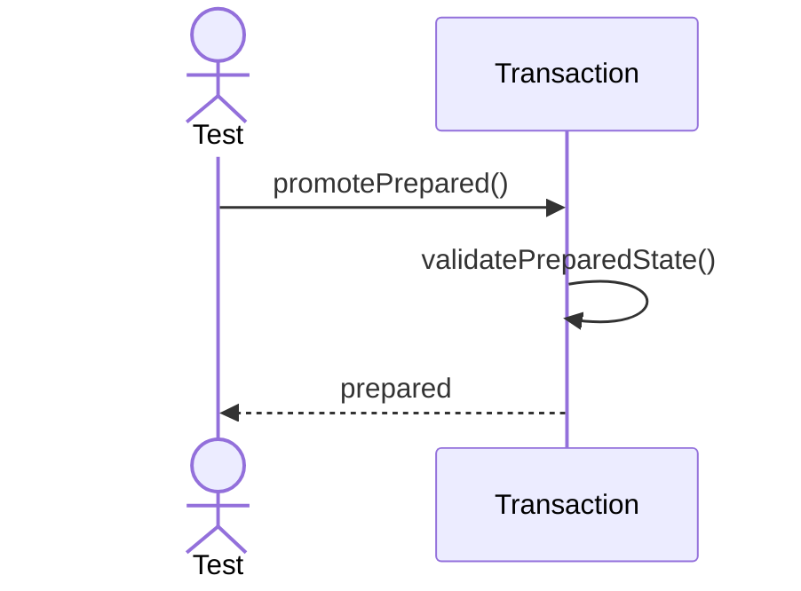
```mermaid
sequenceDiagram
actor Test
participant Transaction

Test->>Transaction: promotePrepared()
Transaction->>Transaction: validatePreparedState()
Transaction-->>Test: prepared
```

---

## 20. Export Transaction Metadata

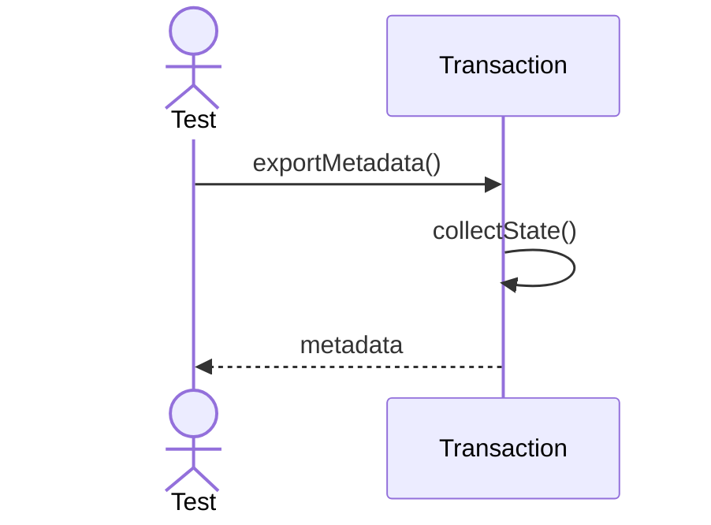
```mermaid
sequenceDiagram
actor Test
participant Transaction

Test->>Transaction: exportMetadata()
Transaction->>Transaction: collectState()
Transaction-->>Test: metadata
```
