# TransactionManager Testing - Main Functional Sequences

---

## 1. Begin Transaction

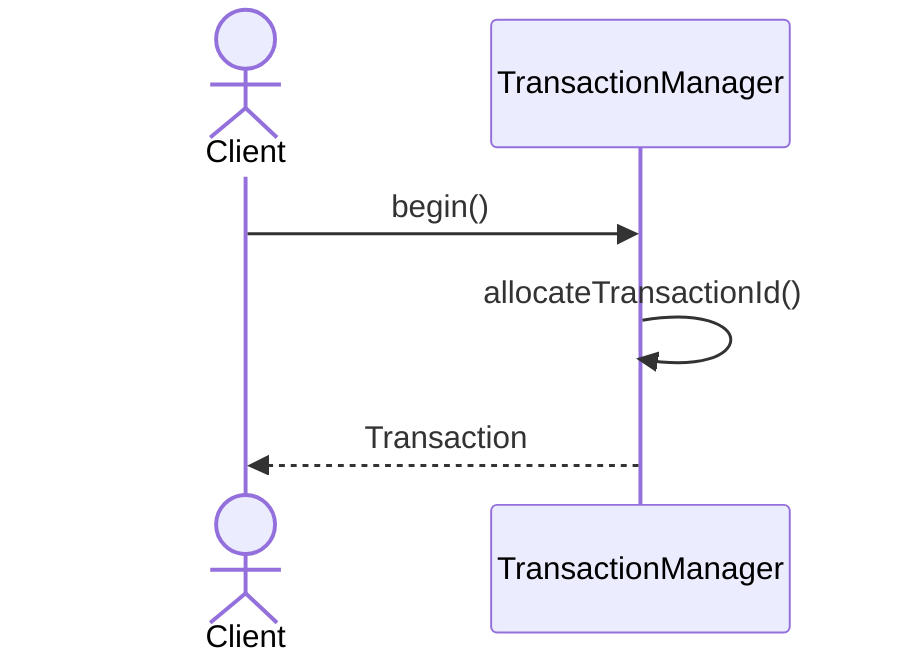
```mermaid
sequenceDiagram
actor Client
participant TransactionManager

Client->>TransactionManager: begin()

TransactionManager->>TransactionManager: allocateTransactionId()

TransactionManager-->>Client: Transaction
```

---

## 2. Commit Transaction

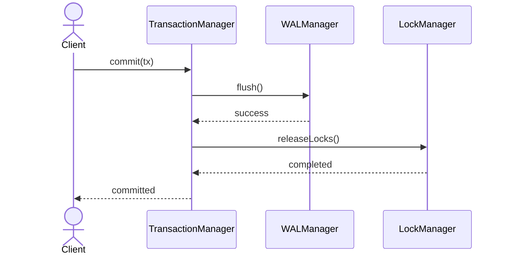
```mermaid
sequenceDiagram
actor Client
participant TransactionManager
participant WALManager
participant LockManager

Client->>TransactionManager: commit(tx)

TransactionManager->>WALManager: flush()

WALManager-->>TransactionManager: success

TransactionManager->>LockManager: releaseLocks()

LockManager-->>TransactionManager: completed

TransactionManager-->>Client: committed
```

---

## 3. Rollback Transaction

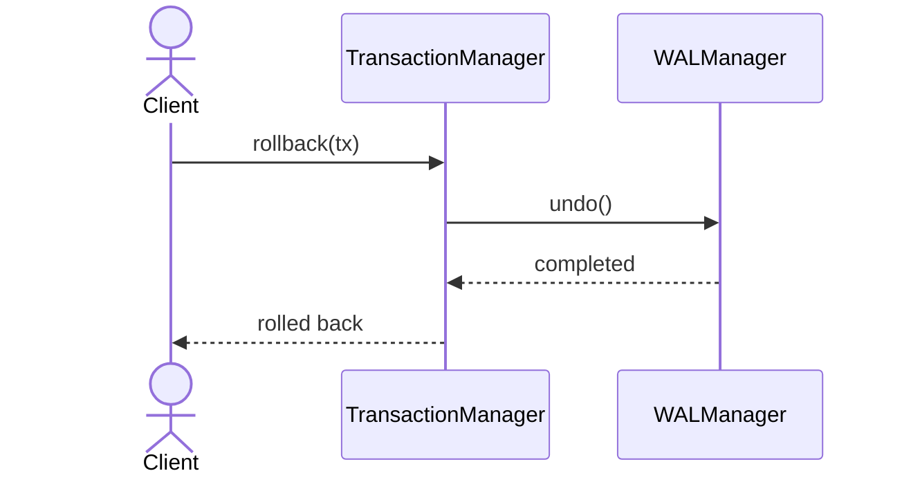
```mermaid
sequenceDiagram
actor Client
participant TransactionManager
participant WALManager

Client->>TransactionManager: rollback(tx)

TransactionManager->>WALManager: undo()

WALManager-->>TransactionManager: completed

TransactionManager-->>Client: rolled back
```

---

## 4. Rollback To Savepoint

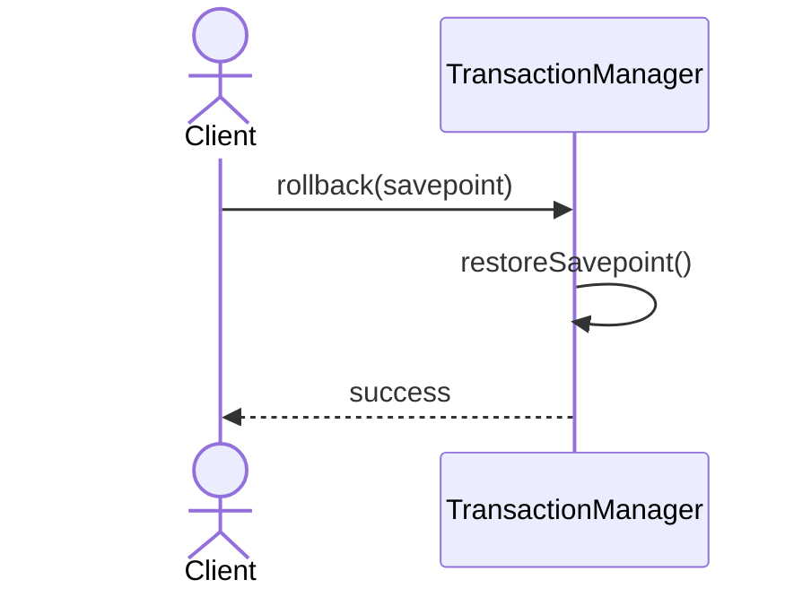
```mermaid
sequenceDiagram
actor Client
participant TransactionManager

Client->>TransactionManager: rollback(savepoint)

TransactionManager->>TransactionManager: restoreSavepoint()

TransactionManager-->>Client: success
```

---

## 5. Nested Transaction

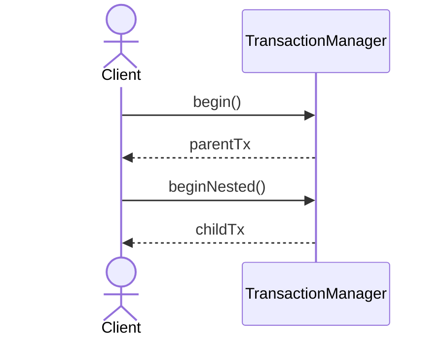
```mermaid
sequenceDiagram
actor Client
participant TransactionManager

Client->>TransactionManager: begin()

TransactionManager-->>Client: parentTx

Client->>TransactionManager: beginNested()

TransactionManager-->>Client: childTx
```

---

## 6. Recover Transaction

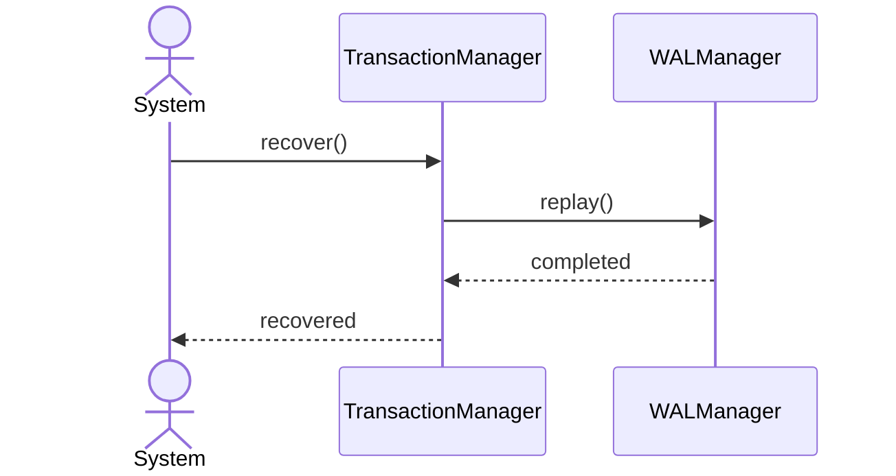
```mermaid
sequenceDiagram
actor System
participant TransactionManager
participant WALManager

System->>TransactionManager: recover()

TransactionManager->>WALManager: replay()

WALManager-->>TransactionManager: completed

TransactionManager-->>System: recovered
```

---

## 7. Transaction Timeout

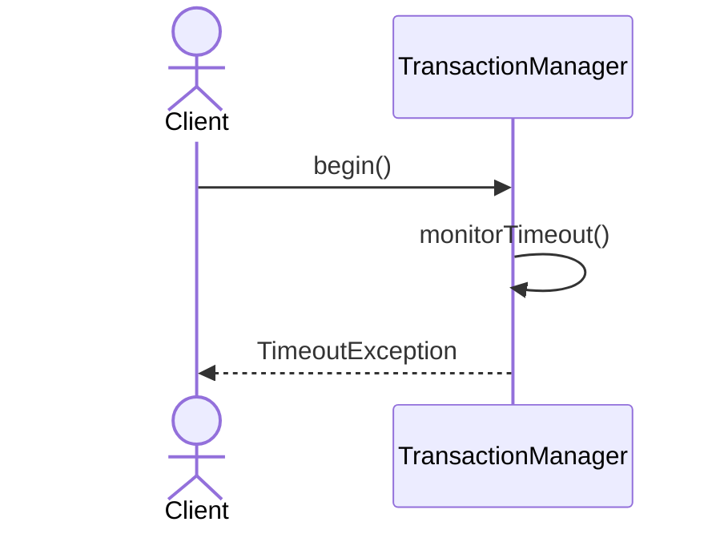
```mermaid
sequenceDiagram
actor Client
participant TransactionManager

Client->>TransactionManager: begin()

TransactionManager->>TransactionManager: monitorTimeout()

TransactionManager-->>Client: TimeoutException
```

---

## 8. Retry Transaction

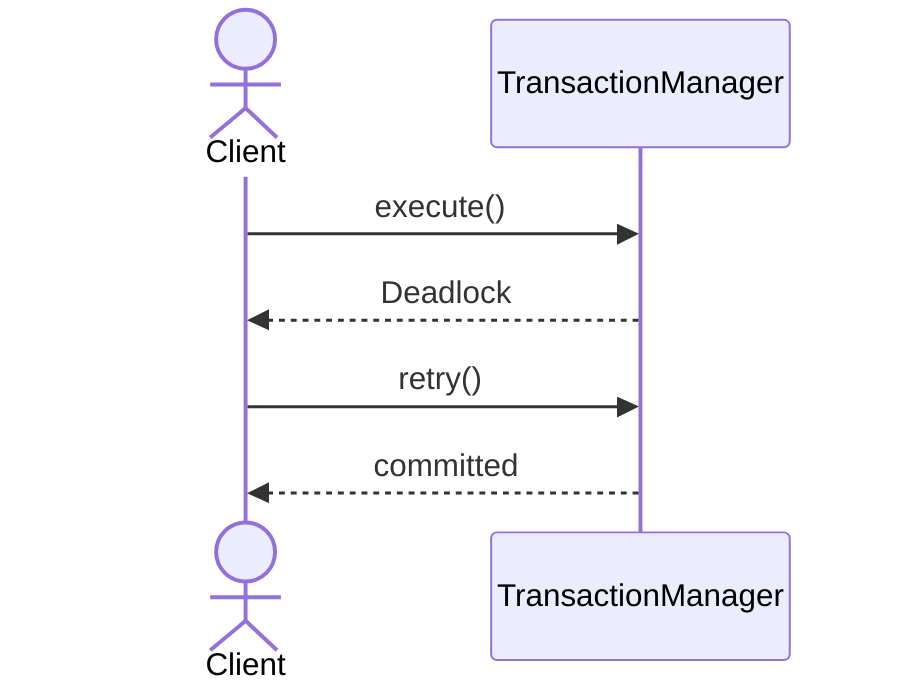
```mermaid
sequenceDiagram
actor Client
participant TransactionManager

Client->>TransactionManager: execute()

TransactionManager-->>Client: Deadlock

Client->>TransactionManager: retry()

TransactionManager-->>Client: committed
```

---

## 9. Deadlock Recovery

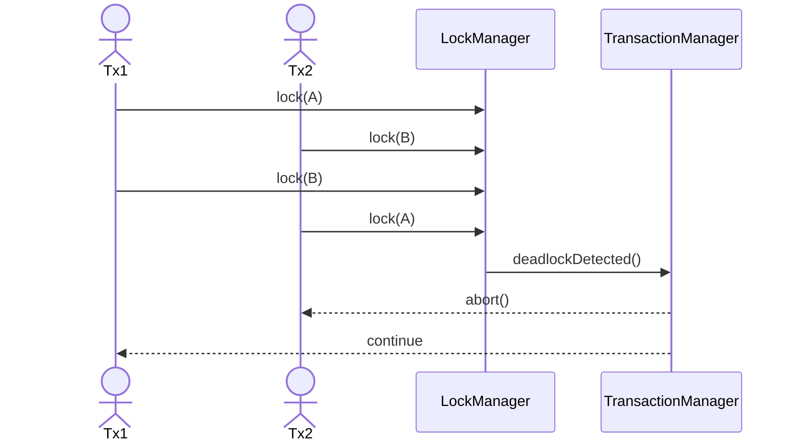
```mermaid
sequenceDiagram
actor Tx1
actor Tx2

participant LockManager
participant TransactionManager

Tx1->>LockManager: lock(A)

Tx2->>LockManager: lock(B)

Tx1->>LockManager: lock(B)

Tx2->>LockManager: lock(A)

LockManager->>TransactionManager: deadlockDetected()

TransactionManager-->>Tx2: abort()

TransactionManager-->>Tx1: continue
```

---

## 10. Concurrent Commit

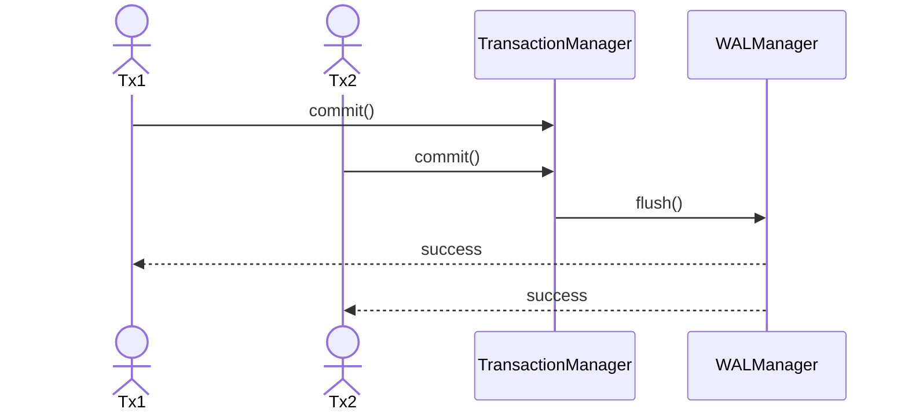
```mermaid
sequenceDiagram
actor Tx1
actor Tx2

participant TransactionManager
participant WALManager

Tx1->>TransactionManager: commit()

Tx2->>TransactionManager: commit()

TransactionManager->>WALManager: flush()

WALManager-->>Tx1: success

WALManager-->>Tx2: success
```

---

## 11. Isolation Validation

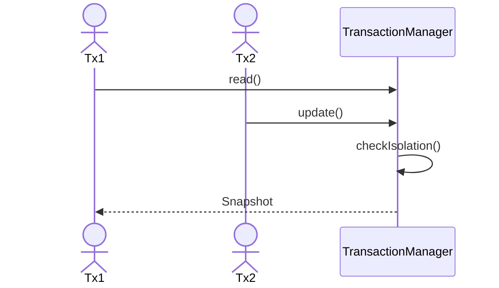
```mermaid
sequenceDiagram
actor Tx1
actor Tx2

participant TransactionManager

Tx1->>TransactionManager: read()

Tx2->>TransactionManager: update()

TransactionManager->>TransactionManager: checkIsolation()

TransactionManager-->>Tx1: Snapshot
```

---

## 12. Invalid Transaction

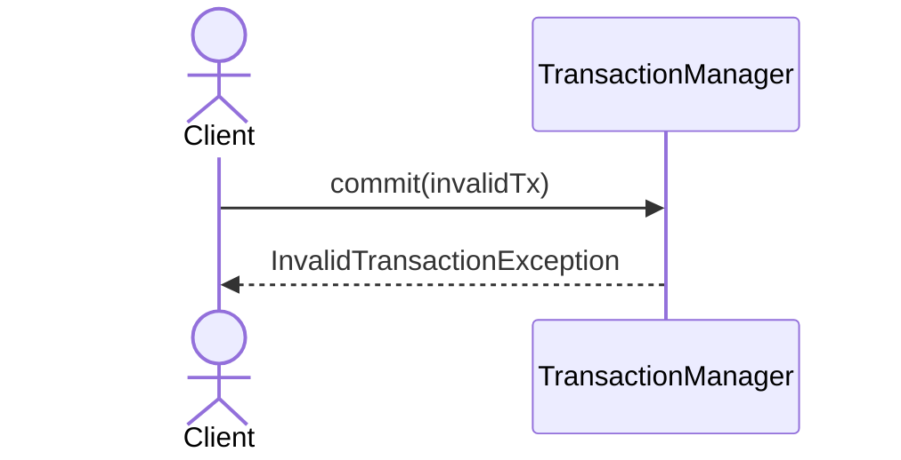
```mermaid
sequenceDiagram
actor Client
participant TransactionManager

Client->>TransactionManager: commit(invalidTx)

TransactionManager-->>Client: InvalidTransactionException
```

---

## 13. Create Read Only Transaction

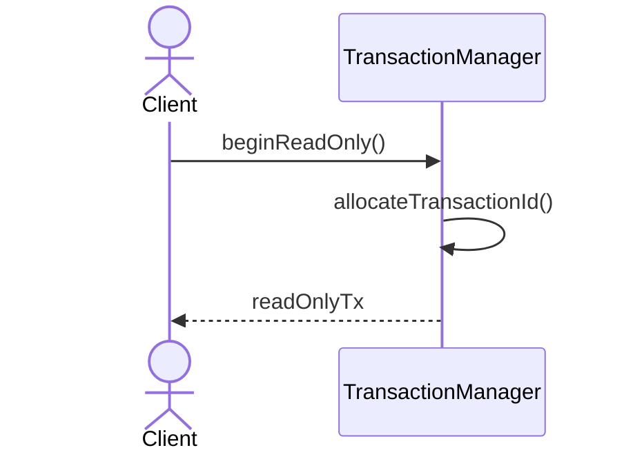
```mermaid
sequenceDiagram
actor Client
participant TransactionManager

Client->>TransactionManager: beginReadOnly()
TransactionManager->>TransactionManager: allocateTransactionId()
TransactionManager-->>Client: readOnlyTx
```

---

## 14. Begin Nested Transaction Level 2

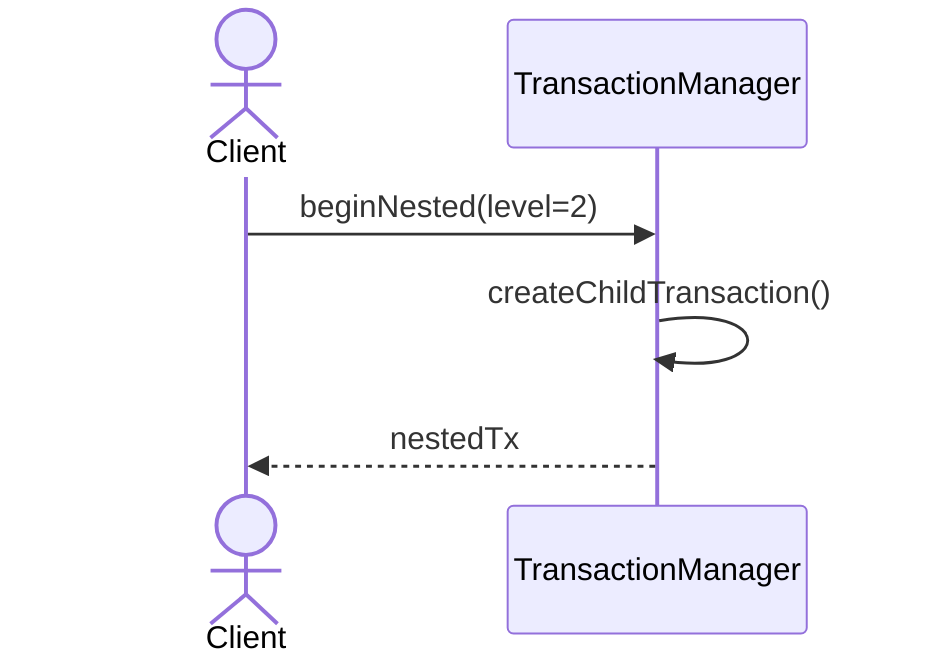
```mermaid
sequenceDiagram
actor Client
participant TransactionManager

Client->>TransactionManager: beginNested(level=2)
TransactionManager->>TransactionManager: createChildTransaction()
TransactionManager-->>Client: nestedTx
```

---

## 15. Create Savepoint

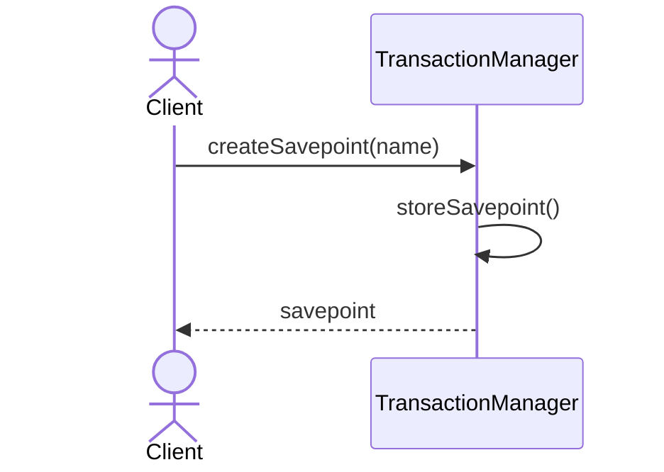
```mermaid
sequenceDiagram
actor Client
participant TransactionManager

Client->>TransactionManager: createSavepoint(name)
TransactionManager->>TransactionManager: storeSavepoint()
TransactionManager-->>Client: savepoint
```

---

## 16. Release Savepoint

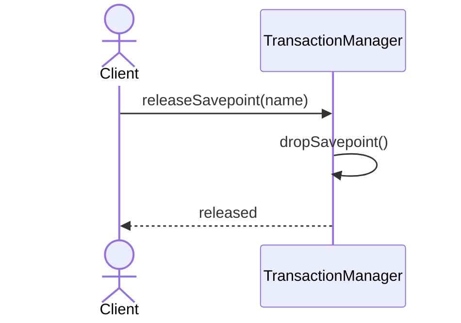
```mermaid
sequenceDiagram
actor Client
participant TransactionManager

Client->>TransactionManager: releaseSavepoint(name)
TransactionManager->>TransactionManager: dropSavepoint()
TransactionManager-->>Client: released
```

---

## 17. Suspend Transaction

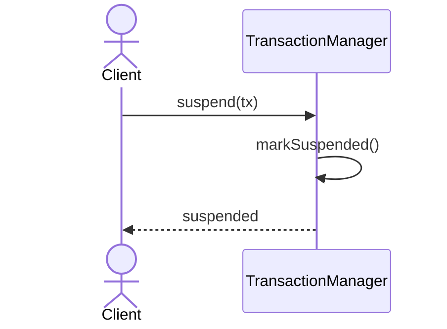
```mermaid
sequenceDiagram
actor Client
participant TransactionManager

Client->>TransactionManager: suspend(tx)
TransactionManager->>TransactionManager: markSuspended()
TransactionManager-->>Client: suspended
```

---

## 18. Resume Transaction

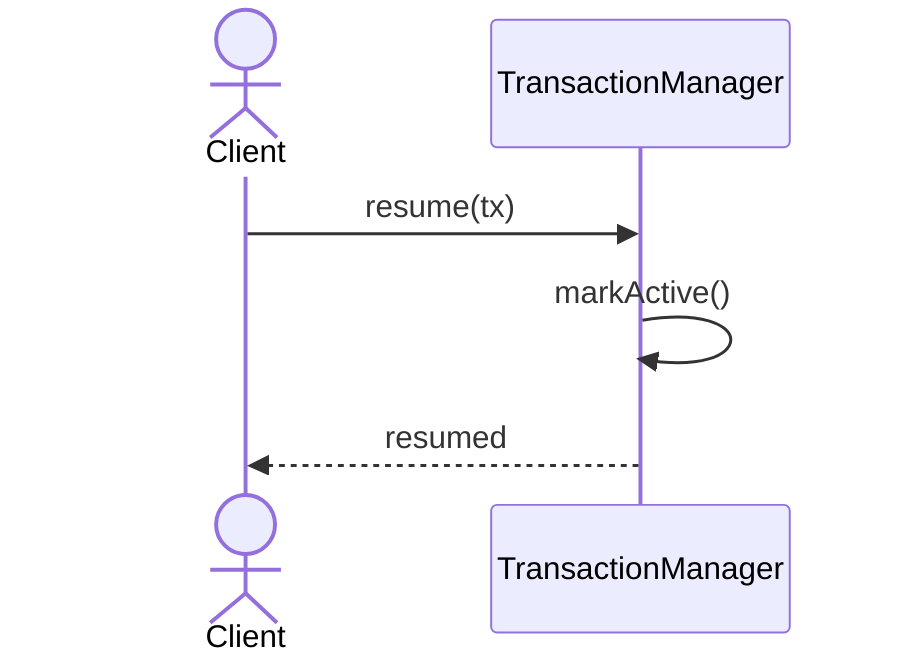
```mermaid
sequenceDiagram
actor Client
participant TransactionManager

Client->>TransactionManager: resume(tx)
TransactionManager->>TransactionManager: markActive()
TransactionManager-->>Client: resumed
```

---

## 19. Check Transaction Status

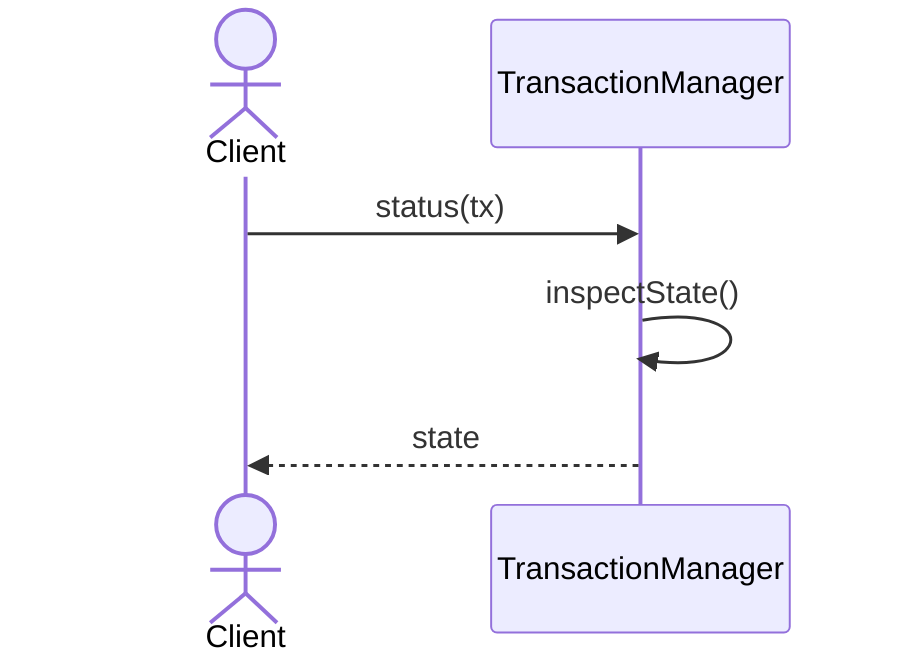
```mermaid
sequenceDiagram
actor Client
participant TransactionManager

Client->>TransactionManager: status(tx)
TransactionManager->>TransactionManager: inspectState()
TransactionManager-->>Client: state
```

---

## 20. Register Transaction Context

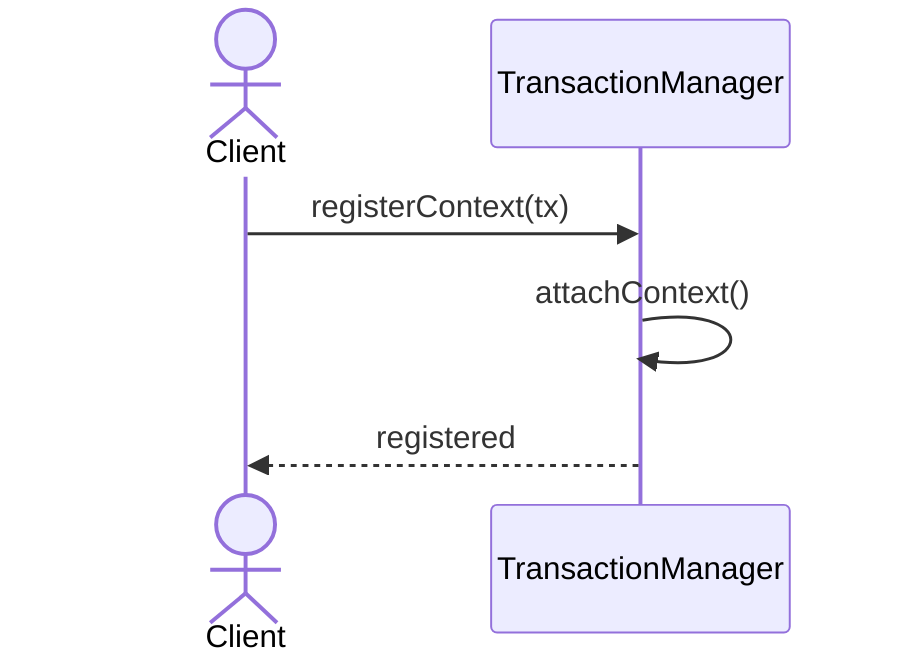
```mermaid
sequenceDiagram
actor Client
participant TransactionManager

Client->>TransactionManager: registerContext(tx)
TransactionManager->>TransactionManager: attachContext()
TransactionManager-->>Client: registered
```
