# TransactionManager Test Sequence Diagrams

Each sequence matches one test in `TransactionManagerTests` and the roadmap.

## Fixture: setUp

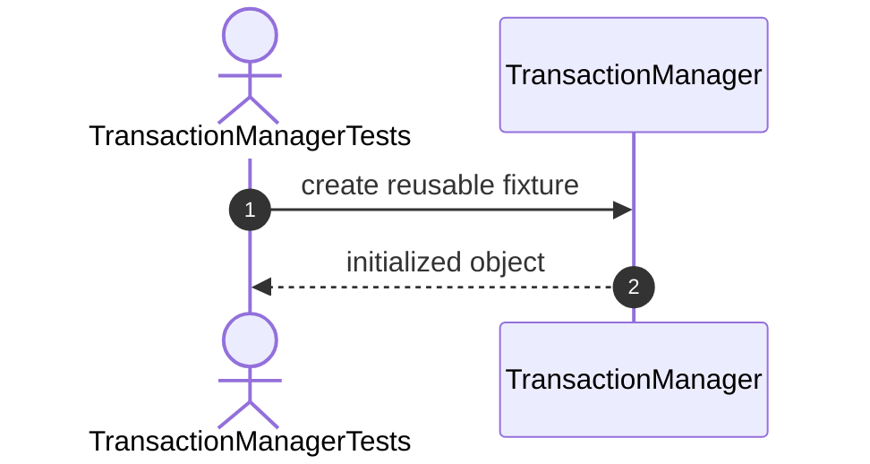

# Constructor Tests

## 1. Constructor_ShouldCreateManager

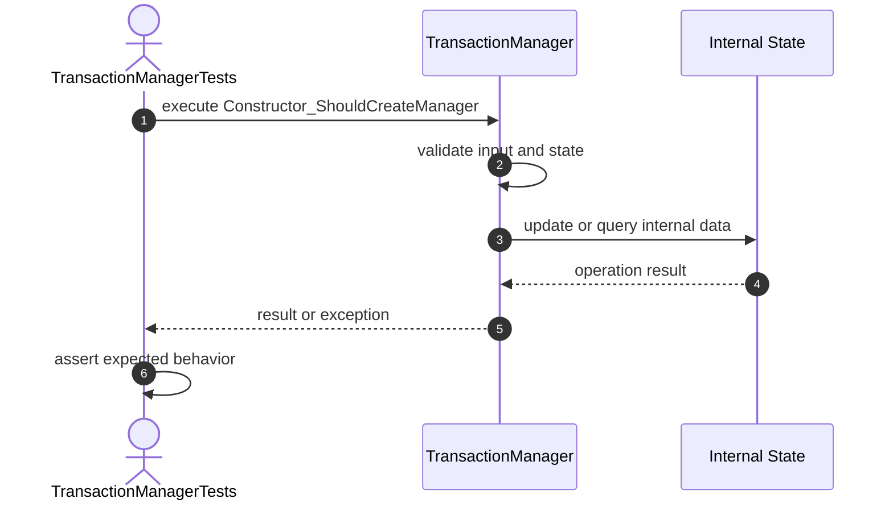

## 2. Constructor_ShouldInitializeEmptyTransactions

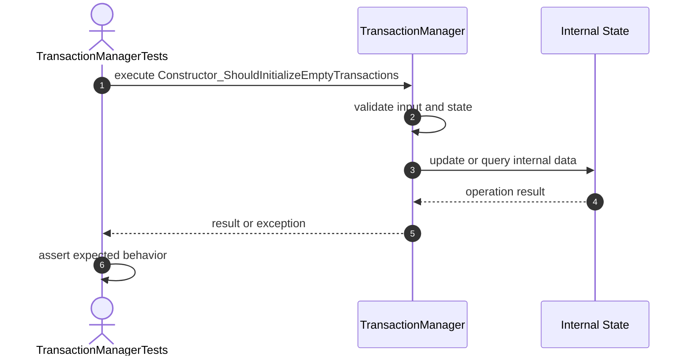

# Begin Tests

## 3. Begin_ShouldCreateTransaction

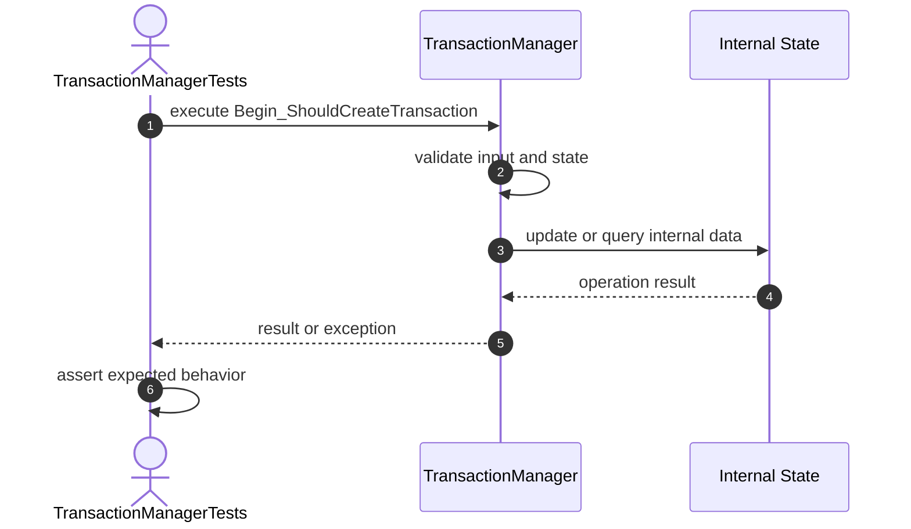

## 4. Begin_ShouldGenerateTransactionId

## 5. Begin_ShouldInitializeActiveStatus

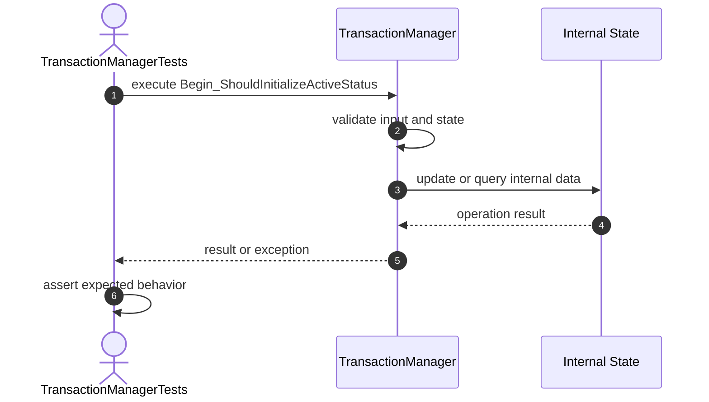

## 6. Begin_ShouldIncreaseTransactionCount

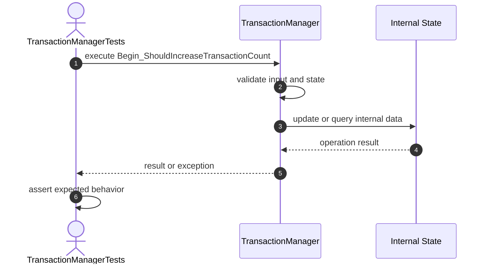

## 7. Begin_ShouldGenerateUniqueIds

# Commit Tests

## 8. Commit_ShouldCommitActiveTransaction

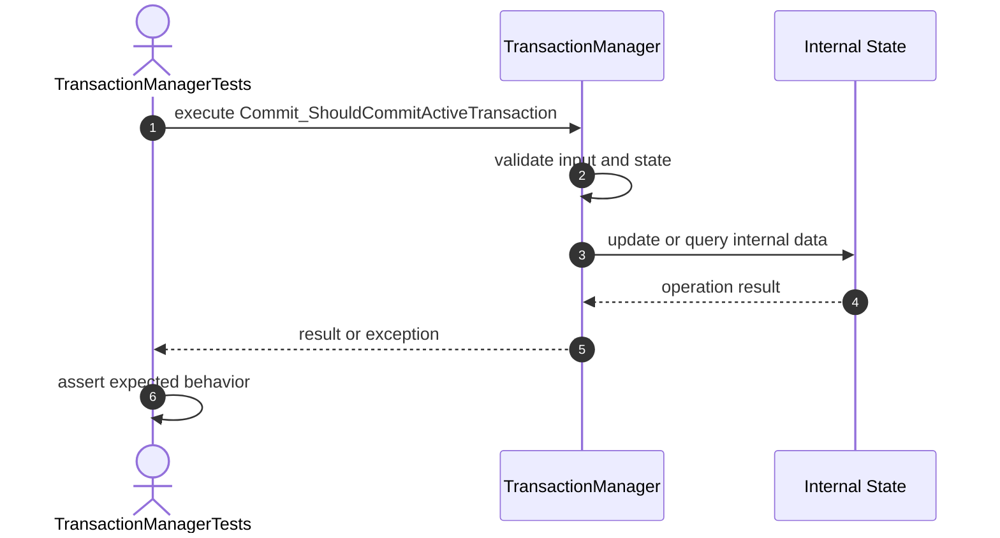

## 9. Commit_ShouldRejectMissingTransaction

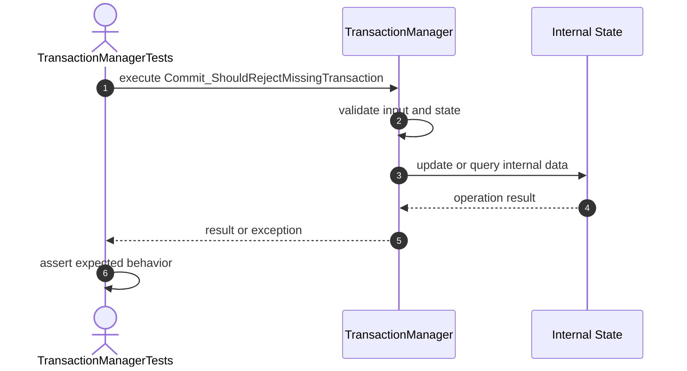

## 10. Commit_ShouldRejectNullId

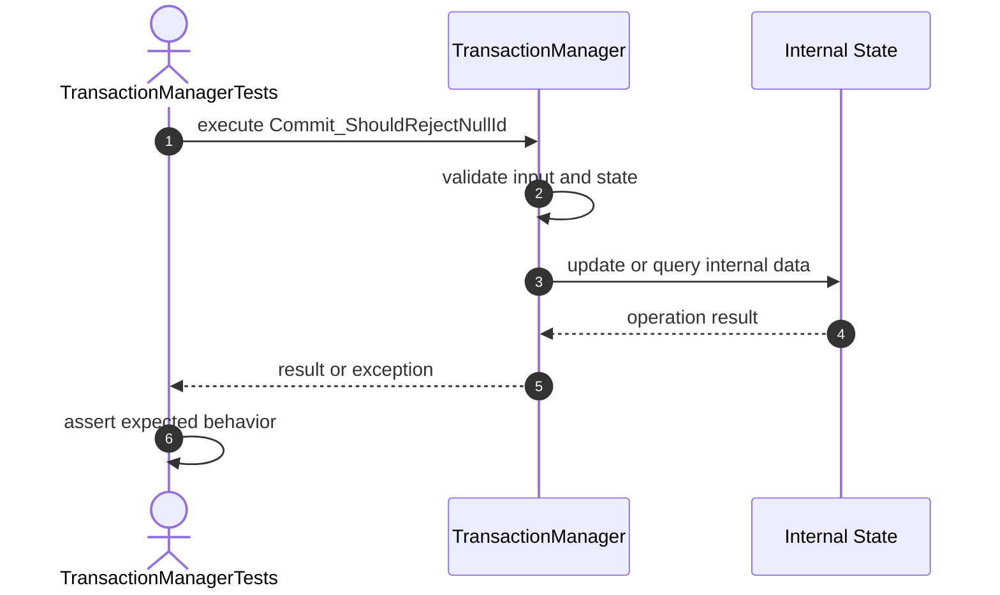

## 11. Commit_ShouldRejectAlreadyCommittedTransaction

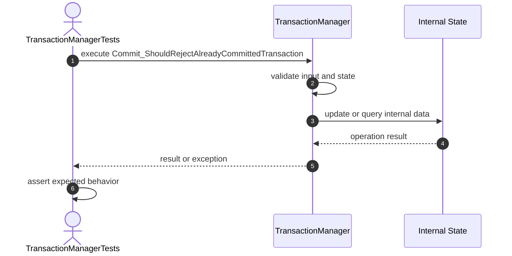

# Rollback Tests

## 12. Rollback_ShouldRollbackActiveTransaction

## 13. Rollback_ShouldRejectMissingTransaction

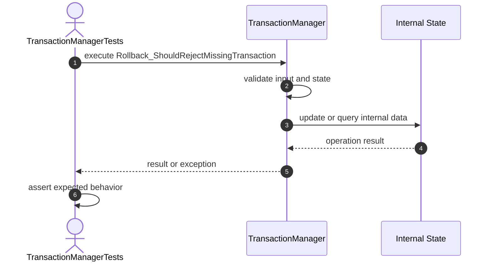

## 14. Rollback_ShouldRejectAlreadyFinishedTransaction

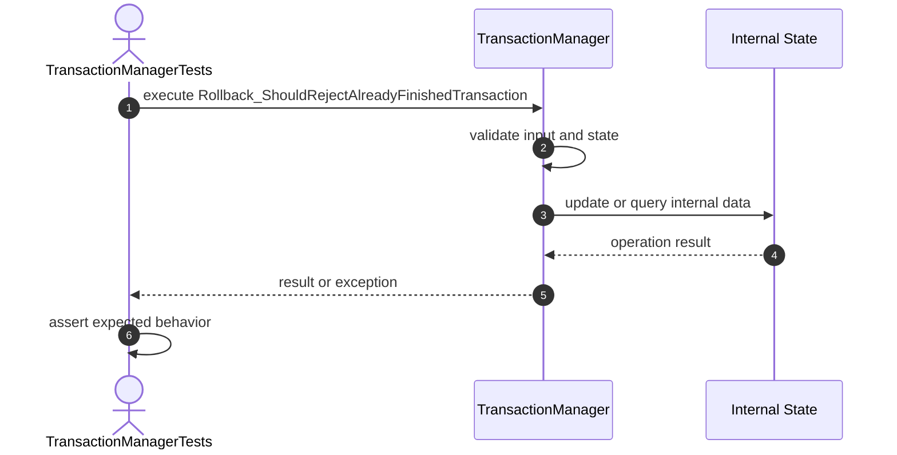

# Metadata Tests

## 15. GetTransaction_ShouldReturnStoredTransaction

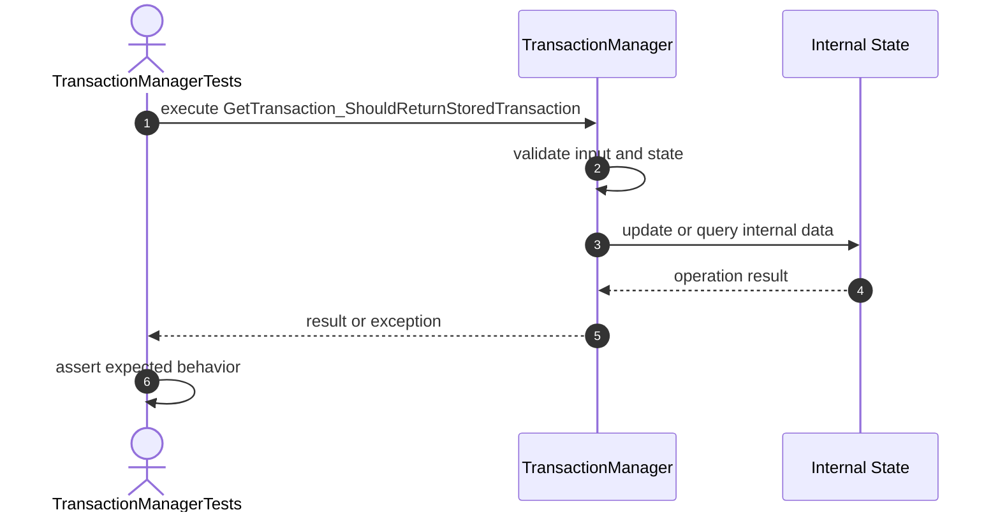

## 16. ContainsTransaction_ShouldReturnTrueForExistingTransaction

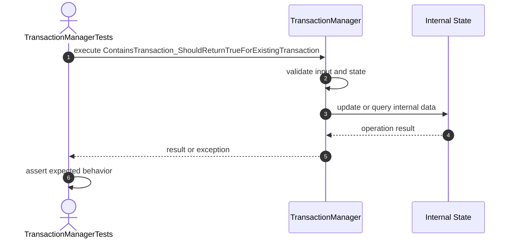

## 17. ContainsTransaction_ShouldReturnFalseForMissingTransaction

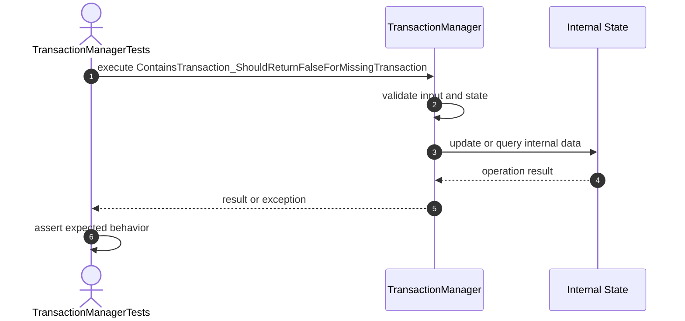

## 18. GetTransactions_ShouldReturnUnmodifiableMap

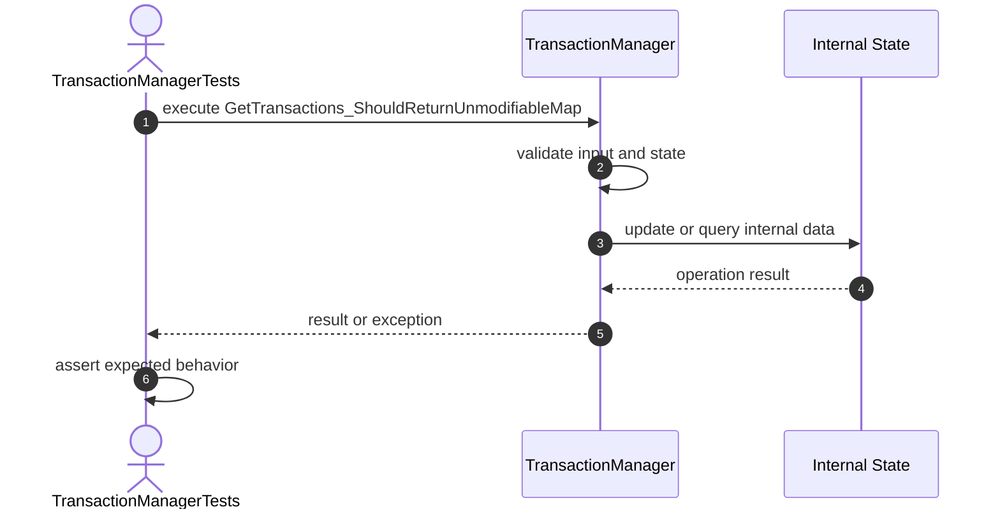